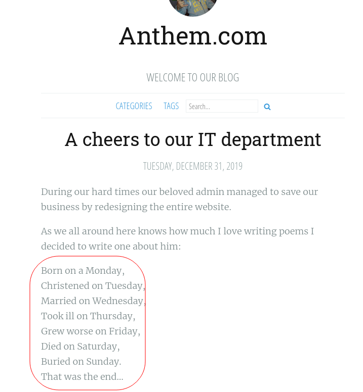
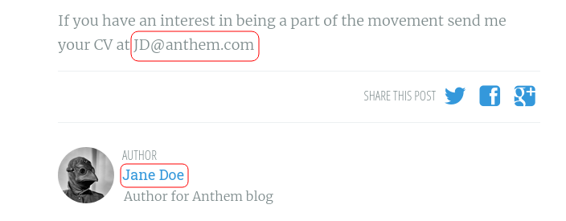
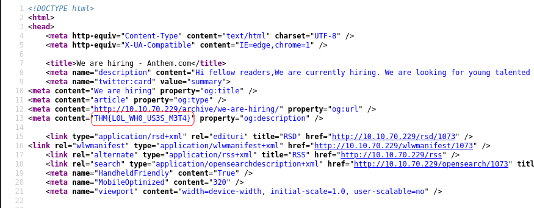
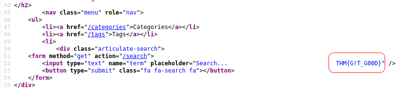
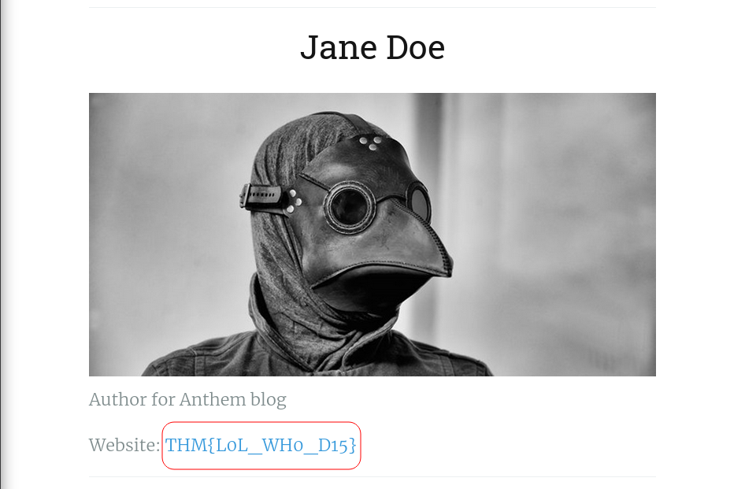
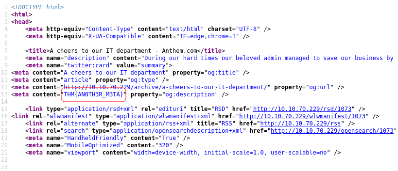
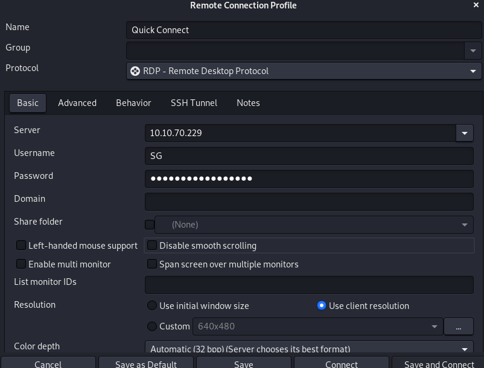
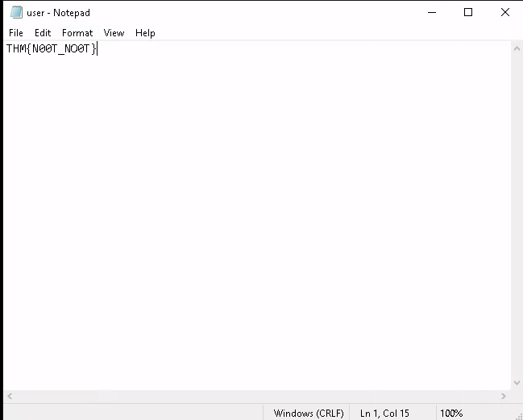
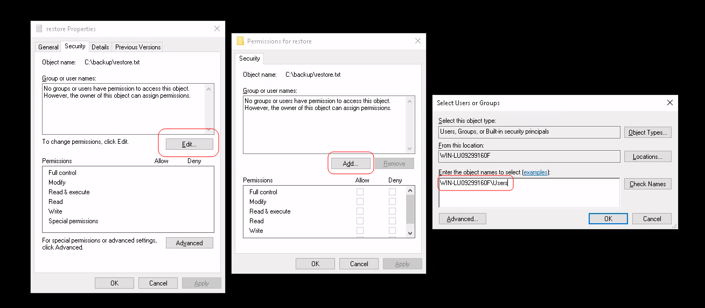
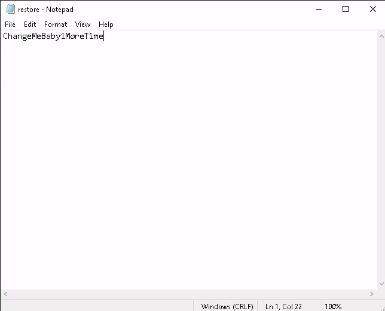

# Anthem

## Description

This task involves you, paying attention to details and finding the 'keys to the castle'.

This room is designed for beginners, however, everyone is welcomed to try it out!

Enjoy the Anthem.

In this room, you don't need to brute force any login page. Just your preferred browser and Remote Desktop.

# Initial Scan

First things first, let's run an Nmap scan (ICMP is disabled, so use `-Pn` flag.):

~~~
PORT     STATE    SERVICE       VERSION
80/tcp   open     http          Microsoft HTTPAPI httpd 2.0 (SSDP/UPnP)
| http-robots.txt: 4 disallowed entries 
|_/bin/ /config/ /umbraco/ /umbraco_client/
|_http-title: Anthem.com - Welcome to our blog
445/tcp  filtered microsoft-ds
3389/tcp open     ms-wbt-server Microsoft Terminal Services
| rdp-ntlm-info: 
|   Target_Name: WIN-LU09299160F
|   NetBIOS_Domain_Name: WIN-LU09299160F
|   NetBIOS_Computer_Name: WIN-LU09299160F
|   DNS_Domain_Name: WIN-LU09299160F
|   DNS_Computer_Name: WIN-LU09299160F
|   Product_Version: 10.0.17763
|_  System_Time: 2021-10-14T09:34:43+00:00
| ssl-cert: Subject: commonName=WIN-LU09299160F
| Not valid before: 2021-10-13T09:27:32
|_Not valid after:  2022-04-14T09:27:32
|_ssl-date: 2021-10-14T09:34:46+00:00; +3m28s from scanner time.
Service Info: OS: Windows; CPE: cpe:/o:microsoft:windows
~~~

# [Task 1 ] Website Analysis

From the result, we can answer the first two questions:

Web server port: `80`

RDS port: `3389`

## Enumeration

Let's check out the web page. The first thing I usually check, is `/robots.txt` and fortunately we got some info there.

~~~
┌──(user㉿Y0B01)-[~/Desktop/walkthroughs/thm/Anthem]
└─$ curl -s "http://$IP/robots.txt"
UmbracoIsTheBest!

# Use for all search robots
User-agent: *

# Define the directories not to crawl
Disallow: /bin/
Disallow: /config/
Disallow: /umbraco/
Disallow: /umbraco_client/
~~~

Possible password: `UmbracoIsTheBest!`

CMS (from directories): `Umbraco`

Website domain (from the title): `anthem.com`

Now that we have the basic information, we can start looking around the website. There are two posts on the website. One of them includes a poem written for admin. By googling the poem, we can find the name of the admin.

Admin's name: `Solomon Grundy`

Now we can try to guess admin's email to login from `/umbraco/`. By looking at the other email in the other post, we can kinda guess the format.

As we can see, they take the first letter of the first name and the last name and add "@anthem.com" to it. So probably, admin's email follows the same pattern:

Admin's email: `SG@anthem.com`

# [Task 2] Spot the flags

Now that we have all the information we need, let's gather the flags.

## Flag 1

We can find the first flag in `/archive/we-are-hiring/` meta data:

Flag 1: `THM{L0L_WH0_US3S_M3T4}`

## Flag 2

We can find flag 2 in the same directory:

Flag 2: `THM{G!T_G00D}`

## Flag 3

Flag 3 can be found in one of the author's profile in`/authors/jane-doe/`:

Flag 3: `THM{L0L_WH0_D15}`

## Flag 4

The 4th flag can be found in `/archive/a-cheers-to-our-it-department/` meta data:

Flag 4: `THM{AN0TH3R_M3TA}`

# [Task 4] Final stage

Let's get into the box using the intel we gathered. The first description refers to remote desktop which means we can probably get access to the box using RDP. I use an applecation called `remmina`. The password is `UmbracoIsTheBest!`.

## user.txt

After connectin to the box, we can see `user.txt` on the desktop:

user.txt: `THM{N00T_NO0T}`

## Admin's password

I looked around a bit and found a hidden folder in `C:\` called `backup` which contained a txt file called `restore`. We don't have permission to read the file, but we can change its permissions.

First right click on it and choose `Properties` and go to `security` section. Then click on *Edit* and click on *Add* and then we add our ID and now we can read the file:

Now save the changes and now we can read the file which is admin's password:

Admin's password: `ChangeMeBaby1MoreTime`

## root.txt

Now that we have root's password, we easily go through admin's files and read root.txt. Go to `C:\Users\Administrator` and enter the password and you can find the root flag in `Desktop`:

root.txt: `THM{Y0U_4R3_1337}`

# D0N3!  ; )

Thanks to the creator(S)!

Hope you had fun and have a good one! : )
