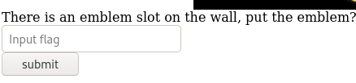

# Biohazard

## Desription

A CTF room based on the old-time survival horror game, Resident Evil. Can you survive until the end?

## [Task 1] Introduction

Welcome to Biohazard room, a puzzle-style CTF. Collecting the item, solving the puzzle and escaping the nightmare is your top priority. Can you survive until the end?

If you have any question, do not hesitate to DM me on the discord channel.

### 1.1 - Deploy the machine and start the nightmare

Deploy the machine and wait till it's fully configured.

No answer needed

### 1.2 - How many open ports?

Let's start with an Nmap scan. The scan reveals three open ports:

* 21 ftp
* 22 ssh
* 80 http

~~~
PORT   STATE SERVICE VERSION
21/tcp open  ftp     vsftpd 3.0.3
22/tcp open  ssh     OpenSSH 7.6p1 Ubuntu 4ubuntu0.3 (Ubuntu Linux; protocol 2.0)
| ssh-hostkey: 
|   2048 c9:03:aa:aa:ea:a9:f1:f4:09:79:c0:47:41:16:f1:9b (RSA)
|   256 2e:1d:83:11:65:03:b4:78:e9:6d:94:d1:3b:db:f4:d6 (ECDSA)
|_  256 91:3d:e4:4f:ab:aa:e2:9e:44:af:d3:57:86:70:bc:39 (ED25519)
80/tcp open  http    Apache httpd 2.4.29 ((Ubuntu))
|_http-title: Beginning of the end
|_http-server-header: Apache/2.4.29 (Ubuntu)
Service Info: OSs: Unix, Linux; CPE: cpe:/o:linux:linux_kernel
~~~

Answer: `3`

### 1.3 - What is the team name in operation

We don't have access to the FTP and the SSH service, so let's head to the webpage. We can find the answer to this question by reading the content of the main page:

<p align="center"></p>

Answer: `STARS alpha team`

## [Task 2] The Mansion

Collect all necessary items and advanced to the next level. The format of the Item flag:

**Item_name{32 character}**

Some of the doors are locked. Use the item flag to unlock the door.

Tips: It is better to record down all the information inside a notepad

### 2.1 - What is the emblem flag

In the main page, there is a link that redirects us to `/mansionmain`. If you check the source code, thaere is a comment that gives us another directory:

~~~
┌──(user㉿Y0B01)-[~/…/walkthroughs/thm/Biohazard/files]
└─$ curl -s "http://$IP/mansionmain/" | grep "<\!--"
	<!-- It is in the /diningRoom/ -->
~~~

Let's head to `/diningRoom` to see what we can find. There is a link which redirects us to a page named `emblem.php`:

<p align="center"></p>

When we go to `/diningRoom/emblem.php`, we can see the emblem flag:

~~~
┌──(user㉿Y0B01)-[~/Desktop/walkthroughs/thm/Biohazard]
└─$ curl -s "http://$IP/diningRoom/emblem.php" | html2text 
emblem{fec832623ea498e20bf4fe1821d58727}
Look like you can put something on the emblem slot, refresh /diningRoom/
~~~

Emblem flag: `emblem{fec832623ea498e20bf4fe1821d58727}`

### 2.2 - What is the lock pick flag

Let's follow the instructions and go back to `/diningRoom` and refresh the page. When you do so, you should see this:

<p align="center"></p>

When you submit the flag we just found, we get a message that says "Nothing happened". I checked the source code of `/diningRoom` and found a commented base64 encoded string, and after decoding it, I got a new directory:

~~~
┌──(user㉿Y0B01)-[~/Desktop/walkthroughs/thm/Biohazard]
└─$ curl -s "http://$IP/diningRoom/" | grep "<\!--"       
		<!-- SG93IGFib3V0IHRoZSAvdGVhUm9vbS8= -->
                                                                                                                      
┌──(user㉿Y0B01)-[~/Desktop/walkthroughs/thm/Biohazard]
└─$ echo "SG93IGFib3V0IHRoZSAvdGVhUm9vbS8=" | base64 -d
How about the /teaRoom/
~~~

When you navigate to this directory (`/teaRoom`), you can see a link to a page named `master_of_unlock.html`:

<p align="center"></p>

When we navigete to `/teaRoom/master_of_unlock.html`, we can see the lock pick flag:

~~~
┌──(user㉿Y0B01)-[~/Desktop/walkthroughs/thm/Biohazard]
└─$ curl -s "http://$IP/teaRoom/master_of_unlock.html" | html2text 
lock_pick{037b35e2ff90916a9abf99129c8e1837}
~~~

Lock pick flag: `lock_pick{037b35e2ff90916a9abf99129c8e1837}`

### 2.3 - What is the music sheet flag

Next I decided to try the new flag in `/diningRoom`, where we could submit flags and still doesn't work. If you check `/teaRoom` content again, you can see a directory named `/artRoom`. When you navigate there, there is a link to `/artRoom/MansionMap.html` which is a map of all the rooms:

~~~
┌──(user㉿Y0B01)-[~/Desktop/walkthroughs/thm/Biohazard]
└─$ curl -s "http://$IP/artRoom/MansionMap.html" | html2text 
Look like a map
Location:
/diningRoom/
/teaRoom/
/artRoom/
/barRoom/
/diningRoom2F/
/tigerStatusRoom/
/galleryRoom/
/studyRoom/
/armorRoom/
/attic/
~~~

I decided to go to the rooms one by one, so I headed to `/barRoom` and we can submit the lock pick falg here:

<p align="center"></p>

When you submit the flag, you get directed to `/barRoom357162e3db904857963e6e0b64b96ba7/` which we can submit another flag. The emblem flag doesn't work on it, but there is a link that takes us somewhere else:

<p align="center"></p>

That takes us to `/barRoom357162e3db904857963e6e0b64b96ba7/musicNote.html` which we have a base32 encoded string, which decodes to the music sheet flag:

~~~
┌──(user㉿Y0B01)-[~/Desktop/walkthroughs/thm/Biohazard]
└─$ curl -s "http://$IP/barRoom357162e3db904857963e6e0b64b96ba7/musicNote.html" | html2text 
Look like a music note
NV2XG2LDL5ZWQZLFOR5TGNRSMQ3TEZDFMFTDMNLGGVRGIYZWGNSGCZLDMU3GCMLGGY3TMZL5
                                                                                                                      
┌──(user㉿Y0B01)-[~/Desktop/walkthroughs/thm/Biohazard]
└─$ echo "NV2XG2LDL5ZWQZLFOR5TGNRSMQ3TEZDFMFTDMNLGGVRGIYZWGNSGCZLDMU3GCMLGGY3TMZL5" | base32 -d
music_sheet{362d72deaf65f5bdc63daece6a1f676e}
~~~

Music sheet flag: `music_sheet{362d72deaf65f5bdc63daece6a1f676e}`

### 2.4 - What is the gold emblem flag

Let's submit the flag in the previous page. After doing so, we go to `/barRoom357162e3db904857963e6e0b64b96ba7/barRoomHidden.php` which has a link to `/barRoom357162e3db904857963e6e0b64b96ba7/gold_emblem.php` and we can find the gold emblem there:

~~~
┌──(user㉿Y0B01)-[~/Desktop/walkthroughs/thm/Biohazard]
└─$ curl -s "http://$IP/barRoom357162e3db904857963e6e0b64b96ba7/gold_emblem.php" | html2text
gold_emblem{58a8c41a9d08b8a4e38d02a4d7ff4843}
Look like you can put something on the emblem slot, refresh the previous page
~~~

Gold emblem flag: `gold_emblem{58a8c41a9d08b8a4e38d02a4d7ff4843}`

### 2.5 - What is the shield key flag

Let's go back then. When you refresh `/barRoom357162e3db904857963e6e0b64b96ba7/barRoomHidden.php`, we see this:

<p align="center"></p>

Submit the first flag we found, and we get a name: `rebecca`

Now go back to `diningRoom` and submit the gold emblem we just found and we get a string:

```
klfvg ks r wimgnd biz mpuiui ulg fiemok tqod. Xii jvmc tbkg ks tempgf tyi_hvgct_jljinf_kvc
```

This is a Vigenère cipher. Use an online decoder and as you probably knew or realized, we need a key. The key is the name we found: `rebecca`.

The string decodes to:

```
there is a shield key inside the dining room. The html page is called the_great_shield_key
```

Now we navigate to `/diningRoom/the_great_shield_key.html` and we can find the shield key flag:

~~~
┌──(user㉿Y0B01)-[~/Desktop/walkthroughs/thm/Biohazard]
└─$ curl -s "http://$IP/diningRoom/the_great_shield_key.html" | html2text      
shield_key{48a7a9227cd7eb89f0a062590798cbac}
~~~

Shield key flag: `shield_key{48a7a9227cd7eb89f0a062590798cbac}`

### 2.6 - What is the blue gem flag

I didn't find anything else in the previous directories, so I decided to go to a new one in the map we found (`/artRoom/MansionMap.html`).

I went to `/diningRoom2F/` and found another commented encoded string:

~~~
┌──(user㉿Y0B01)-[~/Desktop/walkthroughs/thm/Biohazard]
└─$ curl -s "http://$IP/diningRoom2F/" | grep "<\!--"
	<!-- Lbh trg gur oyhr trz ol chfuvat gur fgnghf gb gur ybjre sybbe. Gur trz vf ba gur qvavatEbbz svefg sybbe. Ivfvg fnccuver.ugzy -->
~~~

We are looking at a ROT13 cipher. You can find several online tools to decode it. It decodes to:

```
You get the blue gem by pushing the status to the lower floor. The gem is on the diningRoom first floor. Visit sapphire.html
```

Let's do it then. Navigate to `/diningRoom/sapphire.html` and we have the blue gem flag now:

~~~
┌──(user㉿Y0B01)-[~/Desktop/walkthroughs/thm/Biohazard]
└─$ curl -s "http://$IP/diningRoom/sapphire.html" 
blue_jewel{e1d457e96cac640f863ec7bc475d48aa}
~~~

Blue gem flag: `blue_jewel{e1d457e96cac640f863ec7bc475d48aa}`

### 2.7 - What is the FTP username

Let's go to another directory. In `/tigerStatusRoom`, we can submit the blue gem flag:

<p align="center"></p>

After submiting the flag, we face this:

<p align="center"></p>

We need to find 4 crest and combine them and decoded them.

#### Crest 1

We have the first crest, but it's encoded, twice. First decode it from base64 and then decode it from base32:

~~~
┌──(user㉿Y0B01)-[~/Desktop/walkthroughs/thm/Biohazard]
└─$ echo "S0pXRkVVS0pKQkxIVVdTWUpFM0VTUlk9" | base64 -d | base32 -d                            
RlRQIHVzZXI6IG
~~~

crest 1: `RlRQIHVzZXI6IG`

#### Crest 2

Let's head to `/galleryRoom` and there you can find a link to `/galleryRoom/note.txt`. Let's see what we have there:

~~~
┌──(user㉿Y0B01)-[~/Desktop/walkthroughs/thm/Biohazard]
└─$ curl -s "http://$IP/galleryRoom/note.txt"   
crest 2:
GVFWK5KHK5WTGTCILE4DKY3DNN4GQQRTM5AVCTKE
Hint 1: Crest 2 has been encoded twice
Hint 2: Crest 2 contanis 18 letters
Note: You need to collect all 4 crests, combine and decode to reavel another path
The combination should be crest 1 + crest 2 + crest 3 + crest 4. Also, the combination is a type of encoded base and you need to decode it
~~~

We found the second crest, but we need to decode it. First decode it from base32, then decode it from base58 and you have the second crest:

crest 2: `h1bnRlciwgRlRQIHBh`

#### Crest 3

Let's go to `/armorRoom` and we can see this page, which we need to submit a flag in:

<p align="center"></p>

We can use the shield key flag on it and after doing so, we go to another page that has a link to `/armorRoom547845982c18936a25a9b37096b21fc1/note.txt` which we can find the third crest in:

~~~
┌──(user㉿Y0B01)-[~/Desktop/walkthroughs/thm/Biohazard]
└─$ curl -s "http://$IP/armorRoom547845982c18936a25a9b37096b21fc1/note.txt"
crest 3:
MDAxMTAxMTAgMDAxMTA [REDACTED] xMTAgMDAxMTEwMDA=
Hint 1: Crest 3 has been encoded three times
Hint 2: Crest 3 contanis 19 letters
Note: You need to collect all 4 crests, combine and decode to reavel another path
The combination should be crest 1 + crest 2 + crest 3 + crest 4. Also, the combination is a type of encoded base and you need to decode it
~~~

We should decode this crest three times. This is how we decode it: base64 > binary > hex > 3rd crest

crest 3: `c3M6IHlvdV9jYW50X2h`

#### crest 4

Let's head to `/attic`, where we need to use the shield key again:

<p align="center"></p>

When you submit the key, you go to a page that has a link to where the 4th crest is:

~~~
┌──(user㉿Y0B01)-[~/Desktop/walkthroughs/thm/Biohazard]
└─$ curl -s "http://$IP/attic909447f184afdfb352af8b8a25ffff1d/note.txt"    
crest 4:
gSUERauVpvKzRpyPpuYz66JDmRTbJubaoArM6CAQsnVwte6zF9J4GGYyun3k5qM9ma4s
Hint 1: Crest 2 has been encoded twice
Hint 2: Crest 2 contanis 17 characters
Note: You need to collect all 4 crests, combine and decode to reavel another path
The combination should be crest 1 + crest 2 + crest 3 + crest 4. Also, the combination is a type of encoded base and you need to decode it
~~~

Let's decode the last crest. First decode it from base58, then decode it from hex and you get the crest.

crest 4: `pZGVfZm9yZXZlcg==`

#### Combination

Now that we have all 4 crests, we can combine them and decode the result. Combining the crests in order, gives us the following, which is a base64 encoded string:

```
RlRQIHVzZXI6IGh1bnRlciwgRlRQIHBhc3M6IHlvdV9jYW50X2hpZGVfZm9yZXZlcg==
```

By decoding it, we get creds for the FTP service:

~~~
┌──(user㉿Y0B01)-[~/Desktop/walkthroughs/thm/Biohazard]
└─$ echo "RlRQIHVzZXI6IGh1bnRlciwgRlRQIHBhc3M6IHlvdV9jYW50X2hpZGVfZm9yZXZlcg==" | base64 -d
FTP user: hunter, FTP pass: you_cant_hide_forever
~~~

FTP username: `hunter`

### 2.8 - What is the FTP password

FTP password: `you_cant_hide_forever`

## [Task 3] The guard house

After gaining access to the FTP server, you need to solve another puzzle.

### 3.1 - Where is the hidden directory mentioned by Barry

Let's connect to the FTP service to see what we can find there. There are 5 files in there, so I downloaded them all to check them out:

~~~
┌──(user㉿Y0B01)-[~/…/thm/Biohazard/files/ftp]
└─$ ftp $IP           
Connected to 10.10.199.210.
220 (vsFTPd 3.0.3)
Name (10.10.199.210:user): hunter
331 Please specify the password.
Password:
230 Login successful.
Remote system type is UNIX.
Using binary mode to transfer files.
ftp> ls -la
200 PORT command successful. Consider using PASV.
150 Here comes the directory listing.
drwxrwxrwx    2 1002     1002         4096 Sep 20  2019 .
drwxrwxrwx    2 1002     1002         4096 Sep 20  2019 ..
-rw-r--r--    1 0        0            7994 Sep 19  2019 001-key.jpg
-rw-r--r--    1 0        0            2210 Sep 19  2019 002-key.jpg
-rw-r--r--    1 0        0            2146 Sep 19  2019 003-key.jpg
-rw-r--r--    1 0        0             121 Sep 19  2019 helmet_key.txt.gpg
-rw-r--r--    1 0        0             170 Sep 20  2019 important.txt
226 Directory send OK.
ftp> mget *

[REDACTED]

ftp> exit
221 Goodbye.
~~~

It seems like we still have a long way to go, so I'm gonna show you da way. First, let's read `important.txt`:

~~~
┌──(user㉿Y0B01)-[~/…/thm/Biohazard/files/ftp]
└─$ cat important.txt 
Jill,

I think the helmet key is inside the text file, but I have no clue on decrypting stuff. Also, I come across a /hidden_closet/ door but it was locked.

From,
Barry
~~~

We have a directory which we will get to later, becuase we need to obtain the helmet key first.

Answer: `/hidden_closet/`

### 3.2 - Password for the encrypted file

Now let's get to the images. We need to gather three keys.

#### Key 1

Use `steghide` on `001-key.jpg` and you get a txt file which has the first key:

~~~
┌──(user㉿Y0B01)-[~/…/thm/Biohazard/files/ftp]
└─$ steghide extract -sf 001-key.jpg
Enter passphrase: 
wrote extracted data to "key-001.txt".
                                                                                                                      
┌──(user㉿Y0B01)-[~/…/thm/Biohazard/files/ftp]
└─$ cat key-001.txt  
cGxhbnQ0Ml9jYW
~~~

Key 1: `cGxhbnQ0Ml9jYW`

#### Key 2

Use `exiftool` on `002-key.jpg` which shows the meta data and the second key is in the comment field:

~~~
┌──(user㉿Y0B01)-[~/…/thm/Biohazard/files/ftp]
└─$ exiftool 002-key.jpg
ExifTool Version Number         : 12.34
File Name                       : 002-key.jpg

[REDACTED]

Y Resolution                    : 1
Comment                         : 5fYmVfZGVzdHJveV9   <------------
Image Width                     : 100

[REDACTED]
~~~

Key 2: `5fYmVfZGVzdHJveV9`

#### Key 3

Use `binwalk` on `003-key.jpg` with `-e` switch to extract the file inside it, and we have the third key now:

~~~
┌──(user㉿Y0B01)-[~/…/thm/Biohazard/files/ftp]
└─$ binwalk 003-key.jpg -e

DECIMAL       HEXADECIMAL     DESCRIPTION
--------------------------------------------------------------------------------
0             0x0             JPEG image data, JFIF standard 1.01
1930          0x78A           Zip archive data, at least v2.0 to extract, uncompressed size: 14, name: key-003.txt
2124          0x84C           End of Zip archive, footer length: 22

                                                                                                                      
┌──(user㉿Y0B01)-[~/…/thm/Biohazard/files/ftp]
└─$ cat _003-key.jpg.extracted/key-003.txt 
3aXRoX3Zqb2x0
~~~

Key 3: `3aXRoX3Zqb2x0`

#### Combination

Now we have to combine them in order to get this encoded string:

```
cGxhbnQ0Ml9jYW5fYmVfZGVzdHJveV93aXRoX3Zqb2x0
```

It's a base64 encoded string. Let's decode it:

~~~
┌──(user㉿Y0B01)-[~/…/thm/Biohazard/files/ftp]
└─$ echo "cGxhbnQ0Ml9jYW5fYmVfZGVzdHJveV93aXRoX3Zqb2x0" | base64 -d                        
plant42_can_be_destroy_with_vjolt
~~~

Now we have the password to decrypt the gpg file.

Password for gpg: `plant42_can_be_destroy_with_vjolt`

### 3.3 - What is the helmet key flag

Let's decrypt the gpg file using the password:

~~~
┌──(user㉿Y0B01)-[~/…/thm/Biohazard/files/ftp]
└─$ gpg helmet_key.txt.gpg
gpg: WARNING: no command supplied.  Trying to guess what you mean ...
gpg: AES256.CFB encrypted data
gpg: encrypted with 1 passphrase
                                                                                                                      
┌──(user㉿Y0B01)-[~/…/thm/Biohazard/files/ftp]
└─$ cat helmet_key.txt                    
helmet_key{458493193501d2b94bbab2e727f8db4b}
~~~

Helmet key flag: `helmet_key{458493193501d2b94bbab2e727f8db4b}`

## [Task 4] The Revisit

Done with the puzzle? There are places you have explored before but yet to access.

### 4.1 - What is the SSH login username

If you haven't noticed, I skipped a room when we were exploring them all, the `/studyRoom`. Now we have the helmet key and we can enter:

<p align="center"></p>

Submit the helmet key and enter. In the new directory, there is a tar file to download. After downloading it, extract the file inside it to get the ssh username:

~~~
┌──(user㉿Y0B01)-[~/…/walkthroughs/thm/Biohazard/files]
└─$ tar -xvf doom.tar.gz
eagle_medal.txt
                                                                                                                      
┌──(user㉿Y0B01)-[~/…/walkthroughs/thm/Biohazard/files]
└─$ cat eagle_medal.txt 
SSH user: umbrella_guest
~~~

SSH username: `umbrella_guest`

### 4.2 - What is the SSH login password

Now let's find the password. We found a new directory in `important.txt`, which is `/hidden_closet`. By navigating there, you can submit the helmet flag and enter and you'll see this:

<p align="center"></p>

There are two links there. One shows us a Vigenère cipher that we need a key to decode:

~~~
┌──(user㉿Y0B01)-[~/…/walkthroughs/thm/Biohazard/files]
└─$ curl -s "http://$IP/hiddenCloset8997e740cb7f5cece994381b9477ec38/MO_DISK1.txt"
wpbwbxr wpkzg pltwnhro, txrks_xfqsxrd_bvv_fy_rvmexa_ajk
~~~

The other one gives us the SSH password:

~~~
┌──(user㉿Y0B01)-[~/…/walkthroughs/thm/Biohazard/files]
└─$ curl -s "http://$IP/hiddenCloset8997e740cb7f5cece994381b9477ec38/wolf_medal.txt"
SSH password: T_virus_rules
~~~

SSH password: `T_virus_rules`

### 4.3 - Who the STARS bravo team leader

After entering the `hidden_closet` using the helmet key, you can see the name in the text:

~~~
┌──(user㉿Y0B01)-[~/…/walkthroughs/thm/Biohazard/files]
└─$ curl -s "http://$IP/hiddenCloset8997e740cb7f5cece994381b9477ec38/" | html2text | grep -i "bravo"
In the cave, Jill met injured Enrico, the leader of the STARS Bravo team. He
                              ^^^^^^  ^^^^^^^^^^^^^^^^^^^^^^^^^^^^^
~~~

Answer: `Enrico`

## [Task 5] Underground laboratory

Time for the final showdown. Can you escape the nightmare?

### 5.1 - Where you found Chris

Now let's connect to the machine via ssh using the creds (`umbrella_guest:T_virus_rules`). After I logged in, I listed all the files in our home directory and found an odd one which was hidden too:

~~~
umbrella_guest@umbrella_corp:~$ ls -la
total 64
drwxr-xr-x  8 umbrella_guest umbrella 4096 Sep 20  2019 .
drwxr-xr-x  5 root           root     4096 Sep 20  2019 ..
-rw-r--r--  1 umbrella_guest umbrella  220 Sep 19  2019 .bash_logout
-rw-r--r--  1 umbrella_guest umbrella 3771 Sep 19  2019 .bashrc
drwxrwxr-x  6 umbrella_guest umbrella 4096 Sep 20  2019 .cache
drwxr-xr-x 11 umbrella_guest umbrella 4096 Sep 19  2019 .config
-rw-r--r--  1 umbrella_guest umbrella   26 Sep 19  2019 .dmrc
drwx------  3 umbrella_guest umbrella 4096 Sep 19  2019 .gnupg
-rw-------  1 umbrella_guest umbrella  346 Sep 19  2019 .ICEauthority
drwxr-xr-x  2 umbrella_guest umbrella 4096 Sep 20  2019 .jailcell   <----------
drwxr-xr-x  3 umbrella_guest umbrella 4096 Sep 19  2019 .local
-rw-r--r--  1 umbrella_guest umbrella  807 Sep 19  2019 .profile
drwx------  2 umbrella_guest umbrella 4096 Sep 20  2019 .ssh
-rw-------  1 umbrella_guest umbrella  109 Sep 19  2019 .Xauthority
-rw-------  1 umbrella_guest umbrella 7546 Sep 19  2019 .xsession-errors
~~~

Let's see what we can find in this directory:

~~~
umbrella_guest@umbrella_corp:~$ cd .jailcell/
umbrella_guest@umbrella_corp:~/.jailcell$ ls -la
total 12
drwxr-xr-x 2 umbrella_guest umbrella 4096 Sep 20  2019 .
drwxr-xr-x 8 umbrella_guest umbrella 4096 Sep 20  2019 ..
-rw-r--r-- 1 umbrella_guest umbrella  501 Sep 20  2019 chris.txt
~~~

We found a message from "Chris".

Answer: `jailcell`

### 5.2 - Who is the traitor

Let's read it to see who the traitor is:

~~~
umbrella_guest@umbrella_corp:~/.jailcell$ cat chris.txt 
Jill: Chris, is that you?
Chris: Jill, you finally come. I was locked in the Jail cell for a while. It seem that weasker is behind all this.
Jil, What? Weasker? He is the traitor?
Chris: Yes, Jill. Unfortunately, he play us like a damn fiddle.
Jill: Let's get out of here first, I have contact brad for helicopter support.
Chris: Thanks Jill, here, take this MO Disk 2 with you. It look like the key to decipher something.
Jill: Alright, I will deal with him later.
Chris: see ya.

MO disk 2: albert
~~~

Answer: `weasker`

### 5.3 - The login password for the traitor

We found the key for the Vigenère cipher we found in `/hiddenCloset8997e740cb7f5cece994381b9477ec38/MO_DISK1.txt`. THe key is `albert`. Use an online decoder to decode it. After doing so, you get `weasker`'s password:

```
weasker login password, stars_members_are_my_guinea_pig
```

Answer: `stars_members_are_my_guinea_pig`

### 5.4 - The name of the ultimate form

Let's switch to `weasker` and see what we can find in his home directory:

~~~
umbrella_guest@umbrella_corp:~/.jailcell$ su weasker
Password: 
weasker@umbrella_corp:/home/umbrella_guest/.jailcell$ cd
weasker@umbrella_corp:~$ ls
Desktop  weasker_note.txt
~~~

There is a note. By reading it, we get the name of ultimate form:

~~~
weasker@umbrella_corp:~$ cat weasker_note.txt 
Weaker: Finally, you are here, Jill.
Jill: Weasker! stop it, You are destroying the  mankind.
Weasker: Destroying the mankind? How about creating a 'new' mankind. A world, only the strong can survive.
Jill: This is insane.
Weasker: Let me show you the ultimate lifeform, the Tyrant.   <-----------

(Tyrant jump out and kill Weasker instantly)
(Jill able to stun the tyrant will a few powerful magnum round)

Alarm: Warning! warning! Self-detruct sequence has been activated. All personal, please evacuate immediately. (Repeat)
Jill: Poor bastard
~~~

Answer: `Tyrant`

### 5.5 - The root flag

Now we need to gain root access in order to obtain the root flag. I ran `sudo -l` to check my sudo permissions:

~~~
weasker@umbrella_corp:~$ sudo -l
[sudo] password for weasker: 
Matching Defaults entries for weasker on umbrella_corp:
    env_reset, mail_badpass, secure_path=/usr/local/sbin\:/usr/local/bin\:/usr/sbin\:/usr/bin\:/sbin\:/bin\:/snap/bin

User weasker may run the following commands on umbrella_corp:
    (ALL : ALL) ALL
~~~

As you can see, we can run all the commands with sudo as `root` with no password. We can easily run `sudo su` and switch to root:

~~~
weasker@umbrella_corp:~$ sudo su
root@umbrella_corp:/home/weasker# id
uid=0(root) gid=0(root) groups=0(root)
~~~

Now we can head to `/root` directory and read the root flag:

~~~
root@umbrella_corp:/home/weasker# cd /root
root@umbrella_corp:~# ls
root.txt
root@umbrella_corp:~# cat root.txt 
In the state of emergency, Jill, Barry and Chris are reaching the helipad and awaiting for the helicopter support.

Suddenly, the Tyrant jump out from nowhere. After a tough fight, brad, throw a rocket launcher on the helipad. Without thinking twice, Jill pick up the launcher and fire at the Tyrant.

The Tyrant shredded into pieces and the Mansion was blowed. The survivor able to escape with the helicopter and prepare for their next fight.

The End

flag: 3c5794a00dc56c35f2bf096571edf3bf
~~~

Root flag: `3c5794a00dc56c35f2bf096571edf3bf`

# D0N3! ; )

A HUGE thanks to the creator(s) for this fun room with a great story line!

Hope you had fun like I did and learned something.

Have a g00d 0ne! : )