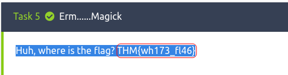
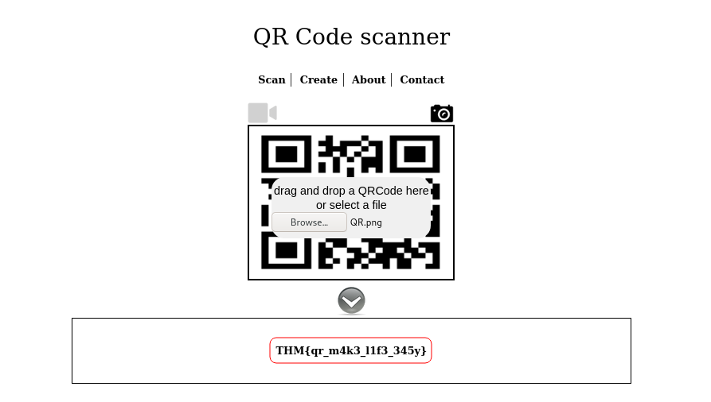
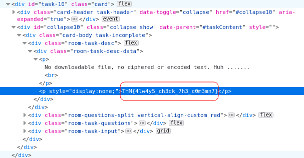
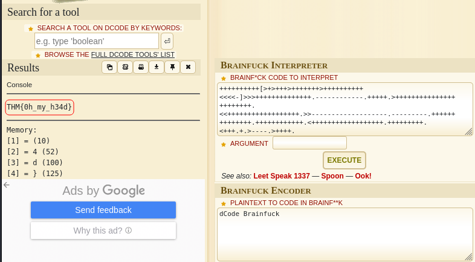
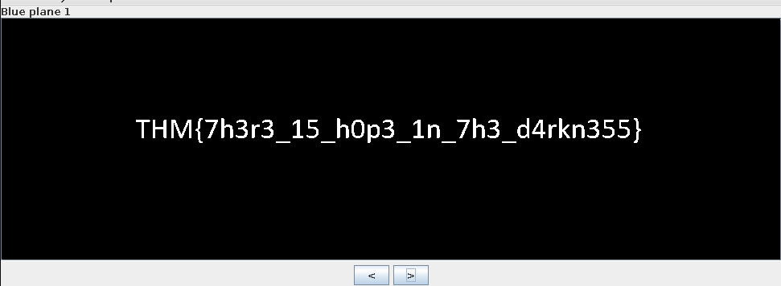
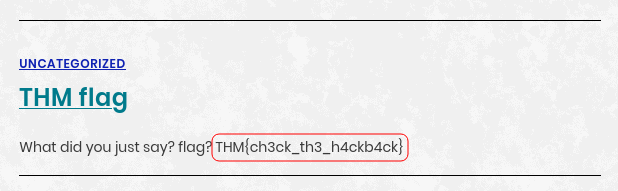
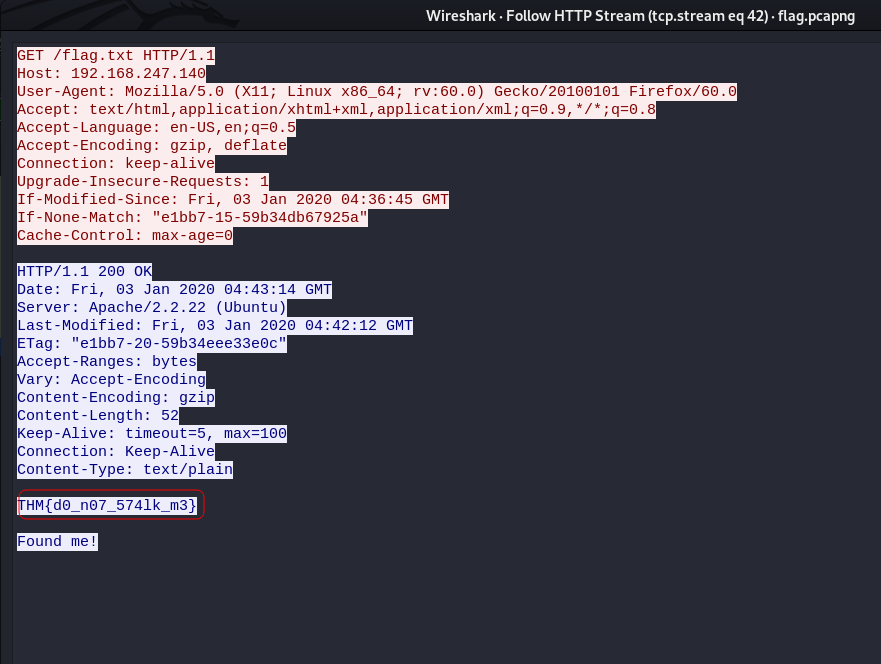

# CTF collection Vol.1

## Description

Sharpening up your CTF skill with the collection. The first volume is designed for beginner.

## [Task 1] Author note

Just another random CTF room created by me. Well, the main objective of the room is to test your CTF skills. For your information, vol.1 consists of 20 tasks and all the challenges are extremely easy. Stay calm and Capture the flag. :)

Note: All the challenges flag are formatted as `THM{flag}`, unless stated otherwise

## [Task 2] What does the base said?

String: VEhNe2p1NTdfZDNjMGQzXzdoM19iNDUzfQ==

We are given a base64 encoded string which we can easily decode:
~~~
┌──(user㉿Y0B01)-[~/Desktop/walkthroughs/thm/CTF_collection_Vol.1]
└─$ echo "VEhNe2p1NTdfZDNjMGQzXzdoM19iNDUzfQ==" | base64 -d
THM{ju57_d3c0d3_7h3_b453}
~~~

Flag: `THM{ju57_d3c0d3_7h3_b453}`

## [Task 3] Meta meta

We are provided with `Findme.jpg`. After downloading it, just use `exiftool` and read the meta data. The flag is in front of the owner name:

~~~
┌──(user㉿Y0B01)-[~/…/walkthroughs/thm/CTF_collection_Vol.1/files]
└─$ exiftool Findme.jpg 
ExifTool Version Number         : 12.32
File Name                       : Findme.jpg
Directory                       : .
File Size                       : 34 KiB
File Modification Date/Time     : 2021:10:18 06:26:38-04:00
File Access Date/Time           : 2021:10:18 06:27:06-04:00
File Inode Change Date/Time     : 2021:10:18 06:28:04-04:00
File Permissions                : -rw-r--r--
File Type                       : JPEG
File Type Extension             : jpg
MIME Type                       : image/jpeg
JFIF Version                    : 1.01
X Resolution                    : 96
Y Resolution                    : 96
Exif Byte Order                 : Big-endian (Motorola, MM)
Resolution Unit                 : inches
Y Cb Cr Positioning             : Centered
Exif Version                    : 0231
Components Configuration        : Y, Cb, Cr, -
Flashpix Version                : 0100
Owner Name                      : THM{3x1f_0r_3x17}  <---------------------
Comment                         : CREATOR: gd-jpeg v1.0 (using IJG JPEG v62), quality = 60.
Image Width                     : 800
Image Height                    : 480
Encoding Process                : Progressive DCT, Huffman coding
Bits Per Sample                 : 8
Color Components                : 3
Y Cb Cr Sub Sampling            : YCbCr4:2:0 (2 2)
Image Size                      : 800x480
Megapixels                      : 0.384
~~~

Flag: `THM{3x1f_0r_3x17}`

## [Task 4] Mon, are we going to be okay?

We are given a jpg file. Use `steghide` to extract the file hidden in there. We don't need a passphrase so just hit enter:

~~~
┌──(user㉿Y0B01)-[~/…/walkthroughs/thm/CTF_collection_Vol.1/files]
└─$ steghide extract -sf Extinction.jpg       
Enter passphrase: 
wrote extracted data to "Final_message.txt".
                                                                                                                      
┌──(user㉿Y0B01)-[~/…/walkthroughs/thm/CTF_collection_Vol.1/files]
└─$ cat Final_message.txt 
It going to be over soon. Sleep my child.

THM{500n3r_0r_l473r_17_15_0ur_7urn}
~~~

Flag: `THM{500n3r_0r_l473r_17_15_0ur_7urn}`

## [Task 5] Erm......Magick

The flag is in the question. Just highlight the whole line and you'll see it:

Flag: `THM{wh173_fl46}`

## [Task 6] QRrrrr

We are given a QR code. Jusy use your phone or an online QR code scanner. I used [this](https://webqr.com/) website.

Flag: `THM{qr_m4k3_l1f3_345y}`

## [Task 7] Reverse it or read it?

We are given an executable file. I used `strings` command to read the strings inside the file and the flag is there:
~~~
┌──(user㉿Y0B01)-[~/…/walkthroughs/thm/CTF_collection_Vol.1/files]
└─$ strings hello.hello | grep THM
THM{345y_f1nd_345y_60}
~~~

Flag: `THM{345y_f1nd_345y_60}`

## [Task 8] Another decoding stuff

String: 3agrSy1CewF9v8ukcSkPSYm3oKUoByUpKG4L

We are given a base58 encoded string. You can use online tools to decode it. I used [CyberChef](https://gchq.github.io/CyberChef/).

Flag: `THM{17_h45_l3553r_l3773r5}`

## [Task 9] Left or right

string: MAF{atbe_max_vtxltk}

Obviously the letters are rotated, so it's some kind of ROT. By counting the first letter (M) to what it actually is (T), we find out that it is ROT7. I used [this](https://rot13.com/) website to rotate the letters.

Flag: `THM{hail_the_caesar}`

## [Task 10] Make a comment

Right click on the description of the task and inspect it and you can see the flag:

Answer: `THM{4lw4y5_ch3ck_7h3_c0m3mn7}`

## [Task 11] Can you fix it?

We are given a corrupted png file and we need to fix it. I used `hexeditor` to do so. Just change the first 4 bits which are called "magic numbers" to `89 50 4E 47` and it's fixed. Save it and now you can display it.

~~~
File: spoil.png                                                         ASCII Offset: 0x00000004 / 0x00011466 (%00)  M
00000000  89 50 4E 47  0D 0A 1A 0A   00 00 00 0D  49 48 44 52                                         .PNG........IHDR
00000010  00 00 03 20  00 00 03 20   08 06 00 00  00 DB 70 06                                         ... ... ......p.
~~~

Flag: `THM{y35_w3_c4n}`

## [Task 12] Read it

This one takes a little bit a googling. Just head [here](https://www.reddit.com/r/tryhackme/comments/eizxaq/new_room_coming_soon/) and you can see the flag.

Flag: `THM{50c14l_4cc0un7_15_p4r7_0f_051n7}`

## [Task 13] Spin my head

Well this is called "Brainfuck language". You can decode it [here](https://www.dcode.fr/brainfuck-language).

Flag: `THM{0h_my_h34d}`

## [Task 14] An exclusive!

This is XOR encryption. You can decrypt it using a simple python code:

~~~py
>>> s1 = "44585d6b2368737c65252166234f20626d"
>>> s2 = "1010101010101010101010101010101010"
>>> h = hex(int(s1, 16) ^ int(s2, 16))[2:]
>>> bytes.fromhex(h).decode('utf-8')
'THM{3xclu51v3_0r}'
~~~

Flag: `THM{3xclu51v3_0r}`

## [Task 15] Binary walk

We are given a jpg file with a file inside it. As the question suggests, I used `binwalk` to extract the file inside it:

~~~
┌──(user㉿Y0B01)-[~/…/walkthroughs/thm/CTF_collection_Vol.1/files]
└─$ binwalk hell.jpg -e

DECIMAL       HEXADECIMAL     DESCRIPTION
--------------------------------------------------------------------------------
0             0x0             JPEG image data, JFIF standard 1.02
30            0x1E            TIFF image data, big-endian, offset of first image directory: 8
265845        0x40E75         Zip archive data, at least v2.0 to extract, uncompressed size: 69, name: hello_there.txt
266099        0x40F73         End of Zip archive, footer length: 22

                                                                                                                      
┌──(user㉿Y0B01)-[~/…/walkthroughs/thm/CTF_collection_Vol.1/files]
└─$ cat _hell.jpg.extracted/hello_there.txt  
Thank you for extracting me, you are the best!

THM{y0u_w4lk_m3_0u7}
~~~

Flag: `THM{y0u_w4lk_m3_0u7}`

## [Task 16] Darkness

The image we are given is a black picture, but there is somrthing hidden in it. Use "Blue plain 1" and it's visible.

Flag: `THM{7h3r3_15_h0p3_1n_7h3_d4rkn355}`

## [Task 17] A sounding QR

We are given a QR code again. After scanning it, we are given a "soundcloud" link which is an audio saying the letters of the flag. You can slow it down to understand the letters better.

Flag: `THM{SOUNDINGQR}`

## [Task 18] Dig up the past

For this one we have to dig through the past. There is a thing called [**"wayback machine"**](https://archive.org/web/). It is a digital archive of the World Wide Web and it keeps snapshots of websites. from different time periods. We are given the URL and the date, so let's look it up.

Flag: `THM{ch3ck_th3_h4ckb4ck}`

## [Task 19] Uncrackable!

For this one, we are given a **Vigenère cipher** but we don't have a key. We can find the key because we know the first part of the flag. Go to [CyberChef](https://gchq.github.io/CyberChef/#recipe=Vigen%C3%A8re_Decode('')) and put `TRYHACKME` as the key. The result would be `THMTHMTHM{YEI_RVEWY_BHU_YQF}`. So the key is `THMTHMTHM`. Put this as the key and you'll get the flag.

Flag: `TRYHACKME{YOU_FOUND_THE_KEY}`

## [task 20] Small bases

581695969015253365094191591547859387620042736036246486373595515576333693

We are given a series of number and we have to decode it. I'm gonna make it short for you. I used the following python code to decode it.

~~~py
>>> n = 581695969015253365094191591547859387620042736036246486373595515576333693
>>> h = hex(n)[2:]
>>> bytearray.fromhex(h).decode()
'THM{17_ju57_4n_0rd1n4ry_b4535}'
~~~

Flag: `THM{17_ju57_4n_0rd1n4ry_b4535}`

## [Task 21]  Read the packet

We are provided with a pcap file. I ran `wireshark` and startedanalyzing the file. I found the flag in **"tcp.stream eq 42"**. Right click > Follow > HTTP Stream and here you go:

</ps>

Flag: `THM{d0_n07_574lk_m3}`

# D0N3! ; )

Thanks to the creator!

Hope you had fun and leaned something!

Make it a good one! : )
