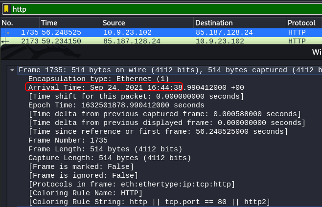
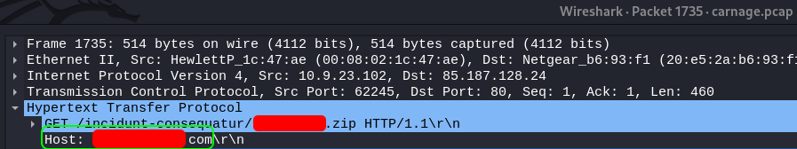
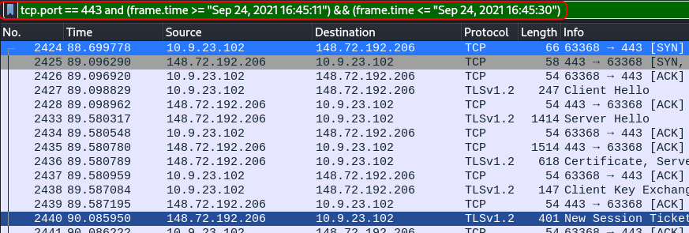
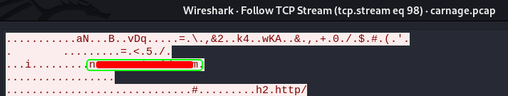
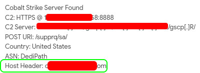
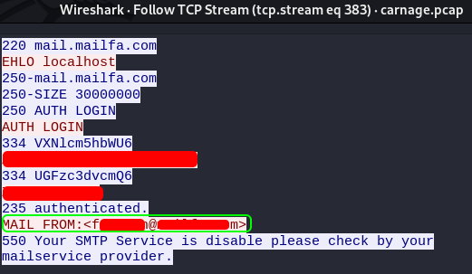

# Carnage

## Description

Apply your analytical skills to analyze the malicious network traffic using Wireshark.

## Scenario

Eric Fischer from the Purchasing Department at Bartell Ltd has received an email from a known contact with a Word document attachment.  Upon opening the document, he accidentally clicked on "Enable Content."  The SOC Department immediately received an alert from the endpoint agent that Eric's workstation was making suspicious connections outbound. The pcap was retrieved from the network sensor and handed to you for analysis.

Task: Investigate the packet capture and uncover the malicious activities.

*Credit goes to [Brad Duncan](https://www.malware-traffic-analysis.net) for capturing the traffic and sharing the pcap packet capture with InfoSec community.

**NOTE: DO NOT** directly interact with any domains and IP addresses in this challenge.

## Traffic Analysis

Are you ready for the journey?

Please, load the pcap file in your Analysis folder on the Desktop into Wireshark to answer the questions below.

### Author (me):

After you deployed the machine, you can either use `wireshark` on the machine or transfer the pcap file to your machine to be more comfortable. The only thing about the second way is that you probably need to convert the time for a few questions.

I'm not gonna put the full answers here, so you can be able to have a hand-on experience except for the first question, so you can calculate the time if needed.

### Transfering the file to your machine

If you want to use the machine itself, you can pass this part, otherwise follow the steps to transfer the pcap file to your machine.

First on the machine, open a terminal using the terminal icon on the left hand top corner. Then navigate to where the pcap file is and start an http server:

After you opened a terminal, run these commands

~~~
$ cd ~/Desktop/Analysis
$ python3 -m http.server 8000
Serving HTTP on 0.0.0.0 port 8000 (http://0.0.0.0:8000/) ...
~~~

Now on your machine, after you connected to tryhackme network, run the following command to transfer the pcap file to your machine:

~~~
$ wget http://<MACHINE IP>:8000/carnage.pcap
~~~

Now we wait till the file is fully downlaoded. After the download is done, we are good to go. Let's start then!

Use `wireshark` and open the pcap file and start analyzing!

### Question 1

**What was the date and time for the first HTTP connection to the malicious IP?**

First we need to apply a filter so we only see the HTTP packets. We can do this by using the filtering bar (if that's what it's called):

Now we can only see the HTTP packets and also we see the destination IP which is `85.187.128.24`. Double click on the first result and in "Frame", we can see the "Arrival Time":

I'm only gonna put the answer for this one, so you can calculate the time for other questions (I think it is UTC - 01:00).

Answer: `2021-09-24 16:44:38`

### Question 2

**What is the name of the zip file that was downloaded?**

There are many ways to see the answer to this question. Let's use the correct one. After double clicking on that packet, expand "Hypertext Transfer Protocol" and you can see the answer in the first line:

Answer: `*********.zip`

### Question 3

**What was the domain hosting the malicious zip file?**

We can find the answer in the same place. It's right below the GET request information:

Answer: `***********.com`

### Question 4

**Without downloading the file, what is the name of the file in the zip file?**

We have to check this by following the HTTP stream. To do this, on the Get request: Right click > Follow > HTTP Stream (TCP Stream shows the same thing):

Now a window opens which is `tcp.stream eq 73`. In the server response where the non-sence starts, we can see the name of the file inside the zip file:

Answer: `chart-**********.xls`

### Question 5

**What is the name of the webserver of the malicious IP from which the zip file was downloaded?**

You can find the answer to this one, in the same tcp stream (`tcp.stream eq 73`). It is in the server header:

Answer: `L*******d`

### Question 6

**What is the version of the webserver from the previous question?**

Still in the same tcp stream (`tcp.stream eq 73`), in server headers, in front of "x-powered-by":

Answer: `***/*.*.**`

### Question 7

**Malicious files were downloaded to the victim host from multiple domains. What were the three domains involved with this activity?**

**Hint:** Check HTTPS traffic. Narrow down the timeframe from 16:45:11 to 16:45:30.

from the hint, we know that we should look through HTTPS traffic and we have the time frame. We can apply a filtering rule to only check this time frame and HTTPS traffic. Here is how it looks like (you may need to calculate the time if you have the file on your machine. Use the answer of the first question to do it.):

~~~
tcp.port == 443 and (frame.time >= "Sep 24, 2021 16:45:11") && (frame.time <= "Sep 24, 2021 16:45:30")
~~~

Port 443 is used for HTTPS that's why it's there. Here's the result of the filtering:

Now we follow the tcp streams as we did in 4th question. Looking through the streams, we can find the domains.

The first one is in `tcp.stream eq 90`:

The second one is in `tcp.stream eq 97`:

And the third on is in `tcp.stream eq 98`:

Answer: `f*********.**m.*u, t*********.com, n**.*********.com`

### Question 8

**Which certificate authority issued the SSL certificate to the first domain from the previous question?**

Let's go to `tcp.stream eq 90` since we want the first domain. we can see the certificate authority there:

Answer: `G*****y`

### Question 9

**What are the two IP addresses of the Cobalt Strike servers? Use VirusTotal (the Community tab) to confirm if IPs are identified as Cobalt Strike C2 servers.**

Let's set the filter to only see the HTTP packets. Then by going through the packets we can see IPs that the victim communicated with:

We use [`virustotal`](https://www.virustotal.com/gui/home/search) search tab to check the IPs and see if they are identified as Cobalt Strike C2 servers. We can see if they are, from the "Community" tab.

Here's the first IP:

Here's the second IP:

Answer: `1**.***.**.**8, 1**.***.***.**4`

### Question 10

**What is the Host header for the first Cobalt Strike IP address from the previous question?**

We can see the answer in both virustotal or by following the tcp stream of that IP:

Answer: `o***.********.com`

### Question 11

**What is the domain name for the first IP address of the Cobalt Strike server? You may use VirusTotal to confirm if it's the Cobalt Strike server (check the Community tab).**

Found it in the "Community tab" of the first IP in virustotal:

Answer: `*********.***e`

### Question 12

**What is the domain name of the second Cobalt Strike server IP?  You may use VirusTotal to confirm if it's the Cobalt Strike server (check the Community tab).**

Found it in the "Community tab" of the second IP in virustotal. It can also be found by following the tcp stream of the second IP:

Answer: `s****************.**m`

### Question 13

**What is the domain name of the post-infection traffic?**

**Hint:** Filter Post HTTP traffic

First we have to apply a filter, so we only see the POST HTTP traffic. We can easily do this using the following filter:

~~~
http.request.method == "POST"
~~~

Then follow the tcp stream of the first result and the domain name is in the "Host" field:

Answer: `m**********.**t`

### Question 14

**What are the first eleven characters that the victim host sends out to the malicious domain involved in the post-infection traffic?**

We can find the answer in the same tcp stream as the question above (`tcp.stream eq 104`):

Answer: `z*********9`

### Question 15

**What was the length for the first packet sent out to the C2 server?**

You can see the length in many places. After filtering the packets for POST HTTP packets, the answer is in the "Length" column of the dirst packet in results:

Answer: `2**`

### Question 16

**What was the Server header for the malicious domain from the previous question?**

In the same tcp stream as the few last questions (`tcp.stream eq 104`). The answer is in front of the "Server" field:

Answer: `A*****/*.*.** (******) O******/*.*.*l m**_*********/*.*`

### Question 17

**The malware used an API to check for the IP address of the victim’s machine. What was the date and time when the DNS query for the IP check domain occurred?**

The first thing we should do is to filter the packets to only see the DNS':

By going through the packets, we can see in `packet 24147`, a query had been sent to an API. By double clicking on it, we can see the "Arrival Time":

Answer: `2***-**-** 17:**:**`

### Question 18

**What was the domain in the DNS query from the previous question?**

Right click on that packet and follow "UDP Stream". The query is there (yes the answer can be found else where):

Answer: `a**.*****.***`

### Question 19

**Looks like there was some malicious spam (malspam) activity going on. What was the first MAIL FROM address observed in the traffic?**

Since we are looking for a mail, we should filter the packets to see SMTP ones. It stands for "Simple Mail Transfer Protocol". We also know the IP source, so the filter should look like this:

~~~
smtp and ip.src == 10.9.23.102
~~~

By following the first result's tcp stream (`tcp.stream 383`), we can see the mail sender:

Answer: `f******@******.***`

### Question 20

**How many packets were observed for the SMTP traffic?**

Filter the packets to only see SMTP ones. Then from the toolbar, select "Statistics" and choose "Protocol Hierarchy":

After doing so, a window pops open which has what we need:

Answer: `1***`

# D0N3! ; )

Thanks a lot to the creators of this room!

Hope you learned somrthing and had fun like I did!

Have a g00d 0ne! : )