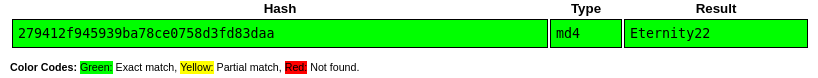

# Crack the hash

## Descripion

Cracking hashes challenges

We are going to use `hashcat`, and `john`, and some websites to crack the given hashes and also we are using `hashid` to help us identifying the hash algorithms. BTW I'm using [`rockyou`](https://www.google.com/url?sa=t&rct=j&q=&esrc=s&source=web&cd=&cad=rja&uact=8&ved=2ahUKEwiJlresqdvzAhVQCxoKHQBOB20QFnoECAcQAQ&url=https%3A%2F%2Fgithub.com%2Fbrannondorsey%2Fnaive-hashcat%2Freleases%2Fdownload%2Fdata%2Frockyou.txt&usg=AOvVaw3snAERl1mU6Ccr4WFEazBd) wordlist.

Let's go!

## Level 1

Can you complete the level 1 tasks by cracking the hashes?

### 1.1

Hash: 48bb6e862e54f2a795ffc4e541caed4d

This hash is an MD5 hash. Let's crack it using hashcat:
~~~
$ hashcat -m 0 1-1.hash /usr/share/wordlists/rockyou.txt
~~~

Answer: `easy`

### 1.2

Hash: CBFDAC6008F9CAB4083784CBD1874F76618D2A97

This is a SHA-1 hash. Used hashcat:
~~~
$ hashcat -m 100 1-2.hash /usr/share/wordlists/rockyou.txt
~~~

Answer: `password123`

### 1.3

Hash: 1C8BFE8F801D79745C4631D09FFF36C82AA37FC4CCE4FC946683D7B336B63032

This hash is a SHA-256 hash. Still using hashcat:
~~~
$ hashcat -m 1400 1-3.hash /usr/share/wordlists/rockyou.txt
~~~

Answer: `letmein`

### 1.4

Hash: $2y$12$Dwt1BZj6pcyc3Dy1FWZ5ieeUznr71EeNkJkUlypTsgbX1H68wsRom

By looking at the `$2$` at start of the hash we know it is a bcrypt hash. Used hashcat to crack it. This one takes a long time to decrypt so just take the answer XD :
~~~
$ hashcat -m 3200 1-4.hash /usr/share/wordlists/rockyou.txt
~~~

Answer: `bleh`

### 1.5

Hash: 279412f945939ba78ce0758d3fd83daa

This is an MD4 hash but I couldn't crack it using rockyou wordlist, so I used a website called [`crackstation`](https://crackstation.net/) and it did the job for me:

Answer: `Eternity22`

## Level 2

This task increases the difficulty. All of the answers will be in the classic rock you password list.

You might have to start using hashcat here and not online tools. It might also be handy to look at some example hashes on hashcats page.

### 2.1

Hash: F09EDCB1FCEFC6DFB23DC3505A882655FF77375ED8AA2D1C13F640FCCC2D0C85

This is a SHA-256 hash. Used hashcat:
~~~
$ hashcat -m 1400 2-1.hash /usr/share/wordlists/rockyou.txt
~~~

Answer: `paule`

### 2.2

Hash: 1DFECA0C002AE40B8619ECF94819CC1B

This one is an NTLM hash which is an old Microsoft authentication protocol that has since been replaced with Kerberos but is still used for local password storage. Used john for this (just cuz I said its name ; ) ):
~~~
$ john --format=nt --wordlist=/usr/share/wordlists/rockyou.txt 2-2.hash
~~~

Answer: `n63umy8lkf4i`

### 2.3

Hash: $6$aReallyHardSalt$6WKUTqzq.UQQmrm0p/T7MPpMbGNnzXPMAXi4bJMl9be.cfi3/qxIf.hsGpS41BqMhSrHVXgMpdjS6xeKZAs02.

Salt: aReallyHardSalt

From `$6$` in the beginning, we know it is a SHA512 hash which comes from a Linux shadow file and also we have a salt which is usually a random value. Used john and btw, john doesn't need any format specification for this type of hash. And also the salt in this type of hash, comes after `$6$`. This one takes some time to crack:
~~~
$ john --wordlist=/usr/share/wordlists/rockyou.txt 2-3.hash
~~~

Answer: `waka99`

### 2.4

Hash: e5d8870e5bdd26602cab8dbe07a942c8669e56d6

Salt: tryhackme

This one is SHA1 but the tricky part is to find the ritht format of SHA1. This is a HMAC-SHA1 hash and btw, you have to put the salt after a `:` at the end of the hash:
~~~
$ cat 2-4.hash 
e5d8870e5bdd26602cab8dbe07a942c8669e56d6:tryhackme
~~~

Cracked it using hashcat:
~~~
$ hashcat -m 160 2-4.hash /usr/share/wordlists/rockyou.txt
~~~

Answer: `481616481616`

# D0N3! ; )

Thanks to the creator(s)!

Hope you had fun and learned something.

Have a good one! : )