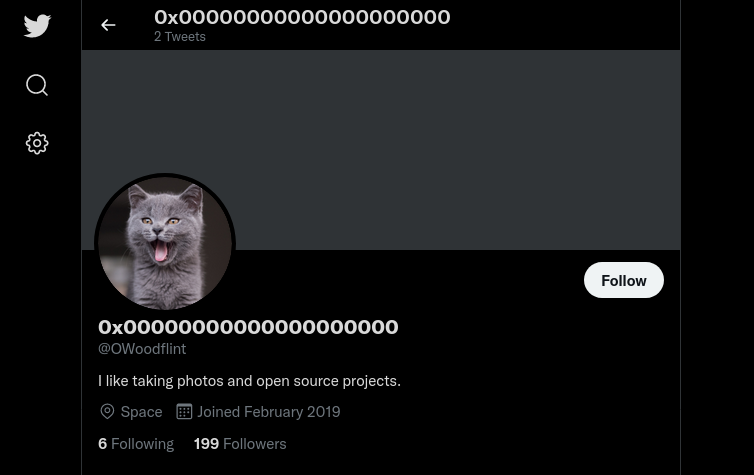
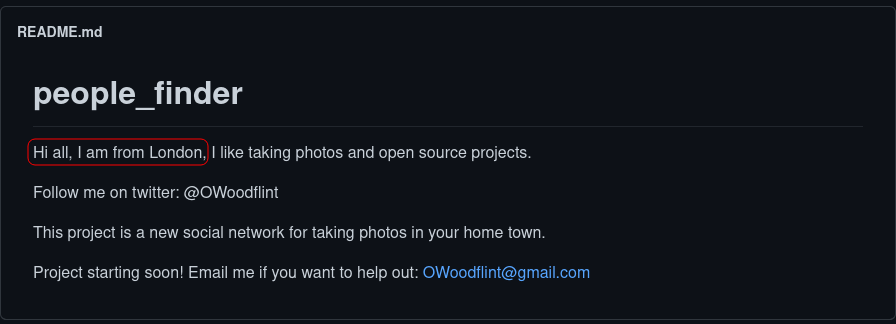
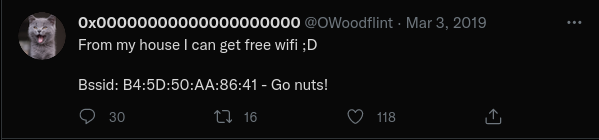
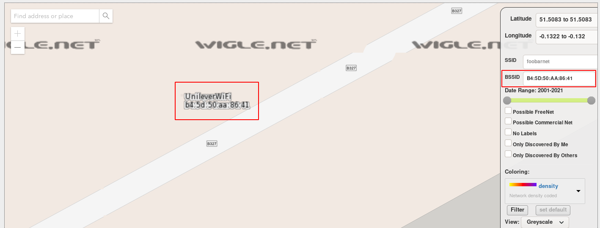
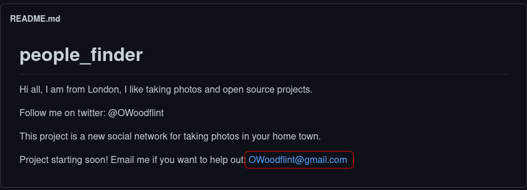
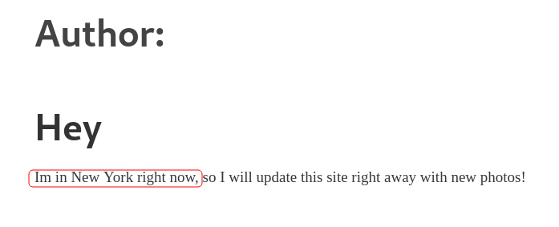
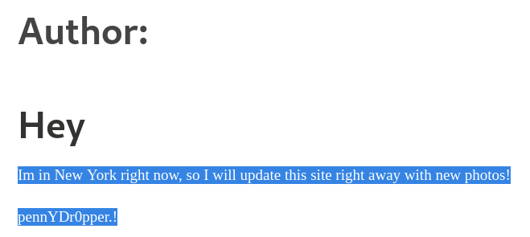

# OhSINT

## Description

Are you able to use open source intelligence to solve this challenge?

What information can you possible get with just one photo?

In this challenge, we are provided with the og background of Windows XP and we should gather information from that image with OSINT skills.

## Questions

### Q1 - What is this users avatar of?

First things first, download the image. Here's the image:

Let's check the meta data using `exiftool`:

~~~
┌──(user㉿Y0B01)-[~/…/walkthroughs/thm/OhSINT/files]
└─$ exiftool WindowsXP.jpg 
ExifTool Version Number         : 12.34
File Name                       : WindowsXP.jpg
Directory                       : .
File Size                       : 229 KiB
File Modification Date/Time     : 2021:11:21 09:43:51-05:00
File Access Date/Time           : 2021:11:21 09:44:24-05:00
File Inode Change Date/Time     : 2021:11:21 09:44:14-05:00
File Permissions                : -rw-r--r--
File Type                       : JPEG
File Type Extension             : jpg
MIME Type                       : image/jpeg
XMP Toolkit                     : Image::ExifTool 11.27
GPS Latitude                    : 54 deg 17' 41.27" N
GPS Longitude                   : 2 deg 15' 1.33" W
Copyright                       : OWoodflint
Image Width                     : 1920
Image Height                    : 1080
Encoding Process                : Baseline DCT, Huffman coding
Bits Per Sample                 : 8
Color Components                : 3
Y Cb Cr Sub Sampling            : YCbCr4:2:0 (2 2)
Image Size                      : 1920x1080
Megapixels                      : 2.1
GPS Latitude Ref                : North
GPS Longitude Ref               : West
GPS Position                    : 54 deg 17' 41.27" N, 2 deg 15' 1.33" W
~~~

Here we can see the name of the copyright owner: `OWoodflint`. By googling this name, we find [this](https://twitter.com/owoodflint) twitter account and the avatar is a cat:

Answer: `cat`

### Q2 - What city is this person in?

There is a github account with this username [here](https://github.com/OWoodfl1nt/people_finder). From the main page, we know that this user is from London:

Answer: `London`

### Q3 - Whats the SSID of the WAP he connected to?

For this one, We can use the BSSID found in a tweet and [wigle.net](https://wigle.net/):

I had to take the image from [here](https://www.aldeid.com/wiki/File:CTF-TryHackMe-OhSINT-bssid-wigle.png) because it wasn't working for me:

Answer: `UnileverWiFi`

### Q4 - What is his personal email address?

We can find the email in their github's main page:

Answer: `OWoodflint@gmail.com`

### Q5 - What site did you find his email address on?

Answer: `github`

### Q6 - Where has he gone on holiday?

There is a wordpress blog with this name [here](https://oliverwoodflint.wordpress.com/author/owoodflint/), and from that we can see that where this person is now:

Answer: `New York`

### Q7 - What is this persons password?

If you check the source code of the blog, we can see a white colored text which is the password. You can also see it by highliting the text:

Answer: `pennYDr0pper.!`

# D0N3! ; )

Thank to the creator(s)!

Hope you had fun and learned something.

Have a g00d one! : )