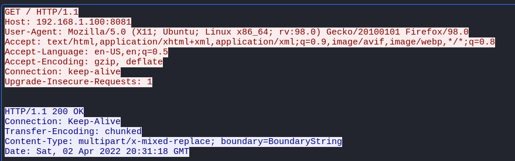
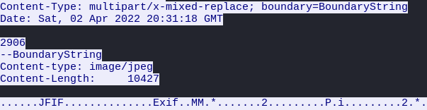
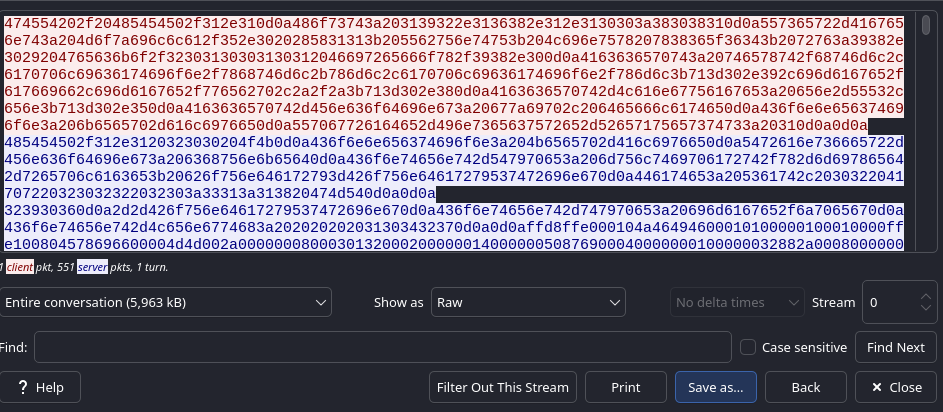

# Security Footage

## Description

Someone broke into our office last night, but they destroyed the hard drives with the security footage. Can you recover the footage?

The challenge gives us a pcap file that we can start investigating on.

## Q - What is the flag?

I started analyzing the file using `wireshark`.

I found one single tcp stream and after following it, I found a single HTTP request with `Content-Type: multipart/x-mixed-replace; boundary=BoundaryString` header:

<p align="center"></p>

It means that the servers is constantly sending parts of data, which in our case the parts are images.

The images are separated by `--BoundaryString` and each part has a `Content-type: image/jpeg` and we can obtain that the server is streaming a video with JPEG frames:

<p align="center"></p>

I don't know any wireshark solution for exporting all the parts, so I decided to export the data and start working on it using python scripts.

After clicking on follow tcp stream option, I I chose `Raw` from `Show as` options and clicked on `Save as...` option and saved it in a file, which I named `tcp-stream.raw`:

<p align="center"></p>

After doing so, I started writing a script to export the images one by one and filter unused data using the magic bytes and the final script looks like this:

```py
with open('tcp-stream.raw', 'rb') as f:
        data = f.read()

parts = data.split(b'--BoundaryString')

for i, part in enumerate(parts):
        if b'JFIF' in part:
                jpg_start = part.find(b'\xFF\xD8')
                jpg_end = part.rfind(b'\xFF\xD9') + 2

                if jpg_start != -1 and jpg_end != -1:
                        jpg_data = part[jpg_start:jpg_end]
                        with open(f'./exported-imgs/frame_{i}.jpg','wb') as img:
                                img.write(jpg_data)
```

**Note:** The `+ 2` at the end of `jpg_end` is to include `\xFF\xD9` in the slice.

The script splits the data using `--BoundaryString` and looks for the `JFIF` in each part. If it exists, it starts locating the start and the end of the jpeg file using the magic bytes.

JPEG markers are as follows: 

- `\xFF\xD8` to indicate the start
- `\xFF\xD9` to indicate the end

Finally I created a folder to write the images in using `frame_` prefix and the frame number to easily read the final stream of jpeg files and then ran the script:

```
└─$ mkdir exported-imgs

└─$ python3 frame-exporter.py

```

After the images were exported, I went inside the directory and use `eog` to read through the files:

```
└─$ cd exported-imgs

└─$ eog .
```

The output was a video of a phone displaying the flag and by writing it down, We get the flag:

<p align="center"></p>

Answer: `flag{5ebf[REDACTED]6f31}`

# D0N3! :)

