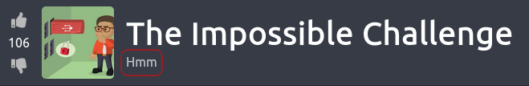
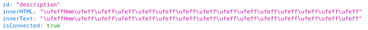
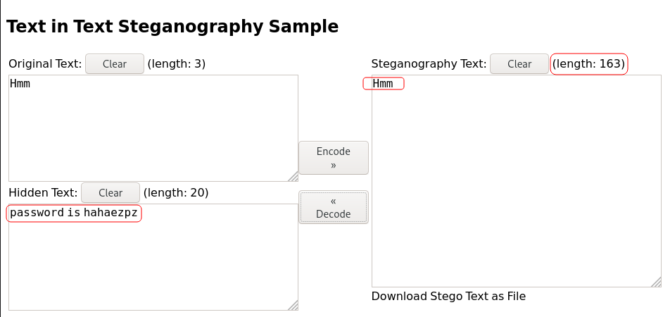

# The Impossible Challenge

## [Task 1] Submit the flag

Download the file, and find the Flag!

For this challenge, we are not penetrating a machine. We are provided with a zip file and a cipher. I downloaded the zip file and after attempting to unzip it, I found out that we need a password for it:

~~~
┌──(user㉿Y0B01)-[~/…/walkthroughs/thm/The_Impossible_Challenge/files]
└─$ unzip Impossible.zip 
Archive:  Impossible.zip
[Impossible.zip] flag.txt password: 
   skipping: flag.txt                incorrect password
~~~

Let's start working on the cipher then.

The cipher:
~~~
qo qt q` r6 ro su pn s_ rn r6 p6 s_ q2 ps qq rs rp ps rt r4 pu pt qn r4 rq pt q` so pu ps r4 sq pu ps q2 su rn on oq o_ pu ps ou r5 pu pt r4 sr rp qt pu rs q2 qt r4 r4 ro su pq o5
~~~

After wasting my time on it for a while, I finally decrypted it using the following pattern:

ROT13 -> ROT47 -> Hex -> Base64

You can use [CyberChef](https://gchq.github.io/CyberChef/) to decrypt it. The cipher decrypted to:

~~~
It's inside the text, in front of your eyes!
~~~

Ok. Since there is no machine to connect to, it's probably talking about the text in the tryhackme page.

If you pay attention to the banner, there is a text saying "Hmm":

I inspected it and look at this:

After googling for a bit, I found out that what we have here is called **"Unicode Steganography with Zero-Width Characters"**. Zero-width characters are non-printing characters that are not displayed by most applications, which leads to the name “zero-width.” They are Unicode characters, typically used to mark possible line break or join/separate characters in writing systems that use ligatures. They are also used to send secret messages.

You can decode it using [this](https://330k.github.io/misc_tools/unicode_steganography.html) website:

As you can see, the actual length is 163. That's cool. It decoded to: `password is hahaezpz`

I used `hahaezpz` as password to unzip the file and it extracted to a file called `flag.txt` which contained the flag:

~~~
┌──(user㉿Y0B01)-[~/…/walkthroughs/thm/The_Impossible_Challenge/files]
└─$ unzip Impossible.zip
Archive:  Impossible.zip
[Impossible.zip] flag.txt password: 
  inflating: flag.txt                
                                                                                                                      
┌──(user㉿Y0B01)-[~/…/walkthroughs/thm/The_Impossible_Challenge/files]
└─$ cat flag.txt  
You have solved the Impossible Challenge! Here is your flag THM{Zero_Width_Characters_EZPZ}
~~~

Flag: `THM{Zero_Width_Characters_EZPZ}`

# D0N3! ; )

Thanks to the creator!

Hope you learned something like I did!

And have a g00d one! : )