# WebAppSec 101

## Description

In this room, we will walk through how to testing an application in the perspective of a hacker/penetration tester

## [Task 1] Basic Description & Objectives

This room is a small vulnerable web application. In the OWASP Juice shop, we looked at how some basic vulnerabilities worked. In this room, we'll walk though the methodology and approach of testing a web application. As an ethical hacker, you need to test the web application from the perspective of an attacker. We'll be using this mindset to establish a strategy to look for weaknesses in the web application.

Credits to [Adam Doupe](https://adamdoupe.com) for creating this.

No answer needed

## [Task 2] Walking through the application

To discover vulnerabilities for any application, we need to understand how the application works. Why don't you click through the links on the application and try identify the functionality. The best way to identify links or particular functionality is by running a web crawler/spider. A web spider will follow every link on every page on the web site(including inputting data into some forms). This can be good because it will help you generate a list of all the pages of the application(so you know what to test and don't miss anything), but it can also be bad because sometimes it might miss functionality or input malformed/incorrect data that may break the application. The Burp tool comes with a spider you can use to crawl through the website.

Some vulnerabilities are particular to some functionality, for example:

* When you see a login page, can you brute force or guess the credentials?
* If there is a user login, can there be an administrator login?
* Can you upload restricted content using upload functionality?
* If input is generated from a textbox, can you perform XSS?

During this phase, it's also important to look at what technologies are being used, along with their version numbers. For example, Do particular versions of servers have public exploits available? 

### 2.1 - What version of Apache is being used?

Let's start with an Nmap scan. The scan reveals three open ports:
* 22 ssh
* 80 http
* 111 rcpbind

~~~
PORT    STATE SERVICE VERSION
22/tcp  open  ssh     OpenSSH 7.4 (protocol 2.0)
| ssh-hostkey: 
|   2048 a7:f4:e8:89:8a:cf:9f:77:3b:66:93:ef:44:f3:5e:b3 (RSA)
|   256 35:7c:30:9d:90:46:3e:34:8f:9b:4b:bf:0c:15:98:4d (ECDSA)
|_  256 3b:9b:e1:61:d0:44:ca:89:ae:aa:23:cc:05:e3:fd:e2 (ED25519)
80/tcp  open  http    Apache httpd 2.4.7 ((Ubuntu))
|_http-title: WackoPicko.com
| http-cookie-flags: 
|   /: 
|     PHPSESSID: 
|_      httponly flag not set
|_http-server-header: Apache/2.4.7 (Ubuntu)
111/tcp open  rpcbind 2-4 (RPC #100000)
| rpcinfo: 
|   program version    port/proto  service
|   100000  2,3,4        111/tcp   rpcbind
|   100000  2,3,4        111/udp   rpcbind
|   100000  3,4          111/tcp6  rpcbind
|   100000  3,4          111/udp6  rpcbind
|   100024  1          44251/tcp   status
|   100024  1          52217/udp   status
|   100024  1          56450/udp6  status
|_  100024  1          60991/tcp6  status
~~~

Answer: `2.4.7`

### 2.2 - What language was used to create the website?

There are several ways to know that PHP is installed on the machine:
* The server is running Apache, which usually hosts PHP applications.
* The cookie flag shows a `PHPSESSID` session cookie.
* The main page is `index.php`.
* The title of the page is `WackoPicko` which is a PHP application.

Answer: `PHP`

### 2.3 - What version of this language is used?

We can find the answer to this question by checking the request header:

~~~
┌──(user㉿Y0B01)-[~/Desktop/walkthroughs/thm/WebAppSec_101]
└─$ curl -s -D header.txt "http://$IP" > /dev/null
                                                                                                                      
┌──(user㉿Y0B01)-[~/Desktop/walkthroughs/thm/WebAppSec_101]
└─$ cat header.txt                                
HTTP/1.1 200 OK
Date: Wed, 17 Nov 2021 15:39:48 GMT
Server: Apache/2.4.7 (Ubuntu)
X-Powered-By: PHP/5.5.9-1ubuntu4.24     <--------------
Set-Cookie: PHPSESSID=gtclufoaipkhbs6587fsaicah4; path=/
Expires: Thu, 19 Nov 1981 08:52:00 GMT
Cache-Control: no-store, no-cache, must-revalidate, post-check=0, pre-check=0
Pragma: no-cache
Vary: Accept-Encoding
Content-Length: 3246
Content-Type: text/html
~~~

If you take a look at `X-Powered-By`, we can see the PHP version:

Answer: `5.5.9`

## [Task 3] Establishing a methodology

Now that we've walked through the application and know the functionality and technologies, how do we actually test it. There are 2 particular ways to test a web application for security vulnerabilities:

The first way is by going through every page and testing all the functionality. This would involve going through every page on the application, and depending on the functionality, testing for all the bugs/vulnerabilities that apply to the page. In this case, if we start off at the home page, we would try see what functionality we can exploit on the home page, and then move on to every page. 

The second way is by breaking down the testing into different stages(including but not limited to):

* Authorization
* Authentication
* Injection
* Client Side Controls
* Application Logic

In this room, we'll be approaching testing through these particular topics. In general testing can be done in a combination of both the approaches mentioned above. 

### 3.1 - Make sure you understand the pro's and con's of each methodology

No answer needed

## [Task 4] Authentication

Authentication involves testing mechanisms and logic that allow users to log in to an application(either as a regular user, or those with elevated privileges). The process of authentication usually involves verifying a user, and this is done when the user provides correct credentials(in most cases usernames and passwords). Authentication can be tested in the following ways:

* Brute Forcing/Weak Credentials: In most cases, users usually pick common passwords that are easy to guess. This could be anything from the username to the names of animals. Attackers can use weak passwords to their advantage by using a list to guess possible users passwords.
* Session Management: Sessions are the mechanism by which the server retains state about the application. This is necessary in applications that need to remember users for transactions. In some cases, sessions(which are stored in cookies) store information about users such as their privilege level. This state can be manipulated and sent back to the server.

### 4.1 - What is the admin username?

If you open the main page, there is a link to admin login page saying "Admin":

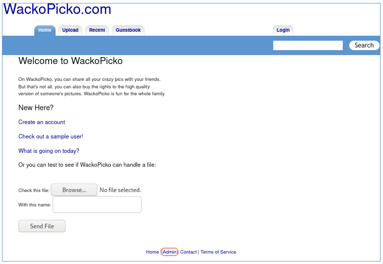

After clicking on it, we are directed to this page, which is a login page for admin:

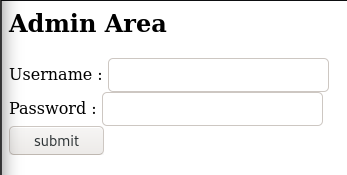

I usually try some default creds before doing anything else and I successfully got through with the first try.

Answer: `admin`

### 4.2 - What is the admin password?

`admin:admin` is one of the the default creds for the admin login pages.

Answer: `admin`

### 4.3 - What is the name of the cookie that can be manipulated?

We can easily check the cookie name using the developer bar (`Ctrl` + `Shift` + `I`). Go to `Storage > Cookies > the URL` and there are two cookies. One is for the main page, and one is for `/admin` which is the one we want:

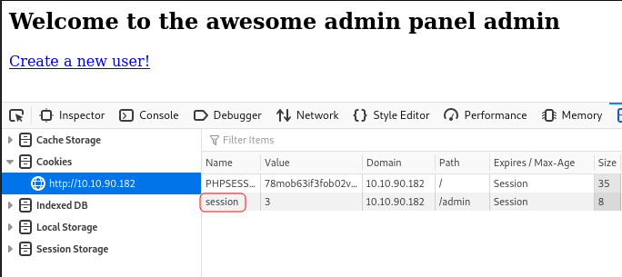

Answer: `session`

### 4.4 - What is the username of a logged on user?

For this question, we can use different ways. You can use tools, or code a script yourself to do the job, or like me, just do it manually. If you take a look at the main page again, there is a link that takes us to the "sample user" pictures:

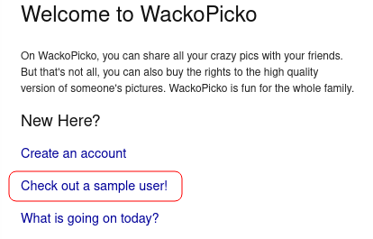

By clicking on it, we'll be directed to `http://<MACHINE IP>/users/sample.php?userid=1` and as you can see, there is a parameter named `userid` that is set to one for the sample user. By changing the value, we can find other users. I was able to find the following users:

|    username   | USER ID |
| :-----------: | :-----: |
| Sample User   | 1       |
| bob           | 2       |
| wanda         | 9       |
| calvinwatters | 10      |
| bryce         | 11      |

The user that the question is asking for, is this one:

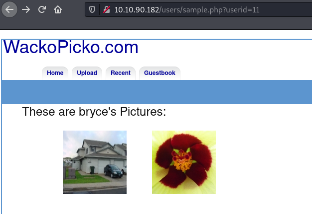

Answer: `bryce`

### 4.5 - What is the corresponding password to the username?

The login page for the existing users is `/users/login.php`. Before doing anything, let's see if the password is the same as the username. I tried it and it is the same.

Answer: `bryce`

## [Task 5] Cross Site Scripting (XSS)

XSS is a vulnerability that involves injecting malicious javascript in trusted websites. Once an attacker has injected malicious javascript, sometimes a browser will not know whether to trust it, and it will run the script. Using this exploit an attacker can:

* steal session information through cookies
* arbitrarily redirect users to their own pages(for phishing)

There are a few different types of XSS attacks:

* Persistent/Non-Reflected - Here the XSS payload has been stored in the database, and once the server/framework passes the data from the database into the webpage, the script/payload is executed.
* Non Persistent/Reflected - Here the XSS payload is usually crafted using a malicious link. It is not stored. 

You can cause javascript to execute using different payloads and HTML tags- [this](https://cheatsheetseries.owasp.org/cheatsheets/XSS_Filter_Evasion_Cheat_Sheet.html) is a good list of resources for payloads.

### 5.1 - Test for XSS on the search bar

Read the linked blog about XSS for explanation. If you enter `` in the search bar, you can see that it runs our script and shows an alert:

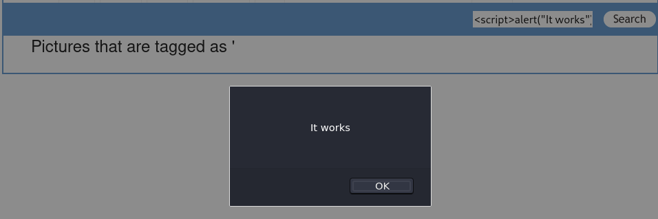

### 5.2 - Test for XSS on the guestbook page

If you head to `/guestbook.php` and submit `` in the comment field with a random name, you can see that the server runs our script and saves it in the database and each time a user goes to this page, the script will be executed:

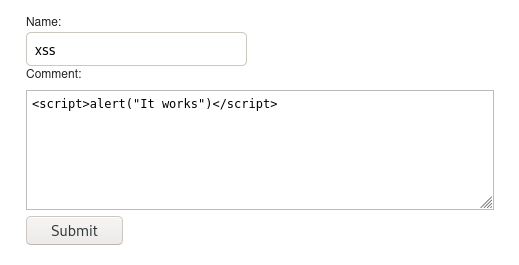

Here's the result:

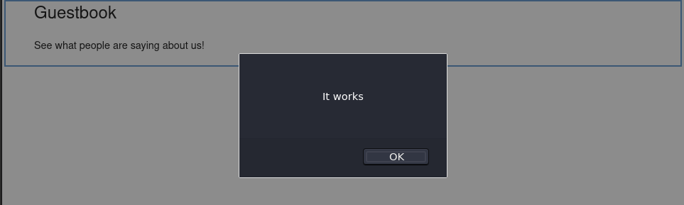

### 5.3 - Test for XSS behind the flash form on the home page

I couldn't figure out where the question is talking about, but with a search I found out that this app asks for your favorite color and that's where you can use the XSS.

## [Task 6] Injection

Injection attacks occur when users input data and this data is being processed/interpreted by the server. Injection is most common when user supplied data is not validated/sanitised by the server. Common injection attacks include:

* SQL Injection - These attacks occur when users provide malicious data that is processed by SQL statements on the server. SQL statements are usually used to interact with databases; by providing malicious input, users can read, modify and even delete data in these databases. These attacks are usually prevalent because developers do not use parameterized queries. More information about SQL Information can be found here. 
* Command Injection - These attacks usually occur when users provide malicious data that is processed as system commands on the web server. With this attack, users can execute arbitrary command on the system and carry out malicious actions like reading password hashes and private keys. More information can be found here.

Injection attacks usually involve passing input to the application. In most cases, this input can be through a text field in a form, but in other cases it can be anything that the user has access to(and is interpreted by the server) e.g. HTTP Headers, disabled input fields. 

### 6.1 - Perform command injection on the check password field

First head to `/users/register.php` and enter `' or '1'='1` in all the fields as shown below. This form is vulnerable to SQLI (SQL Injection):

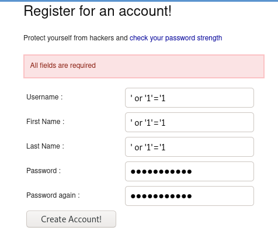

Now navigate to `/users/similar.php` and you'll see that we were able to dump all the exsisting usernames in the database (Ignore the failed attempts XD):

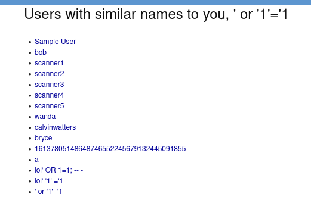

### 6.2 - Check for SQLi on the application

SQL injection is usually used to bypass authentication or dump the content of the databases.

The login form is vulnerable to SQLI and we can login as the users we found previously. Head to `/users/login.php` and for example we want to login as user `bob`, so enter `bob' OR '1'='1` as the username with and empty password:

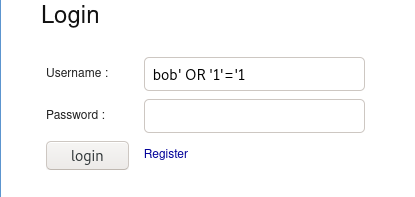

Now we are logged in as user `bob`:

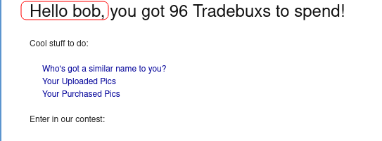

We can use this vulnerability to dump the data from the database with sqlmap to automate the process.

## [Task 7] Miscellaneous & Logic Flaws

Applications can also have vulnerabilities because of flawed logic; a certain part of the application may not work as expected due to mistakes in how it was programmed. The way these flaws can be discovered is by testing these components and trying to understand how they are supposed to operate. After doing this, test these components in ways that the developer did not intend them to be used(e.g. passing in numbers instead of letters, trying to iterate through a range of numbers and etc). 

In addition, applications may have other vulnerabilities:

* Parameter Manipulation: Parameters are usually values passed to queries. For example in the url: www.evil.com/photos?id=1 the parameter is id and the value is 1. Sometimes developers may not correctly map resources using parameters, so an attacker can try different values and access resources that they should not access.
* Directory Traversal: An attacker may be able to access files outside the web root directory(due to incorrect access control) by manipulating variables that may take a file path(adding ../ can navigate to the upper directory). More information can be found [here](https://owasp.org/www-community/attacks/Path_Traversal).
* Forceful Browsing: Here an attacker can access restricted content(that also may be unmapped by the application) by brute forcing through different URLs and links. This can be done using set dictionaries or wordlists using tools like Dirsearch. More information can be found [here](https://owasp.org/www-community/attacks/Forced_browsing).

### 7.1 - Find a parameter manipulation vulnerability

This is what we used to find the users and IDs with changing `userid` parameter in `http://<MACHINE IP>/users/sample.php?userid=1`.

### 7.2 - Find a directory traversal vulnerability

Hint: check the /pictures/upload.php page

Let's head to where the hint says. We can see a form that we can upload pictures from. I uploaded a test image to see how and where the pics are stored:

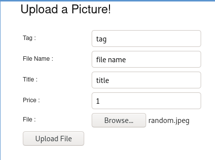

After uploading the pic, we can see where our picture has been stored in the source code. It is located in `http://<MACHINE IP>/upload/tag/filename.550.jpg`.

Btw, if you check `/upload/`, you can see that it allows directory listing. Let's check if we can use a directory traversal attack to upload a php script to the root directory (`/upload` instea of `/upload/tag`). I'm gonna use `conflict.php` located in  `/pictures`:

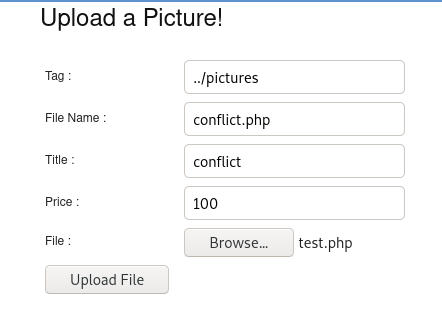

Our php file has been uplaoded:

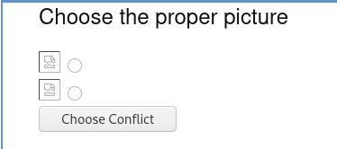

### 7.3 - Find a forceful browsing vulnerability

Hint: try access a restricted image

Read [this](https://owasp.org/www-community/attacks/Forced_browsing) OWASP article on forced browsing. Considering all the directories allow listing, it wouldn't be difficult to find the new features. But forceful browsing is about finding pages following the workflow of an application. Look at the workflow of this application:

1. First we choose a picture and add it to our cart.
2. Then we go to our cart in `/cart/review.php`.
3. Then we click on "Continue to Confirmation" and got to `/cart/confirm.php`.
4. Now we click on "Purchase" to complete the proccess in `/pictures/purchased.php`.
5. Now that we have purchased the picture, we click on it to display it and go to `/pictures/high_quality.php?picid=15&key=ODcxNDAyNA%3D%3D`

### 7.4 - Logic flaw: try get an item for free

Hint: what about discount codes?

If you take a look at the third step which is `/cart/confirm.php`, we are provided with the links of the pictures before actually buying it. We can take advantage of this links to download the images in high quality without actually buying them:

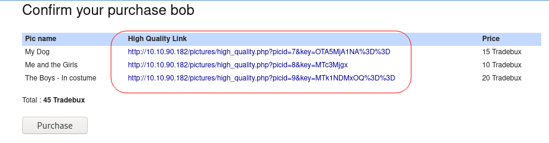

# D0N3! ; )

Thanks a lot to the creator(s) for this educating room!

Hope you had fun and learned something.

Have a g00d one! : )